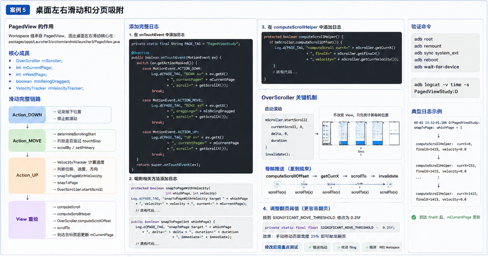
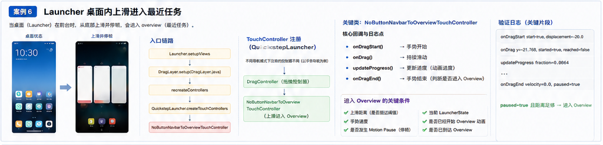
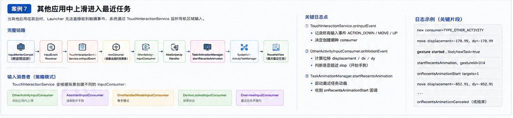
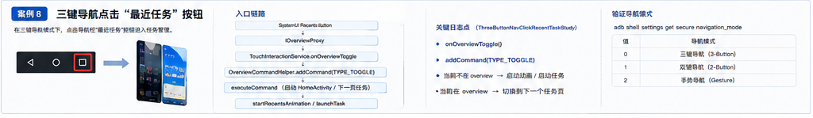
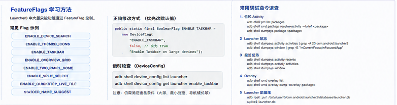
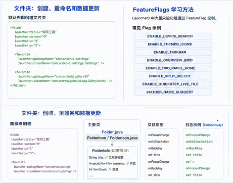
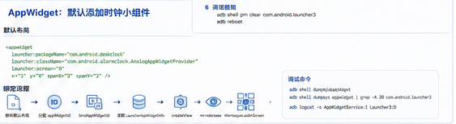

# Launcher3 / Quickstep 学习笔记：滑动分页、最近任务、文件夹与小组件

> 适用环境：AOSP 12 / Launcher3QuickStep 相关源码学习  
> 核心目标：通过源码链路、日志埋点、验证命令，理解 Launcher3 中“桌面左右滑动”“上滑进入最近任务”“三键最近任务”“文件夹重命名”“默认小组件”等典型功能。

---

## 图示说明

本文已将原总览图拆分为独立案例图。每张图都放在对应章节开头，用于先建立整体链路，再阅读源码、日志和验证步骤。

---

## 目录

- [案例 5：桌面左右滑动和分页吸附](#案例-5桌面左右滑动和分页吸附)
- [案例 6：Launcher 桌面内上滑进入最近任务](#案例-6launcher-桌面内上滑进入最近任务)
- [案例 7：其他应用中上滑进入最近任务](#案例-7其他应用中上滑进入最近任务)
- [案例 8：三键导航点击最近任务](#案例-8三键导航点击最近任务)
- [补充 1：移除应用时 Cancel / Uninstall 的显示](#补充-1移除应用时-cancel--uninstall-的显示)
- [补充 2：FeatureFlags 学习方法](#补充-2featureflags-学习方法)
- [补充 3：文件夹创建、重命名和数据库更新](#补充-3文件夹创建重命名和数据库更新)
- [补充 4：AppWidget 默认添加时钟小组件](#补充-4appwidget-默认添加时钟小组件)
- [常用调试命令速查](#常用调试命令速查)

---

# 案例 5：桌面左右滑动和分页吸附



> 图中集中展示了触摸事件链路、吸附方法、`OverScroller` 每帧推进机制、日志位置与验证命令。

## 1. PagedView 的作用

`Workspace` 继承自 `PagedView`，所以桌面左右滑动的核心逻辑主要在：

```text
packages/apps/Launcher3/src/com/android/launcher3/PagedView.java
```

可以把 `PagedView` 理解成：**一个支持横向分页、拖动、惯性滑动、自动吸附到目标页的 View 容器**。

桌面上的每一屏，本质上就是 `PagedView` 中的一个 page。用户左右滑动时，并不是直接“切换 Activity”，而是让 `PagedView` 根据手指位移不断 `scrollTo / scrollBy`，最后通过 `OverScroller` 做吸附动画。

## 2. 核心成员

```java
protected OverScroller mScroller;
protected int mCurrentPage;
protected int mNextPage;
protected boolean mIsBeingDragged;
protected VelocityTracker mVelocityTracker;
```

| 成员 | 作用 |
|---|---|
| `mScroller` | 负责计算滚动动画每一帧应该到哪里 |
| `mCurrentPage` | 当前所在页 |
| `mNextPage` | 正在吸附或即将到达的目标页 |
| `mIsBeingDragged` | 当前是否处于拖动状态 |
| `mVelocityTracker` | 计算手指松开时的速度，用于判断 fling |

## 3. 滑动完整链路

```text
ACTION_DOWN
    ↓
记录按下位置
    ↓
停止旧滚动

ACTION_MOVE
    ↓
determineScrollingStart
    ↓
判断是否超过 touchSlop
    ↓
scrollBy / setPrimary

ACTION_UP
    ↓
VelocityTracker 计算速度
    ↓
判断位移、速度、方向
    ↓
snapToPageWithVelocity
    ↓
snapToPage
    ↓
OverScroller.startScroll

View 重绘
    ↓
computeScroll
    ↓
computeScrollHelper
    ↓
OverScroller.computeScrollOffset
    ↓
scrollTo
    ↓
到达目标页后更新 mCurrentPage
```

通俗理解：

- `DOWN`：手指按下，记录起点，并停止之前还没结束的动画。
- `MOVE`：手指移动，判断是否真的开始拖动，超过阈值后让页面跟手移动。
- `UP`：手指抬起，根据速度和位移判断要回到原页，还是切到下一页。
- `computeScroll`：系统不断重绘，`OverScroller` 每一帧给出一个新的滚动位置。

## 4. 添加完整日志

文件：

```text
packages/apps/Launcher3/src/com/android/launcher3/PagedView.java
```

增加 tag：

```java
private static final String PAGE_TAG = "PagedViewStudy";
```

在 `onTouchEvent()` 中添加日志：

```java
@Override
public boolean onTouchEvent(MotionEvent ev) {
    switch (ev.getActionMasked()) {
        case MotionEvent.ACTION_DOWN:
            Log.d(PAGE_TAG,
                    "DOWN x=" + ev.getX()
                    + ", currentPage=" + mCurrentPage
                    + ", scroll=" + getScrollX());
            break;

        case MotionEvent.ACTION_MOVE:
            Log.d(PAGE_TAG,
                    "MOVE x=" + ev.getX()
                    + ", dragging=" + mIsBeingDragged
                    + ", scroll=" + getScrollX());
            break;

        case MotionEvent.ACTION_UP:
            Log.d(PAGE_TAG,
                    "UP x=" + ev.getX()
                    + ", currentPage=" + mCurrentPage
                    + ", scroll=" + getScrollX());
            break;
    }
    return super.onTouchEvent(ev);
}
```

> 注意：原文中 `ev.getActionMasked` 少了括号，正确写法是 `ev.getActionMasked()`。

## 5. 在吸附方法中添加日志

### 5.1 `snapToPageWithVelocity()`

```java
protected boolean snapToPageWithVelocity(int whichPage, int velocity) {
    Log.d(PAGE_TAG,
            "snapToPageWithVelocity target=" + whichPage
            + ", velocity=" + velocity
            + ", current=" + mCurrentPage);

    // 原有代码...
}
```

### 5.2 `snapToPage()`

```java
public boolean snapToPage(int whichPage) {
    Log.d(PAGE_TAG,
            "snapToPage target=" + whichPage
            + ", current=" + mCurrentPage);

    // 原有代码...
}
```

如果要打印 `delta / duration / immediate`，要放在这些局部变量已经计算出来之后：

```java
Log.d(PAGE_TAG,
        "snapToPage target=" + whichPage
        + ", delta=" + delta
        + ", duration=" + duration
        + ", immediate=" + immediate);
```

> 注意：原文中 `duratioin` 拼写错误，正确变量一般应为 `duration`，具体以源码中的局部变量名为准。

### 5.3 `computeScrollHelper()`

```java
protected boolean computeScrollHelper() {
    if (mScroller.computeScrollOffset()) {
        Log.d(PAGE_TAG,
                "computeScroll currX=" + mScroller.getCurrX()
                + ", finalX=" + mScroller.getFinalX()
                + ", velocity=" + mScroller.getCurrVelocity());
    }

    // 原有代码...
}
```

## 6. OverScroller 关键机制

启动滚动：

```java
mScroller.startScroll(
        currentScroll,
        0,
        delta,
        0,
        duration
);
invalidate();
```

### 为什么必须调用 `invalidate()`？

`OverScroller` 本身不会主动改变 View 的位置。它只负责根据时间计算：**当前这一帧应该滚动到哪里**。

真正让 View 移动的是后续的：

```text
invalidate / postInvalidateOnAnimation
    ↓
触发下一帧绘制
    ↓
computeScroll
    ↓
computeScrollOffset
    ↓
getCurrX / getCurrY
    ↓
scrollTo
    ↓
如果动画没结束，继续 invalidate
```

典型写法：

```java
@Override
public void computeScroll() {
    if (mScroller.computeScrollOffset()) {
        scrollTo(mScroller.getCurrX(), mScroller.getCurrY());
        postInvalidateOnAnimation();
    }
}
```

也就是说：

- `startScroll()`：启动一个滚动计算任务。
- `computeScrollOffset()`：判断当前动画是否还没结束，并计算当前帧位置。
- `scrollTo()`：真正移动 View。
- `postInvalidateOnAnimation()`：请求下一帧继续执行。

## 7. 修改翻页阈值示例

如果希望更容易翻页，可以调低显著位移比例。

查找：

```java
protected float getSignificantMoveThreshold()
```

或者查找常量：

```java
SIGNIFICANT_MOVE_THRESHOLD
```

例如改为：

```java
private static final float SIGNIFICANT_MOVE_THRESHOLD = 0.25f;
```

效果：手动移动页面宽度的 25% 即可触发翻页。

修改后需要重点测试：

- 慢速拖动
- 快速 fling
- 横屏
- 两栏 Workspace
- 边缘回弹
- 第一页 / 最后一页边界行为

## 8. 编译与验证命令

```bash
adb root
adb remount
adb sync system_ext
adb reboot
adb wait-for-device
adb logcat -v time -s PagedViewStudy:D
```

## 9. 日志解读示例

典型日志：

```text
D/PagedViewStudy: action down: x = 605.9619, currentPage = 0, scroll = 0
D/PagedViewStudy: snapToPage: whichPage = 1
D/PagedViewStudy: computeScrollHelper: currX = 0, finalX = 1413
D/PagedViewStudy: computeScrollHelper: currX = 153, finalX = 1413
D/PagedViewStudy: computeScrollHelper: currX = 285, finalX = 1413
...
D/PagedViewStudy: computeScrollHelper: currX = 1413, finalX = 1413
```

这说明：

1. 当前从第 0 页开始滑动。
2. 松手后判断目标页是第 1 页。
3. `OverScroller` 不断计算 `currX`。
4. `currX` 从 0 逐步接近 `finalX=1413`。
5. 到达最终位置后，分页吸附完成。

---

# 案例 6：Launcher 桌面内上滑进入最近任务



> 这张图重点说明：Launcher 前台时，触摸事件由 Launcher 自己的 `TouchController` 链路处理。

## 1. 场景说明

适用场景：**当前前台就是 Launcher，用户从底部向上滑动并停顿，进入 Overview / 最近任务界面。**

这里和“其他应用中上滑进入最近任务”不同。因为当前就是 Launcher 自己在前台，Launcher 的 `DragLayer` 能够收到触摸事件。

相关类：

```java
public class LauncherRecentsView
        extends RecentsView<QuickstepLauncher, LauncherState>
```

可以把 `LauncherRecentsView` 理解成：**Launcher 内部用于显示最近任务卡片的 View。**

## 2. RecentsView 的关键行为

`RecentsView` 内部会维护任务卡片、任务图标、任务缩略图等状态。例如：

```java
mTaskViewPool
```

它可以缓存一定数量的 TaskView，避免频繁创建销毁，提高最近任务界面的滑动性能。

关键调用：

```java
onGestureAnimationStart
showCurrentTask(runningTasks);
setEnableFreeScroll(false);
setEnableDrawingLiveTile(false);
setRunningTaskHidden(true);
setTaskIconScaledDown(true);
```

含义可以简化理解为：

- 手势动画开始。
- 把当前运行任务传入最近任务界面。
- 控制 TaskView 是否自由滚动。
- 控制是否绘制 live tile。
- 控制当前运行任务是否隐藏。
- 控制任务图标是否缩小。

## 3. 入口链路

```text
Launcher.setupViews
    ↓
DragLayer.setup
    ↓
recreateControllers
    ↓
QuickstepLauncher.createTouchControllers
    ↓
NoButtonNavbarToOverviewTouchController
```

源码位置：

```text
packages/apps/Launcher3/quickstep/src/com/android/launcher3/uioverrides/QuickstepLauncher.java
```

## 4. TouchController 注册逻辑

```java
@Override
public TouchController[] createTouchControllers() {
    Mode mode = SysUINavigationMode.getMode(this);
    ArrayList<TouchController> controllers = new ArrayList<>();

    controllers.add(getDragController());

    switch (mode) {
        case NO_BUTTON:
            controllers.add(new NoButtonQuickSwitchTouchController(this));
            controllers.add(new NavBarToHomeTouchController(this));
            controllers.add(new NoButtonNavbarToOverviewTouchController(this));
            break;

        case TWO_BUTTONS:
            controllers.add(new TwoButtonNavbarTouchController(this));
            controllers.add(getDeviceProfile().isVerticalBarLayout()
                    ? new TransposedQuickSwitchTouchController(this)
                    : new QuickSwitchTouchController(this));
            controllers.add(new PortraitStatesTouchController(this));
            break;

        case THREE_BUTTONS:
        default:
            controllers.add(new PortraitStatesTouchController(this));
            break;
    }

    if (!getDeviceProfile().isMultiWindowMode) {
        controllers.add(new StatusBarTouchController(this));
    }

    controllers.add(new LauncherTaskViewController(this));
    return controllers.toArray(new TouchController[0]);
}
```

几个重要控制器：

| 控制器 | 作用 |
|---|---|
| `getDragController()` | 长按图标拖动时，接管图标拖拽事件 |
| `AllAppsSwipeController` | 桌面空白处上滑，拉出所有应用列表 |
| `NoButtonNavbarToOverviewTouchController` | 手势导航模式下，从底部上滑停顿进入 Overview |
| `PortraitStatesTouchController` | 处理普通竖屏状态切换 |

## 5. 增加日志

文件：

```text
packages/apps/Launcher3/quickstep/src/com/android/launcher3/uioverrides/touchcontrollers/NoButtonNavbarToOverviewTouchController.java
```

增加 tag：

```java
private static final String RECENTS_TAG = "LauncherRecentsStudy";
```

### 5.1 `onDragStart()`

```java
@Override
public void onDragStart(boolean start, float startDisplacement) {
    Log.d(RECENTS_TAG,
            "onDragStart start=" + start
            + ", displacement=" + startDisplacement);

    super.onDragStart(start, startDisplacement);

    mMotionPauseDetector.clear();

    if (handlingOverviewAnim()) {
        mMotionPauseDetector.setOnMotionPauseListener(
                this::onMotionPauseDetected);
    }

    mStartedOverview = false;
    mReachedOverview = false;
    mOverviewResistYAnim = null;
}
```

### 5.2 `updateProgress()`

```java
@Override
protected void updateProgress(float fraction) {
    super.updateProgress(fraction);
    Log.d(RECENTS_TAG, "updateProgress fraction=" + fraction);

    if (mNormalToHintOverviewScrimAnimator != null) {
        mNormalToHintOverviewScrimAnimator.setCurrentFraction(fraction);
    }
}
```

### 5.3 `onDrag()`

```java
@Override
public boolean onDrag(float yDisplacement,
        float xDisplacement,
        MotionEvent event) {

    Log.d(RECENTS_TAG,
            "onDrag y=" + yDisplacement
            + ", x=" + xDisplacement
            + ", started=" + mStartedOverview
            + ", reached=" + mReachedOverview);

    // 原有代码...
}
```

### 5.4 `onDragEnd()`

```java
@Override
public void onDragEnd(float velocity) {
    Log.d(RECENTS_TAG,
            "onDragEnd velocity=" + velocity
            + ", paused=" + mMotionPauseDetector.isPaused());

    // 原有代码...
}
```

## 6. 进入 Overview 的关键条件

进入 Overview 主要受以下因素影响：

- 上滑距离
- 手势速度
- 是否发生 Motion Pause
- 当前 `LauncherState`
- 是否已经开始 Overview 动画
- 是否已经到达 Overview

可以简化理解为：

```text
发生 Motion Pause
    ↓
更倾向停留在 Overview

未发生 Motion Pause，且快速结束
    ↓
根据速度、距离、状态判断回 Home 或进入其他手势结果
```

## 7. 验证方式

```bash
adb logcat -c
adb logcat -s LauncherRecentsStudy:D
```

然后在桌面底部上滑并停顿，观察日志：

```text
onDragStart
onDrag...
updateProgress...
onDragEnd
```

典型日志：

```text
D LauncherRecentsStudy: onDragStart start=true, displacement=-20.0
D LauncherRecentsStudy: onDrag y=-1.0283203, x=13.979492, started=false, reached=false
D LauncherRecentsStudy: updateProgress fraction=3.4740553E-4
...
D LauncherRecentsStudy: onDrag y=-21.010742, x=16.967773, started=true, reached=false
D LauncherRecentsStudy: onDragEnd velocity=0.0, paused=true
```

其中 `paused=true` 说明检测到了停顿，这就是进入 Overview 的关键证据之一。

## 8. 注意 Launcher3 与 Launcher3QuickStep 的区别

要确认编译的是正确模块。

如果你修改的是 Quickstep 相关源码，但只编译普通 `Launcher3`，可能看不到日志。

常用编译：

```bash
m Launcher3QuickStep -j2
m SystemUI -j2
adb root
adb remount
adb sync system_ext
adb sync system
adb reboot
```

确认导航模式是手势模式，而不是三键导航：

```bash
adb shell settings get secure navigation_mode
```

常见值：

| 值 | 含义 |
|---|---|
| `0` | 三键导航 |
| `1` | 双键导航 |
| `2` | 手势导航 |

---

# 案例 7：其他应用中上滑进入最近任务



> 这张图重点说明：第三方应用前台时，输入先由 `TouchInteractionService` 和 `InputConsumer` 接管，再启动 Recents 动画。

## 1. 为什么链路不同？

当其他 App 在前台时，Launcher 的 `DragLayer` 收不到触摸事件。

这时由 Quickstep 的 `TouchInteractionService` 通过系统输入监控能力监听导航区域输入，再决定怎么处理手势。

所以链路从 Launcher 内部 View 事件，变成了系统级输入监听链路。

## 2. 完整链路

```text
InputMonitorCompat
    ↓
InputEventReceiver
    ↓
TouchInteractionService.onInputEvent
    ↓
newConsumer
    ↓
OtherActivityInputConsumer
    ↓
AbsSwipeUpHandler
    ↓
TaskAnimationManager.startRecentsAnimation
    ↓
SystemUI / ActivityTaskManager
    ↓
RecentsView
```

每一层职责：

| 节点 | 职责 |
|---|---|
| `InputMonitorCompat` | 跨进程监听导航区域输入事件 |
| `InputEventReceiver` | 接收底层输入事件 |
| `TouchInteractionService` | Quickstep 手势入口，决定使用哪个消费者 |
| `OtherActivityInputConsumer` | 处理其他 App 前台时的上滑事件 |
| `AbsSwipeUpHandler` | 上滑手势处理基类，负责手势进度、动画状态 |
| `TaskAnimationManager` | 启动 Recents 动画 |
| `SystemUI / ActivityTaskManager` | 系统服务协同启动和控制任务动画 |
| `RecentsView` | 显示最近任务界面 |

## 3. TouchInteractionService 输入监听

文件：

```text
packages/apps/Launcher3/quickstep/src/com/android/quickstep/TouchInteractionService.java
```

增加 tag：

```java
private static final String OTHER_RECENTS_TAG = "OtherRecentsStudy";
```

在 `onInputEvent()` 中记录输入事件：

```java
private void onInputEvent(InputEvent inputEvent) {
    if (!(inputEvent instanceof MotionEvent)) {
        Log.e(OTHER_RECENTS_TAG, "Unknown input event=" + inputEvent);
        return;
    }

    MotionEvent event = (MotionEvent) inputEvent;

    Log.d(OTHER_RECENTS_TAG,
            "TIS event=" + MotionEvent.actionToString(event.getActionMasked())
            + ", x=" + event.getRawX()
            + ", y=" + event.getRawY());

    // 原有代码...
}
```

在创建消费者后添加：

```java
Log.d(OTHER_RECENTS_TAG, "new consumer=" + mConsumer.getName());
```

## 4. OtherActivityInputConsumer 日志

文件：

```text
packages/apps/Launcher3/quickstep/src/com/android/quickstep/inputconsumers/OtherActivityInputConsumer.java
```

在 `onMotionEvent()` 中记录：

```java
@Override
public void onMotionEvent(MotionEvent ev) {
    Log.d("OtherRecentsStudy",
            "consumer event="
            + MotionEvent.actionToString(ev.getActionMasked())
            + ", x=" + ev.getX()
            + ", y=" + ev.getY()
            + ", passedSlop=" + mPassedWindowMoveSlop);

    // 原有代码...
}
```

在 `ACTION_MOVE` 中记录位移：

```java
float displacement = getDisplacement(ev);
float displacementX = mLastPos.x - mDownPos.x;
float displacementY = mLastPos.y - mDownPos.y;

Log.d("OtherRecentsStudy",
        "move displacement=" + displacement
        + ", dx=" + displacementX
        + ", dy=" + displacementY);
```

> 注意：原文日志字符串里把 `displacement` 拼接了两次，容易导致日志显示成 `dx = -10.98-170.99` 这种不直观格式。建议改成上面的清晰写法。

在超过 slop 后记录：

```java
if (!mPassedPilferInputSlop) {
    if (passedSlop) {
        Log.d("OtherRecentsStudy",
                "gesture started, likelyNewTask=" + isLikelyToStartNewTask);
    }
}
```

## 5. TaskAnimationManager 日志

文件：

```text
packages/apps/Launcher3/quickstep/src/com/android/quickstep/TaskAnimationManager.java
```

在启动 Recents 动画处：

```java
public RecentsAnimationCallbacks startRecentsAnimation(
        GestureState gestureState,
        Intent intent,
        RecentsAnimationCallbacks.RecentsAnimationListener listener) {

    Log.d("OtherRecentsStudy",
            "startRecentsAnimation, gestureId="
            + gestureState.getGestureId()
            + ", intent=" + intent);

    // 原有代码...
}
```

在回调中：

```java
@Override
public void onRecentsAnimationStart(
        RecentsAnimationController controller,
        RecentsAnimationTargets targets) {

    Log.d("OtherRecentsStudy",
            "onRecentsAnimationStart targets=" + targets.apps.length);

    // 原有代码...
}
```

```java
@Override
public void onRecentsAnimationCanceled(
        HashMap<Integer, ThumbnailData> thumbnailDatas) {

    Log.d("OtherRecentsStudy", "onRecentsAnimationCanceled");
    cleanUpRecentsAnimation();
}
```

## 6. InputMonitor 为什么能收到其他应用的手势？

普通 View 只能收到自己窗口内的事件。

但是 Quickstep 是系统级组件，可以通过输入监控能力监听导航区域事件，然后根据当前状态决定是否处理。

它可能把手势交给：

- Assistant
- 单手模式
- Quick Switch
- Swipe Up Handler
- Overview
- 或者不处理

## 7. InputConsumer 策略模式

`TouchInteractionService` 不直接处理所有手势，而是根据当前场景创建不同的 `InputConsumer`。

常见消费者：

| InputConsumer | 场景 |
|---|---|
| `OtherActivityInputConsumer` | 其他 App 前台时的输入事件 |
| `AssistantInputConsumer` | 助手手势 |
| `OneHandedModeInputConsumer` | 单手模式手势 |
| `DeviceLockedInputConsumer` | 锁屏状态 |
| `OverviewInputConsumer` | 已经在最近任务界面 |

这就是一个典型的策略模式：

```text
同样是手势输入
    ↓
根据前台状态 / 导航模式 / 锁屏状态
    ↓
切换不同 InputConsumer
    ↓
执行不同处理策略
```

## 8. 日志解读示例

```text
D OtherRecentsStudy: TIS event=ACTION_DOWN, x=695.9619, y=2914.834
D OtherRecentsStudy: new consumer=TYPE_OTHER_ACTIVITY
D OtherRecentsStudy: consumer event=ACTION_DOWN, x=695.9619, y=2914.834, passedSlop=false
D OtherRecentsStudy: TIS event=ACTION_MOVE, x=684.9756, y=2777.8906
D OtherRecentsStudy: startRecentsAnimation, gestureId=314, intent=Intent {... QuickstepLauncher ...}
D OtherRecentsStudy: onRecentsAnimationStart targets=1
D OtherRecentsStudy: consumer event=ACTION_MOVE, x=690.148, y=2513.6653, passedSlop=true
```

这说明：

1. `TouchInteractionService` 收到了导航区域的 `ACTION_DOWN`。
2. 系统判断当前不是 Launcher 前台，于是创建 `TYPE_OTHER_ACTIVITY` 消费者。
3. 手势移动后，启动 `startRecentsAnimation`。
4. Recents 动画开始，目标 App 数量为 1。
5. 位移超过 slop 后，进入稳定的上滑处理阶段。

---

# 案例 8：三键导航点击最近任务



> 这张图展示了 SystemUI 最近任务按钮经过 `IOverviewProxy`、`TouchInteractionService`、`OverviewCommandHelper` 到任务视图的切换链路。

## 1. 场景说明

在三键导航模式下，用户点击底部“最近任务”按钮，会进入任务管理 / 最近任务界面。

此时不是通过上滑手势触发，而是通过 SystemUI 的 Recents Button 触发。

## 2. 入口链路

```text
SystemUI Recents Button
    ↓
IOverviewProxy
    ↓
TouchInteractionService.onOverviewToggle
    ↓
OverviewCommandHelper.addCommand(TYPE_TOGGLE)
    ↓
executeCommand
    ↓
启动 HomeActivity / 切换任务页
    ↓
startRecentsAnimation / launchTask
```

## 3. TouchInteractionService 添加日志

文件：

```text
packages/apps/Launcher3/quickstep/src/com/android/quickstep/TouchInteractionService.java
```

建议 tag：

```java
private static final String THREE_BUTTON_TAG = "ThreeButtonRecentsStudy";
```

添加日志：

```java
@Override
public void onOverviewToggle() {
    Log.d(THREE_BUTTON_TAG, "onOverviewToggle");

    TestLogging.recordEvent(
            TestProtocol.SEQUENCE_MAIN,
            "onOverviewToggle");

    if (mDeviceState.isScreenPinningActive()) {
        Log.d(THREE_BUTTON_TAG,
                "ignored: screen pinning active");
        return;
    }

    TaskUtils.closeSystemWindowsAsync(
            CLOSE_SYSTEM_WINDOWS_REASON_RECENTS);

    mOverviewCommandHelper.addCommand(
            OverviewCommandHelper.TYPE_TOGGLE);
}
```

> 注意：原文中出现了 `onOverriewToggle`、`ThreadButtonRecentsStudy` 等拼写不一致问题。建议统一使用 `onOverviewToggle` 和 `ThreeButtonRecentsStudy`，否则 grep 日志时容易漏掉。

## 4. OverviewCommandHelper 添加日志

文件：

```text
packages/apps/Launcher3/quickstep/src/com/android/quickstep/OverviewCommandHelper.java
```

```java
@BinderThread
public void addCommand(int type) {
    Log.d("ThreeButtonRecentsStudy",
            "addCommand type=" + type
            + ", thread=" + Thread.currentThread().getName());

    // 原有代码...
}
```

在执行命令处可以继续加：

```java
Log.d("ThreeButtonRecentsStudy", "executeCommand type=" + type);
```

如果是 `TYPE_TOGGLE`：

```java
Log.d("ThreeButtonRecentsStudy", "TYPE_TOGGLE");
```

## 5. 两种状态

### 5.1 当前已经在 Overview

如果当前已经在最近任务界面，再点击最近任务按钮，可能会切换到下一个任务，或者执行退出 / 切换逻辑。具体行为和当前状态有关。

### 5.2 当前不在 Overview

如果当前不在最近任务界面，则会创建一次进入 Recents 的命令，然后启动 Home / Recents 动画链路。

## 6. 验证导航模式

```bash
adb shell settings get secure navigation_mode
```

常见值：

| 值 | 模式 |
|---|---|
| `0` | 三键导航 |
| `1` | 双键导航 |
| `2` | 手势导航 |

## 7. 通过 Overlay 查看导航模式

查询当前 overlay：

```bash
adb shell cmd overlay list | grep NavigationBarMode
```

常见 overlay：

```text
NavigationBarMode3Button
NavigationBarMode2Button
NavigationBarModeGestural
```

在应用日志中也可能看到类似：

```text
/product/overlay/NavigationBarModeGestural/NavigationBarModeGesturalOverlay.apk
```

这说明当前加载的是手势导航 overlay。

## 8. 验证日志

```bash
adb shell logcat | grep -iE "ThreeButtonRecentsStudy"
```

典型日志：

```text
D ThreeButtonRecentsStudy: onOverviewToggle
D ThreeButtonRecentsStudy: addCommand
D ThreeButtonRecentsStudy: TYPE_TOGGLE
D ThreeButtonRecentsStudy: launch task
```

---

# 补充 1：移除应用时 Cancel / Uninstall 的显示

## 1. 现象

长按并拖动桌面图标时，顶部或底部可能出现：

- Cancel / Remove
- Uninstall

不同图标、不同应用类型显示不同。例如系统应用通常不允许卸载，所以不会显示普通卸载入口。

## 2. 关键类

| 类 | 作用 |
|---|---|
| `DropTargetBar` | 实现 DragController 相关接口，用于监听图标拖动开始和结束 |
| `DeleteDropTarget` | 处理移除 / 删除入口 |
| `SecondaryDropTarget` | 处理卸载、特殊 drop 行为 |

## 3. 关键逻辑

```text
长按图标
    ↓
DragController 开始拖动
    ↓
DropTargetBar.onDragStart
    ↓
animateToVisibility
    ↓
显示 Cancel / Remove / Uninstall 等入口
```

`DeleteDropTarget.onDragStart()` 会根据当前拖动对象设置显示文案，例如 remove / cancel。

`SecondaryDropTarget.supportsAccessibilityDrop()` 会判断当前对象是否支持对应操作。系统应用通常不显示卸载。

---

# 补充 2：FeatureFlags 学习方法



## 1. FeatureFlags 的作用

AOSP 12 Launcher3 中大量实验功能通过 `FeatureFlags` 控制，例如：

```text
ENABLE_DEVICE_SEARCH
ENABLE_THEMED_ICONS
ENABLE_TASKBAR
ENABLE_OVERVIEW_GRID
ENABLE_TWO_PANEL_HOME
ENABLE_SPLIT_SELECT
ENABLE_QUICKSTEP_LIVE_TILE
FOLDER_NAME_SUGGEST
```

常见位置：

```text
packages/apps/Launcher3/src/com/android/launcher3/config/FeatureFlags.java
packages/apps/Launcher3/quickstep/src/com/android/launcher3/config/FeatureFlags.java
```

## 2. 正确修改方式

不要只修改调用处。优先修改 Flag 默认值或 DeviceConfig 逻辑。

示例：

```java
public static final BooleanFlag ENABLE_TASKBAR = new DeviceFlag(
        "ENABLE_TASKBAR",
        false,
        "Enable Taskbar on large devices");
```

改为：

```java
public static final BooleanFlag ENABLE_TASKBAR = new DeviceFlag(
        "ENABLE_TASKBAR",
        true,
        "Enable Taskbar on large devices");
```

但要注意：即使 flag 改成 `true`，仍然可能需要满足其他设备条件，例如：

- 是否大屏设备
- 最小宽度是否满足
- 是否处于特定导航模式
- 是否被 DeviceConfig 覆盖
- 是否有运行时判断逻辑

## 3. 运行时检查

很多 Flag 支持通过 DeviceConfig 配置：

```bash
adb shell device_config list launcher
adb shell device_config get launcher enable_taskbar
```

具体 namespace 和 key 需要以源码为准。

---

# 补充 3：文件夹创建、重命名和数据库更新



## 1. 默认布局创建文件夹

可以在默认布局中配置文件夹：

```xml
<folder
    launcher:title="常用工具"
    launcher:screen="0"
    launcher:x="2"
    launcher:y="3">

    <favorite
        launcher:packageName="com.android.settings"
        launcher:className="com.android.settings.Settings" />

    <favorite
        launcher:packageName="com.android.gallery3d"
        launcher:className="com.android.gallery3d.app.GalleryActivity" />
</folder>
```

## 2. 主要类

| 类 | 作用 |
|---|---|
| `folder/Folder.java` | 文件夹展开后的主体 View 和交互逻辑 |
| `folder/FolderIcon.java` | 桌面上显示的文件夹图标 |
| `model/data/FolderInfo.java` | 文件夹数据对象，保存标题和内容 |
| `ModelWriter` | 将数据变更写入 Launcher 数据库 |

## 3. FolderInfo 的作用

`FolderInfo` 保存文件夹标题和内部 item 列表。

```java
public class FolderInfo extends ItemInfo {
    // title
    // contents
    // options
}
```

可以理解为：

- `FolderIcon` 是桌面上的图标显示。
- `Folder` 是点开后的文件夹界面。
- `FolderInfo` 是背后的数据。
- 数据最终会同步到 `launcher.db` 中的 `favorites` 表。

## 4. 文件夹重命名链路

```text
FolderNameEditText 失去焦点
    ↓
Folder.onFocusChange(v, false)
    ↓
记录文件夹名称修改埋点
    ↓
mFolderName.dispatchBackKey()
    ↓
ExtendedEditText.dispatchBackKey()
    ↓
OnBackKeyListener.onBackKey()
    ↓
Folder.onBackKey()
    ↓
读取新名称
    ↓
FolderInfo.setTitle()
    ↓
FolderIcon 更新显示
    ↓
ModelWriter.updateItemInDatabase()
    ↓
更新 favorites.title
```

也可能通过键盘“完成”触发：

```text
输入新名称
    ↓
点击键盘完成
    ↓
onEditorAction
    ↓
Folder.onBackKey
    ↓
setTitle
    ↓
updateItemInDatabase
```

## 5. 日志验证

```bash
adb shell logcat | grep -Ei "FolderStudy"
```

典型日志：

```text
D FolderStudy: onFocusChange
D FolderStudy: onEditorAction
D FolderStudy: onBackKey
D FolderStudy: set title
D FolderStudy: onFocusChange
D FolderStudy: onBackKey
D FolderStudy: set title
```

这说明可能出现多次回调：

- 键盘完成触发一次。
- 输入框失去焦点又触发一次。

因此实际开发时要注意避免重复写库、重复埋点或重复刷新。

---

# 补充 4：AppWidget 默认添加时钟小组件



## 1. 关键类

| 类 | 作用 |
|---|---|
| `LauncherAppWidgetHost` | Launcher 作为 AppWidget 宿主的管理类 |
| `LauncherAppWidgetHostView` | 小组件最终显示的 View |
| `LauncherAppWidgetInfo` | Launcher 中保存的小组件数据对象 |
| `AppWidgetManager` | 系统小组件管理服务 |

## 2. 默认布局示例

```xml
<appwidget
    launcher:packageName="com.android.deskclock"
    launcher:className="com.android.alarmclock.AnalogAppWidgetProvider"
    launcher:screen="0"
    launcher:x="1"
    launcher:y="0"
    launcher:spanX="2"
    launcher:spanY="2" />
```

> 注意：建议所有属性统一带 `launcher:` 前缀，避免解析时出现命名空间问题。

## 3. 绑定流程

```text
默认布局解析
    ↓
分配 appWidgetId
    ↓
AppWidgetManager.bindAppWidgetIdIfAllowed
    ↓
favorites 写入数据库
    ↓
LoaderTask 读取 LauncherAppWidgetInfo
    ↓
LauncherAppWidgetHost.createView
    ↓
生成 LauncherAppWidgetHostView
    ↓
Workspace.addInScreen
    ↓
小组件显示在桌面
```

## 4. 调试命令

```bash
adb shell dumpsys appwidget
adb shell dumpsys appwidget | grep -A 20 com.android.launcher3
adb logcat -s AppWidgetService:I Launcher3:D
```

重点观察：

- 小组件 provider 是否存在。
- appWidgetId 是否分配成功。
- Launcher 是否成功 bind。
- 数据库是否写入。
- Workspace 是否添加到屏幕。

---

# 常用调试命令速查

## 1. 包和 Activity

```bash
adb shell pm list packages
adb shell cmd package resolve-activity --brief <package>
adb shell dumpsys package <package>
```

## 2. Launcher 状态

```bash
adb shell dumpsys activity activities | grep -A 20 com.android.launcher3
adb shell dumpsys window | grep -E "mCurrentFocus|mFocusedApp"
```

> 注意：原文中 `mFocuseApp` 拼写不完整，常用字段是 `mFocusedApp`。

## 3. 最近任务

```bash
adb shell dumpsys activity recents
adb shell dumpsys activity activities
adb shell dumpsys window
```

## 4. Overlay

```bash
adb shell cmd overlay list
adb shell cmd overlay dump <overlay-package>
adb shell cmd overlay list | grep NavigationBarMode
```

## 5. Launcher 数据库

```bash
adb root
adb pull /data/user/0/com.android.launcher3/databases/launcher.db
sqlite3 launcher.db
```

常用 SQL：

```sql
.tables
.schema favorites
select _id, title, itemType, container, screen, cellX, cellY, spanX, spanY from favorites;
```

## 6. 清理数据

```bash
adb shell pm clear com.android.launcher3
adb reboot
```

## 7. 编译与同步

Quickstep 相关修改建议：

```bash
m Launcher3QuickStep -j2
m SystemUI -j2
adb root
adb remount
adb sync system_ext
adb sync system
adb reboot
```

PagedView / Launcher 普通逻辑修改，根据实际产物位置同步：

```bash
adb root
adb remount
adb sync system_ext
adb reboot
```

## 8. 日志过滤

```bash
adb logcat -c
adb logcat -v time -s PagedViewStudy:D
adb logcat -s LauncherRecentsStudy:D
adb shell logcat | grep -Ei "OtherRecentsStudy"
adb shell logcat | grep -Ei "ThreeButtonRecentsStudy"
adb shell logcat | grep -Ei "FolderStudy"
```

也可以组合多个 tag：

```bash
adb logcat | grep -iE "PagedViewStudy|LauncherRecentsStudy|OtherRecentsStudy|ThreeButtonRecentsStudy|FolderStudy"
```

---

# 学习建议

建议按照下面顺序学习这组案例：

1. 先看 `PagedView`，理解普通 View 的触摸、滚动和吸附机制。
2. 再看 Launcher 桌面内上滑，理解 TouchController 如何接管 Launcher 内部手势。
3. 再看其他 App 内上滑，理解 Quickstep 为什么需要 `TouchInteractionService` 和 `InputConsumer`。
4. 最后看三键最近任务，理解 SystemUI 与 Quickstep 的跨进程入口。
5. 文件夹、小组件、FeatureFlags 可以作为 Launcher 数据模型和功能开关的补充案例。

一条主线可以这样记：

```text
桌面滑动：View 自己处理触摸事件
Launcher 内上滑：Launcher 的 TouchController 处理手势
其他 App 内上滑：Quickstep 通过 InputMonitor 监听导航区域
三键最近任务：SystemUI 通过 IOverviewProxy 通知 Quickstep
文件夹 / 小组件：默认布局解析 + 数据库 + LoaderTask + Workspace 显示
```

