# Android Logcat 与 Launcher3 AOSP 12 定制开发实战指南

> 面向刚接触 Android Framework、AOSP 和 Launcher3 源码的开发者。本文从日志工具开始，逐步讲清 Launcher3 的定位、源码结构、启动加载流程、默认布局、Partner 定制，以及双排 Hotseat 的完整实现思路。

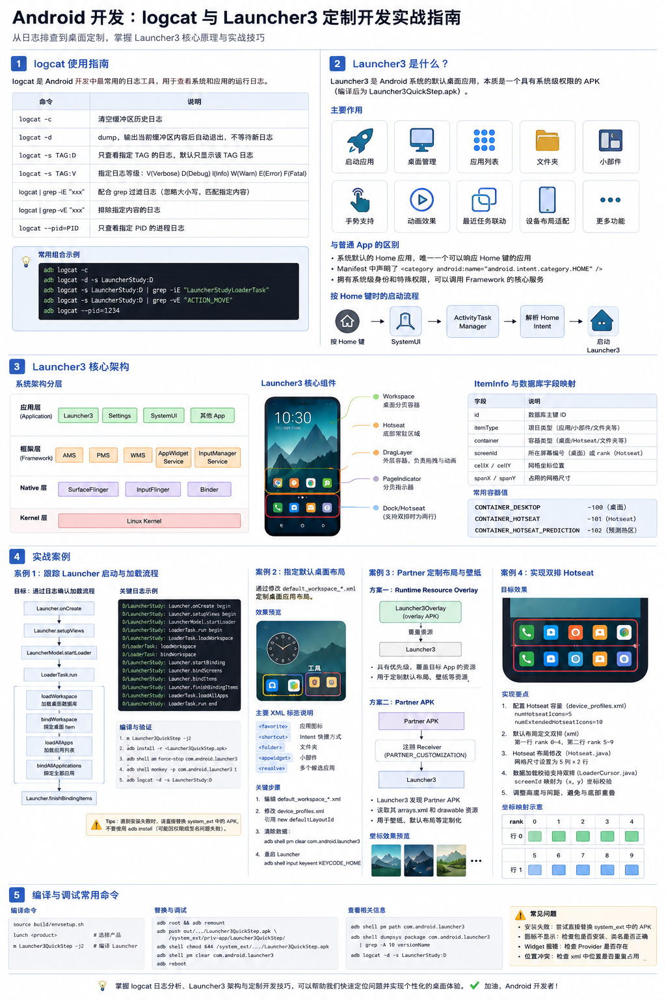

---

## 目录

1. [Logcat 使用指南](#1-logcat-使用指南)
2. [Launcher3 是什么](#2-launcher3-是什么)
3. [Launcher3 与 Android 系统的关系](#3-launcher3-与-android-系统的关系)
4. [Launcher3 与 Launcher3QuickStep 的区别](#4-launcher3-与-launcher3quickstep-的区别)
5. [Launcher3 源码目录](#5-launcher3-源码目录)
6. [Launcher3 核心架构](#6-launcher3-核心架构)
7. [ItemInfo 与数据库字段](#7-iteminfo-与数据库字段)
8. [编译、部署与启动](#8-编译部署与启动)
9. [案例一：跟踪 Launcher 启动和桌面加载流程](#9-案例一跟踪-launcher-启动和桌面加载流程)
10. [案例二：指定默认桌面布局](#10-案例二指定默认桌面布局)
11. [案例三：使用 Overlay 和 Partner APK 定制布局与壁纸](#11-案例三使用-overlay-和-partner-apk-定制布局与壁纸)
12. [案例四：实现双排 Hotseat](#12-案例四实现双排-hotseat)
13. [常见问题与排查方法](#13-常见问题与排查方法)
14. [学习路线建议](#14-学习路线建议)

---

# 1. Logcat 使用指南

## 1.1 Logcat 是什么

`logcat` 是 Android 中最常用的日志查看工具。系统服务、应用进程、Native 模块以及 Launcher3 中通过 `Log.d()`、`Log.i()`、`Log.e()` 等方式输出的日志，都可以通过 logcat 查看。

最常见的用途包括：

- 确认某个方法是否被调用；
- 观察代码执行顺序；
- 查看应用崩溃堆栈；
- 排查 Launcher 数据加载失败；
- 验证 Overlay 或 Partner APK 是否生效；
- 分析系统服务调用过程。

## 1.2 常用命令

### 清空历史日志

```bash
adb logcat -c
```

`-c` 表示清空当前日志缓冲区。通常在复现问题前执行，避免旧日志干扰分析。

### 输出当前日志后退出

```bash
adb logcat -d
```

`-d` 表示 dump：输出当前缓冲区内容，输出完成后自动退出，不持续等待新日志。

### 只查看指定 Tag

```bash
adb logcat -s LauncherStudy:D
```

含义：

- `-s`：只显示指定 Tag；
- `LauncherStudy`：日志 Tag；
- `D`：显示 Debug 及以上等级。

对应代码：

```java
Log.d("LauncherStudy", "Launcher.onCreate begin");
```

### 日志等级

Android 常用日志等级如下：

| 缩写 | 名称 | 说明 |
|---|---|---|
| V | Verbose | 最详细日志 |
| D | Debug | 调试日志 |
| I | Info | 普通信息 |
| W | Warn | 警告 |
| E | Error | 错误 |
| F | Fatal | 严重错误 |

例如：

```bash
adb logcat -s LauncherStudy:V
adb logcat -s LauncherStudy:D
adb logcat -s LauncherStudy:E
```

## 1.3 配合 grep 使用

### 匹配多个关键字

```bash
adb logcat -d | grep -iE "PagedViewStudy|LauncherStudy|LoaderTask"
```

参数说明：

- `-i`：忽略大小写；
- `-E`：使用扩展正则表达式；
- `|`：表示“或者”。

### 排除指定日志

```bash
adb logcat -d | grep -vE "ACTION_MOVE"
```

适合排除大量重复的触摸移动日志。

### 组合过滤

```bash
adb logcat -d \
  | grep -iE "LauncherStudy|LoaderTask|Workspace" \
  | grep -vE "ACTION_MOVE|OpenGLRenderer"
```

## 1.4 查看指定进程日志

先查询 PID：

```bash
adb shell pidof com.android.launcher3
```

再查看对应进程：

```bash
adb logcat --pid=$(adb shell pidof com.android.launcher3)
```

也可以手动指定：

```bash
adb logcat --pid=4709
```

注意：Launcher 进程重启后 PID 会改变。

## 1.5 推荐的 Launcher 调试命令模板

```bash
adb logcat -c
adb shell am force-stop com.android.launcher3
adb shell monkey -p com.android.launcher3 1
adb logcat -d | grep -iE "LauncherStudy|LoaderTask|LauncherProvider|LoaderCursor"
```

---

# 2. Launcher3 是什么

Launcher3 本质上是一个系统应用，也是一个 APK。它位于 Android 应用层，但通常以系统应用或特权应用的身份安装。

在支持 QuickStep 的产品中，常见编译产物是：

```text
Launcher3QuickStep.apk
```

Launcher3 和普通 Android 应用一样，也包含：

- `AndroidManifest.xml`；
- Activity；
- Service；
- Java 源码；
- XML 布局；
- Drawable 资源；
- SQLite 数据库；
- 生命周期管理；
- View 绘制和触摸事件。

但它拥有普通应用不具备的系统身份和默认 Home 能力。

## 2.1 Launcher3 的主要职责

1. 显示桌面图标；
2. 启动其他应用；
3. 管理桌面分页；
4. 显示应用列表 All Apps；
5. 管理文件夹；
6. 承载小部件；
7. 支持拖拽；
8. 支持动画；
9. 与最近任务联动；
10. 适配不同设备尺寸、方向和网格。

## 2.2 点击图标后发生了什么

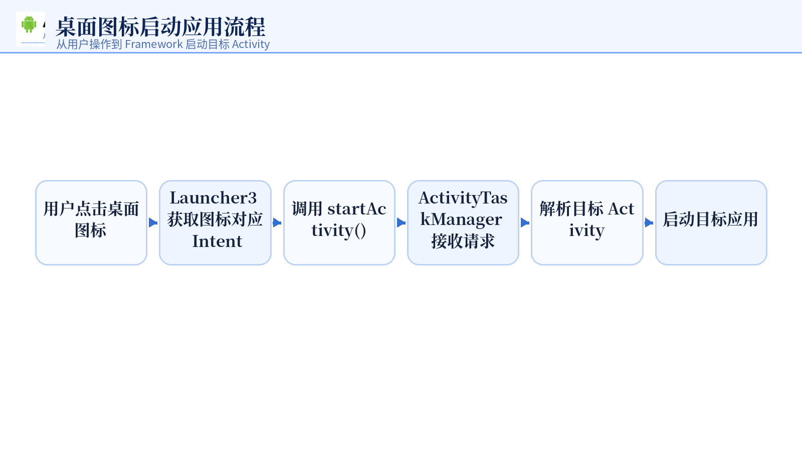

例如点击“设置”：

```text
点击 Settings 图标
    ↓
Launcher3 获取 ComponentName / Intent
    ↓
调用 startActivity()
    ↓
ActivityTaskManagerService 处理启动请求
    ↓
启动 com.android.settings
```

---

# 3. Launcher3 与 Android 系统的关系

Launcher3 不是 Android Framework 本身，而是运行在 Framework 之上的系统桌面应用。

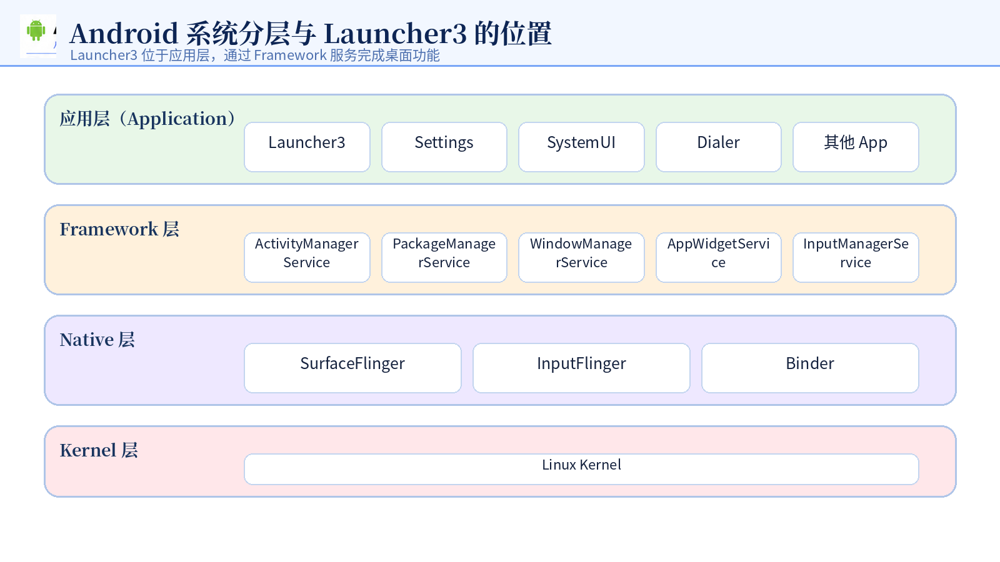

Launcher3 常用的系统服务包括：

| Framework 服务 | Launcher3 用途 |
|---|---|
| ActivityTaskManagerService | 启动应用、任务管理 |
| PackageManagerService | 查询已安装应用、Activity 和图标信息 |
| WindowManagerService | 窗口、动画和屏幕布局 |
| AppWidgetService | 添加和管理桌面小部件 |
| InputManagerService | 输入事件和手势支持 |

## 3.1 为什么 Launcher 能成为系统桌面

关键在 Manifest 中的 HOME 类别：

```xml
<intent-filter>
    <action android:name="android.intent.action.MAIN" />
    <category android:name="android.intent.category.HOME" />
    <category android:name="android.intent.category.DEFAULT" />
</intent-filter>
```

其中最关键的是：

```xml
<category android:name="android.intent.category.HOME" />
```

当用户按下 Home 键时，系统会解析带有 `CATEGORY_HOME` 的 Activity，并启动当前默认桌面。

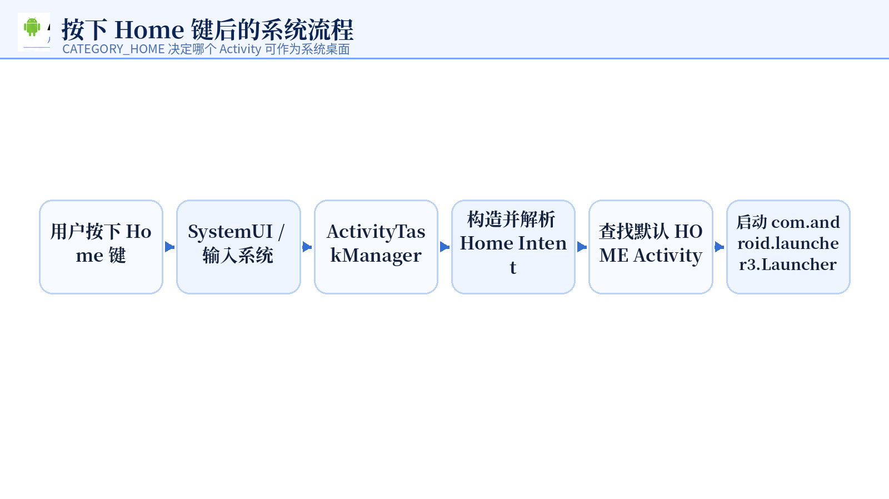

---

# 4. Launcher3 与 Launcher3QuickStep 的区别

## 4.1 Launcher3

基础桌面版本，主要包含：

- Workspace；
- All Apps；
- Folder；
- Widget；
- Hotseat；
- Drag and Drop；
- 桌面分页。

## 4.2 Launcher3QuickStep

在 Launcher3 基础上增加 QuickStep 能力：

- 最近任务 Overview；
- 全面屏手势；
- 上滑回桌面；
- 上滑进入最近任务；
- 左右快速切换任务；
- 与 SystemUI 和 RecentsAnimation 交互。

常见安装位置：

```text
/system_ext/priv-app/Launcher3QuickStep/Launcher3QuickStep.apk
```

源码目录：

```text
packages/apps/Launcher3/quickstep
```

## 4.3 上滑进入最近任务的大致链路

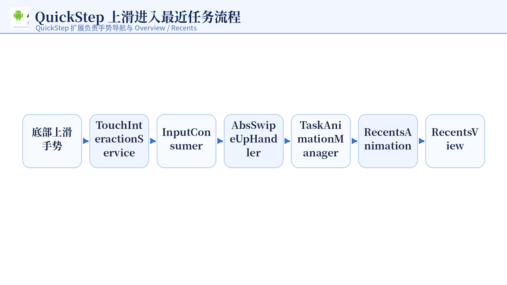

---

# 5. Launcher3 源码目录

Launcher3 根目录：

```text
packages/apps/Launcher3
```

主要目录结构：

```text
packages/apps/Launcher3/
├── Android.bp
├── AndroidManifest.xml
├── AndroidManifest-common.xml
├── res/
│   ├── layout/
│   ├── values/
│   ├── xml/
│   └── drawable/
├── src/com/android/launcher3/
│   ├── Launcher.java
│   ├── LauncherModel.java
│   ├── LauncherProvider.java
│   ├── LauncherState.java
│   ├── PagedView.java
│   ├── Workspace.java
│   ├── Hotseat.java
│   ├── DragLayer.java
│   ├── DeviceProfile.java
│   ├── InvariantDeviceProfile.java
│   ├── IconCache.java
│   ├── model/
│   ├── widget/
│   ├── touch/
│   ├── views/
│   └── util/
└── quickstep/src/com/android/quickstep/
    ├── TouchInteractionService.java
    ├── OtherActivityInputConsumer.java
    ├── TaskAnimationManager.java
    ├── OverviewCommandHelper.java
    └── inputconsumers/
```

---

# 6. Launcher3 核心架构

## 6.1 核心对象

| 类 | 作用 |
|---|---|
| `Launcher` | 主 Activity，负责生命周期、视图初始化和状态切换 |
| `Workspace` | 桌面分页容器，承载图标、文件夹和小部件 |
| `Hotseat` | 底部常驻区域，本质上是一个 CellLayout |
| `DragLayer` | Launcher 最外层容器，承载拖拽、弹窗、动画和触摸分发 |
| `DragController` | 拖拽状态机和拖拽目标管理 |
| `LauncherModel` | Launcher 数据模型入口，负责加载、更新和绑定 |
| `LoaderTask` | 后台线程加载桌面、应用列表和小部件数据 |
| `LauncherProvider` | 创建和升级 `launcher.db` |
| `LoaderCursor` | 逐行读取数据库，并校验 Item 合法性 |
| `ItemInfo` | 桌面元素的通用数据结构 |
| `DeviceProfile` | 当前设备下的实际尺寸和布局参数 |
| `InvariantDeviceProfile` | 网格、图标数等相对稳定的设备配置 |
| `IconCache` | 应用图标和标题缓存 |
| `PagedView` | Launcher 分页滑动基础类 |
| `QuickstepLauncher` | 支持 QuickStep 和 Recents 的 Launcher 实现 |
| `TouchInteractionService` | 手势导航全局输入入口 |
| `RecentsView` | 最近任务界面 |

## 6.2 Launcher3 的数据流水线

Launcher3 的数据流是严格的单向流水线：

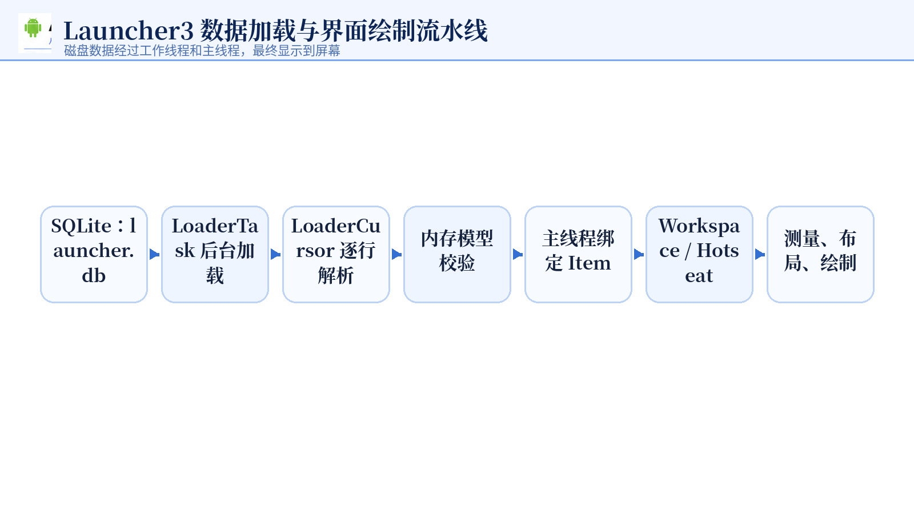

理解这条流水线非常重要。修改默认布局、Hotseat、数据库校验或 Item 坐标时，不能只修改某一个环节。

---

# 7. ItemInfo 与数据库字段

Launcher 中的桌面图标、文件夹、小部件，最终都会抽象为 `ItemInfo` 或其子类。

常见字段：

```java
public int id;
public int itemType;
public int container;
public int screenId;
public int cellX;
public int cellY;
public int spanX;
public int spanY;
```

字段含义：

| 字段 | 含义 |
|---|---|
| `id` | 数据库记录 ID |
| `itemType` | 图标、文件夹、小部件等类型 |
| `container` | 所属容器，如桌面、Hotseat、Folder |
| `screenId` | Workspace 页面 ID，或 Hotseat 中的 rank |
| `cellX` | 网格 X 坐标 |
| `cellY` | 网格 Y 坐标 |
| `spanX` | 横向占用网格数 |
| `spanY` | 纵向占用网格数 |

常用容器：

```java
LauncherSettings.Favorites.CONTAINER_DESKTOP
LauncherSettings.Favorites.CONTAINER_HOTSEAT
LauncherSettings.Favorites.CONTAINER_HOTSEAT_PREDICTION
```

典型值：

```text
CONTAINER_DESKTOP = -100
CONTAINER_HOTSEAT = -101
CONTAINER_HOTSEAT_PREDICTION = -102
```

---

# 8. 编译、部署与启动

## 8.1 初始化编译环境

```bash
source build/envsetup.sh
lunch <product_name>
```

不要只写 `lunch 70` 作为长期文档，因为不同源码环境中的编号可能变化。更推荐使用明确产品名。

## 8.2 编译 Launcher3QuickStep

```bash
m Launcher3QuickStep -j2
```

查找 APK：

```bash
find out/target/product -name "Launcher3QuickStep.apk"
```

## 8.3 查看设备中 Launcher 的真实路径

```bash
adb shell pm path com.android.launcher3
```

## 8.4 为什么不建议直接 adb install

系统 Launcher 往往：

- 位于 `system_ext/priv-app`；
- 使用平台签名；
- 声明系统权限；
- 依赖系统权限组和 privapp 权限；
- 与当前系统镜像版本绑定。

因此直接执行：

```bash
adb install -r Launcher3QuickStep.apk
```

可能出现权限组、签名或降级问题。

## 8.5 推荐替换方式

启动可写 system 的模拟器：

```bash
emulator -writable-system -no-snapshot
```

然后：

```bash
adb root
adb remount

adb push \
out/target/product/<product>/system_ext/priv-app/Launcher3QuickStep/Launcher3QuickStep.apk \
/system_ext/priv-app/Launcher3QuickStep/Launcher3QuickStep.apk

adb shell chmod 644 \
/system_ext/priv-app/Launcher3QuickStep/Launcher3QuickStep.apk

adb shell pm clear com.android.launcher3
adb reboot
```

也可以在同一源码产品上使用：

```bash
adb root
adb remount
adb sync system_ext
adb reboot
```

---

# 9. 案例一：跟踪 Launcher 启动和桌面加载流程

## 9.1 目标

通过日志确认以下调用链：

```text
Launcher.onCreate
    → setupViews
    → LauncherModel.startLoader
    → LoaderTask.run
    → loadWorkspace
    → bindWorkspace
    → loadAllApps
    → bindAllApplications
    → finishBindingItems
```

## 9.2 Launcher.java 添加日志

文件：

```text
packages/apps/Launcher3/src/com/android/launcher3/Launcher.java
```

示例：

```java
private static final String STUDY_TAG = "LauncherStudy";

@Override
protected void onCreate(Bundle savedInstanceState) {
    Log.d(STUDY_TAG, "Launcher.onCreate begin");
    super.onCreate(savedInstanceState);

    // 原有代码

    Log.d(STUDY_TAG, "Launcher.onCreate end");
}

protected void setupViews() {
    Log.d(STUDY_TAG, "Launcher.setupViews begin");

    // 原有代码

    Log.d(STUDY_TAG, "Launcher.setupViews end");
}
```

## 9.3 LauncherModel.java 添加日志

文件：

```text
packages/apps/Launcher3/src/com/android/launcher3/LauncherModel.java
```

不同 AOSP 12 分支入口可能不同：

```java
public boolean startLoader(Callbacks[] newCallbacks)
```

或者：

```java
public boolean addCallbackAndLoad(Callbacks callbacks)
```

在实际存在的方法入口添加：

```java
Log.d("LauncherStudy", "LauncherModel.startLoader");
```

## 9.4 LoaderTask.java 添加日志

文件：

```text
packages/apps/Launcher3/src/com/android/launcher3/model/LoaderTask.java
```

```java
@Override
public void run() {
    Log.d("LauncherStudy", "LoaderTask.run begin");
    try {
        // 原有代码
    } finally {
        Log.d("LauncherStudy", "LoaderTask.run end");
    }
}
```

在关键加载阶段继续添加：

```java
Log.d("LauncherStudy", "LoaderTask.loadWorkspace begin");
Log.d("LauncherStudy", "LoaderTask.loadWorkspace end");

Log.d("LauncherStudy", "LoaderTask.loadAllApps begin");
Log.d("LauncherStudy", "LoaderTask.loadAllApps end");
```

## 9.5 Launcher 回调绑定日志

在对应 Callback 方法中添加：

```java
@Override
public void startBinding() {
    Log.d("LauncherStudy", "Launcher.startBinding");
    // 原有代码
}

@Override
public void bindScreens(IntArray orderedScreenIds) {
    Log.d("LauncherStudy", "Launcher.bindScreens: " + orderedScreenIds);
    // 原有代码
}

@Override
public void bindItems(List<ItemInfo> shortcuts, boolean forceAnimateIcons) {
    Log.d("LauncherStudy", "Launcher.bindItems size=" + shortcuts.size());
    // 原有代码
}

@Override
public void finishBindingItems(IntSet pagesBoundFirst) {
    Log.d("LauncherStudy", "Launcher.finishBindingItems");
    // 原有代码
}
```

## 9.6 编译与验证

```bash
m Launcher3QuickStep -j2
adb root
adb remount
adb sync system_ext
adb reboot
```

复现：

```bash
adb logcat -c
adb shell am force-stop com.android.launcher3
adb shell monkey -p com.android.launcher3 1
adb logcat -d -s LauncherStudy:D
```

## 9.7 预期流程

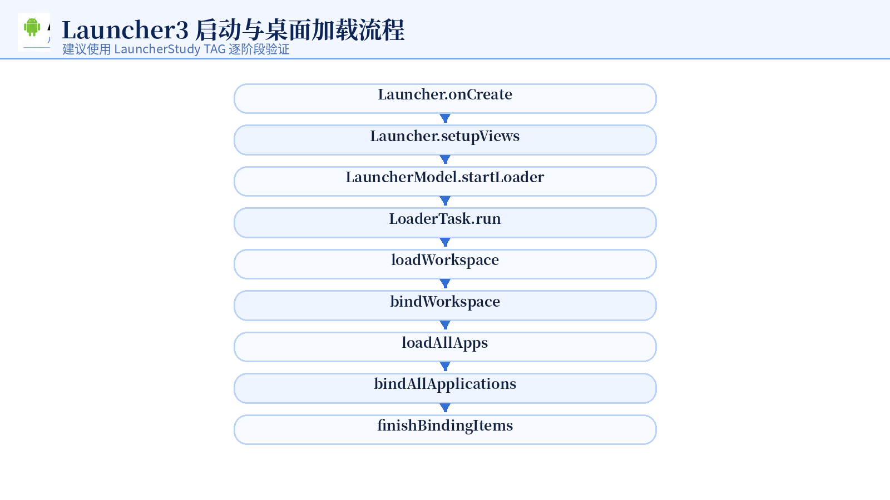

---

# 10. 案例二：指定默认桌面布局

## 10.1 默认布局的加载时机

Launcher 首次启动或数据库被清除后：

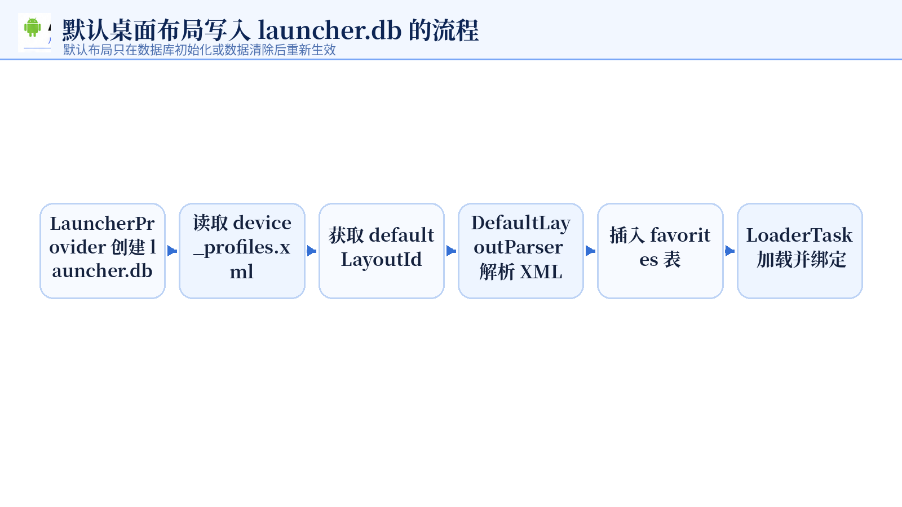

默认布局通常只在数据库首次创建时导入。因此修改 XML 后，应清除 Launcher 数据。

## 10.2 查找当前默认布局

```bash
grep -R "default_workspace" -n packages/apps/Launcher3

grep -R "defaultLayoutId" -n packages/apps/Launcher3/src packages/apps/Launcher3/res
```

## 10.3 示例布局

文件：

```text
packages/apps/Launcher3/res/xml/default_workspace_study.xml
```

```xml
<?xml version="1.0" encoding="utf-8"?>
<favorites xmlns:launcher="http://schemas.android.com/apk/res-auto/com.android.launcher3">

    <favorite
        launcher:packageName="com.android.gallery3d"
        launcher:className="com.android.gallery3d.app.GalleryActivity"
        launcher:screen="0"
        launcher:x="0"
        launcher:y="4" />

    <folder
        launcher:title="工具"
        launcher:screen="0"
        launcher:x="3"
        launcher:y="4">

        <favorite
            launcher:packageName="com.android.gallery3d"
            launcher:className="com.android.gallery3d.app.GalleryActivity" />

        <favorite
            launcher:packageName="com.android.settings"
            launcher:className="com.android.settings.Settings" />
    </folder>

    <resolve
        launcher:screen="1"
        launcher:x="0"
        launcher:y="0">
        <favorite launcher:uri="#Intent;action=android.intent.action.MAIN;category=android.intent.category.APP_MARKET;end" />
        <favorite launcher:uri="market://details?id=com.android.launcher" />
    </resolve>

    <favorite
        launcher:packageName="com.android.settings"
        launcher:className="com.android.settings.Settings"
        launcher:container="-101"
        launcher:screen="0"
        launcher:x="0"
        launcher:y="0" />

</favorites>
```

## 10.4 常见标签

| 标签 | 作用 |
|---|---|
| `<favorite>` | 应用图标 |
| `<shortcut>` | Intent 快捷方式 |
| `<folder>` | 文件夹 |
| `<appwidget>` | 小部件 |
| `<resolve>` | 在多个候选 Intent 中解析可用应用 |

## 10.5 device_profiles.xml 引用布局

```xml
<grid-option
    launcher:name="5_by_5"
    launcher:numRows="5"
    launcher:numColumns="5"
    launcher:numFolderRows="4"
    launcher:numFolderColumns="4"
    launcher:numHotseatIcons="5"
    launcher:dbFile="launcher.db"
    launcher:defaultLayoutId="@xml/default_workspace_study" />
```

## 10.6 数据库检查

```bash
adb root
adb shell ls -l /data/user/0/com.android.launcher3/databases/
adb pull /data/user/0/com.android.launcher3/databases/launcher.db
sqlite3 launcher.db
```

查询：

```sql
.headers on
.mode column

SELECT
    _id,
    title,
    itemType,
    container,
    screen,
    cellX,
    cellY,
    spanX,
    spanY
FROM favorites
ORDER BY container, screen, cellY, cellX;
```

## 10.7 修改后必须清除数据

```bash
adb shell pm clear com.android.launcher3
adb shell input keyevent KEYCODE_HOME
```

否则 Launcher 会继续使用旧数据库，不会重新解析默认布局 XML。

---

# 11. 案例三：使用 Overlay 和 Partner APK 定制布局与壁纸

# 11.1 Runtime Resource Overlay 定制 Launcher 布局

目录示例：

```text
vendor/bohuo2wx/overlay/Launcher3Overlay/
├── Android.bp
├── AndroidManifest.xml
└── res/xml/default_workspace_study.xml
```

## Android.bp

```bp
runtime_resource_overlay {
    name: "Launcher3StudyOverlay",
    theme: "Launcher3StudyOverlay",
    product_specific: true,
    resource_dirs: ["res"],
    manifest: "AndroidManifest.xml",
    aaptflags: [
        "--no-resource-deduping",
        "--no-resource-removal",
    ],
}
```

## AndroidManifest.xml

```xml
<manifest xmlns:android="http://schemas.android.com/apk/res/android"
    package="com.example.launcher3.overlay">

    <application android:hasCode="false" />

    <overlay
        android:targetPackage="com.android.launcher3"
        android:isStatic="true"
        android:priority="10" />
</manifest>
```

## 加入产品编译

```makefile
PRODUCT_PACKAGES += \
    Launcher3StudyOverlay
```

Overlay 生效的前提是：Launcher3 原始资源中存在可覆盖的同名资源，且资源 overlay 策略允许覆盖。

# 11.2 WallpaperPicker Overlay

目录：

```text
vendor/bohuo2wx/overlay/WallpaperPickerOverlay/
├── Android.bp
├── AndroidManifest.xml
├── res/drawable-nodpi/
│   ├── my_custom_wallpaper_1.jpg
│   └── my_custom_wallpaper_2.jpg
└── res/values/arrays.xml
```

需要注意：不同 AOSP 分支的 WallpaperPicker2 资源名和数据源可能不同。不能只凭固定的 `wallpapers` 数组名判断，必须先检查当前源码实际读取逻辑。

建议搜索：

```bash
grep -R "wallpapers_info\|partner_wallpapers\|getStringArray" -n packages/apps/WallpaperPicker2
```

# 11.3 Partner APK 原理

Partner APK 的核心不是通过广播主动执行逻辑，而是通过 Manifest 声明约定 Action，让 Launcher 或 WallpaperPicker 能够发现该系统应用并读取其资源。

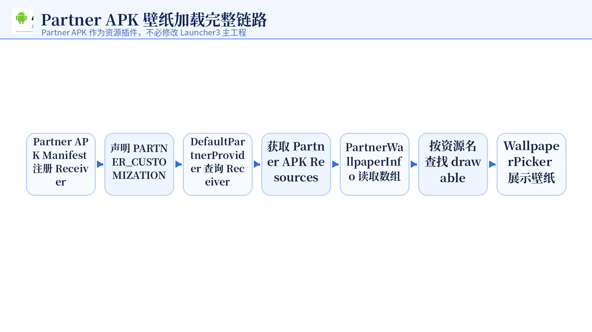

## Manifest 示例

```xml
<manifest xmlns:android="http://schemas.android.com/apk/res/android"
    package="com.bohuo2wx.partnerwallpapers">

    <application android:hasCode="true">
        <receiver
            android:name=".PartnerReceiver"
            android:exported="true">
            <intent-filter>
                <action android:name="com.android.launcher3.action.PARTNER_CUSTOMIZATION" />
            </intent-filter>
        </receiver>
    </application>
</manifest>
```

## Receiver

```java
public class PartnerReceiver extends BroadcastReceiver {
    @Override
    public void onReceive(Context context, Intent intent) {
        // 通常无需主动执行逻辑。
        // 系统主要使用 PackageManager 发现该 APK，并读取其资源。
    }
}
```

## arrays.xml

实际数组名称必须与当前源码中 `PartnerProvider.WALLPAPER_RES_ID` 的值一致。

例如源码定义为：

```java
public static final String WALLPAPER_RES_ID = "partner_wallpapers";
```

那么资源应为：

```xml
<?xml version="1.0" encoding="utf-8"?>
<resources>
    <string-array name="partner_wallpapers" translatable="false">
        <item>bohuo_wallpaper</item>
    </string-array>
</resources>
```

图片：

```text
res/drawable-nodpi/bohuo_wallpaper.jpg
res/drawable-nodpi/bohuo_wallpaper_small.jpg
```

不要把数组名写成源码未读取的 `wallpapers`，否则即使 APK 被发现，壁纸也不会加载。

## 编译与验证

```bash
m WallpaperPicker2 Bohuo2wxPartnerWallpapers
adb root
adb remount
adb sync
adb reboot
```

查看 Receiver：

```bash
adb shell cmd package query-receivers \
  -a com.android.launcher3.action.PARTNER_CUSTOMIZATION
```

查看日志：

```bash
adb logcat -c
adb logcat \
  DefaultPartnerProvider:D \
  PartnerWallpaperInfo:D \
  PartnerWallpapers:D \
  '*:S'
```

注意在 zsh 中最好给 `*:S` 加引号，避免通配符扩展。

---

# 12. 案例四：实现双排 Hotseat

## 12.1 为什么不能只改 XML

默认 Hotseat 是单排结构。Google 原生 Launcher3 的大量逻辑默认假设 Hotseat 是一维 rank。

双排改造至少涉及：

1. Hotseat 网格尺寸；
2. rank 到 cellX/cellY 的映射；
3. 数据库占用校验；
4. Item 绑定坐标；
5. 默认布局 XML；
6. DeviceProfile 高度和内边距；
7. 拖拽位置计算；
8. 横竖屏兼容；
9. 预测图标和 QSB；
10. 数据库迁移或清除旧数据。

## 12.2 设计约定

本文以 5 列 × 2 行为例：

```text
第一行：rank 0 1 2 3 4
第二行：rank 5 6 7 8 9
```

映射公式：

```java
cellX = rank % columnCount;
cellY = rank / columnCount;
```

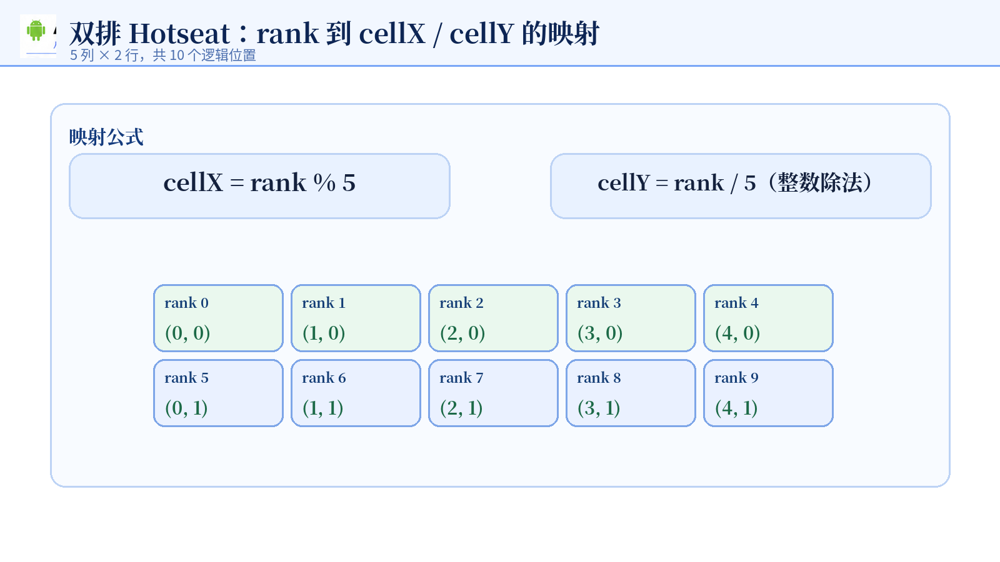

| rank | cellX | cellY |
|---:|---:|---:|
| 0 | 0 | 0 |
| 1 | 1 | 0 |
| 4 | 4 | 0 |
| 5 | 0 | 1 |
| 9 | 4 | 1 |

## 12.3 配置容量

文件：

```text
packages/apps/Launcher3/res/xml/device_profiles.xml
```

示例：

```xml
<grid-option
    launcher:name="5_by_5"
    launcher:numRows="5"
    launcher:numColumns="5"
    launcher:numFolderRows="4"
    launcher:numFolderColumns="4"
    launcher:numHotseatIcons="5"
    launcher:numExtendedHotseatIcons="10"
    launcher:dbFile="launcher.db"
    launcher:defaultLayoutId="@xml/default_workspace_study_hotseat" />
```

注意：`numExtendedHotseatIcons` 并不是所有 Launcher3 分支都存在。使用前应确认当前 AOSP 12 源码确实定义和读取了该属性。若不存在，需要在 `InvariantDeviceProfile`、资源声明和解析逻辑中自行增加，不能只在 XML 中写入。

## 12.4 默认双排布局 XML

```xml
<?xml version="1.0" encoding="utf-8"?>
<favorites xmlns:launcher="http://schemas.android.com/apk/res-auto/com.android.launcher3">

    <!-- 第一行：rank 0～4 -->
    <favorite
        launcher:packageName="com.android.settings"
        launcher:className="com.android.settings.Settings"
        launcher:container="-101"
        launcher:screen="0"
        launcher:x="0"
        launcher:y="0" />

    <!-- 第二行：rank 5～9 -->
    <favorite
        launcher:packageName="com.android.calendar"
        launcher:className="com.android.calendar.AllInOneActivity"
        launcher:container="-101"
        launcher:screen="5"
        launcher:x="0"
        launcher:y="1" />

</favorites>
```

实际产品中必须确认每个包名和 Activity 都真实存在：

```bash
adb shell cmd package resolve-activity \
  -n com.android.calendar/com.android.calendar.AllInOneActivity
```

或者：

```bash
adb shell dumpsys package com.android.calendar | grep -i Activity
```

## 12.5 修改 Hotseat.java

文件：

```text
packages/apps/Launcher3/src/com/android/launcher3/Hotseat.java
```

### rank 转 cellX

```java
public int getCellXFromOrder(int rank) {
    if (mHasVerticalHotseat) {
        return 0;
    }
    int countX = getCountX();
    return countX > 1 ? rank % countX : rank;
}
```

### rank 转 cellY

```java
public int getCellYFromOrder(int rank) {
    if (mHasVerticalHotseat) {
        return getCountY() - (rank + 1);
    }
    int countX = getCountX();
    return countX > 1 ? rank / countX : 0;
}
```

### 设置网格

```java
public void resetLayout(boolean hasVerticalHotseat) {
    removeAllViewsInLayout();
    mHasVerticalHotseat = hasVerticalHotseat;

    DeviceProfile dp = mActivity.getDeviceProfile();
    if (hasVerticalHotseat) {
        setGridSize(1, dp.numShownHotseatIcons);
    } else {
        setGridSize(5, 2);
    }
}
```

更稳妥的方式是不硬编码 `5` 和 `2`，而是将其抽象为配置：

```java
setGridSize(dp.numShownHotseatIcons, HOTSEAT_ROW_COUNT);
```

## 12.6 修改 Hotseat 高度

双排后不能简单地把所有场景中的 `hotseatBarSizePx` 乘 2。Hotseat 高度通常还包含：

- 图标尺寸；
- 图标文字区域；
- 上下 padding；
- QSB 高度；
- 导航栏 inset；
- Taskbar；
- Workspace 底部 padding。

示意代码：

```java
lp.height = grid.hotseatBarSizePx * 2 + insets.bottom;
```

只能作为初步验证。正式实现应在 `DeviceProfile` 中统一计算双排 Hotseat 的实际高度，并确保 Workspace 可用高度同步减少。

否则可能出现：

- 第二排被裁剪；
- Workspace 与 Hotseat 重叠；
- QSB 挡住图标；
- 点击区域和显示区域不一致；
- 拖拽落点偏移。

## 12.7 修改 LoaderCursor 数据库占用校验

文件：

```text
packages/apps/Launcher3/src/com/android/launcher3/model/LoaderCursor.java
```

示例：

```java
private static final int HOTSEAT_COLUMN_COUNT = 5;
private static final int HOTSEAT_ROW_COUNT = 2;

protected boolean checkItemPlacement(ItemInfo item) {
    if (item.container == LauncherSettings.Favorites.CONTAINER_HOTSEAT) {
        final int hotseatIndex = (int) item.screenId;
        final int maxCount = HOTSEAT_COLUMN_COUNT * HOTSEAT_ROW_COUNT;

        if (hotseatIndex < 0 || hotseatIndex >= maxCount) {
            Log.e(TAG, "Invalid hotseat position: " + item);
            return false;
        }

        final int x = hotseatIndex % HOTSEAT_COLUMN_COUNT;
        final int y = hotseatIndex / HOTSEAT_COLUMN_COUNT;

        GridOccupancy occupancy = occupied.get(
                LauncherSettings.Favorites.CONTAINER_HOTSEAT);

        if (occupancy == null) {
            occupancy = new GridOccupancy(
                    HOTSEAT_COLUMN_COUNT,
                    HOTSEAT_ROW_COUNT);
            occupied.put(
                    LauncherSettings.Favorites.CONTAINER_HOTSEAT,
                    occupancy);
        }

        if (occupancy.cells[x][y]) {
            Log.e(TAG, "Hotseat position occupied: x=" + x
                    + ", y=" + y + ", item=" + item);
            return false;
        }

        occupancy.cells[x][y] = true;
        return true;
    }

    if (item.container != LauncherSettings.Favorites.CONTAINER_DESKTOP) {
        return true;
    }

    // 保留原有 Workspace 校验逻辑
    return true;
}
```

必须确认 `GridOccupancy.cells` 的维度顺序是 `[x][y]`。不要凭印象写成 `[y][x]`。

## 12.8 Item 绑定坐标

仅修改 `LoaderCursor` 只能保证数据库校验通过，不能保证 View 真正绑定到第二行。

需要继续检查：

```text
WorkspaceLayoutManager.addInScreenFromBind()
Hotseat.getCellXFromOrder()
Hotseat.getCellYFromOrder()
```

对于 Hotseat Item，应保证：

```java
cellX = hotseat.getCellXFromOrder((int) item.screenId);
cellY = hotseat.getCellYFromOrder((int) item.screenId);
```

如果绑定阶段仍然把 `cellY` 固定为 0，第二排数据虽然存在，也会全部压到第一排。

## 12.9 拖拽和 rank 反向计算

双排后还需要检查从坐标反推 rank 的逻辑。

正确关系：

```java
rank = cellY * columnCount + cellX;
```

需要搜索：

```bash
grep -R "getOrderInHotseat\|getCellXFromOrder\|getCellYFromOrder" \
  -n packages/apps/Launcher3/src packages/apps/Launcher3/quickstep
```

常见受影响功能：

- 从 All Apps 拖入 Hotseat；
- Hotseat 图标换位；
- 删除图标后的重新排序；
- 横竖屏切换；
- 数据库写回；
- 预测图标；
- 无障碍拖拽。

## 12.10 完整验证流程

```bash
m Launcher3QuickStep -j2
adb root
adb remount
adb sync system_ext
adb shell pm clear com.android.launcher3
adb reboot
```

查看日志：

```bash
adb logcat -c
adb logcat -d | grep -iE \
"Hotseat|LoaderCursor|LauncherStudy|occupied|Invalid hotseat|position"
```

数据库验证：

```sql
SELECT
    _id,
    title,
    container,
    screen,
    cellX,
    cellY
FROM favorites
WHERE container = -101
ORDER BY screen;
```

预期结果：

```text
screen 0～4  → cellY = 0
screen 5～9  → cellY = 1
```

---

# 13. 常见问题与排查方法

## 13.1 adb install 报权限组不存在

错误示例：

```text
Package com.android.launcher3 attempting to declare permission
com.android.launcher3.permission.WRITE_SETTINGS
in non-existing group android.permission-group.SYSTEM_TOOLS
```

原因通常不是 APK 本身编译失败，而是：

- APK 与当前模拟器 Framework 不匹配；
- 当前系统镜像没有对应权限组；
- Launcher 使用平台权限，不能按普通 APK 安装；
- 安装包来自不同产品或不同源码版本。

解决：

- 使用同一套源码和产品编译；
- 替换 `system_ext/priv-app` 中 APK；
- 使用 `adb sync system_ext`；
- 必要时重新刷写完整镜像。

## 13.2 修改默认布局后没有变化

检查：

1. `device_profiles.xml` 是否引用正确 XML；
2. 是否有 Overlay 覆盖该资源；
3. 是否清除了 Launcher 数据；
4. 当前产品是否使用另一个 grid option；
5. 是否启动了正确的 Launcher APK；
6. 修改后的资源是否已进入设备镜像。

命令：

```bash
adb shell pm clear com.android.launcher3
adb shell input keyevent KEYCODE_HOME
```

## 13.3 Can't find widget provider

错误：

```text
Can't find widget provider: com.android.deskclock.DigitalAppWidgetProvider
```

说明默认布局中填写的 AppWidget Provider 不存在。

检查：

```bash
adb shell pm list packages | grep deskclock
adb shell dumpsys package com.android.deskclock | grep -i AppWidget
```

也可以从 APK Manifest 或源码中确认真实的 `AppWidgetProvider` 类名。

## 13.4 Workspace 位置被占用

错误：

```text
already occupied
```

常见原因：

- 两个 Item 使用相同 screen、cellX、cellY；
- 系统自动添加了搜索框或小部件；
- 默认布局与数据库旧数据叠加；
- Overlay 与主工程布局同时生效；
- 坐标映射错误。

解决：

- 查询 favorites 表；
- 清除 Launcher 数据；
- 将 Item 移动到其他单元格；
- 检查 QSB 和默认占位；
- 增加 `LoaderCursor` 日志。

## 13.5 Partner APK 已发现但壁纸不显示

依次检查：

1. Receiver 是否被查询到；
2. APK 是否为系统应用；
3. 数组名是否与源码常量一致；
4. drawable 名称是否与数组 Item 一致；
5. 图片是否进入 APK；
6. WallpaperPicker 是否使用当前 PartnerProvider；
7. 是否需要清除 WallpaperPicker 数据或执行 `adb sync`。

## 13.6 adb sync 后生效，adb push 后不生效

可能原因：

- 修改的不只是 APK，还包括 Overlay、资源表或其他分区文件；
- `adb push` 只替换了一个文件；
- `adb sync` 同步了 product/system_ext 等多个相关产物；
- 资源 overlay 需要与目标包在启动或系统重启时重新加载。

---

# 14. 学习路线建议

建议按照以下顺序学习 Launcher3：

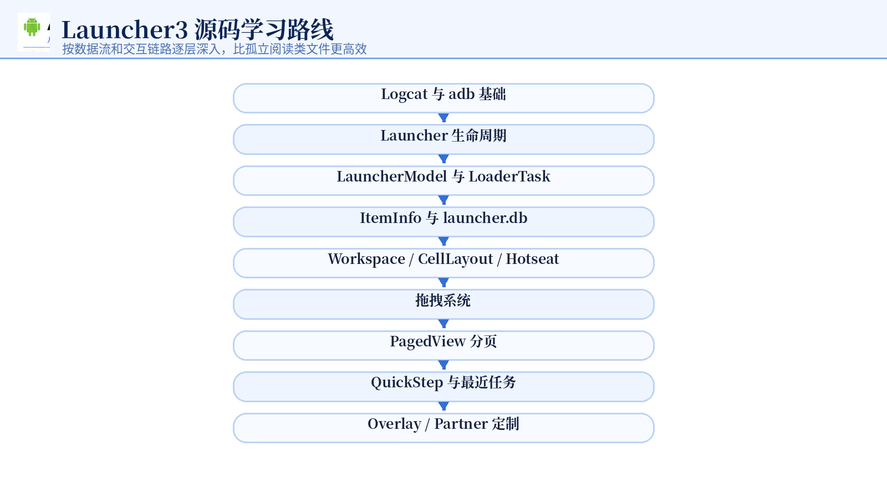

每学习一个模块，都建议采用同样的方法：

1. 找入口；
2. 添加日志；
3. 编译和部署；
4. 操作界面复现；
5. 分析日志顺序；
6. 查询数据库或 dumpsys；
7. 修改一个小功能验证理解。

---

# 附录 A：常用命令速查

```bash
# 清空日志
adb logcat -c

# 输出当前日志并退出
adb logcat -d

# 查看指定 Tag
adb logcat -s LauncherStudy:D

# 匹配多个关键词
adb logcat -d | grep -iE "LauncherStudy|LoaderTask|LoaderCursor"

# 排除日志
adb logcat -d | grep -vE "ACTION_MOVE"

# 查看 Launcher PID
adb shell pidof com.android.launcher3

# 查看 Launcher APK 路径
adb shell pm path com.android.launcher3

# 强制停止 Launcher
adb shell am force-stop com.android.launcher3

# 启动 Launcher
adb shell monkey -p com.android.launcher3 1

# 清除 Launcher 数据
adb shell pm clear com.android.launcher3

# 返回桌面
adb shell input keyevent KEYCODE_HOME

# 查询 HOME Activity
adb shell cmd package resolve-activity \
  -a android.intent.action.MAIN \
  -c android.intent.category.HOME

# 查询 Partner Receiver
adb shell cmd package query-receivers \
  -a com.android.launcher3.action.PARTNER_CUSTOMIZATION
```

# 附录 B：核心结论

- Launcher3 是应用层系统桌面，不是 Framework 本身；
- `CATEGORY_HOME` 决定 Activity 能否成为系统主屏幕；
- Launcher3QuickStep 在 Launcher3 上增加最近任务和手势导航；
- 默认布局通常只在首次创建数据库时导入；
- 修改默认布局后必须清除 Launcher 数据；
- Partner APK 主要通过 PackageManager 被发现，然后由目标应用读取资源；
- 双排 Hotseat 不是单纯 XML 改造，而是配置、数据、绑定、布局和拖拽的协同修改；
- 所有结论都应通过 logcat、数据库和源码调用链交叉验证。
