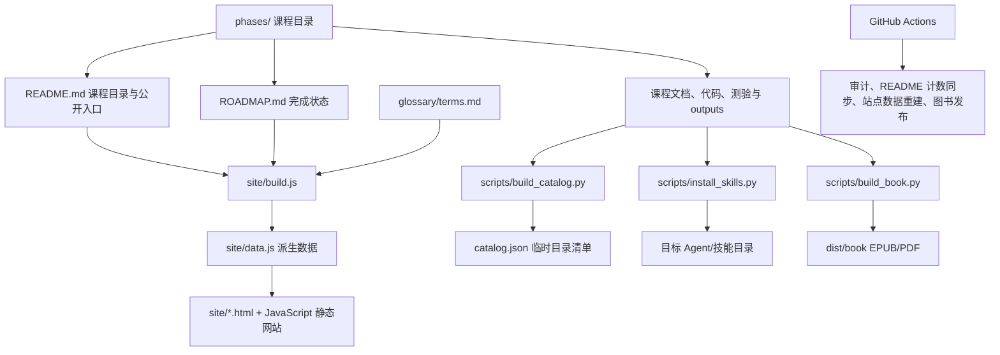

# 架构说明

## 概览

本项目采用“课程目录为内容事实源，脚本派生索引与发布物”的静态内容架构。运行时不依赖应用服务器或数据库：网站、书籍和可安装产物均由仓库中的文件和构建脚本生成。



## 内容层

`phases/` 是课程内容的主事实源。目录命名遵循 `NN-阶段名/MM-课程名`，每个课程应具备 `docs/en.md`，并可包含 `code/`、`quiz.json`、`outputs/` 与 notebook。

课程质量约束由 `scripts/audit_lessons.py` 执行：检查课程目录命名、课程文档、非空代码目录、测验 schema 与课程文档中的内部链接。课程贡献还需遵守根目录的 `AGENTS.md`：一课一提交、受限依赖、代码可端到端执行、最少测试要求及标准化 quiz 结构。

`README.md` 是面向读者的产品入口，同时提供可供站点解析的阶段与课程表。`ROADMAP.md` 是状态事实源，使用 `✅`、`🚧`、`⬚` 表示完成、进行中和计划。`glossary/terms.md` 是跨课程术语的权威来源。

## 派生数据与静态网站

`site/build.js` 在仓库根目录读取 README、ROADMAP 与术语表，解析课程列表、课程状态、课程摘要、关键词和术语，然后生成 `site/data.js`。网站页面和 JavaScript 通过该全局数据渲染阶段、课程列表、搜索与导航。

网站为原生静态 HTML、CSS、JavaScript：

- `site/index.html` 与 `site/app.js`：首页、阶段总览和弹窗课程列表。
- `site/lesson.html`：按 `?path=phases/...` 在浏览器加载并渲染课程内容。
- `site/progress.js`：将测验答案和完成进度保存到浏览器 `localStorage`。
- `site/catalog.html`、`glossary.html`、`prereqs.html`、`about.html`：目录、术语、路径和说明页。
- `site/style.css` 与 `site/figures-*.js`：统一视觉样式及交互图形。

`vercel.json` 将 `site/` 作为部署输出目录，构建命令为 `node site/build.js`，并配置常用静态路由重写和缓存策略。因此生产部署的前提是 `site/data.js` 与内容源保持同步。

## 自动化与发布

### 课程目录清单

`scripts/build_catalog.py` 扫描 `phases/`，输出课程、代码文件、测验和产物清单。默认输出 `catalog.json`，该文件是临时生成物且被忽略，不应提交。它也被 README 计数校验使用。

### 课程产物安装

`scripts/install_skills.py` 发现所有课程 `outputs/` 中以 `skill-`、`prompt-` 或 `agent-` 开头的 Markdown 文件，读取 YAML frontmatter，并按类型、阶段或标签过滤。它可使用 flat、by-phase 或 skills 三种布局复制至外部目录，同时写入 `manifest.json`。

### 图书构建

`scripts/build_book.py` 按 `book/volumes.json` 将课程文档拼成六卷书。它把交互图和在线测验保留为回链，并通过 Pandoc 生成 EPUB；传入 `--pdf` 时还需要 XeLaTeX。`build-book.yml` 在主分支课程变更时构建 EPUB，在发布或手动触发时构建 EPUB/PDF 并上传到 Release。

### CI 职责

`.github/workflows/curriculum.yml` 在 PR 和主分支的相关变更上运行课程审计。主分支 push 后，CI 先生成临时目录清单并自动修复 README 计数，再运行 `node site/build.js` 并自动提交新的 `site/data.js`。因此：

- 应编辑内容源、README 的课程链接行、ROADMAP 和术语表。
- 不应手工提交 `catalog.json`。
- `site/data.js` 是派生文件，常规课程 PR 不应手改；主分支 CI 会重建它。

## 本地验证边界

最低验证命令如下：

```bash
python3 scripts/audit_lessons.py
python3 scripts/check_readme_counts.py
node site/build.js
```

修改某节课程时，还应在该课程的 `code/` 目录执行主程序与对应的标准库测试命令。图书构建需要本地安装 Pandoc；生成 PDF 额外需要 XeLaTeX，Mermaid CLI 只在可用时将 Mermaid 图预渲染为 SVG。

## 关键设计约束

1. README 的课程行必须保留 Markdown 链接，站点构建器据此推导课程 URL。
2. ROADMAP 的状态符号和表格形状是构建器输入，不可随意替换。
3. 课程文档中的代码围栏必须有语言标记；图表使用 Mermaid 或 SVG。
4. 课程依赖尽量使用标准库，允许的附加依赖以 `AGENTS.md` 为准。
5. 每次课程变更应限定在单个课程目录及其必要的 README、ROADMAP、术语更新，保持审查和回滚边界清晰。