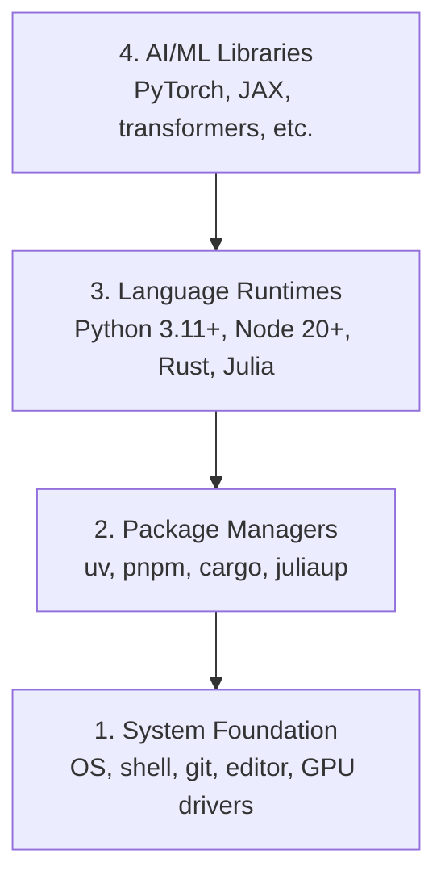

# 开发环境搭建

> 每一个 AI 工程里程碑都始于一个稳健、可复现的开发环境。搞定驱动、包管理器与项目结构。

**Type:** 构建
**Languages:** Python, Bash
**Prerequisites:** 无
**Time:** ~45 分钟

## 学习目标

- 从零开始设置 Python 3.11+、Node.js 20+ 和 Rust 工具链
- 为可复现的构建配置虚拟环境和包管理器
- 使用 CUDA/MPS 验证 GPU 访问并运行测试张量操作
- 理解四层堆栈：系统、软件包、运行时、AI 库

## The Problem

你即将通过 200 多节课学习使用 Python、TypeScript、Rust 和 Julia 进行 AI 工程。如果环境配置错误，每节课都会变成与工具链的斗争，而非学习本身。

大多数人会跳过环境搭建。然后他们花费数小时调试导入错误、版本冲突和缺失的 CUDA 驱动。我们将一次性正确完成这个过程。

## The Concept

AI 工程环境有四层：

 /think



我们采用自底向上的方式安装。每一层都依赖于它下面的那一层。

## 构建它

### 步骤 1：系统基础

检查您的系统并安装基础知识。

 /think

```bash
# macOS
xcode-select --install
brew install git curl wget

# Ubuntu/Debian
sudo apt update && sudo apt install -y build-essential git curl wget

# Windows (use WSL2)
wsl --install -d Ubuntu-24.04
```

### 步骤2：使用 uv 的 Python

我们使用 `uv` —— 它比 pip 快 10-100 倍，并且可以自动处理虚拟环境。

```bash
curl -LsSf https://astral.sh/uv/install.sh | sh

uv python install 3.12

uv venv
source .venv/bin/activate  # or .venv\Scripts\activate on Windows

uv pip install numpy matplotlib jupyter
```

Verify:

```python
import sys
print(f"Python {sys.version}")

import numpy as np
print(f"NumPy {np.__version__}")
a = np.array([1, 2, 3])
print(f"Vector: {a}, dot product with itself: {np.dot(a, a)}")
```

### Step 3: Node.js with pnpm

For TypeScript lessons (agents, MCP servers, web apps).

```bash
curl -fsSL https://fnm.vercel.app/install | bash
fnm install 22
fnm use 22

npm install -g pnpm

node -e "console.log('Node', process.version)"
```**macOS / Apple Silicon (M1/M2/M3/M4):** 如果安装器在 `Error: Cannot install under Rosetta 2 in ARM default prefix (/opt/homebrew)` 处停止，表示你的终端正在 Rosetta 2 下运行（`arch` 输出 `i386`），而 Homebrew 是原生的 arm64 构建版本。请强制安装 arm64 版本的 fnm，将其集成到你的 shell 中，然后从 `fnm install 22` 重新运行上面的命令：

 /opt/homebrew/bin/fnm install 22

```bash
arch -arm64 brew install fnm
echo 'eval "$(fnm env --use-on-cd)"' >> ~/.zshrc
source ~/.zshrc
```

### Step 4: Rust

For performance-critical lessons (inference, systems).

```bash
curl --proto '=https' --tlsv1.2 -sSf https://sh.rustup.rs | sh

rustc --version
cargo --version
```

### Step 5: Julia (Optional)

For math-heavy lessons where Julia shines.

```bash
curl -fsSL https://install.julialang.org | sh

julia -e 'println("Julia ", VERSION)'
```

### Step 6: GPU Setup (If You Have One)

**NVIDIA (Linux / Windows):**

```bash
nvidia-smi

# Install PyTorch with CUDA
uv pip install torch torchvision torchaudio --index-url https://download.pytorch.org/whl/cu124
```**macOS / Apple Silicon (M1/M2/M3/M4):** 在 Mac 上没有 CUDA —— 这是预期的结果，而不是故障。**不要**传递 `--index-url .../cuXXX`（这些 wheel 仅适用于 Linux/Windows，因此安装会失败）。安装普通版本的构建，其中包含 Apple 的 MPS (Metal) GPU 后端：

 /usr/local/bin

```bash
uv pip install torch torchvision torchaudio
```

Verify (works on any platform):

```python
import torch
print(f"CUDA available: {torch.cuda.is_available()}")           # False on macOS — expected
print(f"MPS available:  {torch.backends.mps.is_available()}")   # True on Apple Silicon
if torch.cuda.is_available():
    print(f"GPU: {torch.cuda.get_device_name(0)}")
```

没有 GPU？没问题。大部分课程可以在 CPU 上运行。对于需要大量训练的课程，请使用 Google Colab 或云 GPU。

### 第7步：验证所有内容

运行验证脚本：

 /think

```bash
python phases/00-setup-and-tooling/01-dev-environment/code/verify.py
```

## 使用它

你的环境现在已准备好用于本课程的每一节课。以下是使用方式：

| 语言 | 使用阶段 | 包管理器 |
|--|---------|-----------|
| Python | 阶段1-12（机器学习、深度学习、自然语言处理、视觉、音频、大语言模型） | uv |
| TypeScript | 阶段13-17（工具、代理、群体、基础设施） | pnpm |
| Rust | 阶段12、15-17（高性能关键系统） | cargo |
| Julia | 阶段1（数学基础） | Pkg |

## 发布它

本课生成一个验证脚本，任何人都可以运行它来检查自己的环境设置。

查看 `outputs/prompt-env-check.md` 获取一个提示，帮助AI助手诊断环境问题。

## 练习

1. 运行验证脚本并修复任何失败项
2. 为本课程创建一个Python虚拟环境并安装PyTorch
3. 用所有四种语言编写一个"hello world"并运行每个程序
