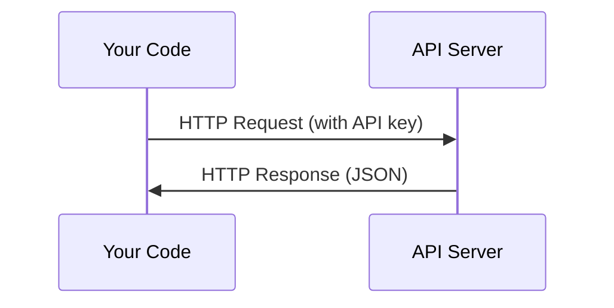

# API 与密钥安全管理

> 安全地集成 LLM API。掌握环境变量管理、限流重试、错误处理以及 Token 计量计算。

**Type:** 构建
**Languages:** Python, Bash
**Prerequisites:** 无
**Time:** ~30 分钟

## 学习目标

- 使用环境变量和 `.env` 文件安全存储 API 密钥
- 使用 Anthropic Python SDK 和原始 HTTP 两种方式调用 LLM API
- 对比 SDK 和原始 HTTP 请求/响应格式用于调试
- 识别并处理常见 API 错误包括认证和限流

## The Problem

从 Phase 11 开始，你将调用 LLM APIs (Anthropic, OpenAI, Google)。在 Phase 13-16 中你将构建使用这些 API 的循环代理。你需要了解 API 密钥的工作原理、如何安全存储它们以及如何进行首次 API 调用。

## The Concept



每个API调用都有：
1. 一个端点（URL）
2. 一个API密钥（认证）
3. 一个请求体（你想要的内容）
4. 一个响应体（你获得的结果）

## 构建它

### 步骤1：安全存储API密钥

切勿将API密钥直接写入代码。使用环境变量。

 /think

```bash
export ANTHROPIC_API_KEY="sk-ant-..."
export OPENAI_API_KEY="sk-..."
```

Or use a `.env` file (add it to `.gitignore`):

```
ANTHROPIC_API_KEY=sk-ant-...
OPENAI_API_KEY=sk-...
```

### Step 2: First API call (Python)

```python
import os

import anthropic

client = anthropic.Anthropic()

MODEL = os.environ.get("LLM_MODEL", "claude-sonnet-5")

response = client.messages.create(
    model=MODEL,
    max_tokens=256,
    messages=[{"role": "user", "content": "What is a neural network in one sentence?"}]
)

print(response.content[0].text)
```

`LLM_MODEL` 选择 Anthropic 模型 ID，默认值为未指定日期的 Sonnet 别名。其他提供商（OpenAI、Google 等）遵循相同的模式：一个键加上模型 ID，但每个提供商都有自己的 SDK、端点和请求/响应模式。

### 步骤3：首次 API 调用（TypeScript）

```typescript
import Anthropic from "@anthropic-ai/sdk";

const client = new Anthropic();

const MODEL = process.env.LLM_MODEL ?? "claude-sonnet-5";

const response = await client.messages.create({
  model: MODEL,
  max_tokens: 256,
  messages: [{ role: "user", content: "What is a neural network in one sentence?" }],
});

console.log(response.content[0].text);
```

### Step 4: Raw HTTP (no SDK)

```python
import os
import urllib.request
import json

url = "https://api.anthropic.com/v1/messages"
headers = {
    "Content-Type": "application/json",
    "x-api-key": os.environ["ANTHROPIC_API_KEY"],
    "anthropic-version": "2023-06-01",
}
body = json.dumps({
    "model": os.environ.get("LLM_MODEL", "claude-sonnet-5"),
    "max_tokens": 256,
    "messages": [{"role": "user", "content": "What is a neural network in one sentence?"}],
}).encode()

req = urllib.request.Request(url, data=body, headers=headers, method="POST")
with urllib.request.urlopen(req) as resp:
    result = json.loads(resp.read())
    print(result["content"][0]["text"])
```

这是 SDK 在底层所做的操作。理解原始 HTTP 请求有助于调试。

## 使用方法

对于本课程：

| API | 使用场景 | 免费层级 |
|-----|-----------------|-----------|
| Anthropic (Claude) | 第 11-16 阶段（代理，工具） | 注册时赠送 5 美元信用额度 |
| OpenAI | 第 11 阶段（对比） | 注册时赠送 5 美元信用额度 |
| Hugging Face | 第 4-10 阶段（模型，数据集） | 免费 |

你现在不需要全部使用。当课程要求时再进行设置。

## 部署

本课将生成：
- `outputs/prompt-api-troubleshooter.md` - 诊断常见 API 错误

## 练习

1. 获取 Anthropic API 密钥并进行首次 API 调用
2. 尝试原始 HTTP 版本，并将响应格式与 SDK 版本进行对比
3. 故意使用错误的 API 密钥并阅读错误信息

## 关键术语

| 术语 | 人们常说 | 实际含义 |
|------|----------------|----------------------|
| API 密钥 | "API 的密码" | 一个唯一字符串，用于识别您的账户并授权请求 |
| 速率限制 | "他们正在限流" | 每分钟/每小时最大请求数，用于防止滥用并确保公平使用 |
| 令牌 | "一个词"（在 API 上下文中） | 计费单位：输入和输出令牌分别计数并收费 |
| 流式传输 | "实时响应" | 逐字获取响应，而不是等待完整响应 |
