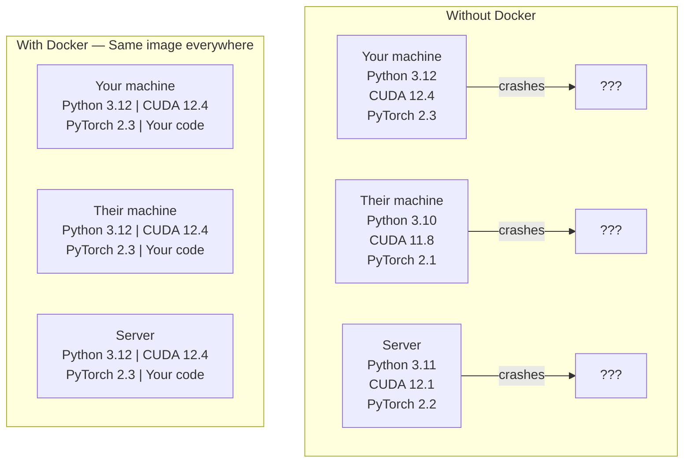

# 面向 AI 的 Docker 容器化

> 打包包括 C++ 驱动、CUDA 运行时与 PyTorch 在内的完整 AI 系统。构建高效的 GPU 容器镜像。

**Type:** 构建  
**Languages:** Docker, Bash  
**Prerequisites:** 开发环境搭建  
**Time:** ~45 分钟  

## 学习目标

- 从 Dockerfile 构建一个启用 GPU 的 Docker 镜像，其中包含 CUDA、PyTorch 和 AI 库  
- 将主机目录挂载为卷，以便在容器重建过程中持久化模型、数据集和代码  
- 配置 NVIDIA Container Toolkit，以在容器内暴露 GPU  
- 使用 Docker Compose 协调多服务 AI 应用程序（推理服务器 + 向量数据库）

## The Problem

你在笔记本电脑上使用 PyTorch 2.3、CUDA 12.4 和 Python 3.12 训练了一个模型。你的同事使用 PyTorch 2.1、CUDA 11.8 和 Python 3.10。你的模型在其机器上崩溃了。你的 Dockerfile 在两者上都正常运行。

AI 项目是依赖的噩梦。一个典型的堆栈包括 Python、PyTorch、CUDA 驱动、cuDNN、系统级 C 库以及需要特定编译器版本的专用包（如 flash-attn）。Docker 将所有这些打包成一个单一的镜像，可以在任何地方以完全相同的方式运行。

## The Concept

Docker 将你的代码、运行时、库和系统工具封装到一个称为容器的隔离单元中。可以将其想象成一个轻量级的虚拟机，只不过它与主机操作系统共享内核，而不是运行自己的内核，因此它可以在几秒钟内启动，而不是几分钟。



### 为什么AI项目比大多数项目更需要Docker

1. **GPU驱动程序容易出错。** CUDA 12.4代码无法在CUDA 11.8上运行。Docker通过NVIDIA Container Toolkit在容器内部隔离CUDA工具包，同时共享主机的GPU驱动程序。

2. **模型权重体积庞大。** 一个7B参数模型在fp16格式下占用14 GB空间。每次重建时都不希望重新下载。Docker卷允许从主机挂载一个模型目录。

3. **多服务架构很常见。** 一个真正的AI应用不仅仅是一个Python脚本。它可能包含一个推理服务器、一个用于RAG的向量数据库，以及一个网页前端。Docker Compose可以通过一个命令协调所有这些服务。

### 关键术语

| 术语 | 含义 |
|------|------|
| Image | 一个只读模板。你的配方。通过Dockerfile构建。 |
| Container | 镜像的运行实例。你的厨房。 |
| Dockerfile | 构建镜像的指令。逐层构建。 |
| Volume | 可持久化存储，可跨越容器重启。 |
| docker-compose | 一个用YAML定义多容器应用的工具。 |

### AI中常见的容器模式

```
Dev Container
  Full toolkit. Editor support. Jupyter. Debugging tools.
  Used during development and experimentation.

Training Container
  Minimal. Just the training script and dependencies.
  Runs on GPU clusters. No editor, no Jupyter.

Inference Container
  Optimized for serving. Small image. Fast cold start.
  Runs behind a load balancer in production.
```

## 构建它

### 步骤 1：安装 Docker

```bash
# macOS
brew install --cask docker
open /Applications/Docker.app

# Ubuntu
curl -fsSL https://get.docker.com | sh
sudo usermod -aG docker $USER
# Log out and back in for group change to take effect
```

验证：

```bash
docker --version
docker run hello-world
```

### 步骤 2：安装 NVIDIA Container Toolkit（适用于配备 NVIDIA GPU 的 Linux 系统）

这使 Docker 容器能够访问您的 GPU。macOS 和 Windows（WSL2）用户可以跳过此步骤；Docker Desktop 在这些平台上处理 GPU 直通的方式不同。

```bash
distribution=$(. /etc/os-release;echo $ID$VERSION_ID)
curl -fsSL https://nvidia.github.io/libnvidia-container/gpgkey | sudo gpg --dearmor -o /usr/share/keyrings/nvidia-container-toolkit-keyring.gpg
curl -s -L https://nvidia.github.io/libnvidia-container/$distribution/libnvidia-container.list | \
    sed 's#deb https://#deb [signed-by=/usr/share/keyrings/nvidia-container-toolkit-keyring.gpg] https://#g' | \
    sudo tee /etc/apt/sources.list.d/nvidia-container-toolkit.list

sudo apt-get update
sudo apt-get install -y nvidia-container-toolkit
sudo nvidia-ctk runtime configure --runtime=docker
sudo systemctl restart docker
```

在容器内测试 GPU 访问：

 /no_think

<>

在容器内测试 GPU 访问：

 /no_think

```bash
docker run --rm --gpus all nvidia/cuda:12.4.1-base-ubuntu22.04 nvidia-smi
```

如果你能看到你的GPU信息，说明工具包正在正常工作。

### 第3步：了解基础镜像

选择合适的基础镜像可以节省数小时的调试时间。

```
nvidia/cuda:12.4.1-devel-ubuntu22.04
  Full CUDA toolkit. Compilers included.
  Use for: building packages that need nvcc (flash-attn, bitsandbytes)
  Size: ~4 GB

nvidia/cuda:12.4.1-runtime-ubuntu22.04
  CUDA runtime only. No compilers.
  Use for: running pre-built code
  Size: ~1.5 GB

pytorch/pytorch:2.6.0-cuda12.4-cudnn9-runtime
  PyTorch pre-installed on top of CUDA.
  Use for: skipping the PyTorch install step
  Size: ~6 GB

python:3.12-slim
  No CUDA. CPU only.
  Use for: inference on CPU, lightweight tools
  Size: ~150 MB
```

### 第4步：为AI开发编写Dockerfile

这是位于 `code/Dockerfile` 的 Dockerfile。请逐步查看：

```dockerfile
FROM nvidia/cuda:12.4.1-devel-ubuntu22.04

ENV DEBIAN_FRONTEND=noninteractive
ENV PYTHONUNBUFFERED=1

RUN apt-get update && apt-get install -y --no-install-recommends \
    software-properties-common \
    git \
    curl \
    build-essential \
    && add-apt-repository -y ppa:deadsnakes/ppa \
    && apt-get update && apt-get install -y --no-install-recommends \
    python3.12 \
    python3.12-venv \
    python3.12-dev \
    && rm -rf /var/lib/apt/lists/*

RUN update-alternatives --install /usr/bin/python python /usr/bin/python3.12 1

RUN curl -sSL https://raw.githubusercontent.com/pypa/get-pip/3b73145063be545b649ad9ca83ea8da5fc915a4f/public/get-pip.py -o /tmp/get-pip.py \
    && echo "a341e1a43e38001c551a1508a73ff23636a11970b61d901d9a1cad2a18f57055  /tmp/get-pip.py" | sha256sum -c - \
    && python /tmp/get-pip.py \
    && rm /tmp/get-pip.py \
    && update-alternatives --install /usr/bin/pip pip /usr/local/bin/pip3.12 1

RUN python -m pip install --no-cache-dir --upgrade pip setuptools wheel

RUN python -m pip install --no-cache-dir \
    torch==2.6.0+cu124 \
    torchvision==0.21.0+cu124 \
    torchaudio==2.6.0+cu124 \
    --index-url https://download.pytorch.org/whl/cu124

RUN python -m pip install --no-cache-dir \
    numpy \
    pandas \
    scikit-learn \
    matplotlib \
    jupyter \
    transformers \
    datasets \
    accelerate \
    safetensors

WORKDIR /workspace

VOLUME ["/workspace", "/models"]

EXPOSE 8888

CMD ["python"]
```

构建它：

 /no_think

```bash
docker build -t ai-dev -f phases/00-setup-and-tooling/07-docker-for-ai/code/Dockerfile .
```

首次运行需要一些时间（下载 CUDA 基础镜像 + PyTorch）。后续构建将使用缓存层。

运行它：

```bash
```

```bash
docker run --rm -it --gpus all \
    -v $(pwd):/workspace \
    -v ~/models:/models \
    ai-dev python -c "import torch; print(f'PyTorch {torch.__version__}, CUDA: {torch.cuda.is_available()}')"
```

在容器内运行 Jupyter：

 /no_think

<>

在容器内运行 Jupyter：

 /no_think

```bash
docker run --rm -it --gpus all \
    -v $(pwd):/workspace \
    -v ~/models:/models \
    -p 8888:8888 \
    ai-dev jupyter notebook --ip=0.0.0.0 --port=8888 --no-browser --allow-root
```

### 步骤5：用于数据和模型的卷挂载

卷挂载对于AI工作至关重要。没有它们，当容器停止时，您的14 GB模型下载内容将消失。

```bash
# Mount your code
-v $(pwd):/workspace

# Mount a shared models directory
-v ~/models:/models

# Mount datasets
-v ~/datasets:/data
```

在您的训练脚本中，从挂载的路径加载：

 /no_think

<>

在您的训练脚本中，从挂载的路径加载：

 /no_think

```python
from transformers import AutoModel

model = AutoModel.from_pretrained("/models/llama-7b")
```

该模型位于你的主机文件系统中。根据需要频繁重建容器而无需重新下载。

### 第6步：使用Docker Compose构建多服务AI应用

一个真正的RAG应用需要推理服务器和向量数据库。Docker Compose可以通过一个命令同时运行两者。

查看 `code/docker-compose.yml`:

 
<>

该模型位于你的主机文件系统中。根据需要频繁重建容器而无需重新下载。

### 第6步：使用Docker Compose构建多服务AI应用

一个真正的RAG应用需要推理服务器和向量数据库。Docker Compose可以通过一个命令同时运行两者。

查看 `code/docker-compose.yml`:

```yaml
services:
  ai-dev:
    build:
      context: .
      dockerfile: Dockerfile
    deploy:
      resources:
        reservations:
          devices:
            - driver: nvidia
              count: all
              capabilities: [gpu]
    volumes:
      - ../../../:/workspace
      - ~/models:/models
      - ~/datasets:/data
    ports:
      - "8888:8888"
    stdin_open: true
    tty: true
    command: jupyter notebook --ip=0.0.0.0 --port=8888 --no-browser --allow-root

  qdrant:
    image: qdrant/qdrant:v1.12.5
    ports:
      - "6333:6333"
      - "6334:6334"
    volumes:
      - qdrant_data:/qdrant/storage

volumes:
  qdrant_data:
```

开始所有内容：

 /no_think

<>

开始所有内容：

 /no_think

```bash
cd phases/00-setup-and-tooling/07-docker-for-ai/code
docker compose up -d
```

现在你的AI开发容器可以通过服务名称访问向量数据库 `http://qdrant:6333`。Docker Compose 会自动创建共享网络。

从AI容器内部测试连接：

```bash
```

```python
from qdrant_client import QdrantClient

client = QdrantClient(host="qdrant", port=6333)
print(client.get_collections())
```

停止一切：

 /no_think

<>

停止一切：

 /no_think

```bash
docker compose down
```

添加 `-v` 以同时删除 qdrant 卷：

```bash
```

```bash
docker compose down -v
```

### 步骤 7：AI 工作中常用的 Docker 命令

```bash
# List running containers
docker ps

# List all images and their sizes
docker images

# Remove unused images (reclaim disk space)
docker system prune -a

# Check GPU usage inside a running container
docker exec -it <container_id> nvidia-smi

# Copy a file from container to host
docker cp <container_id>:/workspace/results.csv ./results.csv

# View container logs
docker logs -f <container_id>
```

## 使用它

你现在拥有一个可复现的AI开发环境。在本课程的其余部分中：

- 使用 `docker compose up` 启动你的开发环境和向量数据库
- 将代码、模型和数据作为卷挂载，这样在重新构建之间不会丢失任何内容
- 当课程需要新的Python包时，将其添加到Dockerfile并重新构建
- 与队友共享你的Dockerfile。他们将获得完全相同的环境。

### 没有GPU？

移除 `--gpus all` 标志和NVIDIA部署块。容器仍然可以用于基于CPU的课程。PyTorch会自动检测到CUDA的缺失，并回退到CPU。

## 练习

1. 构建Dockerfile并在容器内运行 `python -c "import torch; print(torch.__version__)"`
2. 启动docker-compose堆栈，并验证AI容器是否可以通过 `http://qdrant:6333/collections` 访问Qdrant
3. 将 `flask` 添加到Dockerfile中，重新构建，并在5000端口运行一个简单的API服务器。使用 `-p 5000:5000` 将端口映射
4. 使用 `docker images` 测量镜像大小。尝试将基础镜像从 `devel` 切换为 `runtime` 并比较大小

## 关键术语

| 术语 | 人们常说 | 实际含义 |
|------|----------------|----------------------|
| 容器 | "轻量级虚拟机" | 使用主机内核的隔离进程，拥有自己的文件系统和网络 |
| 镜像层 | "缓存的步骤" | 每个Dockerfile指令创建一个层。未更改的层被缓存，因此重新构建速度很快。 |
| NVIDIA Container Toolkit | "Docker中的GPU" | 通过 `--gpus` 标志将主机GPU暴露给容器的运行时钩子 |
| 卷挂载 | "共享文件夹" | 主机上的一个目录映射到容器中。容器停止后更改仍然保留。 |
| 基础镜像 | "起点" | Dockerfile基于的 `FROM` 镜像。决定了预安装的内容。 |
