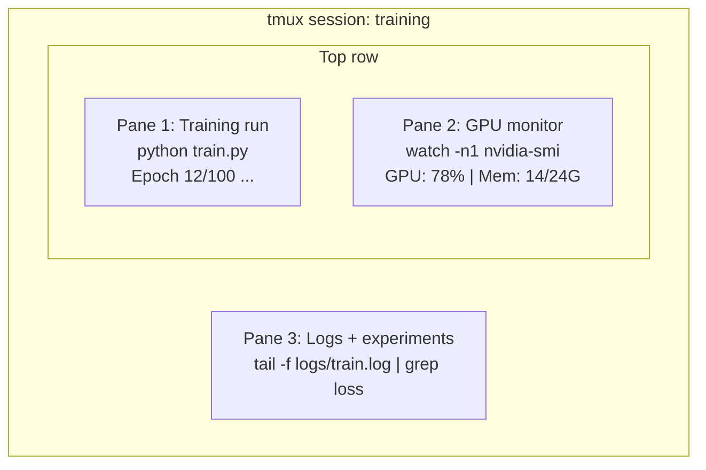

# 终端与 Shell 高效技巧

> 命令行是 AI 工程师的终极武器。掌握 tmux 会话管理、管道组合、rg 极速检索与自动化处理。

**Type:** 构建
**Languages:** Bash
**Prerequisites:** 无
**Time:** ~35 分钟

## 学习目标

- 使用管道、重定向和 `grep` 从命令行过滤和处理训练日志
- 创建持久的 tmux 会话，包含多个窗格，用于并发训练和 GPU 监控
- 使用 `htop`、`nvtop` 和 `nvidia-smi` 监控系统和 GPU 资源
- 使用 SSH、`scp` 和 `rsync` 在本地和远程机器之间传输文件

## The Problem

你将在终端中花费比在任何编辑器中更多的时间。训练运行、GPU 监控、日志尾随、远程 SSH 会话、环境管理。每个 AI 工作流都会触及 shell。如果你在这里效率低下，那么你到处都会效率低下。

本课程涵盖对 AI 工作至关重要的终端技能。无需 Unix 历史。无需深入 Bash 脚本。只需你需要的内容。

## The Concept



同时运行三件事。一个终端。你可以分离，回家，通过SSH重新连接，并重新附加。训练会继续运行。

## 构建它

### 步骤1：了解你的shell

检查你正在运行的shell：

```bash
```

```bash
echo $SHELL
```

大多数系统使用 `bash` 或 `zsh`。两者都能正常工作。本课程中的命令在两者中均可使用。

关键知识点：

```bash
# Move around
cd ~/projects/ai-engineering-from-scratch
pwd
ls -la

# History search (most useful shortcut you'll learn)
# Ctrl+R then type part of a previous command
# Press Ctrl+R again to cycle through matches

# Clear terminal
clear   # or Ctrl+L

# Cancel a running command
# Ctrl+C

# Suspend a running command (resume with fg)
# Ctrl+Z
```

### 第2步：管道和重定向

管道将命令连接在一起。这是处理日志、过滤输出和串联工具的方法。你将频繁使用这一功能。

```bash
# Count how many times "loss" appears in a log
cat train.log | grep "loss" | wc -l

# Extract just the loss values from training output
grep "loss:" train.log | awk '{print $NF}' > losses.txt

# Watch a log file update in real time, filtering for errors
tail -f train.log | grep --line-buffered "ERROR"

# Sort experiments by final accuracy
grep "final_accuracy" results/*.log | sort -t= -k2 -n -r

# Redirect stdout and stderr to separate files
python train.py > output.log 2> errors.log

# Redirect both to the same file
python train.py > train_full.log 2>&1
```

你需要的三个重定向：

| 符号 | 作用 |
|------|------|
| `>` | 将标准输出写入文件（覆盖） |
| `>>` | 将标准输出追加到文件 |
| `2>` | 将标准错误写入文件 |
| `2>&1` | 将标准错误发送到与标准输出相同的位置 |
| `\|` | 将一个命令的标准输出作为标准输入发送给下一个命令 |

### 步骤3：后台进程

训练运行需要数小时。你不想一直保持终端打开。

```bash
# Run in background (output still goes to terminal)
python train.py &

# Run in background, immune to hangup (closing terminal won't kill it)
nohup python train.py > train.log 2>&1 &

# Check what's running in background
jobs
ps aux | grep train.py

# Bring a background job to foreground
fg %1

# Kill a background process
kill %1
# or find its PID and kill that
kill $(pgrep -f "train.py")
```

`&`、`nohup` 和 `screen`/`tmux` 的区别：

| 方法 | 是否在关闭终端后继续运行？ | 是否能重新连接？ |
|------|--------------------------|------------------|
| `command &` | 否 | 否 |
| `nohup command &` | 是 | 否（查看日志文件） |
| `screen` / `tmux` | 是 | 是 |

对于持续时间超过几分钟的任务，请使用 tmux。

### 第4步：tmux

tmux 可让你创建带有多个窗格的持久化终端会话。这是管理训练运行过程中最实用的工具。

```bash
# Install
# macOS
brew install tmux
# Ubuntu
sudo apt install tmux

# Start a named session
tmux new -s training

# Split horizontally
# Ctrl+B then "

# Split vertically
# Ctrl+B then %

# Navigate between panes
# Ctrl+B then arrow keys

# Detach (session keeps running)
# Ctrl+B then d

# Reattach
tmux attach -t training

# List sessions
tmux ls

# Kill a session
tmux kill-session -t training
```

一个典型的 AI 工作流程会话：

```bash
tmux new -s train

# Pane 1: start training
python train.py --epochs 100 --lr 1e-4

# Ctrl+B, " to split, then run GPU monitor
watch -n1 nvidia-smi

# Ctrl+B, % to split vertically, tail the logs
tail -f logs/experiment.log

# Now detach with Ctrl+B, d
# SSH out, go get coffee, come back
# tmux attach -t train
```

### 步骤 5：使用 htop 和 nvtop 进行监控

```bash
# System processes (better than top)
htop

# GPU processes (if you have NVIDIA GPU)
# Install: sudo apt install nvtop (Ubuntu) or brew install nvtop (macOS)
nvtop

# Quick GPU check without nvtop
nvidia-smi

# Watch GPU usage update every second
watch -n1 nvidia-smi

# See which processes are using the GPU
nvidia-smi --query-compute-apps=pid,name,used_memory --format=csv
```

`htop` 快捷键使用说明：
- `F6` 或 `>` 按列排序（按内存排序以查找内存泄漏）
- `F5` 切换树状视图（查看子进程）
- `F9` 终止进程
- `/` 搜索进程名称

### 步骤6：使用SSH连接远程GPU服务器

当您租用云GPU（Lambda, RunPod, Vast.ai）时，需要通过SSH进行连接。

```bash
# Basic connection
ssh user@gpu-box-ip

# With a specific key
ssh -i ~/.ssh/my_gpu_key user@gpu-box-ip

# Copy files to remote
scp model.pt user@gpu-box-ip:~/models/

# Copy files from remote
scp user@gpu-box-ip:~/results/metrics.json ./

# Sync a whole directory (faster for many files)
rsync -avz ./data/ user@gpu-box-ip:~/data/

# Port forward (access remote Jupyter/TensorBoard locally)
ssh -L 8888:localhost:8888 user@gpu-box-ip
# Now open localhost:8888 in your browser

# SSH config for convenience
# Add to ~/.ssh/config:
# Host gpu
#     HostName 192.168.1.100
#     User ubuntu
#     IdentityFile ~/.ssh/gpu_key
#
# Then just:
# ssh gpu
```

### 第7步：AI工作的有用别名

将这些添加到你的 `~/.bashrc` 或 `~/.zshrc` 中：

 /no_think

<>

### 第7步：AI工作的有用别名

将这些添加到你的 `~/.bashrc` 或 `~/.zshrc` 中：

 /no_think

```bash
source phases/00-setup-and-tooling/10-terminal-and-shell/code/shell_aliases.sh
```

或者复制你想要的那些。关键别名：

 /no_think

<>

或者复制你想要的那些。关键别名：

 /no_think

```bash
# GPU status at a glance
alias gpu='nvidia-smi --query-gpu=index,name,utilization.gpu,memory.used,memory.total,temperature.gpu --format=csv,noheader'

# Kill all Python training processes
alias killtraining='pkill -f "python.*train"'

# Quick virtual environment activate
alias ae='source .venv/bin/activate'

# Watch training loss
alias watchloss='tail -f logs/*.log | grep --line-buffered "loss"'
```

在 `code/shell_aliases.sh` 中查看完整集合。

### 步骤8: 常见AI终端模式

在实际应用中，这些模式会反复出现：

```bash
# Run training, log everything, notify when done
python train.py 2>&1 | tee train.log; echo "DONE" | mail -s "Training complete" you@email.com

# Compare two experiment logs side by side
diff <(grep "accuracy" exp1.log) <(grep "accuracy" exp2.log)

# Find the largest model files (clean up disk space)
find . -name "*.pt" -o -name "*.safetensors" | xargs du -h | sort -rh | head -20

# Download a model from Hugging Face
wget https://huggingface.co/model/resolve/main/model.safetensors

# Untar a dataset
tar xzf dataset.tar.gz -C ./data/

# Count lines in all Python files (see how big your project is)
find . -name "*.py" | xargs wc -l | tail -1

# Check disk space (training data fills disks fast)
df -h
du -sh ./data/*

# Environment variable check before training
env | grep -i cuda
env | grep -i torch
```

## 使用场景

以下是本课程中每个工具的使用时机：

| 工具 | 使用时机 |
|------|----------------|
| tmux | 每个训练运行（阶段3+） |
| `tail -f` + `grep` | 监控训练日志 |
| `nohup` / `&` | 快速后台任务 |
| `htop` / `nvtop` | 调试训练缓慢、OOM错误 |
| SSH + `rsync` | 在云GPU上工作 |
| 管道 + 重定向 | 处理实验结果 |
| 别名 | 节省重复命令的时间 |

## 练习

1. 安装 tmux，创建一个包含三个窗格的会话，在其中一个运行 `htop`，在另一个运行 `watch -n1 date`，在第三个运行一个 Python 脚本。分离并重新连接。
2. 将 `code/shell_aliases.sh` 中的别名添加到你的 shell 配置，并使用 `source ~/.zshrc`（或 `~/.bashrc`）重新加载。
3. 使用 `for i in $(seq 1 100); do echo "epoch $i loss: $(echo "scale=4; 1/$i" | bc)"; sleep 0.1; done > fake_train.log` 创建一个假训练日志，然后使用 `grep`、`tail` 和 `awk` 提取损失值。
4. 为一个你有访问权限的服务器设置 SSH 配置条目（或使用 `localhost` 练习语法）。

## 术语表

| 术语 | 人们常说 | 实际含义 |
|------|----------------|----------------------|
| Shell | “终端” | 解释你命令的程序（bash、zsh、fish） |
| tmux | “终端多路复用器” | 允许你在单个窗口内运行多个终端会话，并实现分离/重新连接的程序 |
| 管道 | “那个竖线符号” | `\|` 操作符，将一个命令的输出作为另一个命令的输入 |
| PID | “进程ID” | 每个运行进程分配的唯一编号，用于监控或终止进程 |
| nohup | “不挂断” | 免受挂断信号影响地运行命令，关闭终端不会终止它 |
| SSH | “连接到服务器” | 安全壳，一种在远程机器上运行命令的加密协议 |
