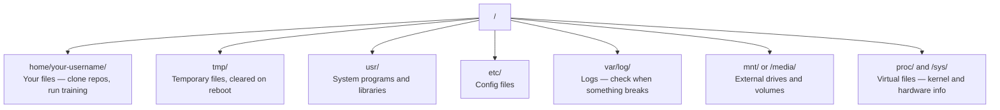

# 面向 AI 的 Linux 系统指南

> 深度学习运行在 Linux 之上。掌握系统文件权限、内存管理（OOM 机制）、进程调度与磁盘分析。

**Type:** 学习
**Languages:** Bash
**Prerequisites:** 无
**Time:** ~40 分钟

## 学习目标

- Navigate the Linux file system and perform essential file operations from the command line
- Manage file permissions with `chmod` and `chown` to resolve "Permission denied" errors
- Install system packages with `apt` and set up a fresh GPU box for AI work
- Identify macOS-to-Linux differences that commonly trip up developers working on remote machines

## The Problem

You develop on macOS or Windows. But the moment you SSH into a cloud GPU box, rent a Lambda instance, or spin up an EC2 machine, you land in Ubuntu. The terminal is your only interface. There is no Finder, no Explorer, no GUI. If you can't navigate the file system, install packages, and manage processes from the command line, you're stuck paying for idle GPU hours while googling "how to unzip a file in Linux."

This is a survival guide. It covers exactly what you need to operate on a remote Linux machine for AI work. Nothing more.

## File System Layout

Linux organizes everything under a single root `/`. There is no `C:\` or `/Volumes`. The directories you'll actually touch:

  /no_think



您的家目录是 `~` 或 `/home/your-username`。您几乎所做的所有操作都发生在这里。

## 基本命令

这些是涵盖您在远程GPU服务器上95%操作的15个命令。

### 移动与导航

```bash
pwd                         # Where am I?
ls                          # What's here?
ls -la                      # What's here, including hidden files with details?
cd /path/to/dir             # Go there
cd ~                        # Go home
cd ..                       # Go up one level
```

### 文件和目录

```bash
mkdir my-project            # Create a directory
mkdir -p a/b/c              # Create nested directories in one shot

cp file.txt backup.txt      # Copy a file
cp -r src/ src-backup/      # Copy a directory (recursive)

mv old.txt new.txt          # Rename a file
mv file.txt /tmp/           # Move a file

rm file.txt                 # Delete a file (no trash, it's gone)
rm -rf my-dir/              # Delete a directory and everything inside
```

`rm -rf` 是永久的。无法撤销。在按下回车之前，请再次确认路径。

### 读取文件

```bash
cat file.txt                # Print entire file
head -20 file.txt           # First 20 lines
tail -20 file.txt           # Last 20 lines
tail -f log.txt             # Follow a log file in real time (Ctrl+C to stop)
less file.txt               # Scroll through a file (q to quit)
```

### 搜索

```bash
grep "error" training.log           # Find lines containing "error"
grep -r "learning_rate" .           # Search all files in current directory
grep -i "cuda" config.yaml          # Case-insensitive search

find . -name "*.py"                 # Find all Python files under current dir
find . -name "*.ckpt" -size +1G     # Find checkpoint files larger than 1GB
```

## 权限

Linux 中的每个文件都有一个所有者和权限位。当脚本无法执行或无法向目录写入时，你会遇到这个问题。

*脚本无法执行或无法向目录写入*

```bash
ls -l train.py
# -rwxr-xr-- 1 user group 2048 Mar 19 10:00 train.py
#  ^^^             owner permissions: read, write, execute
#     ^^^          group permissions: read, execute
#        ^^        everyone else: read only
```

常见修复方法：

```bash
chmod +x train.sh           # Make a script executable
chmod 755 deploy.sh         # Owner: full, others: read+execute
chmod 644 config.yaml       # Owner: read+write, others: read only

chown user:group file.txt   # Change who owns a file (needs sudo)
```

当某处显示 "Permission denied" 时，几乎总是权限问题。`chmod +x` 或 `sudo` 可以解决大多数情况。

## 包管理 (apt)

Ubuntu 使用 `apt`。这是安装系统级软件的方式。

```bash
sudo apt update             # Refresh the package list (always do this first)
sudo apt install -y htop    # Install a package (-y skips confirmation)
sudo apt install -y build-essential  # C compiler, make, etc. Needed by many Python packages
sudo apt install -y tmux    # Terminal multiplexer (keep sessions alive after disconnect)

apt list --installed        # What's installed?
sudo apt remove htop        # Uninstall
```

在全新的 GPU 机器上你将安装的常用软件包：

```bash
sudo apt update && sudo apt install -y \
    build-essential \
    git \
    curl \
    wget \
    tmux \
    htop \
    unzip \
    python3-venv
```

## 用户和 sudo

你通常以普通用户身份登录。某些操作需要 root（管理员）权限。

```bash
whoami                      # What user am I?
sudo command                # Run a single command as root
sudo su                     # Become root (exit to go back, use sparingly)
```

在云GPU实例上，您通常是唯一的用户，并且已经拥有sudo访问权限。不要以root身份运行所有东西。仅在需要时使用sudo。

## 进程和systemd

当您的训练挂起，或需要检查正在运行的内容时：

```bash
htop                        # Interactive process viewer (q to quit)
ps aux | grep python        # Find running Python processes
kill 12345                  # Gracefully stop process with PID 12345
kill -9 12345               # Force kill (use when graceful doesn't work)
nvidia-smi                  # GPU processes and memory usage
```systemd 管理服务（后台守护进程）。如果你运行推理服务器，你会用到它：

 /no_think

<>

systemd 管理服务（后台守护进程）。如果你运行推理服务器，你会用到它：

 /no_think

```bash
sudo systemctl start nginx          # Start a service
sudo systemctl stop nginx           # Stop it
sudo systemctl restart nginx        # Restart it
sudo systemctl status nginx         # Check if it's running
sudo systemctl enable nginx         # Start automatically on boot
```

## 磁盘空间

GPU 设备通常磁盘空间有限。模型和数据集会迅速占满空间。

```bash
df -h                       # Disk usage for all mounted drives
df -h /home                 # Disk usage for /home specifically

du -sh *                    # Size of each item in current directory
du -sh ~/.cache             # Size of your cache (pip, huggingface models land here)
du -sh /data/checkpoints/   # Check how big your checkpoints are

# Find the biggest space hogs
du -h --max-depth=1 / 2>/dev/null | sort -hr | head -20
```

常用空间节省方法：

```bash
# Clear pip cache
pip cache purge

# Clear apt cache
sudo apt clean

# Remove old checkpoints you don't need
rm -rf checkpoints/epoch_01/ checkpoints/epoch_02/
```

## 网络

你将从命令行下载模型、传输文件并调用 API。

```bash
# Download files
wget https://example.com/model.bin                   # Download a file
curl -O https://example.com/data.tar.gz              # Same thing with curl
curl -s https://api.example.com/health | python3 -m json.tool  # Hit an API, pretty-print JSON

# Transfer files between machines
scp model.bin user@remote:/data/                     # Copy file to remote machine
scp user@remote:/data/results.csv .                  # Copy file from remote to local
scp -r user@remote:/data/checkpoints/ ./local-dir/   # Copy directory

# Sync directories (faster than scp for large transfers, resumes on failure)
rsync -avz --progress ./data/ user@remote:/data/
rsync -avz --progress user@remote:/results/ ./results/
```

对于大文件传输，使用 `rsync` 而非 `scp`。它仅传输更改的字节并处理中断的连接。

## tmux：保持会话存活

当你通过 SSH 连接到远程服务器时，关闭笔记本电脑会导致训练运行终止。tmux 可防止这种情况发生。

```bash
tmux new -s train           # Start a new session named "train"
# ... start your training, then:
# Ctrl+B, then D            # Detach (training keeps running)

tmux ls                     # List sessions
tmux attach -t train        # Reattach to session

# Inside tmux:
# Ctrl+B, then %            # Split pane vertically
# Ctrl+B, then "            # Split pane horizontally
# Ctrl+B, then arrow keys   # Switch between panes
```

始终在 tmux 中运行长时间的训练任务。始终如此。

## Windows 用户使用 WSL2

如果你使用 Windows，WSL2 为你提供真正的 Linux 环境，无需双启动。

```bash
# In PowerShell (admin)
wsl --install -d Ubuntu-24.04

# After restart, open Ubuntu from Start menu
sudo apt update && sudo apt upgrade -y
```WSL2 运行一个真正的 Linux 内核。本课中的所有内容都可以在其中运行。从 WSL 内部来看，你的 Windows 文件位于 `/mnt/c/Users/YourName/`。

通过在 Windows 端安装 NVIDIA 驱动程序，可以实现 GPU 直通。安装 Windows 版的 NVIDIA 驱动程序（而非 Linux 版），WSL2 中将可以使用 CUDA。

## 注意事项：从 macOS 迁移到 Linux

如果你是从 macOS 转过来的，以下内容可能会让你感到困惑：

| macOS | Linux | 说明 |
|-------|-------|-------|
| `brew install` | `sudo apt install` | 包名称有时不同。`brew install htop` 与 `sudo apt install htop` 的效果相同，但 `brew install readline` 与 `sudo apt install libreadline-dev` 不同。 |
| `open file.txt` | `xdg-open file.txt` | 但在远程服务器上你不会有 GUI。使用 `cat` 或 `less`。 |
| `pbcopy` / `pbpaste` | 不可用 | 通过 SSH 无法实现剪贴板的复制粘贴。 |
| `~/.zshrc` | `~/.bashrc` | macOS 默认使用 zsh。大多数 Linux 服务器使用 bash。 |
| `/opt/homebrew/` | `/usr/bin/`, `/usr/local/bin/` | 可执行文件存储在不同的位置。 |
| `sed -i '' 's/a/b/' file` | `sed -i 's/a/b/' file` | macOS 的 sed 在 `-i` 后需要一个空字符串。Linux 不需要。 |
| 不区分大小写的文件系统 | 区分大小写的文件系统 | 在 Linux 中，`Model.py` 和 `model.py` 是两个不同的文件。 |
| 换行符 `\n` | 换行符 `\n` | 相同。但 Windows 使用 `\r\n`，这会破坏 bash 脚本。运行 `dos2unix` 来修复。 |

## 快速参考卡

```
Navigation:     pwd, ls, cd, find
Files:          cp, mv, rm, mkdir, cat, head, tail, less
Search:         grep, find
Permissions:    chmod, chown, sudo
Packages:       apt update, apt install
Processes:      htop, ps, kill, nvidia-smi
Services:       systemctl start/stop/restart/status
Disk:           df -h, du -sh
Network:        curl, wget, scp, rsync
Sessions:       tmux new/attach/detach
```

## 练习

1. 通过 SSH 登录任意 Linux 机器（或打开 WSL2），导航到你的主目录。创建一个项目文件夹，在其中使用 `touch` 创建三个空文件，然后使用 `ls -la` 列出它们。
2. 使用 apt 安装 `htop`，运行它，并找出占用内存最多的进程。
3. 启动一个 tmux 会话，在其中运行 `sleep 300`，分离会话，列出会话，然后重新连接。
4. 使用 `df -h` 检查可用磁盘空间，然后使用 `du -sh ~/.cache/*` 查找缓存中占用空间的内容。
5. 使用 `scp` 将文件从本地机器传输到远程机器，然后使用 `rsync` 执行相同的传输并比较使用体验。
