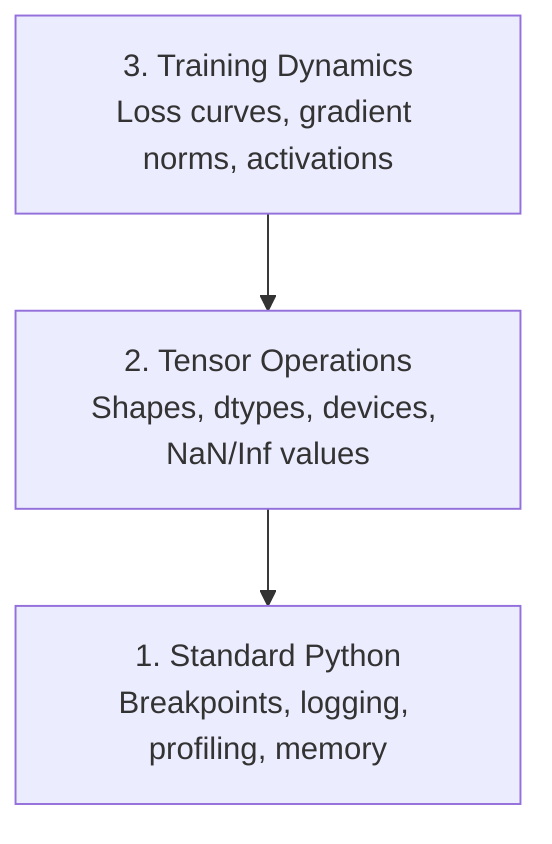

# AI 代码调试与性能分析

> 别再只靠 `print()` 了。掌握张量维度调试、NaN 数值异常定位、PyTorch Profiler 与 CUDA 阻塞分析。

**Type:** 构建
**Language:** Python
**Prerequisites:** 开发环境搭建
**Time:** ~45 分钟

## 学习目标

- 使用条件 `breakpoint()` 和 `debug_print` 在训练过程中检查张量的形状、dtypes 和 NaN 值
- 使用 `cProfile`、`line_profiler` 和 `tracemalloc` 对训练循环进行性能分析，以找到瓶颈
- 检测常见的 AI 错误：形状不匹配、NaN 损失、数据泄露和设备错误的张量
- 设置 TensorBoard 以可视化损失曲线、权重直方图和梯度分布

## 问题

AI 代码的失败方式与常规代码不同。一个 Web 应用会因堆栈跟踪而崩溃。一个配置错误的训练循环可能运行 8 小时，消耗 200 美元的 GPU 时间，并生成一个对每个输入预测平均值的模型。代码从未报错。错误可能是一个位于错误设备上的张量、一个被遗忘的 `.detach()`，或者标签泄露到特征中。

你需要调试工具，在这些静默故障浪费你的时间和计算资源之前就检测到它们。

## 概念

AI 调试在三个层面上进行：



大多数人直接跳到第三级（盯着 TensorBoard）。但 80% 的 AI 错误都出现在第一和第二级。

## 构建它

### 第1部分：打印调试（是的，它有效）

打印调试常常被忽视。它不应该被忽视。对于张量代码来说，有针对性的打印语句比通过调试器逐步执行更有效，因为你需要一次性看到形状、数据类型和值范围。

```python
def debug_print(name, tensor):
    print(f"{name}: shape={tensor.shape}, dtype={tensor.dtype}, "
          f"device={tensor.device}, "
          f"min={tensor.min().item():.4f}, max={tensor.max().item():.4f}, "
          f"mean={tensor.mean().item():.4f}, "
          f"has_nan={tensor.isnan().any().item()}")
```

在每次可疑操作后调用此方法。找到错误后，删除打印语句。简单。

### 第二部分：Python调试器（pdb和breakpoint）

内置调试器在AI工作中被低估了。将`breakpoint()`插入训练循环中，可以交互式地检查张量。

```python
def training_step(model, batch, criterion, optimizer):
    inputs, labels = batch
    outputs = model(inputs)
    loss = criterion(outputs, labels)

    if loss.item() > 100 or torch.isnan(loss):
        breakpoint()

    loss.backward()
    optimizer.step()
```

当调试器暂停时，有用的命令：

- `p outputs.shape` 用于检查形状
- `p loss.item()` 用于查看损失值
- `p torch.isnan(outputs).sum()` 用于统计NaN数量
- `p model.fc1.weight.grad` 用于检查梯度
- `c` 继续执行，`q` 退出调试

这是条件调试。只有在发现异常时才会暂停。在10,000步的训练运行中，这一点非常重要。

### 第3部分：Python日志记录

当调试需求超出快速检查时，用日志记录替代print语句。

```python
import logging

logging.basicConfig(
    level=logging.INFO,
    format="%(asctime)s [%(levelname)s] %(message)s",
    handlers=[
        logging.FileHandler("training.log"),
        logging.StreamHandler()
    ]
)
logger = logging.getLogger(__name__)

logger.info("Starting training: lr=%.4f, batch_size=%d", lr, batch_size)
logger.warning("Loss spike detected: %.4f at step %d", loss.item(), step)
logger.error("NaN loss at step %d, stopping", step)
```

日志记录为您提供时间戳、严重级别和文件输出。当训练运行在凌晨3点失败时，您需要的是日志文件，而不是已经从屏幕滚动出去的终端输出。

### 第4部分：代码部分的计时

了解时间的去向是优化的第一步。

```python
import time

class Timer:
    def __init__(self, name=""):
        self.name = name

    def __enter__(self):
        self.start = time.perf_counter()
        return self

    def __exit__(self, *args):
        elapsed = time.perf_counter() - self.start
        print(f"[{self.name}] {elapsed:.4f}s")

with Timer("data loading"):
    batch = next(dataloader_iter)

with Timer("forward pass"):
    outputs = model(batch)

with Timer("backward pass"):
    loss.backward()
```

常见问题：数据加载占用了60%的训练时间。解决方法是在你的DataLoader中使用`num_workers > 0`，而不是更快的GPU。

### 第5部分：cProfile和line_profiler

当需要比手动计时器更强大的功能时：

```bash
python -m cProfile -s cumtime train.py
```

这显示了按累计时间排序的每个函数调用。对于逐行分析：

 /no_think

<>

这显示了按累计时间排序的每个函数调用。对于逐行分析：

```bash
pip install line_profiler
```

```python
@profile
def train_step(model, data, target):
    output = model(data)
    loss = F.cross_entropy(output, target)
    loss.backward()
    return loss

# Run with: kernprof -l -v train.py
```

### 第6部分：内存分析

#### 使用 tracemalloc 的 CPU 内存

```python
import tracemalloc

tracemalloc.start()

# your code here
model = build_model()
data = load_dataset()

snapshot = tracemalloc.take_snapshot()
top_stats = snapshot.statistics("lineno")
for stat in top_stats[:10]:
    print(stat)
```

#### 使用 memory_profiler 的 CPU 内存

```bash
pip install memory_profiler
```

```python
from memory_profiler import profile

@profile
def load_data():
    raw = read_csv("data.csv")       # watch memory jump here
    processed = preprocess(raw)       # and here
    return processed
```

使用 `python -m memory_profiler your_script.py` 查看逐行内存使用情况。

#### 使用 PyTorch 的 GPU 内存

```python
import torch

if torch.cuda.is_available():
    print(torch.cuda.memory_summary())

    print(f"Allocated: {torch.cuda.memory_allocated() / 1e9:.2f} GB")
    print(f"Cached: {torch.cuda.memory_reserved() / 1e9:.2f} GB")
```

当发生 OOM（Out of Memory）时：

1. 减少批量大小（首要尝试的方法，始终如此）
2. 使用 `torch.cuda.empty_cache()` 释放缓存内存
3. 对大型中间变量使用 `del tensor` 后接 `torch.cuda.empty_cache()`
4. 使用混合精度（`torch.cuda.amp`）将内存使用量减半
5. 对于非常深的模型使用梯度检查点

### 第7部分：常见AI错误及其捕捉方法

#### 形状不匹配

最频繁出现的错误。张量的形状为 `[batch, features]`，而模型期望的是 `[batch, channels, height, width]`。

```python
def check_shapes(model, sample_input):
    print(f"Input: {sample_input.shape}")
    hooks = []

    def make_hook(name):
        def hook(module, inp, out):
            in_shape = inp[0].shape if isinstance(inp, tuple) else inp.shape
            out_shape = out.shape if hasattr(out, "shape") else type(out)
            print(f"  {name}: {in_shape} -> {out_shape}")
        return hook

    for name, module in model.named_modules():
        hooks.append(module.register_forward_hook(make_hook(name)))

    with torch.no_grad():
        model(sample_input)

    for h in hooks:
        h.remove()
```

运行一次示例批次。它会映射模型中所有形状变换。

#### NaN Loss

NaN损失意味着某些内容发生了爆炸。常见原因：

- 学习率过高
- 自定义损失函数中的除以零
- 对零或负数取对数
- RNN中的梯度爆炸

```python
def detect_nan(model, loss, step):
    if torch.isnan(loss):
        print(f"NaN loss at step {step}")
        for name, param in model.named_parameters():
            if param.grad is not None:
                if torch.isnan(param.grad).any():
                    print(f"  NaN gradient in {name}")
                if torch.isinf(param.grad).any():
                    print(f"  Inf gradient in {name}")
        return True
    return False
```

#### 数据泄露

你的模型在测试集上达到了 99% 的准确率。听起来很棒。其实这是一个错误。

```python
def check_data_leakage(train_set, test_set, id_column="id"):
    train_ids = set(train_set[id_column].tolist())
    test_ids = set(test_set[id_column].tolist())
    overlap = train_ids & test_ids
    if overlap:
        print(f"DATA LEAKAGE: {len(overlap)} samples in both train and test")
        return True
    return False
```

同时检查时间泄露问题：使用未来数据预测过去。在拆分数据集前按时间戳排序。

#### 错误的设备

不同设备（CPU与GPU）上的张量会导致运行时错误。但有时一个张量会静默地留在CPU上，而其他所有内容都在GPU上，导致训练过程变得非常缓慢。

```python
def check_devices(model, *tensors):
    model_device = next(model.parameters()).device
    print(f"Model device: {model_device}")
    for i, t in enumerate(tensors):
        if t.device != model_device:
            print(f"  WARNING: tensor {i} on {t.device}, model on {model_device}")
```

### 第8部分：TensorBoard基础

TensorBoard展示了训练过程中随时间变化的情况。

```bash
pip install tensorboard
```

```python
from torch.utils.tensorboard import SummaryWriter

writer = SummaryWriter("runs/experiment_1")

for step in range(num_steps):
    loss = train_step(model, batch)

    writer.add_scalar("loss/train", loss.item(), step)
    writer.add_scalar("lr", optimizer.param_groups[0]["lr"], step)

    if step % 100 == 0:
        for name, param in model.named_parameters():
            writer.add_histogram(f"weights/{name}", param, step)
            if param.grad is not None:
                writer.add_histogram(f"grads/{name}", param.grad, step)

writer.close()
```

启动它：

 /no_think

<>

启动它：

 /no_think

```bash
tensorboard --logdir=runs
```

需要关注的问题：

- **损失不下降**：学习率过低，或模型架构问题
- **损失剧烈波动**：学习率过高
- **损失变为 NaN**：数值不稳定性（参见上方 NaN 部分）
- **训练损失下降，验证损失上升**：过拟合
- **权重直方图坍缩至零**：梯度消失
- **梯度直方图爆炸**：需要梯度裁剪

### 第9部分：VS Code 调试器

为了进行交互式调试，请使用 `launch.json` 配置 VS Code：

 
<>

需要关注的问题：

- **损失不下降**：学习率过低，或模型架构问题
- **损失剧烈波动**：学习率过高
- **损失变为 NaN**：数值不稳定性（参见上方 NaN 部分）
- **训练损失下降，验证损失上升**：过拟合
- **权重直方图坍缩至零**：梯度消失
- **梯度直方图爆炸**：需要梯度裁剪

### 第9部分：VS Code 调试器

为了进行交互式调试，请使用 `launch.json` 配置 VS Code：

```json
{
    "version": "0.2.0",
    "configurations": [
        {
            "name": "Debug Training",
            "type": "debugpy",
            "request": "launch",
            "program": "${file}",
            "console": "integratedTerminal",
            "justMyCode": false
        }
    ]
}
```

通过点击代码行旁边的空白区域设置断点。使用 Variables 面板检查张量属性。Debug Console 允许你在执行过程中运行任意 Python 表达式。

在需要查看每个转换步骤的数据预处理流水线中非常有用。

## 使用方法

以下是能捕获大多数 AI 错误的调试工作流程：

1. **训练前**：使用示例批次运行 `check_shapes`。验证输入和输出维度是否符合预期。
2. **前 10 步**：对损失值、输出和梯度使用 `debug_print`。确认没有 NaN 值且数值在合理范围内。
3. **训练过程中**：记录损失值、学习率和梯度范数。使用 TensorBoard 进行可视化。
4. **当出现故障时**：在故障点插入 `breakpoint()`。交互式检查张量。
5. **性能优化**：对比数据加载、前向传播和反向传播的时间。若接近内存不足（OOM），请进行内存分析。

## 部署应用

运行调试工具包脚本：

```bash
```

```bash
python phases/00-setup-and-tooling/12-debugging-and-profiling/code/debug_tools.py
```

参见 `outputs/prompt-debug-ai-code.md` 以获取有助于诊断特定于AI的错误的提示。

## 练习

1. 运行 `debug_tools.py` 并阅读每个部分的输出。修改虚拟模型以引入 NaN（提示：在前向传播中除以零），并观察检测器如何捕获它。
2. 使用 `cProfile` 对训练循环进行性能分析，并找出最慢的函数。
3. 使用 `tracemalloc` 找出数据加载管道中哪一行分配了最多的内存。
4. 为一个简单的训练运行设置 TensorBoard，并判断模型是否过拟合。
5. 在训练循环中使用 `breakpoint()`。练习从调试器提示中检查张量形状、设备和梯度值。
