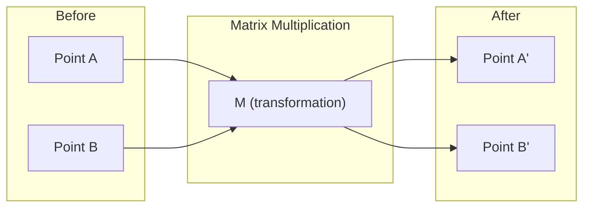

# 线性代数直觉

> 将矩阵视为对空间的拉伸、旋转和压扁。建立从抽象代数到直观几何变换的映射。

**Type:** 学习
**Languages:** Python
**Prerequisites:** 无
**Time:** ~40 分钟

## 学习目标

- 在 Python 中从零开始实现向量和矩阵操作（加法、点积、矩阵乘法）
- 从几何角度解释点积、投影和 Gram-Schmidt 过程的作用
- 使用行化简确定一组向量的线性无关性、秩和基
- 将线性代数概念与其在人工智能中的应用联系起来：嵌入、注意力分数和 LoRA

## 问题

打开任何机器学习论文。在第一页上，你会看到向量、矩阵、点积和变换。没有线性代数直觉，这些只是符号。有了它，你可以看到神经网络实际上在做什么——在空间中移动点。

你不需要成为数学家。你需要看到这些操作的几何意义，然后自己编写代码实现它们。

## 概念

### 向量是点（和方向）

向量只是一组数字的列表。但这些数字有其含义——它们是空间中的坐标。

**二维向量 [3, 2]:**

| x | y | 点 |
|---|---|----|
| 3 | 2 | 向量从原点 (0,0) 指向平面中的点 (3, 2) |

该向量的大小为 sqrt(3^2 + 2^2) = sqrt(13)，指向右上方。

在人工智能中，向量代表一切：
- 一个词 → 一个包含 768 个数字的向量（其在嵌入空间中的“含义”）
- 一张图像 → 一个包含数百万像素值的向量
- 一个用户 → 一个包含偏好的向量

### 矩阵是变换

矩阵将一个向量转换为另一个向量。它可以旋转、缩放、拉伸或投影。



在人工智能中，矩阵就是模型：
- 神经网络权重 → 将输入转换为输出的矩阵
- 注意力分数 → 决定关注什么的矩阵
- 嵌入 → 将单词映射到向量的矩阵

### 点积衡量相似性

两个向量的点积告诉你它们有多相似。

```
a · b = a₁×b₁ + a₂×b₂ + ... + aₙ×bₙ

Same direction:      a · b > 0  (similar)
Perpendicular:       a · b = 0  (unrelated)
Opposite direction:  a · b < 0  (dissimilar)
```

这实际上就是搜索引擎、推荐系统和 RAG 的工作原理——找到点积高的向量。

### 线性无关

如果集合中的任何一个向量都不能表示为其他向量的组合，那么这些向量就是线性无关的。如果 v1、v2、v3 是线性无关的，那么它们张成一个三维空间。如果其中一个向量是其他向量的组合，那么它们只能张成一个平面。

对 AI 的重要性：你的特征矩阵应该具有线性无关的列。如果两个特征完全相关（线性相关），模型就无法区分它们的影响。这在回归中会导致多重共线性——权重矩阵变得不稳定，微小的输入变化会导致输出的剧烈波动。

**具体例子：**

```
v1 = [1, 0, 0]
v2 = [0, 1, 0]
v3 = [2, 1, 0]   # v3 = 2*v1 + v2
```v1 和 v2 是相互独立的 -- 一个不是另一个的标量倍数或组合。但是 v3 = 2*v1 + v2，所以 {v1, v2, v3} 是一个依赖集合。这三个向量都位于 xy 平面内。不管你怎么组合它们，你都无法到达 [0, 0, 1]。你有三个向量，但只有两个自由度。

在一个数据集中：如果 feature_3 = 2*feature_1 + feature_2，添加 feature_3 给模型提供零新的信息。更糟糕的是，它使正规方程变得奇异 -- 权重没有唯一解。

### 基和秩

基是线性无关向量的最小集合，这些向量可以张成整个空间。基向量的数量就是空间的维度。

三维空间的标准基是 {[1,0,0], [0,1,0], [0,0,1]}。但是三维空间中的任何三个独立向量都可以构成一个有效的基。基的选择就是坐标系的选择。

矩阵的秩 = 线性无关的列数 = 线性无关的行数。如果秩 < min(行数, 列数)，矩阵是秩不足的。这意味着：
- 方程组有无限多解（或无解）
- 变换过程中丢失了信息
- 矩阵不能被求逆

| 情况 | 秩 | 对机器学习的意义 |
|------|---|-------------|
| 满秩（秩 = min(m, n)） | 最大可能 | 存在唯一的最小二乘解。模型条件良好。 |
| 秩不足（秩 < min(m, n)） | 低于最大 | 特征是冗余的。有无限多的权重解。需要正则化。 |
| 秩 1 | 1 | 每一列都是一个向量的缩放副本。所有数据都位于一条直线上。 |
| 近似秩不足（小奇异值） | 数值上低 | 矩阵是病态的。微小的输入噪声会导致输出发生巨大变化。使用 SVD 截断或岭回归。 |

### 投影

将向量 **a** 投影到向量 **b** 上，得到 **a** 在 **b** 方向上的分量：

```
proj_b(a) = (a dot b / b dot b) * b
```

残差（a - proj_b(a)）与 b 垂直。这种正交分解是最小二乘拟合的基础。

投影在机器学习中无处不在：
- 线性回归最小化观测值到列空间的距离 —— 解就是一种投影
- 主成分分析（PCA）将数据投影到方差最大的方向上
- 变压器中的注意力机制计算查询在键上的投影

```mermaid
graph LR
    subgraph Projection["Projection of a onto b"]
        direction TB
        O["Origin"] --> |"b (direction)"| B["b"]
        O --> |"a (original)"| A["a"]
        O --> |"proj_b(a)"| P["projection"]
        A -.-> |"residual (perpendicular)"| P
    end
```**示例:** a = [3, 4], b = [1, 0]

proj_b(a) = (3*1 + 4*0) / (1*1 + 0*0) * [1, 0] = 3 * [1, 0] = [3, 0]

投影消除了 y 分量。这是最简单的维度降低方式——丢弃你不关心的方向。

### Gram-Schmidt 过程

将任何一组独立向量转换为正交归一化基。正交归一化意味着每个向量长度为 1，每对向量相互垂直。

算法：
1. 取第一个向量，将其归一化
2. 取第二个向量，减去其在第一个向量上的投影，然后归一化
3. 取第三个向量，减去其在所有先前向量上的投影，然后归一化
4. 对剩余的向量重复上述步骤

```
Input:  v1, v2, v3, ... (linearly independent)

u1 = v1 / |v1|

w2 = v2 - (v2 dot u1) * u1
u2 = w2 / |w2|

w3 = v3 - (v3 dot u1) * u1 - (v3 dot u2) * u2
u3 = w3 / |w3|

Output: u1, u2, u3, ... (orthonormal basis)
```

这是 QR 分解在内部的工作方式。Q 是正交基，R 捕获投影系数。QR 分解用于：
- 解线性方程组（比高斯消元更稳定）
- 计算特征值（QR 算法）
- 最小二乘回归（标准数值方法）

```figure
eigen-directions
```

## 构建它

### 第一步：从零开始构建向量（Python）

```python
class Vector:
    def __init__(self, components):
        self.components = list(components)
        self.dim = len(self.components)

    def __add__(self, other):
        return Vector([a + b for a, b in zip(self.components, other.components)])

    def __sub__(self, other):
        return Vector([a - b for a, b in zip(self.components, other.components)])

    def dot(self, other):
        return sum(a * b for a, b in zip(self.components, other.components))

    def magnitude(self):
        return sum(x**2 for x in self.components) ** 0.5

    def normalize(self):
        mag = self.magnitude()
        return Vector([x / mag for x in self.components])

    def cosine_similarity(self, other):
        return self.dot(other) / (self.magnitude() * other.magnitude())

    def __repr__(self):
        return f"Vector({self.components})"


a = Vector([1, 2, 3])
b = Vector([4, 5, 6])

print(f"a + b = {a + b}")
print(f"a · b = {a.dot(b)}")
print(f"|a| = {a.magnitude():.4f}")
print(f"cosine similarity = {a.cosine_similarity(b):.4f}")
```

### 步骤 2：从零开始创建矩阵（Python）

```python
class Matrix:
    def __init__(self, rows):
        self.rows = [list(row) for row in rows]
        self.shape = (len(self.rows), len(self.rows[0]))

    def __matmul__(self, other):
        if isinstance(other, Vector):
            return Vector([
                sum(self.rows[i][j] * other.components[j] for j in range(self.shape[1]))
                for i in range(self.shape[0])
            ])
        rows = []
        for i in range(self.shape[0]):
            row = []
            for j in range(other.shape[1]):
                row.append(sum(
                    self.rows[i][k] * other.rows[k][j]
                    for k in range(self.shape[1])
                ))
            rows.append(row)
        return Matrix(rows)

    def transpose(self):
        return Matrix([
            [self.rows[j][i] for j in range(self.shape[0])]
            for i in range(self.shape[1])
        ])

    def __repr__(self):
        return f"Matrix({self.rows})"


rotation_90 = Matrix([[0, -1], [1, 0]])
point = Vector([3, 1])

rotated = rotation_90 @ point
print(f"Original: {point}")
print(f"Rotated 90°: {rotated}")
```

### 步骤 3：这对 AI 的重要性

```python
import random

random.seed(42)
weights = Matrix([[random.gauss(0, 0.1) for _ in range(3)] for _ in range(2)])
input_vector = Vector([1.0, 0.5, -0.3])

output = weights @ input_vector
print(f"Input (3D): {input_vector}")
print(f"Output (2D): {output}")
print("This is what a neural network layer does -- matrix multiplication.")
```

### 步骤 4：Julia 版本

```julia
a = [1.0, 2.0, 3.0]
b = [4.0, 5.0, 6.0]

println("a + b = ", a + b)
println("a · b = ", a ⋅ b)       # Julia supports unicode operators
println("|a| = ", √(a ⋅ a))
println("cosine = ", (a ⋅ b) / (√(a ⋅ a) * √(b ⋅ b)))

# Matrix-vector multiplication
W = [0.1 -0.2 0.3; 0.4 0.5 -0.1]
x = [1.0, 0.5, -0.3]
println("Wx = ", W * x)
println("This is a neural network layer.")
```

### 步骤 5：从零开始的线性无关性与投影（Python）

```python
def is_linearly_independent(vectors):
    n = len(vectors)
    dim = len(vectors[0].components)
    mat = Matrix([v.components[:] for v in vectors])
    rows = [row[:] for row in mat.rows]
    rank = 0
    for col in range(dim):
        pivot = None
        for row in range(rank, len(rows)):
            if abs(rows[row][col]) > 1e-10:
                pivot = row
                break
        if pivot is None:
            continue
        rows[rank], rows[pivot] = rows[pivot], rows[rank]
        scale = rows[rank][col]
        rows[rank] = [x / scale for x in rows[rank]]
        for row in range(len(rows)):
            if row != rank and abs(rows[row][col]) > 1e-10:
                factor = rows[row][col]
                rows[row] = [rows[row][j] - factor * rows[rank][j] for j in range(dim)]
        rank += 1
    return rank == n


def project(a, b):
    scalar = a.dot(b) / b.dot(b)
    return Vector([scalar * x for x in b.components])


def gram_schmidt(vectors):
    orthonormal = []
    for v in vectors:
        w = v
        for u in orthonormal:
            proj = project(w, u)
            w = w - proj
        if w.magnitude() < 1e-10:
            continue
        orthonormal.append(w.normalize())
    return orthonormal


v1 = Vector([1, 0, 0])
v2 = Vector([1, 1, 0])
v3 = Vector([1, 1, 1])
basis = gram_schmidt([v1, v2, v3])
for i, u in enumerate(basis):
    print(f"u{i+1} = {u}")
    print(f"  |u{i+1}| = {u.magnitude():.6f}")

print(f"u1 · u2 = {basis[0].dot(basis[1]):.6f}")
print(f"u1 · u3 = {basis[0].dot(basis[2]):.6f}")
print(f"u2 · u3 = {basis[1].dot(basis[2]):.6f}")
```

## 使用它

现在用 NumPy 来做同样的事情 -- 实际上你将会在实践中使用的方法：

```python
import numpy as np

a = np.array([1, 2, 3], dtype=float)
b = np.array([4, 5, 6], dtype=float)

print(f"a + b = {a + b}")
print(f"a · b = {np.dot(a, b)}")
print(f"|a| = {np.linalg.norm(a):.4f}")
print(f"cosine = {np.dot(a, b) / (np.linalg.norm(a) * np.linalg.norm(b)):.4f}")

W = np.random.randn(2, 3) * 0.1
x = np.array([1.0, 0.5, -0.3])
print(f"Wx = {W @ x}")
```

### 排名、投影和 QR 分解（使用 NumPy）

```python
import numpy as np

A = np.array([[1, 2], [2, 4]])
print(f"Rank: {np.linalg.matrix_rank(A)}")

a = np.array([3, 4])
b = np.array([1, 0])
proj = (np.dot(a, b) / np.dot(b, b)) * b
print(f"Projection of {a} onto {b}: {proj}")

Q, R = np.linalg.qr(np.random.randn(3, 3))
print(f"Q is orthogonal: {np.allclose(Q @ Q.T, np.eye(3))}")
print(f"R is upper triangular: {np.allclose(R, np.triu(R))}")
```

### PyTorch -- 张量是带有自动微分的向量

```python
import torch

x = torch.randn(3, requires_grad=True)
y = torch.tensor([1.0, 0.0, 0.0])

similarity = torch.dot(x, y)
similarity.backward()

print(f"x = {x.data}")
print(f"y = {y.data}")
print(f"dot product = {similarity.item():.4f}")
print(f"d(dot)/dx = {x.grad}")
```

点积关于x的梯度仅仅是y。PyTorch自动计算了这个梯度。神经网络中的每个操作都是由这样的操作构建而成的——矩阵乘法、点积、投影——而自动微分会追踪所有这些操作的梯度。

你刚刚从零开始实现了NumPy用一行代码完成的功能。现在你知道了幕后到底发生了什么。

## 发布它

本课生成的内容：
- `outputs/prompt-linear-algebra-tutor.md` -- 用于AI助手通过几何直觉教授线性代数的提示语

## 联系

本课中的所有内容都与现代AI的特定部分相关：

| 概念 | 出现的位置 |
|---------|------------------|
| 点积 | Transformer中的注意力分数，RAG中的余弦相似度 |
| 矩阵乘法 | 每个神经网络层，每个线性变换 |
| 线性无关 | 特征选择，避免多重共线性 |
| 秩 | 确定系统是否可解，LoRA（低秩适应） |
| 投影 | 线性回归（投影到列空间），PCA |
| Gram-Schmidt / QR | 数值求解器，特征值计算 |
| 正交基 | 稳定的数值计算，白化变换 |

LoRA值得特别提及。它通过将权重更新分解为低秩矩阵来微调大型语言模型。而不是更新一个4096x4096的权重矩阵（16M参数），LoRA更新两个大小为4096x16和16x4096的矩阵（131K参数）。秩-16的约束意味着LoRA假设权重更新存在于完整的4096维空间的16维子空间中。这就是线性代数真正发挥作用的地方。

## 练习

1. 实现一个名为`Vector.angle_between(other)`的函数，返回两个向量之间的角度（以度为单位）
2. 创建一个二维缩放矩阵，将x坐标加倍，将y坐标三倍，然后将其应用于向量[1, 1]
3. 给定5个随机的词向量（维度为50），使用余弦相似度找到其中最相似的两个
4. 验证Gram-Schmidt的输出是否确实是正交归一化的：检查每一对的点积是否为0，每个向量的模长是否为1
5. 创建一个秩为2的3x3矩阵。使用`rank()`方法进行验证。然后解释列向量所跨越的几何对象是什么。
6. 将向量[1, 2, 3]投影到[1, 1, 1]上。结果在几何上代表什么？

## 关键术语

| 术语 | 人们常说 | 实际含义 |
|------|----------------|--------------------|
| 向量 | “一个箭头” | 一组数字，表示n维空间中的一个点或方向 |
| 矩阵 | “一个数字表格” | 一种将向量从一个空间映射到另一个空间的变换 |
| 点积 | “相乘并求和” | 两个向量对齐程度的度量——相似性搜索的核心 |
| 嵌入 | “某种AI魔法” | 表示某个事物（词、图像、用户）意义的向量 |
| 线性无关 | “它们不重叠” | 集合中的任何一个向量都不能表示为其他向量的组合 |
| 秩 | “多少维” | 矩阵中线性无关的列（或行）的数量 |
| 投影 | “影子” | 一个向量在另一个向量方向上的分量 |
| 基 | “坐标轴” | 跨越空间的最小独立向量集合 |
| 正交归一化 | “相互垂直的单位向量” | 相互垂直的向量，每个向量的长度都为1 |
