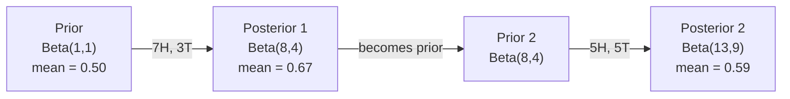

# 贝叶斯定理与似然估计

> 在不确定性下更新信念。掌握先验、似然、后验与极大似然估计（MLE）。

**Type:** 构建
**Language:** Python
**Prerequisites:** Phase 1, Lesson 06 (概率论与概率分布)
**Time:** ~45 分钟

## Learning Objectives

- 应用贝叶斯定理从先验、似然和证据中计算后验概率
- 从零开始构建一个带有拉普拉斯平滑和对数空间计算的朴素贝叶斯文本分类器
- 比较极大似然估计（MLE）和最大后验估计（MAP）并解释MAP如何对应于L2正则化
- 使用Beta-Binomial共轭先验对A/B测试进行顺序贝叶斯更新

## The Problem

一种医学检测的准确率为99%。你检测结果为阳性。你实际患有该疾病的可能性有多大？

大多数人会说99%。真实答案取决于这种疾病有多罕见。如果每10,000人中只有1人患有该疾病，那么阳性结果只能给你大约1%的患病几率。其余99%的阳性结果都是来自健康人出现的假阳性。

这不是一个陷阱问题。这就是贝叶斯定理。每一种垃圾邮件过滤器、每一种医学诊断、每一种量化不确定性的机器学习模型都使用这种精确的推理。你开始时有一个信念。你看到证据。你更新信念。

如果你在不理解这个原理的情况下构建机器学习系统，你将误解模型输出，设置错误的阈值，并部署过度自信的预测。

## The Concept

### 从联合概率到贝叶斯

你已经在第6课中了解到条件概率是：

```
P(A|B) = P(A and B) / P(B)
```

对称地：

```python
```

```
P(B|A) = P(A and B) / P(A)
```

这两个表达式有相同的分子：P(A 和 B)。将它们设为相等并重新排列：

```
P(A and B) = P(A|B) * P(B) = P(B|A) * P(A)

Therefore:

P(A|B) = P(B|A) * P(A) / P(B)
```

这就是贝叶斯定理。四个量，一个方程。

### 四个部分

| 部分 | 名称 | 含义 |
|------|------|-------------|
| P(A\|B) | 后验概率 | 在看到证据 B 之后，对 A 的更新信念 |
| P(B\|A) | 似然 | 如果 A 为真，证据 B 出现的可能性有多大 |
| P(A) | 先验概率 | 在看到任何证据之前，对 A 的信念 |
| P(B) | 证据 | 在所有可能性下观察到 B 的总概率 |

证据项 P(B) 起着归一化因子的作用。你可以使用全概率定律来展开它：

```
P(B) = P(B|A) * P(A) + P(B|not A) * P(not A)
```

### 医疗测试示例

一种疾病影响 10,000 人中的 1 人。该测试的准确率为 99%（能检测出 99% 的患病者，1% 的时间出现假阳性）。

```
P(sick)          = 0.0001     (prior: disease is rare)
P(positive|sick) = 0.99       (likelihood: test catches it)
P(positive|healthy) = 0.01    (false positive rate)

P(positive) = P(positive|sick) * P(sick) + P(positive|healthy) * P(healthy)
            = 0.99 * 0.0001 + 0.01 * 0.9999
            = 0.000099 + 0.009999
            = 0.010098

P(sick|positive) = P(positive|sick) * P(sick) / P(positive)
                 = 0.99 * 0.0001 / 0.010098
                 = 0.0098
                 = 0.98%
```

少于 1%。先验概率占主导地位。当某种条件罕见时，即使测试准确，也会产生大量的假阳性结果。这就是为什么医生会要求进行确认测试的原因。

### 垃圾邮件过滤器示例

你收到一封包含“lottery”这个词的电子邮件。它是垃圾邮件吗？

```
P(spam)                = 0.3      (30% of email is spam)
P("lottery"|spam)      = 0.05     (5% of spam emails contain "lottery")
P("lottery"|not spam)  = 0.001    (0.1% of legitimate emails contain "lottery")

P("lottery") = 0.05 * 0.3 + 0.001 * 0.7
             = 0.015 + 0.0007
             = 0.0157

P(spam|"lottery") = 0.05 * 0.3 / 0.0157
                  = 0.955
                  = 95.5%
```

一个词将概率从 30% 提高到 95.5%。一个真正的垃圾邮件过滤器会同时在数百个词上应用贝叶斯定理。

### 朴素贝叶斯：独立性假设

朴素贝叶斯通过假设在给定类别的情况下所有特征都是条件独立的，将这一方法扩展到多个特征：

```
P(class | feature_1, feature_2, ..., feature_n)
  = P(class) * P(feature_1|class) * P(feature_2|class) * ... * P(feature_n|class)
    / P(feature_1, feature_2, ..., feature_n)
```

“naive”的部分是指独立性假设。在文本中，词的出现并不是独立的（“New”和“York”是相关的）。但是，这个假设在实践中出人意料地有效，因为分类器只需要对类别进行排序，而不需要产生校准后的概率。

由于所有类别的分母都是一样的，你可以忽略它，只比较分子：

```
score(class) = P(class) * product of P(feature_i | class)
```

选择得分最高的类别。

### 最大似然估计（MLE）

如何从训练数据中得到 P(特征|类别)？计数。

```
P("free"|spam) = (number of spam emails containing "free") / (total spam emails)
```

这是 MLE：选择使观测数据最可能的参数值。你是在最大化似然函数，对于离散计数来说，这等价于相对频率。

问题：如果某个词在训练期间从未出现在垃圾邮件中，MLE 会赋予它概率零。一个未见过的词会使整个乘积归零。用拉普拉斯平滑来解决这个问题：

```
P(word|class) = (count(word, class) + 1) / (total_words_in_class + vocabulary_size)
```

将每个计数加 1 可以确保任何概率都不会为零。

### 最大后验概率（MAP）

最大似然估计（MLE）问：什么参数可以最大化 P(data|parameters)？

MAP 问：什么参数可以最大化 P(parameters|data)？

根据贝叶斯定理：

```
P(parameters|data) proportional to P(data|parameters) * P(parameters)
```MAP 在参数本身上添加了一个先验。如果你认为参数应该较小，你可以将其编码为一个惩罚大值的先验。这与机器学习中的 L2 正则化完全相同。岭回归中的“岭”惩罚实际上是权重的高斯先验。

| 估计方法 | 优化目标 | 机器学习等价项 |
|------------|-----------|---------------|
| MLE | P(data\|params) | 无正则化的训练 |
| MAP | P(data\|params) * P(params) | L2 / L1 正则化 |

### 贝叶斯与频率学派：实际差异

频率学派将参数视为固定的未知量。他们问：“如果我重复这个实验很多次，会发生什么？”

贝叶斯学派将参数视为分布。他们问：“根据我所观察到的内容，我对参数有什么看法？”

在构建机器学习系统时，实际差异如下：

| 方面 | 频率学派 | 贝叶斯学派 |
|--------|-------------|----------|
| 输出 | 点估计 | 值的分布 |
| 不确定性 | 置信区间（关于程序） | 可信区间（关于参数） |
| 小数据 | 可能过拟合 | 先验起到正则化作用 |
| 计算 | 通常更快 | 通常需要采样（MCMC） |

大多数生产环境中的机器学习是频率学派的（SGD，点估计）。贝叶斯方法在需要校准的不确定性（医疗决策、安全关键系统）或数据稀少（少样本学习、冷启动）时表现出色。

### 为什么贝叶斯思维对机器学习很重要

这种联系比类比更深：

**先验是正则化。** 权重的高斯先验就是 L2 正则化。拉普拉斯先验是 L1 正则化。每次你添加一个正则化项，你实际上在做贝叶斯陈述，说明你预期的参数值。

**后验是不确定性。** 一个单一的预测概率并不能告诉你模型对该估计的置信度。贝叶斯方法会给你一个分布：“我认为 P(spam) 在 0.8 到 0.95 之间。”

**贝叶斯更新是在线学习。** 今天的后验变成明天的先验。当模型看到新数据时，它会逐步更新其信念，而不是从头开始重新训练。

**模型比较是贝叶斯的。** 贝叶斯信息准则（BIC）、边缘似然和贝叶斯因子都使用贝叶斯推理在不发生过拟合的情况下选择模型。

```figure
bayes-update
```

## 构建它

### 步骤 1：贝叶斯定理函数

```python
def bayes(prior, likelihood, false_positive_rate):
    evidence = likelihood * prior + false_positive_rate * (1 - prior)
    posterior = likelihood * prior / evidence
    return posterior

result = bayes(prior=0.0001, likelihood=0.99, false_positive_rate=0.01)
print(f"P(sick|positive) = {result:.4f}")
```

### 步骤 2：朴素贝叶斯分类器

```python
import math
from collections import defaultdict

class NaiveBayes:
    def __init__(self, smoothing=1.0):
        self.smoothing = smoothing
        self.class_counts = defaultdict(int)
        self.word_counts = defaultdict(lambda: defaultdict(int))
        self.class_word_totals = defaultdict(int)
        self.vocab = set()

    def train(self, documents, labels):
        for doc, label in zip(documents, labels):
            self.class_counts[label] += 1
            words = doc.lower().split()
            for word in words:
                self.word_counts[label][word] += 1
                self.class_word_totals[label] += 1
                self.vocab.add(word)

    def predict(self, document):
        words = document.lower().split()
        total_docs = sum(self.class_counts.values())
        vocab_size = len(self.vocab)
        best_class = None
        best_score = float("-inf")
        for cls in self.class_counts:
            score = math.log(self.class_counts[cls] / total_docs)
            for word in words:
                count = self.word_counts[cls].get(word, 0)
                total = self.class_word_totals[cls]
                score += math.log((count + self.smoothing) / (total + self.smoothing * vocab_size))
            if score > best_score:
                best_score = score
                best_class = cls
        return best_class
```

对数概率可以防止下溢。将许多小概率相乘会产生浮点数无法表示的极小数值。对数概率的求和在数值上是稳定的，并且在数学上是等价的。

### 步骤 3：在垃圾邮件数据上进行训练

```python
train_docs = [
    "win free money now",
    "free lottery ticket winner",
    "claim your prize today free",
    "urgent offer free cash",
    "congratulations you won free",
    "meeting tomorrow at noon",
    "project update attached",
    "can we schedule a call",
    "quarterly report review",
    "lunch on thursday sounds good",
    "team standup notes attached",
    "please review the pull request",
]

train_labels = [
    "spam", "spam", "spam", "spam", "spam",
    "ham", "ham", "ham", "ham", "ham", "ham", "ham",
]

classifier = NaiveBayes()
classifier.train(train_docs, train_labels)

test_messages = [
    "free money waiting for you",
    "meeting rescheduled to friday",
    "you won a free prize",
    "please review the attached report",
]

for msg in test_messages:
    print(f"  '{msg}' -> {classifier.predict(msg)}")
```

### 步骤 4：检查学习到的概率

```python
def show_top_words(classifier, cls, n=5):
    vocab_size = len(classifier.vocab)
    total = classifier.class_word_totals[cls]
    probs = {}
    for word in classifier.vocab:
        count = classifier.word_counts[cls].get(word, 0)
        probs[word] = (count + classifier.smoothing) / (total + classifier.smoothing * vocab_size)
    sorted_words = sorted(probs.items(), key=lambda x: x[1], reverse=True)
    for word, prob in sorted_words[:n]:
        print(f"    {word}: {prob:.4f}")

print("\nTop spam words:")
show_top_words(classifier, "spam")
print("\nTop ham words:")
show_top_words(classifier, "ham")
```

## 使用它

Scikit-learn 提供了生产就绪的朴素贝叶斯实现：

```python
from sklearn.feature_extraction.text import CountVectorizer
from sklearn.naive_bayes import MultinomialNB
from sklearn.metrics import classification_report

vectorizer = CountVectorizer()
X_train = vectorizer.fit_transform(train_docs)
clf = MultinomialNB()
clf.fit(X_train, train_labels)

X_test = vectorizer.transform(test_messages)
predictions = clf.predict(X_test)
for msg, pred in zip(test_messages, predictions):
    print(f"  '{msg}' -> {pred}")
```

相同算法。CountVectorizer 负责分词和词汇构建。MultinomialNB 内部处理平滑和对数概率。你的从零开始的版本在 40 行代码中完成了同样的事情。

## 发布它

这里构建的 NaiveBayes 类展示了完整的流程：分词、使用拉普拉斯平滑的概率估计、对数空间预测。`code/bayes.py` 中的代码可以端到端运行，除了 Python 标准库之外，不需要任何其他依赖。

### 共轭先验

当先验和后验属于同一类分布时，先验被称为“共轭先验”。这使得贝叶斯更新在代数上更加简洁 —— 你可以直接得到一个闭合形式的后验，而无需进行数值积分。

| 似然 | 共轭先验 | 后验 | 示例 |
|------|---------|------|------|
| 伯努利 | Beta(a, b) | Beta(a + 成功次数, b + 失败次数) | 硬币偏倚估计 |
| 正态分布（方差已知） | Normal(mu_0, sigma_0) | Normal(加权平均, 更小的方差) | 传感器校准 |
| 泊松分布 | Gamma(a, b) | Gamma(a + 计数总和, b + n) | 建模到达率 |
| 多项分布 | Dirichlet(alpha) | Dirichlet(alpha + 计数) | 主题建模，语言模型 |

为什么这很重要：没有共轭先验时，你需要使用蒙特卡洛采样或变分推断来近似后验。有了共轭先验，你只需要更新两个数字。

Beta 分布是实践中最常见的共轭先验。Beta(a, b) 表示你对一个概率参数的信念。均值是 a/(a+b)。a+b 越大，分布越集中（越有信心）。

Beta 先验的特殊情况：
- Beta(1, 1) = 均匀分布。你对参数没有任何意见。
- Beta(10, 10) = 在 0.5 处尖峰。你强烈相信参数接近 0.5。
- Beta(1, 10) = 偏向于 0。你相信参数很小。

更新规则非常简单：

```
Prior:     Beta(a, b)
Data:      s successes, f failures
Posterior: Beta(a + s, b + f)
```

无需积分。无需抽样。只需加法。

### 顺序贝叶斯更新

贝叶斯推断本质上是顺序进行的。今天的后验分布就是明天的先验分布。这就是真实系统如何在不重新处理所有历史数据的情况下逐步学习的方式。

具体示例：估计一枚硬币是否公平。

**第1天：尚未有数据。**
从 Beta(1, 1) 开始 —— 一个均匀先验。你没有任何意见。
- 先验均值：0.5
- 先验在 [0, 1] 范围内是平坦的

**第2天：观察到7次正面，3次反面。**
后验分布 = Beta(1 + 7, 1 + 3) = Beta(8, 4)
- 后验均值：8/12 = 0.667
- 证据表明硬币偏向正面

**第3天：再观察到5次正面，5次反面。**
使用昨天的后验分布作为今天的先验分布。
后验分布 = Beta(8 + 5, 4 + 5) = Beta(13, 9)
- 后验均值：13/22 = 0.591
- 更加平衡的新数据将估计值拉回接近0.5



观察的顺序无关紧要。一次用全部 12 次正面和 8 次反面更新 Beta(1,1) 会得到 Beta(13, 9) —— 与结果相同。顺序更新和批量更新在数学上是等价的。但顺序更新允许你在每一步做出决策，而无需存储原始数据。

这是生产环境中在线学习的基础。老虎机的汤普森抽样、增量推荐系统和流式异常检测器都使用这种模式。

### 与 A/B 测试的联系

A/B 测试实际上是贝叶斯推断的伪装。

设置：你正在测试两个按钮的颜色。变体 A（蓝色）和变体 B（绿色）。你想要知道哪一个能获得更多的点击。

贝叶斯 A/B 测试：

1. **先验。** 对于两个变体都从 Beta(1, 1) 开始。没有先验偏好。
2. **数据。** 变体 A：1000 次浏览中有 50 次点击。变体 B：1000 次浏览中有 65 次点击。
3. **后验。**
   - A：Beta(1 + 50, 1 + 950) = Beta(51, 951)。均值 = 0.051
   - B：Beta(1 + 65, 1 + 935) = Beta(66, 936)。均值 = 0.066
4. **决策。** 计算 P(B > A) —— B 的真实转化率高于 A 的概率。

分析计算 P(B > A) 是困难的。但蒙特卡洛方法使它变得简单：

```
1. Draw 100,000 samples from Beta(51, 951)  -> samples_A
2. Draw 100,000 samples from Beta(66, 936)  -> samples_B
3. P(B > A) = fraction of samples where B > A
```

如果 P(B > A) > 0.95，你上线变体 B。如果它在 0.05 和 0.95 之间，你继续收集数据。如果 P(B > A) < 0.05，你上线变体 A。

与频率主义 A/B 测试相比的优势：
- 你可以得到一个直接的概率陈述：“B 更好的概率是 97%”
- 没有 p 值的混淆。没有“无法拒绝零假设”的措辞。
- 你可以在任何时间检查结果而不会增加假阳性率（没有“窥视问题”）
- 你可以结合先验知识（例如，之前的测试表明转化率通常在 3-8% 之间）

| 方面 | 频率主义 A/B | 贝叶斯 A/B |
|------|--------------|------------|
| 输出 | p 值 | P(B > A) |
| 解释 | “如果 A=B，这些数据有多令人惊讶？” | “B 比 A 更好的可能性有多大？” |
| 早期停止 | 增加假阳性 | 在任何时间点都是安全的（前提是选择了一个合适的先验和正确指定的模型） |
| 先验知识 | 不使用 | 作为 Beta 先验进行编码 |
| 决策规则 | p < 0.05 | P(B > A) > 阈值 |

## 练习

1. **多重测试。** 一位患者在两次独立的测试中都呈阳性（两次测试的准确率均为 99%，疾病患病率为 1/10,000）。两次测试后，P(sick) 是多少？使用第一次测试的后验作为第二次测试的先验。

2. **平滑影响。** 使用平滑值为 0.01、0.1、1.0 和 10.0 运行垃圾邮件分类器。顶部单词的概率如何变化？当平滑值为 0 且某个单词仅在 ham 中出现时会发生什么？

3. **添加特征。** 扩展 NaiveBayes 类，使其还使用消息长度（短/长）作为特征，与单词计数并行使用。从训练数据中估计 P(short|spam) 和 P(short|ham)，并将其整合到预测分数中。

4. **手动 MAP。** 给定观测数据（10 次抛硬币中出现 7 次正面），使用 Beta(2,2) 先验计算偏倚的 MAP 估计值。将其与 MLE 估计值（7/10）进行比较。

## 关键术语

| 术语 | 人们怎么说 | 实际含义 |
|------|------------|----------|
| 先验 | “我的初始猜测” | 在观察证据之前，假设的概率。在机器学习中：正则化项。 |
| 似然 | “数据拟合得如何” | P(证据|假设)。特定假设下观察到的数据的概率。 |
| 后验 | “我的更新信念” | P(假设|证据)。先验乘以似然，然后归一化。 |
| 证据 | “归一化常数” | 所有假设下的 P(数据)。确保后验总和为 1。 |
| 朴素贝叶斯 | “那个简单的文本分类器” | 假设在给定类别下特征是独立的分类器。尽管这个假设是错误的，但表现良好。 |
| 拉普拉斯平滑 | “加一平滑” | 为每个特征添加一个小的计数，以防止未见过的数据导致零概率。 |
| MLE | “只使用频率” | 选择最大化 P(数据|参数) 的参数。没有先验。在小数据上可能过拟合。 |
| MAP | “带有先验的 MLE” | 选择最大化 P(数据|参数) * P(参数) 的参数。等同于正则化的 MLE。 |
| 对数概率 | “在对数空间中工作” | 使用 log(P) 而不是 P，以避免乘以许多小数时发生浮点下溢。 |
| 假阳性 | “错误的警报” | 测试结果为阳性，但真实状态为阴性。导致基础率谬误。 |

## 进一步阅读

- [3Blue1Brown: 贝叶斯定理](https://www.youtube.com/watch?v=HZGCoVF3YvM) - 包含医学测试示例的可视化解释
- [Stanford CS229: 生成学习算法](https://cs229.stanford.edu/notes2022fall/cs229-notes2.pdf) - 朴素贝叶斯及其与判别模型的联系
- [Think Bayes](https://greenteapress.com/wp/think-bayes/) - 免费书籍，使用 Python 代码进行贝叶斯统计
- [scikit-learn 朴素贝叶斯](https://scikit-learn.org/stable/modules/naive_bayes.html) - 生产实现和使用每种变体的时机
