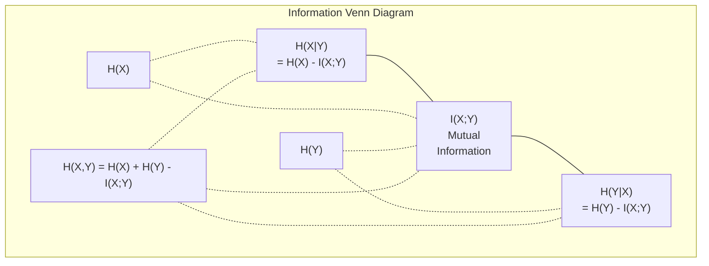

# 信息论基础

> 度量信息、不确定性与分布差异。掌握香农熵、KL 散度与交叉熵损失。

**Type:** 学习
**Language:** Python
**Prerequisites:** Phase 1, Lesson 06 (概率论与概率分布)
**Time:** ~40 分钟

## 学习目标

- 从零开始计算熵、交叉熵和KL散度，并解释它们之间的关系
- 推导出为什么最小化交叉熵损失等价于最大化对数似然
- 计算特征与目标之间的互信息以对特征重要性进行排序
- 解释困惑度作为语言模型所选择的有效词汇量

## 问题

你在训练的每个分类模型中都调用 `CrossEntropyLoss()`。你在每篇语言模型论文中都看到“困惑度”。你读到变分自编码器（VAEs）、知识蒸馏和强化学习与人类反馈（RLHF）中的KL散度。这些概念并不是相互独立的。它们都是同一个想法戴着不同的帽子。

信息论为你提供了推理不确定性、压缩和预测的语言。克劳德·香农在1948年发明它来解决通信问题。结果证明，训练神经网络是一个通信问题：模型试图通过学习得到的权重构成的噪声通道传递正确的标签。

本课将从零开始构建每个公式，让你看到它们的来源以及为什么它们有效。

## 概念

### 信息量（惊讶度）

当不太可能发生的事情发生时，它携带更多的信息。硬币正面朝上？并不令人惊讶。中彩票？非常令人惊讶。

概率为 p 的事件的信息量为：

```
I(x) = -log(p(x))
```

使用以 2 为底的对数会得到比特（bits）。使用自然对数会得到纳特（nats）。同样的概念，不同的单位。

```
Event              Probability    Surprise (bits)
Fair coin heads    0.5            1.0
Rolling a 6        0.167          2.58
1-in-1000 event    0.001          9.97
Certain event      1.0            0.0
```

某些事件携带零信息。你已经知道它们会发生。

### 熵（平均惊讶度）

熵是分布中所有可能结果的预期惊讶度。

```
H(P) = -sum( p(x) * log(p(x)) )  for all x
```

一个公平的硬币对于一个二元变量具有最大熵：1 bit。一个有偏的硬币（正面概率为99%）具有较低的熵：0.08 bits。你已经知道会发生什么，因此每次抛硬币几乎不会给你提供任何新信息。

```
Fair coin:    H = -(0.5 * log2(0.5) + 0.5 * log2(0.5)) = 1.0 bit
Biased coin:  H = -(0.99 * log2(0.99) + 0.01 * log2(0.01)) = 0.08 bits
```

熵衡量的是分布中不可约减的不确定性。你无法将其压缩到低于这个值。

### 交叉熵（你每天使用的损失函数）

交叉熵衡量的是当你使用分布 Q 来对实际来自分布 P 的事件进行编码时的平均惊讶程度。

```
H(P, Q) = -sum( p(x) * log(q(x)) )  for all x
```P 是真实分布（即标签）。Q 是你的模型的预测。如果 Q 完全匹配 P，交叉熵等于熵。任何不匹配都会使其增大。

在分类中，P 是一个 one-hot 向量（真实类别概率为 1，其余为 0）。这使得交叉熵简化为：

```
H(P, Q) = -log(q(true_class))
```

这就是分类的完整交叉熵损失公式。最大化正确类别的预测概率。

### KL 散度（分布之间的距离）

KL 散度衡量使用 Q 而不是 P 时，你所获得的额外惊讶程度。

```
D_KL(P || Q) = sum( p(x) * log(p(x) / q(x)) )  for all x
             = H(P, Q) - H(P)
```

交叉熵等于熵加上KL散度。由于在训练过程中真实分布的熵是恒定的，因此最小化交叉熵等同于最小化KL散度。你正在将模型的分布推向真实分布。

KL散度不是对称的：D_KL(P || Q) != D_KL(Q || P)。它不是一个真正的距离度量。

### 互信息

互信息衡量的是知道一个变量能告诉你另一个变量多少信息。

```
I(X; Y) = H(X) - H(X|Y)
        = H(X) + H(Y) - H(X, Y)
```

如果 X 和 Y 是独立的，互信息为零。知道其中一个变量，对另一个变量没有任何信息。如果它们完全相关，互信息等于任一变量的熵。

在特征选择中，特征与目标之间具有高互信息意味着该特征是有用的。互信息低意味着它是噪声。

### 条件熵

H(Y|X) 表示在观察到 X 之后，关于 Y 剩余的不确定性。

```
H(Y|X) = H(X,Y) - H(X)
```

两种极端情况：
- 如果 X 完全决定了 Y，那么 H(Y|X) = 0。知道 X 就消除了关于 Y 的所有不确定性。例子：X = 摄氏温度，Y = 华氏温度。
- 如果 X 对 Y 没有任何信息，那么 H(Y|X) = H(Y)。知道 X 完全不会减少你的不确定性。例子：X = 硬币抛掷，Y = 明天的天气。

条件熵始终是非负的，并且永远不会超过 H(Y)：

```
0 <= H(Y|X) <= H(Y)
```

在机器学习中，条件熵出现在决策树中。在每次划分时，算法会选择使 $ H(Y|X) $ 最小的特征 $ X $ —— 即能够最大程度消除对标签 $ Y $ 不确定性的特征。

### 联合熵

$ H(X,Y) $ 是 $ X $ 和 $ Y $ 联合分布的熵。

```
H(X,Y) = -sum sum p(x,y) * log(p(x,y))   for all x, y
```

关键属性：

```
H(X,Y) <= H(X) + H(Y)
```

当 X 和 Y 独立时，等式成立。如果它们共享信息，联合熵就小于各自熵的总和。缺失的熵正好是互信息。



关系如下：
- H(X,Y) = H(X) + H(Y|X) = H(Y) + H(X|Y)
- I(X;Y) = H(X) - H(X|Y) = H(Y) - H(Y|X)
- H(X,Y) = H(X) + H(Y) - I(X;Y)

### 互信息量度（深入探讨）

互信息 I(X;Y) 衡量了知道一个变量后，对另一个变量的不确定性减少的程度。

```
I(X;Y) = H(X) - H(X|Y)
       = H(Y) - H(Y|X)
       = H(X) + H(Y) - H(X,Y)
       = sum sum p(x,y) * log(p(x,y) / (p(x) * p(y)))
```

属性：
- I(X;Y) 总是 >= 0。通过观察事物你永远不会丢失信息。
- 当且仅当 X 和 Y 独立时，I(X;Y) = 0。
- I(X;Y) = I(Y;X)。它对称，与 KL 散度不同。
- I(X;X) = H(X)。一个变量与自身共享所有信息。

**特征选择的互信息**。在机器学习中，你希望特征对目标有信息量。互信息为你提供了一种有原则的方式来对特征进行排序：

1. 对于每个特征 X_i，计算 I(X_i; Y)，其中 Y 是目标变量。
2. 按照 MI 分数对特征进行排序。
3. 保留前 k 个特征。

这适用于任何特征与目标之间的关系——线性、非线性、单调或非单调。相关性只能捕捉线性关系。互信息可以捕捉一切。

| 方法 | 检测 | 计算成本 | 支持分类变量？ |
|--------|---------|-------------|----------|
| 皮尔逊相关系数 | 线性关系 | O(n) | 否 |
| 斯皮尔曼相关系数 | 单调关系 | O(n log n) | 否 |
| 互信息 | 任何统计依赖 | 使用分箱后为 O(n log n) | 是 |

### 标签平滑和交叉熵

标准分类使用硬目标：[0, 0, 1, 0]。真实类别获得概率 1，其余都获得 0。标签平滑将这些替换为软目标：

```
soft_target = (1 - epsilon) * hard_target + epsilon / num_classes
```

使用 epsilon = 0.1 和 4 个类别时：
- 硬目标：[0, 0, 1, 0]
- 软目标：[0.025, 0.025, 0.925, 0.025]

从信息论的角度来看，标签平滑增加了目标分布的熵。硬的 one-hot 标签的熵为 0 —— 没有不确定性。软标签具有正的熵。

这样做的好处：
- 防止模型将 logit 推向极端值（在交叉熵下，完美匹配一个 one-hot 标签需要无限大的 logit）
- 起到正则化作用：模型不能 100% 确定
- 改善校准：预测的概率更好地反映真实的不确定性
- 减少训练和推理行为之间的差距

使用标签平滑的交叉熵损失变为：

```
L = (1 - epsilon) * CE(hard_target, prediction) + epsilon * H_uniform(prediction)
```

第二项惩罚那些远离均匀分布的预测——对置信度的直接正则化。

### 为什么交叉熵是分类损失

三个视角，得出相同的结论。

**信息论视角。** 交叉熵衡量你使用模型分布而不是真实分布时浪费了多少比特。最小化它使你的模型成为现实最有效的编码器。

**最大似然视角。** 对于N个训练样本，其真实类别为 $ y_i $:

```
Likelihood     = product( q(y_i) )
Log-likelihood = sum( log(q(y_i)) )
Negative log-likelihood = -sum( log(q(y_i)) )
```

最后一行是交叉熵损失。最小化交叉熵等于最大化模型下训练数据的可能性。

**梯度视角。** 交叉熵相对于logits的梯度仅仅是（预测值 - 真实值）。简洁、稳定且计算速度快。这就是为什么它与softmax完美搭配的原因。

### 位（Bits）与自然对数单位（Nats）

唯一的区别是使用的对数底数。

```
log base 2   -> bits      (information theory tradition)
log base e   -> nats      (machine learning convention)
log base 10  -> hartleys  (rarely used)
```1 nat = 1/ln(2) bits = 1.4427 bits。PyTorch 和 TensorFlow 默认使用自然对数（nats）。

### 混淆度（Perplexity）

混淆度是交叉熵的指数。它告诉你模型在不确定的情况下，相当于在多少个同样可能的选择之间进行判断。

```
Perplexity = 2^H(P,Q)   (if using bits)
Perplexity = e^H(P,Q)   (if using nats)
```

困惑度（perplexity）为 50 的语言模型，平均来说，其困惑程度相当于必须从 50 个可能的下一个词元（token）中均匀随机选择。数值越低越好。

GPT-2 在常见基准测试中实现了约 30 的困惑度。现代模型在代表性良好的领域中，困惑度已降至个位数。

```figure
entropy-kl
```

## 构建它

### 第一步：信息内容和熵

```python
import math

def information_content(p, base=2):
    if p <= 0 or p > 1:
        return float('inf') if p <= 0 else 0.0
    return -math.log(p) / math.log(base)

def entropy(probs, base=2):
    return sum(
        p * information_content(p, base)
        for p in probs if p > 0
    )

fair_coin = [0.5, 0.5]
biased_coin = [0.99, 0.01]
fair_die = [1/6] * 6

print(f"Fair coin entropy:   {entropy(fair_coin):.4f} bits")
print(f"Biased coin entropy: {entropy(biased_coin):.4f} bits")
print(f"Fair die entropy:    {entropy(fair_die):.4f} bits")
```

### 步骤 2：交叉熵和 KL 散度

```python
def cross_entropy(p, q, base=2):
    total = 0.0
    for pi, qi in zip(p, q):
        if pi > 0:
            if qi <= 0:
                return float('inf')
            total += pi * (-math.log(qi) / math.log(base))
    return total

def kl_divergence(p, q, base=2):
    return cross_entropy(p, q, base) - entropy(p, base)

true_dist = [0.7, 0.2, 0.1]
good_model = [0.6, 0.25, 0.15]
bad_model = [0.1, 0.1, 0.8]

print(f"Entropy of true dist:     {entropy(true_dist):.4f} bits")
print(f"CE (good model):          {cross_entropy(true_dist, good_model):.4f} bits")
print(f"CE (bad model):           {cross_entropy(true_dist, bad_model):.4f} bits")
print(f"KL divergence (good):     {kl_divergence(true_dist, good_model):.4f} bits")
print(f"KL divergence (bad):      {kl_divergence(true_dist, bad_model):.4f} bits")
```

### 步骤 3：交叉熵作为分类损失

```python
def softmax(logits):
    max_logit = max(logits)
    exps = [math.exp(z - max_logit) for z in logits]
    total = sum(exps)
    return [e / total for e in exps]

def cross_entropy_loss(true_class, logits):
    probs = softmax(logits)
    return -math.log(probs[true_class])

logits = [2.0, 1.0, 0.1]
true_class = 0

probs = softmax(logits)
loss = cross_entropy_loss(true_class, logits)

print(f"Logits:      {logits}")
print(f"Softmax:     {[f'{p:.4f}' for p in probs]}")
print(f"True class:  {true_class}")
print(f"Loss:        {loss:.4f} nats")
print(f"Perplexity:  {math.exp(loss):.2f}")
```

### 步骤 4：交叉熵等于负对数似然

```python
import random

random.seed(42)

n_samples = 1000
n_classes = 3
true_labels = [random.randint(0, n_classes - 1) for _ in range(n_samples)]
model_logits = [[random.gauss(0, 1) for _ in range(n_classes)] for _ in range(n_samples)]

ce_loss = sum(
    cross_entropy_loss(label, logits)
    for label, logits in zip(true_labels, model_logits)
) / n_samples

nll = -sum(
    math.log(softmax(logits)[label])
    for label, logits in zip(true_labels, model_logits)
) / n_samples

print(f"Cross-entropy loss:      {ce_loss:.6f}")
print(f"Negative log-likelihood: {nll:.6f}")
print(f"Difference:              {abs(ce_loss - nll):.2e}")
```

### 步骤 5：互信息

```python
def mutual_information(joint_probs, base=2):
    rows = len(joint_probs)
    cols = len(joint_probs[0])

    margin_x = [sum(joint_probs[i][j] for j in range(cols)) for i in range(rows)]
    margin_y = [sum(joint_probs[i][j] for i in range(rows)) for j in range(cols)]

    mi = 0.0
    for i in range(rows):
        for j in range(cols):
            pxy = joint_probs[i][j]
            if pxy > 0:
                mi += pxy * math.log(pxy / (margin_x[i] * margin_y[j])) / math.log(base)
    return mi

independent = [[0.25, 0.25], [0.25, 0.25]]
dependent = [[0.45, 0.05], [0.05, 0.45]]

print(f"MI (independent): {mutual_information(independent):.4f} bits")
print(f"MI (dependent):   {mutual_information(dependent):.4f} bits")
```

## 使用它

使用 NumPy 的相同概念，这将是你在实践中使用它们的方式：

```python
import numpy as np

def np_entropy(p):
    p = np.asarray(p, dtype=float)
    mask = p > 0
    result = np.zeros_like(p)
    result[mask] = p[mask] * np.log(p[mask])
    return -result.sum()

def np_cross_entropy(p, q):
    p, q = np.asarray(p, dtype=float), np.asarray(q, dtype=float)
    mask = p > 0
    return -(p[mask] * np.log(q[mask])).sum()

def np_kl_divergence(p, q):
    return np_cross_entropy(p, q) - np_entropy(p)

true = np.array([0.7, 0.2, 0.1])
pred = np.array([0.6, 0.25, 0.15])
print(f"Entropy:    {np_entropy(true):.4f} nats")
print(f"Cross-ent:  {np_cross_entropy(true, pred):.4f} nats")
print(f"KL div:     {np_kl_divergence(true, pred):.4f} nats")
```

你从零开始构建了 `torch.nn.CrossEntropyLoss()` 内部的工作方式。现在你知道为什么在训练过程中损失会下降：你的模型预测的分布正在接近真实的分布，以浪费的信息量（单位为 nats）来衡量。

## 练习

1. 假设英文字母表是均匀分布（26 个字母），计算其熵。然后使用实际字母频率进行估算。哪一种更高，为什么？

2. 一个模型对一个真实类别为 1 的样本输出的 logits 为 [5.0, 2.0, 0.5]。手动计算交叉熵损失，然后使用你的 `cross_entropy_loss` 函数进行验证。什么样的 logits 会导致零损失？

3. 证明 KL 散度是不对称的。选择两个分布 P 和 Q，计算 D_KL(P || Q) 和 D_KL(Q || P)。解释为什么它们不同。

4. 构建一个函数，用于计算一系列 token 预测的困惑度（perplexity）。给定一个 (true_token_index, predicted_logits) 对的列表，返回该序列的困惑度。

## 关键术语

| 术语 | 人们常说 | 实际含义 |
|------|----------------|----------------------|
| 信息内容 | "惊喜" | 编码一个事件所需的比特数（或 nats）：-log(p) |
| 熵 | "随机性" | 分布中所有结果的平均惊喜度。衡量不可约减的不确定性。 |
| 交叉熵 | "损失函数" | 使用模型分布 Q 来对来自真实分布 P 的事件进行编码时的平均惊喜度。 |
| KL 散度 | "分布之间的距离" | 使用 Q 而不是 P 所浪费的额外比特数。等于交叉熵减去熵。不对称。 |
| 互信息 | "X 和 Y 之间的关系" | 通过知道 Y 而减少的关于 X 的不确定性。为零表示独立。 |
| Softmax | "将 logits 转换为概率" | 指数化并归一化。将任何实值向量映射为有效的概率分布。 |
| 困惑度 | "模型的困惑程度" | 交叉熵的指数。模型在每一步选择的有效词汇量大小。 |
| 比特 | "香农单位" | 使用以 2 为底的对数来衡量信息。一个比特可以解决一次公平的抛硬币事件。 |
| Nat | "机器学习的单位" | 使用自然对数来衡量信息。PyTorch 和 TensorFlow 默认使用。 |
| 负对数似然 | "NLL 损失" | 对于 one-hot 标签，与交叉熵损失相同。最小化它会最大化正确预测的概率。 |

## 进一步阅读

- [Shannon 1948: 通信的数学理论](https://people.math.harvard.edu/~ctm/home/text/others/shannon/entropy/entropy.pdf) - 原始论文，仍然可读
- [视觉信息理论 (Chris Olah)](https://colah.github.io/posts/2015-09-Visual-Information/) - 熵和 KL 散度的最佳视觉解释
- [PyTorch CrossEntropyLoss 文档](https://pytorch.org/docs/stable/generated/torch.nn.CrossEntropyLoss.html) - 框架如何实现你刚刚构建的内容
