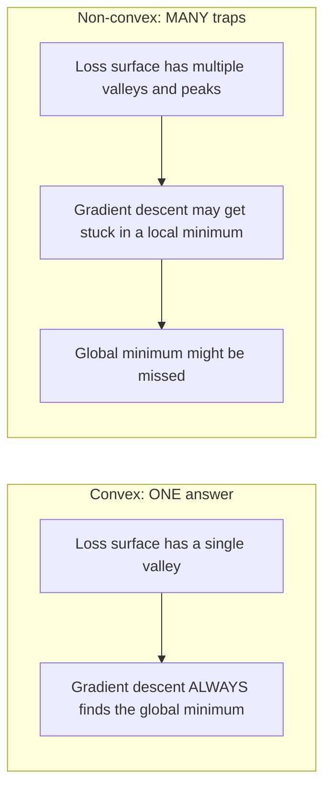
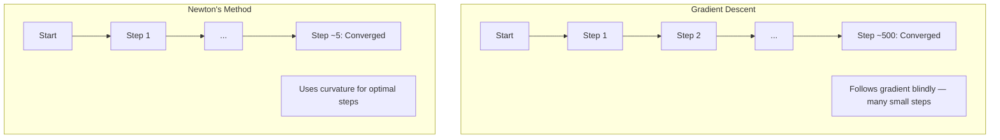
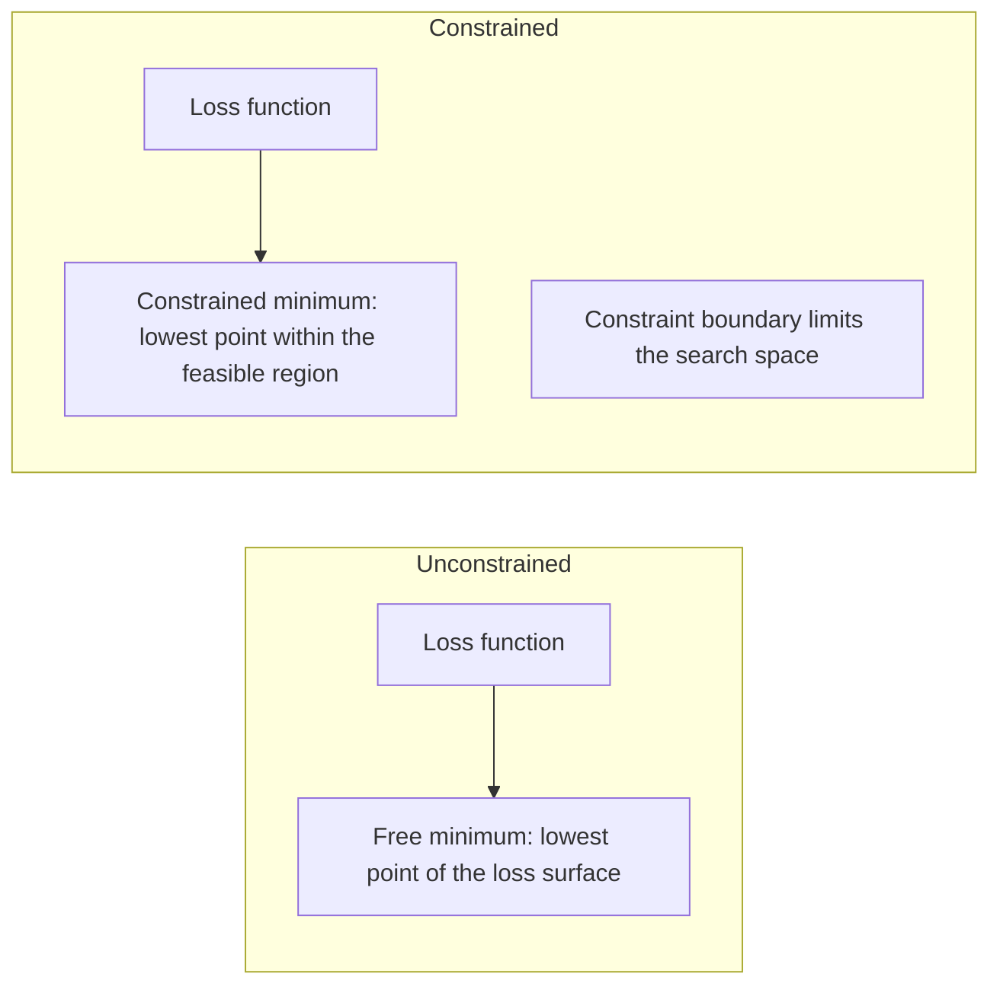
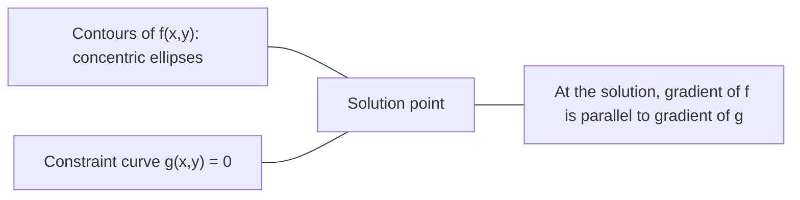

# 凸优化基础与拉格朗日对偶

> 保证找到全局最优解。掌握凸集、KKT 条件、拉格朗日对偶性与 SVM 凸规划。

**Type:** 学习
**Language:** Python
**Prerequisites:** Phase 1, Lesson 08 (最优化方法)
**Time:** ~45 分钟

## 学习目标

- 使用定义、二阶导数和海森矩阵准则测试函数是否为凸函数
- 实现牛顿法，并将其二次收敛性与梯度下降法进行比较
- 使用拉格朗日乘数解决约束优化问题，并解释 KKT 条件
- 解释为什么神经网络的损失景观是非凸的，但 SGD 仍然能找到好的解

## 问题

第 8 课教了你梯度下降、动量和 Adam。这些优化器可以在任何表面上向下走。但它们没有保证。在非凸景观上进行梯度下降可能会陷入坏的局部最小值，陷入鞍点，或者永远振荡。你仍然使用它，因为神经网络是非凸的，没有其他选择。

但机器学习中的许多问题都是凸的。线性回归、逻辑回归、SVM、LASSO、岭回归。对于这些，存在更强的东西：具有数学保证的优化。凸问题恰好有一个山谷。任何向下走的算法都会到达全局最小值。不需要重启。不需要学习率调度。不需要祈祷。

理解凸性有三个作用。首先，它告诉你什么时候你的问题是容易的（凸）还是困难的（非凸）。其次，它为你提供更快的工具，如用于凸问题的牛顿法。第三，它解释了贯穿整个机器学习的概念：正则化作为约束、SVM 中的对偶性以及为什么深度学习在违反凸性提供的所有良好性质的情况下仍然有效。

## 概念

### 凸集

如果集合 S 中的任意两点之间的线段也完全位于 S 中，则 S 是凸集。

| 凸集 | 非凸 |
|---|---|
| **矩形**：任意两点之间的线段都保持在矩形内部 | **星形/月牙形**：两点之间的线段可能穿过集合外部 |
| **三角形**：所有内部点都具有相同的性质 | **甜甜圈/环形**：孔意味着某些线段会离开集合 |
| 任意两点之间的线段都保留在集合内 | 某些点对之间的线段会离开集合 |

正式测试：对于集合 S 中的任意点 x、y 和任意 t ∈ [0, 1]，点 tx + (1 - t)y 也位于 S 中。

凸集的例子：
- 一条直线、一个平面、整个 R^n
- 一个球（圆、球体、超球体）
- 一个半空间：{x : a^T x ≤ b}
- 任意数量的凸集的交集

非凸集的例子：
- 一个甜甜圈（环形）
- 两个不相交的圆的并集
- 任何有“凹陷”或“孔”的集合

### 凸函数

如果函数 f 的定义域是一个凸集，并且对于定义域中的任意两点 x、y 和任意 t ∈ [0, 1]：

```
f(tx + (1-t)y) <= t*f(x) + (1-t)*f(y)
```

几何上：图像上任意两点之间的线段位于图像上方或与图像重合。

| 属性 | 凸函数 | 非凸函数 |
|---|---|---|
| **线段测试** | 图像上任意两点之间的线位于曲线**上方或与曲线重合** | 图像上某些两点之间的线会**低于**曲线 |
| **形状** | 单个碗状/谷状向上弯曲 | 多个峰和谷，曲率混合 |
| **局部最小值** | 每一个局部最小值都是全局最小值 | 可能存在多个不同高度的局部最小值 |

常见的凸函数：
- f(x) = x^2（抛物线）
- f(x) = |x|（绝对值）
- f(x) = e^x（指数）
- f(x) = max(0, x)（ReLU，尽管是分段线性）
- f(x) = -log(x)（x > 0时为负对数）
- 任意线性函数 f(x) = a^T x + b（既是凸函数也是凹函数）

### 凸性的测试

三种实用的测试方法，从最容易到最严格。

**测试 1：二阶导数测试（一维）**。如果对于所有 x，f''(x) >= 0，则 f 是凸函数。

- f(x) = x^2：f''(x) = 2 >= 0。凸函数。
- f(x) = x^3：f''(x) = 6x。当 x < 0 时为负值。非凸函数。
- f(x) = e^x：f''(x) = e^x > 0。凸函数。

**测试 2：Hessian 测试（多变量）**。如果 Hessian 矩阵 H(x) 对所有 x 都是半正定的，则 f 是凸函数。Hessian 是二阶偏导数组成的矩阵。

**测试 3：定义测试**。直接检查不等式 f(tx + (1-t)y) <= t*f(x) + (1-t)*f(y)。对于难以计算导数的函数非常有用。

### 为什么凸性很重要

凸优化的核心定理：

**对于凸函数，每一个局部最小值都是全局最小值。**

这意味着梯度下降不会陷入局部极小值。任何下坡路径都会导向相同的结果。算法保证可以收敛到最优解。



后果：
- 不需要随机重启
- 不需要复杂的学习率调度
- 可以证明收敛性（收敛速度取决于函数的性质）
- 解是唯一的（在平坦区域范围内）

### 机器学习中的凸与非凸

| 问题 | 凸？ | 原因 |
|-----|-----|-----|
| 线性回归（MSE） | 是 | 损失函数在权重上是二次的 |
| 逻辑回归 | 是 | 对数损失在权重上是凸的 |
| SVM（铰链损失） | 是 | 线性函数的最大值 |
| LASSO（L1回归） | 是 | 凸函数的和是凸的 |
| 岭回归（L2） | 是 | 二次函数加二次函数等于凸函数 |
| 神经网络（任何损失） | 否 | 非线性激活函数会创建非凸的景观 |
| k-means聚类 | 否 | 离散的分配步骤 |
| 矩阵分解 | 否 | 未知数的乘积 |

具有凸损失的线性模型是凸的。一旦你添加了带有非线性激活的隐藏层，凸性就会被打破。

### 海森矩阵

函数 $ f: \mathbb{R}^n \to \mathbb{R} $ 的海森矩阵 $ H $ 是一个 $ n \times n $ 的矩阵，包含二阶偏导数。

```
H[i][j] = d^2 f / (dx_i dx_j)
```

对于 f(x, y) = x^2 + 3xy + y^2:

```
df/dx = 2x + 3y       d^2f/dx^2 = 2      d^2f/dxdy = 3
df/dy = 3x + 2y       d^2f/dydx = 3      d^2f/dy^2 = 2

H = [ 2  3 ]
    [ 3  2 ]
```Hessian 矩阵告诉你关于曲率的信息：
- 所有特征值都为正：函数在所有方向上都向上弯曲（在该点处是凸的）
- 所有特征值都为负：函数在所有方向上都向下弯曲（在该点处是凹的，局部最大值）
- 特征值符号混合：鞍点（在某些方向上向上弯曲，在其他方向上向下弯曲）
- 特征值为零：在该方向上是平坦的（退化的）

对于凸性，Hessian 矩阵必须在所有点处都是半正定的（所有特征值 >= 0），而不仅仅是在某一点。

### 牛顿法

梯度下降使用一阶信息（梯度）。牛顿法使用二阶信息（Hessian 矩阵）。它在当前点拟合一个二次近似，并直接跳转到该二次函数的最小值点。

```
Update rule:
  x_new = x - H^(-1) * gradient

Compare to gradient descent:
  x_new = x - lr * gradient
```

牛顿法用海森矩阵的逆代替了标量学习率。这会根据局部曲率自动调整步长和方向。



优点：
- 在最小值附近具有二次收敛性（每次迭代误差平方减少）
- 无需调整学习率
- 尺度不变（无论问题如何参数化，都能正常工作）

缺点：
- 计算海森矩阵需要 O(n²) 的内存和 O(n³) 的时间进行求逆
- 对于一个拥有 100 万个权重的神经网络，这意味着 10¹² 个元素和 10¹⁸ 次操作
- 在深度学习中不切实际

### 有约束的优化

无约束优化：在所有 x 上最小化 f(x)。
有约束优化：在满足约束条件下最小化 f(x)。

现实问题通常有约束。你希望最小化成本，但预算有限。你希望最小化误差，但模型复杂度有上限。



### 拉格朗日乘数法

拉格朗日乘数法将有约束的问题转化为无约束的问题。

问题：在约束条件 g(x) = 0 下最小化 f(x)。

解法：引入一个新的变量（拉格朗日乘数 lambda），并求解无约束问题：

```
L(x, lambda) = f(x) + lambda * g(x)
```

在解处，L 的梯度为零：

```
dL/dx = df/dx + lambda * dg/dx = 0
dL/dlambda = g(x) = 0
```

几何直觉：在约束最小值处，函数 $ f $ 的梯度必须与约束函数 $ g $ 的梯度平行。如果它们不平行，你可以沿着约束曲面移动，并进一步减小 $ f $。



示例：在约束条件 $ x + y = 1 $ 下，最小化 $ f(x,y) = x^2 + y^2 $。

```
L = x^2 + y^2 + lambda(x + y - 1)

dL/dx = 2x + lambda = 0  =>  x = -lambda/2
dL/dy = 2y + lambda = 0  =>  y = -lambda/2
dL/dlambda = x + y - 1 = 0

From first two: x = y
Substituting: 2x = 1, so x = y = 0.5, lambda = -1
```

直线 x + y = 1 上离原点最近的点是 (0.5, 0.5)。

### KKT 条件

Karush-Kuhn-Tucker 条件将拉格朗日乘数法扩展到不等式约束。

问题：最小化 f(x)，满足 g_i(x) <= 0，其中 i = 1, ..., m。

KKT 条件（最优性必要条件）：

```
1. Stationarity:    df/dx + sum(lambda_i * dg_i/dx) = 0
2. Primal feasibility:  g_i(x) <= 0  for all i
3. Dual feasibility:    lambda_i >= 0  for all i
4. Complementary slackness:  lambda_i * g_i(x) = 0  for all i
```

互补松弛性是关键的洞察：要么约束是活跃的（g_i = 0，解位于边界上），要么乘子为零（约束不重要）。不影响解的约束对应的 lambda 等于 0。

KKT 条件对支持向量机（SVM）至关重要。支持向量是那些约束活跃（lambda > 0）的数据点。所有其他数据点的 lambda 等于 0，不影响决策边界。

### 正则化作为约束优化

L1 和 L2 正则化并不是随意的技巧。它们实际上是约束优化问题的伪装形式。

**L2 正则化（岭回归）：**

```
minimize  Loss(w)  subject to  ||w||^2 <= t

Equivalent unconstrained form:
minimize  Loss(w) + lambda * ||w||^2
```

约束 ||w||² ≤ t 定义了一个球（在二维中是圆，在三维中是球）。解是损失轮廓第一次接触这个球的地方。

**L1 正则化（LASSO）：**

```
minimize  Loss(w)  subject to  ||w||_1 <= t

Equivalent unconstrained form:
minimize  Loss(w) + lambda * ||w||_1
```

约束 ||w||_1 <= t 定义了一个钻石（在二维空间中是旋转的正方形）。

| 特性 | L2 约束（圆） | L1 约束（钻石） |
|---|---|---|
| **约束形状** | 圆（高维空间中的球体） | 钻石（二维空间中的旋转正方形） |
| **损失等高线接触的位置** | 光滑边界 —— 圆上的任意一点 | 角点 —— 与坐标轴对齐 |
| **解的行为** | 权重较小但非零 | 某些权重恰好为零（稀疏） |
| **结果** | 权重收缩 | 特征选择 |

这解释了为什么 L1 会产生稀疏模型（特征选择），而 L2 只是收缩权重。钻石有与坐标轴对齐的角点。损失等高线更可能接触角点，从而将一个或多个权重精确地设为零。

### 对偶性

每个有约束的优化问题（原问题）都有一个对应的对偶问题（对偶问题）。对于凸问题，原问题和对偶问题具有相同的最优值。这是强对偶性。

拉格朗日对偶函数：

```
Primal: minimize f(x) subject to g(x) <= 0
Lagrangian: L(x, lambda) = f(x) + lambda * g(x)
Dual function: d(lambda) = min_x L(x, lambda)
Dual problem: maximize d(lambda) subject to lambda >= 0
```

为什么对偶性很重要：
- 对偶问题有时比原问题更容易求解
- 支持向量机（SVMs）以对偶形式求解，其中问题依赖于数据点之间的点积（从而实现核技巧）
- 对偶问题为原问题的最优解提供了下界，可用于检查解的质量

对于支持向量机（SVMs）来说：

```
Primal: find w, b that maximize the margin 2/||w|| subject to
        y_i(w^T x_i + b) >= 1 for all i

Dual:   maximize sum(alpha_i) - 0.5 * sum_ij(alpha_i * alpha_j * y_i * y_j * x_i^T x_j)
        subject to alpha_i >= 0 and sum(alpha_i * y_i) = 0

The dual only involves dot products x_i^T x_j.
Replace x_i^T x_j with K(x_i, x_j) to get the kernel trick.
```

### 为什么深度学习在非凸性情况下仍然有效

神经网络损失函数高度非凸。从所有经典标准来看，优化它们应该会失败。然而，随机梯度下降法能够稳定地找到良好的解。有几个因素解释了这一点。

**大多数局部极小值已经足够好。** 在高维空间中，随机临界点（梯度为零的点）绝大多数是鞍点，而不是局部极小值。存在的少数局部极小值往往具有接近全局极小值的损失值。当参数空间有数百万个维度时，陷入一个糟糕的局部极小值的可能性极低。

**鞍点，而非局部极小值，才是真正的障碍。** 在一个有n个参数的函数中，鞍点在曲率方向上混合了正负曲率。在高维空间中，一个随机临界点的所有n个特征值均为正（局部极小值）的概率大约为2^(-n)。几乎所有临界点都是鞍点。随机梯度下降的噪声有助于逃离这些鞍点。

**过度参数化使损失函数更平滑。** 参数数量多于训练样本的网络具有更平滑、更连通的损失曲面。更宽的网络有更少的糟糕局部极小值。这与直觉相反，但与经验一致。

**损失函数曲面的结构：**

| 特性 | 低维空间 | 高维空间 |
|---|---|---|
| **曲面** | 许多孤立的山峰和山谷 | 平滑相连的山谷 |
| **极小值** | 许多孤立的局部极小值 | 很少的糟糕局部极小值；大多数接近最优 |
| **导航** | 难以找到全局极小值 | 有许多路径导向良好解 |
| **临界点** | 局部极小值和鞍点的混合 | 极大多数是鞍点，而非局部极小值 |

**随机噪声起到了隐式的正则化作用。** 小批量随机梯度下降添加的噪声防止了陷入尖锐的极小值。尖锐的极小值会过拟合；平坦的极小值泛化能力更好。噪声使优化偏向损失曲面的平坦区域。

### 实践中的二阶方法

纯牛顿法对于大规模模型来说是不切实际的。一些近似方法使二阶信息变得可用。

**L-BFGS（有限内存BFGS）：** 使用最近m个梯度差异近似逆Hessian矩阵。内存需求为O(mn)，而不是O(n²)。适用于最多约10,000个参数的问题。在经典机器学习（如逻辑回归、条件随机场）中使用，但不用于深度学习。

**自然梯度：** 使用Fisher信息矩阵（对数似然的期望Hessian矩阵）代替标准Hessian矩阵。这考虑了概率分布的几何特性。K-FAC（Kronecker-Factored Approximate Curvature）将Fisher矩阵近似为Kronecker乘积，使其在神经网络中变得实用。

**Hessian-free优化：** 使用共轭梯度法求解Hx = g，而无需显式构造H。只需要Hessian向量乘积，可通过自动微分在O(n)时间内计算。

**对角线近似：** Adam的二阶矩是对Hessian对角线的对角线近似。AdaHessian通过Hutchinson估计器使用实际Hessian对角线元素扩展了这一方法。

| 方法 | 内存 | 每步成本 | 使用时机 |
|--------|--|----------|---------|
| 梯度下降 | O(n) | O(n) | 基线，大型模型 |
| 牛顿法 | O(n²) | O(n³) | 小型凸问题 |
| L-BFGS | O(mn) | O(mn) | 中等凸问题 |
| Adam | O(n) | O(n) | 深度学习默认 |
| K-FAC | O(n) | 每层O(n) | 研究，大批量训练 |

```figure
convex-vs-nonconvex
```

## 构建它

### 步骤 1：凸性检查器

构建一个函数，通过采样点并检查定义来实证地测试凸性。

```python
import random
import math

def check_convexity(f, dim, bounds=(-5, 5), samples=1000):
    violations = 0
    for _ in range(samples):
        x = [random.uniform(*bounds) for _ in range(dim)]
        y = [random.uniform(*bounds) for _ in range(dim)]
        t = random.uniform(0, 1)
        mid = [t * xi + (1 - t) * yi for xi, yi in zip(x, y)]
        lhs = f(mid)
        rhs = t * f(x) + (1 - t) * f(y)
        if lhs > rhs + 1e-10:
            violations += 1
    return violations == 0, violations
```

### 步骤 2：二维情况下的牛顿法

使用显式海森矩阵实现牛顿法。将收敛速度与梯度下降法进行比较。

```python
def newtons_method(f, grad_f, hessian_f, x0, steps=50, tol=1e-12):
    x = list(x0)
    history = [x[:]]
    for _ in range(steps):
        g = grad_f(x)
        H = hessian_f(x)
        det = H[0][0] * H[1][1] - H[0][1] * H[1][0]
        if abs(det) < 1e-15:
            break
        H_inv = [
            [H[1][1] / det, -H[0][1] / det],
            [-H[1][0] / det, H[0][0] / det],
        ]
        dx = [
            H_inv[0][0] * g[0] + H_inv[0][1] * g[1],
            H_inv[1][0] * g[0] + H_inv[1][1] * g[1],
        ]
        x = [x[0] - dx[0], x[1] - dx[1]]
        history.append(x[:])
        if sum(gi ** 2 for gi in g) < tol:
            break
    return history
```

### 步骤 3：Lagrange 乘数求解器

使用 Lagrangian 上的梯度下降法求解带约束的优化问题。

```python
def lagrange_solve(f_grad, g_val, g_grad, x0, lr=0.01,
                   lr_lambda=0.01, steps=5000):
    x = list(x0)
    lam = 0.0
    history = []
    for _ in range(steps):
        fg = f_grad(x)
        gv = g_val(x)
        gg = g_grad(x)
        x = [
            xi - lr * (fgi + lam * ggi)
            for xi, fgi, ggi in zip(x, fg, gg)
        ]
        lam = lam + lr_lambda * gv
        history.append((x[:], lam, gv))
    return history
```

### 步骤 4：比较一阶方法与二阶方法

在相同的二次函数上运行梯度下降法和牛顿法。统计收敛所需的步数。

```python
def quadratic(x):
    return 5 * x[0] ** 2 + x[1] ** 2

def quadratic_grad(x):
    return [10 * x[0], 2 * x[1]]

def quadratic_hessian(x):
    return [[10, 0], [0, 2]]
```

牛顿法将在1步内收敛（它对二次函数是精确的）。梯度下降法需要数百步，因为海森矩阵的特征值之间相差5倍，从而形成了一个狭长的山谷。

## 使用场景

在选择机器学习模型和求解器时，凸性分析可以直接应用。

对于凸问题（逻辑回归、支持向量机、LASSO）：
- 使用专用求解器（liblinear、CVXPY、scipy.optimize.minimize 且 method='L-BFGS-B'）
- 期望得到一个唯一的全局解
- 二阶方法是实用且快速的

对于非凸问题（神经网络）：
- 使用一阶方法（SGD、Adam）
- 接受解依赖于初始化和随机性
- 使用过参数化、噪声和学习率调度作为隐式正则化
- 不要浪费时间寻找全局最小值。一个好的局部最小值就足够了。

```python
from scipy.optimize import minimize

result = minimize(
    fun=lambda w: sum((y - X @ w) ** 2) + 0.1 * sum(w ** 2),
    x0=np.zeros(d),
    method='L-BFGS-B',
    jac=lambda w: -2 * X.T @ (y - X @ w) + 0.2 * w,
)
```

对于支持向量机（SVMs），对偶形式使你可以使用核技巧：

```python
from sklearn.svm import SVC

svm = SVC(kernel='rbf', C=1.0)
svm.fit(X_train, y_train)
print(f"Support vectors: {svm.n_support_}")
```

## 练习

1. **凸性画廊。** 使用检查器测试这些函数的凸性：f(x) = x^4, f(x) = sin(x), f(x,y) = x^2 + y^2, f(x,y) = x*y, f(x) = max(x, 0)。解释为什么每个结果是有道理的。

2. **牛顿法与梯度下降法的竞赛。** 从起始点 (10, 10) 出发，分别使用这两种方法对函数 f(x,y) = 50*x^2 + y^2 进行优化。每种方法需要多少步才能使损失小于 1e-10？当条件数（Hessian 最大特征值与最小特征值的比值）增加时，梯度下降法会发生什么？

3. **拉格朗日乘数几何。** 在约束条件 x + 2y = 4 下，最小化 f(x,y) = (x-3)^2 + (y-3)^2。通过检查解处的 f 梯度是否与 g 梯度平行来验证解。

4. **正则化约束。** 实现 L1 约束优化：最小化 (x-3)^2 + (y-2)^2，约束条件为 |x| + |y| <= 1。展示解中有一个坐标等于零（来自钻石约束的稀疏性）。

5. **Hessian 特征值分析。** 计算 Rosenbrock 函数在点 (1,1) 和 (-1,1) 处的 Hessian。计算这两个点的特征值。特征值告诉你关于在极小值处与远离极小值处的曲率信息吗？

## 关键术语

| 术语 | 含义 |
|------|------|
| 凸集 | 一个集合，其中任意两点之间的线段都保持在集合内部 |
| 凸函数 | 一个函数，其图像上任意两点之间的线段都位于图像上方或图像上。等价地，Hessian 在任何地方都是半正定的 |
| 局部最小值 | 比其周围所有点都低的点。对于凸函数，每个局部最小值都是全局最小值 |
| 全局最小值 | 函数在其整个定义域上的最低点 |
| Hessian 矩阵 | 所有二阶偏导数的矩阵。编码了曲率信息 |
| 半正定 | 一个所有特征值都非负的矩阵。是“二阶导数 >= 0”的多维类比 |
| 条件数 | Hessian 最大特征值与最小特征值的比值。高条件数意味着拉长的山谷和慢速的梯度下降 |
| 牛顿法 | 使用 Hessian 逆矩阵来确定步长方向和大小的二阶优化方法。在接近极小值时具有二次收敛性 |
| 拉格朗日乘数 | 引入的一个变量，用于将有约束的优化问题转换为无约束问题 |
| KKT 条件 | 有不等式约束的最优性必要条件。推广拉格朗日乘数 |
| 互补松弛性 | 在解处，约束要么是活跃的，要么其乘数为零。从不同时为非零 |
| 对偶性 | 每个有约束的问题都有一个对应的对偶问题。对于凸问题，两者具有相同的最优值 |
| 强对偶性 | 原问题和对偶问题的最优值相等。对于满足 Slater 条件的凸问题成立 |
| L-BFGS | 一种近似二阶方法，存储最近的 m 个梯度差而不是完整的 Hessian |
| 马鞍点 | 一个梯度为零的点，但在某些方向上是极小值，在其他方向上是极大值 |
| 过参数化 | 使用比训练样本更多的参数。平滑损失景观并减少不良局部最小值 |

## 进一步阅读

- [Boyd & Vandenberghe: Convex Optimization](https://web.stanford.edu/~boyd/cvxbook/) - 标准教科书，可在线免费获取
- [Bottou, Curtis, Nocedal: Optimization Methods for Large-Scale Machine Learning (2018)](https://arxiv.org/abs/1606.04838) - 桥接凸优化理论与深度学习实践
- [Choromanska 等: The Loss Surfaces of Multilayer Networks (2015)](https://arxiv.org/abs/1412.0233) - 为什么非凸神经网络景观并不像看起来那样糟糕
- [Nocedal & Wright: Numerical Optimization](https://link.springer.com/book/10.1007/978-0-387-40065-5) - 牛顿法、L-BFGS 和约束优化的全面参考
