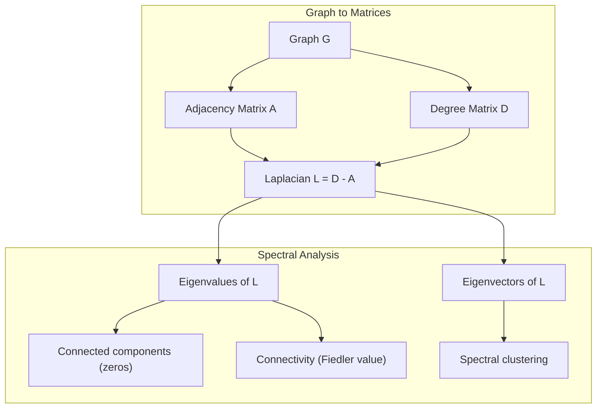
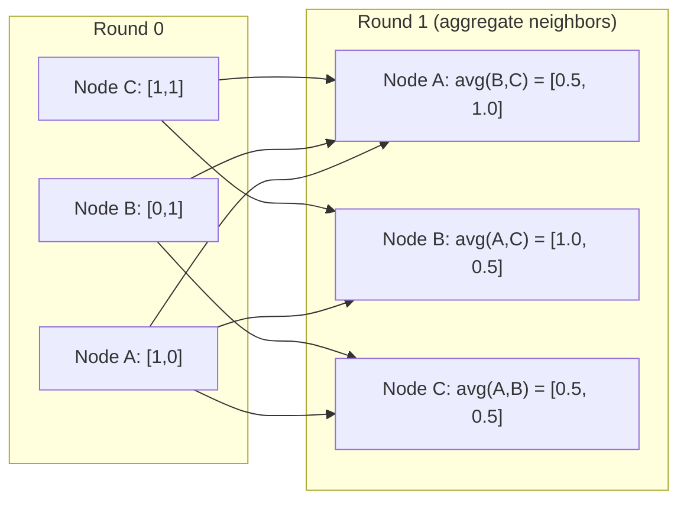

# 图论基础与图神经网络

> 对非欧氏结构拓扑建模。掌握邻接矩阵、图拉普拉斯矩阵与消息传递机制。

**Type:** 学习
**Language:** Python
**Prerequisites:** Phase 1, Lesson 02 (向量与矩阵运算)
**Time:** ~40 分钟

## Learning Objectives

- 用邻接矩阵/列表表示构建图类并实现广度优先搜索（BFS）和深度优先搜索（DFS）遍历
- 计算图拉普拉斯矩阵并使用其特征值检测连通组件和聚类节点
- 以归一化邻接矩阵乘法的形式实现一轮GNN风格的消息传递
- 使用Fiedler向量对图进行谱聚类划分

## The Problem

社交网络、分子、知识库、引用网络、地图——这些都是图。传统的机器学习将数据视为平面表。每一行都是独立的。每个特征是一列。但当连接结构变得重要时，表格就失效了。

考虑一个社交网络。你想预测用户会购买什么产品。他们的购买历史很重要。但他们的朋友的购买历史更重要。连接携带信号。

再考虑一个分子。你想预测它是否与蛋白质结合。原子很重要，但真正重要的是原子如何连接。结构就是数据。

图神经网络（GNNs）是深度学习中增长最快的领域。它们推动了药物发现、社交推荐、欺诈检测和知识图谱推理。每一个GNN都建立在相同的基础之上：基本的图论。

你需要四样东西：
1. 一种将图表示为矩阵的方法（这样你就可以对它们进行乘法运算）
2. 用于探索图结构的遍历算法
3. 拉普拉斯矩阵——谱图理论中最重要的矩阵
4. 消息传递——使GNNs工作的操作

## The Concept

### 图：节点和边

图 $ G = (V, E) $ 由顶点（节点） $ V $ 和边 $ E $ 组成。每条边连接两个节点。

**有向图与无向图。** 在无向图中，边 $ (u, v) $ 表示 $ u $ 连接到 $ v $ 且 $ v $ 连接到 $ u $。在有向图（digraph）中，边 $ (u, v) $ 表示 $ u $ 指向 $ v $，但不一定相反。

**有权重图与无权重图。** 在无权重图中，边要么存在，要么不存在。在有权重图中，每条边都有一个数值权重——一个距离、一个成本、一个强度。

| 图类型 | 示例 |
|------|---|
| 无向无权重 | Facebook友谊网络 |
| 有向无权重 | Twitter关注网络 |
| 无向有权重 | 地图（距离） |
| 有向有权重 | 网页链接（PageRank分数） |

### 邻接矩阵

邻接矩阵 $ A $ 是核心表示。对于有 $ n $ 个节点的图：

```
A[i][j] = 1    if there is an edge from node i to node j
A[i][j] = 0    otherwise
```

对于无向图，A 是对称的：A[i][j] = A[j][i]。对于有向图，A[i][j] = 边 (i, j) 的权重。

**示例 -- 一个三角形：**

```
Nodes: 0, 1, 2
Edges: (0,1), (1,2), (0,2)

A = [[0, 1, 1],
     [1, 0, 1],
     [1, 1, 0]]
```

邻接矩阵是每个图神经网络（GNN）的输入。对邻接矩阵 $ A $ 进行矩阵运算，对应于对图进行操作。

### 度数

节点的度数是指连接到该节点的边的数量。对于有向图，有入度（指向该节点的边）和出度（从该节点出发的边）。

度数矩阵 $ D $ 是一个对角矩阵：

```
D[i][i] = degree of node i
D[i][j] = 0    for i != j
```

对于三角形示例：D = diag(2, 2, 2)，因为每个节点都连接到另外两个节点。

度数告诉你节点的重要性。高度数 = 集散节点。网络的度数分布揭示了其结构。社交网络遵循幂律分布（少数集散节点，多数叶子节点）。随机图的度数呈泊松分布。

### BFS 和 DFS

两种基本的图遍历算法。你都需要它们。

**广度优先搜索（BFS）：** 先探索所有邻居，然后是邻居的邻居。使用队列（先进先出）。

```
BFS from node 0:
  Visit 0
  Queue: [1, 2]        (neighbors of 0)
  Visit 1
  Queue: [2, 3]        (add neighbors of 1)
  Visit 2
  Queue: [3]           (neighbors of 2 already visited)
  Visit 3
  Queue: []            (done)
```BFS 在无权图中找到最短路径。从起点到任意节点的距离等于该节点首次被发现的 BFS 层级。这就是为什么 BFS 被用于社交网络中的跳数（hop-count）距离。

**深度优先搜索（DFS）：** 尽可能深入搜索，然后再回溯。使用栈（LIFO）或递归。

```
DFS from node 0:
  Visit 0
  Stack: [1, 2]        (neighbors of 0)
  Visit 2               (pop from stack)
  Stack: [1, 3]         (add neighbors of 2)
  Visit 3               (pop from stack)
  Stack: [1]
  Visit 1               (pop from stack)
  Stack: []             (done)
```DFS 的用途包括：
- 查找连通分量（从未访问的节点运行 DFS）
- 检测环（DFS 树中的回边）
- 拓扑排序（DFS 完成顺序的逆序）

| 算法 | 数据结构 | 查找内容 | 使用场景 |
|------|---------|--------|---------|
| BFS | 队列 | 最短路径 | 社交网络距离，知识图谱遍历 |
| DFS | 栈 | 连通分量、环 | 连通性，拓扑排序 |

### 图拉普拉斯矩阵

L = D - A。谱图论中最重要的矩阵。

对于三角形：

```
D = [[2, 0, 0],    A = [[0, 1, 1],    L = [[2, -1, -1],
     [0, 2, 0],         [1, 0, 1],         [-1, 2, -1],
     [0, 0, 2]]         [1, 1, 0]]         [-1, -1,  2]]
```

拉普拉斯矩阵具有显著的特性：

1. **L 是半正定矩阵。** 所有特征值都 >= 0。

2. **零特征值的个数等于连通分量的个数。** 一个连通图恰好有一个零特征值。有三个不连通分量的图有三个零特征值。

3. **最小的非零特征值（Fiedler 值）衡量连通性。** 较大的 Fiedler 值意味着图的连通性较好。较小的 Fiedler 值意味着图存在较弱的连接点——瓶颈。

4. **Fiedler 值的特征向量（Fiedler 向量）揭示了最佳分割方式。** 正值的节点归为一组，负值的节点归为另一组。这就是谱聚类。



### 光谱特性

邻接矩阵和拉普拉斯矩阵的特征值可以揭示结构特性，而无需任何遍历。

**光谱聚类**的运作方式如下：
1. 计算拉普拉斯矩阵 L
2. 找出 L 的 k 个最小特征向量（跳过第一个，对于连通图来说，第一个是全为1的向量）
3. 将这些特征向量作为每个节点的新坐标
4. 在这些坐标上运行 k-means 聚类算法

为什么这方法有效？L 的特征向量编码了图上“最平滑”的函数。连接良好的节点具有相似的特征向量值。被瓶颈分隔的节点则具有不同的值。特征向量自然地将簇分开。

**随机游走联系。** 归一化拉普拉斯矩阵与图上的随机游走有关。随机游走的平稳分布与节点度成正比。混合时间（游走收敛的速度）取决于光谱间隙。

### 消息传递

图神经网络的核心操作。每个节点从其邻居收集消息，对它们进行聚合，并更新自己的状态。

```
h_v^(k+1) = UPDATE(h_v^(k), AGGREGATE({h_u^(k) : u in neighbors(v)}))
```

最简单的情况下，AGGREGATE = mean，且 UPDATE = 线性变换 + 激活函数：

```
h_v^(k+1) = sigma(W * mean({h_u^(k) : u in neighbors(v)}))
```

这是矩阵乘法的另一种表现形式。如果 H 是所有节点特征的矩阵，A 是邻接矩阵：

```
H^(k+1) = sigma(A_norm * H^(k) * W)
```

其中 A_norm 是归一化邻接矩阵（每行之和为 1）。

一轮消息传递使每个节点能够“看到”其直接邻居。两轮则让它看到邻居的邻居。K 轮可以让每个节点获取其 K 跳邻域内的信息。



### 概念和机器学习应用

| 概念 | 机器学习应用 |
|---------|---------------|
| 邻接矩阵 | 图神经网络输入表示 |
| 图拉普拉斯矩阵 | 谱聚类，社区发现 |
| 广度优先搜索/深度优先搜索 | 知识图谱遍历，路径查找 |
| 度分布 | 节点重要性，特征工程 |
| 消息传递 | 图神经网络层（GCN，GAT，GraphSAGE） |
| L 的特征值 | 社区发现，图划分 |
| 谱聚类 | 无监督节点分组 |
| PageRank | 节点重要性，网页搜索 |

```figure
graph-degree-distribution
```

## 构建它

### 步骤 1：从零开始编写图类

```python
class Graph:
    def __init__(self, n_nodes, directed=False):
        self.n = n_nodes
        self.directed = directed
        self.adj = {i: {} for i in range(n_nodes)}

    def add_edge(self, u, v, weight=1.0):
        self.adj[u][v] = weight
        if not self.directed:
            self.adj[v][u] = weight

    def neighbors(self, node):
        return list(self.adj[node].keys())

    def degree(self, node):
        return len(self.adj[node])

    def adjacency_matrix(self):
        import numpy as np
        A = np.zeros((self.n, self.n))
        for u in range(self.n):
            for v, w in self.adj[u].items():
                A[u][v] = w
        return A

    def degree_matrix(self):
        import numpy as np
        D = np.zeros((self.n, self.n))
        for i in range(self.n):
            D[i][i] = self.degree(i)
        return D

    def laplacian(self):
        return self.degree_matrix() - self.adjacency_matrix()
```

邻接表 (`self.adj`) 高效地存储了邻居信息。邻接矩阵转换使用 numpy，因为所有的谱操作都需要它。

### 步骤 2：BFS 和 DFS

```python
from collections import deque

def bfs(graph, start):
    visited = set()
    order = []
    distances = {}
    queue = deque([(start, 0)])
    visited.add(start)
    while queue:
        node, dist = queue.popleft()
        order.append(node)
        distances[node] = dist
        for neighbor in graph.neighbors(node):
            if neighbor not in visited:
                visited.add(neighbor)
                queue.append((neighbor, dist + 1))
    return order, distances


def dfs(graph, start):
    visited = set()
    order = []
    stack = [start]
    while stack:
        node = stack.pop()
        if node in visited:
            continue
        visited.add(node)
        order.append(node)
        for neighbor in reversed(graph.neighbors(node)):
            if neighbor not in visited:
                stack.append(neighbor)
    return order
```BFS 使用一个双端队列（deque）以实现 O(1) 的 popleft 操作。DFS 使用一个列表作为栈。两者都恰好访问每个节点一次 -- 时间复杂度为 O(V + E)。

### 第三步：连通分量和拉普拉斯矩阵的特征值

```python
def connected_components(graph):
    visited = set()
    components = []
    for node in range(graph.n):
        if node not in visited:
            order, _ = bfs(graph, node)
            visited.update(order)
            components.append(order)
    return components


def laplacian_eigenvalues(graph):
    import numpy as np
    L = graph.laplacian()
    eigenvalues = np.linalg.eigvalsh(L)
    return eigenvalues
```

`eigvalsh` 用于对称矩阵 -- 拉普拉斯矩阵对于无向图总是对称的。它按升序返回特征值。统计零的个数可以找到连通分量的数量。

### 步骤 4：谱聚类

```python
def spectral_clustering(graph, k=2):
    import numpy as np
    L = graph.laplacian()
    eigenvalues, eigenvectors = np.linalg.eigh(L)
    features = eigenvectors[:, 1:k+1]

    labels = np.zeros(graph.n, dtype=int)
    for i in range(graph.n):
        if features[i, 0] >= 0:
            labels[i] = 0
        else:
            labels[i] = 1
    return labels
```

对于 k=2，Fiedler 向量的符号将图分成两个簇。对于 k>2，你会对前 k 个特征向量（排除平凡的全 1 特征向量）运行 k-means 算法。

### 步骤 5：消息传递

```python
def message_passing(graph, features, weight_matrix):
    import numpy as np
    A = graph.adjacency_matrix()
    row_sums = A.sum(axis=1, keepdims=True)
    row_sums[row_sums == 0] = 1
    A_norm = A / row_sums
    aggregated = A_norm @ features
    output = aggregated @ weight_matrix
    return output
```

这是 GNN 消息传递的一轮。每个节点的新特征是其邻居特征的加权平均值，经过权重矩阵变换。堆叠多轮传递，可以进一步传播信息。

## 使用方法

使用 networkx 和 numpy，相同的操作只需一行代码：

```python
import networkx as nx
import numpy as np

G = nx.karate_club_graph()

A = nx.adjacency_matrix(G).toarray()
L = nx.laplacian_matrix(G).toarray()

eigenvalues = np.linalg.eigvalsh(L.astype(float))
print(f"Smallest eigenvalues: {eigenvalues[:5]}")
print(f"Connected components: {nx.number_connected_components(G)}")

communities = nx.community.greedy_modularity_communities(G)
print(f"Communities found: {len(communities)}")

pr = nx.pagerank(G)
top_nodes = sorted(pr.items(), key=lambda x: x[1], reverse=True)[:5]
print(f"Top 5 PageRank nodes: {top_nodes}")
```networkx 使用优化的 C 后端处理任意大小的图。可以在生产环境中使用它。使用你从零开始的实现来理解它是如何工作的。

### numpy 谱分析

```python
import numpy as np

A = np.array([
    [0, 1, 1, 0, 0],
    [1, 0, 1, 0, 0],
    [1, 1, 0, 1, 0],
    [0, 0, 1, 0, 1],
    [0, 0, 0, 1, 0]
])

D = np.diag(A.sum(axis=1))
L = D - A

eigenvalues, eigenvectors = np.linalg.eigh(L)
print(f"Eigenvalues: {np.round(eigenvalues, 4)}")
print(f"Fiedler value: {eigenvalues[1]:.4f}")
print(f"Fiedler vector: {np.round(eigenvectors[:, 1], 4)}")

fiedler = eigenvectors[:, 1]
group_a = np.where(fiedler >= 0)[0]
group_b = np.where(fiedler < 0)[0]
print(f"Cluster A: {group_a}")
print(f"Cluster B: {group_b}")
```Fiedler 向量承担了主要的工作。在一个簇中为正数，在另一个簇中为负数。不需要迭代优化，只需一次特征分解即可。

## 发布它

本课内容产生以下成果：
- `outputs/skill-graph-analysis.md` -- 用于分析图结构数据的技能参考

## 联系

| 概念 | 出现的位置 |
|---------|------------------|
| 邻接矩阵 | GCN，GAT，GraphSAGE 输入 |
| 拉普拉斯矩阵 | 谱聚类，ChebNet 滤波器 |
| BFS | 知识图谱遍历，最短路径查询 |
| 消息传递 | 每个 GNN 层，神经消息传递 |
| 谱间隙 | 图连通性，随机游走的混合时间 |
| 度分布 | 幂律网络，节点特征工程 |
| 连通组件 | 预处理，处理不连通图 |
| PageRank | 节点重要性排序，注意力初始化 |

GNNs 值得特别提及。GCN（Kipf & Welling，2017）中的图卷积操作使用带有自环的邻接矩阵，A_hat = A + I：

```text
H^(l+1) = sigma(D_hat^(-1/2) * A_hat * D_hat^(-1/2) * H^(l) * W^(l))
```

其中，A_hat = A + I（邻接矩阵加自环），而 D_hat 是 A_hat 的度矩阵。自环确保在聚合过程中每个节点都包含自身的特征。这正好是具有对称归一化的消息传递。D_hat^(-1/2) * A_hat * D_hat^(-1/2) 是归一化的邻接矩阵。拉普拉斯矩阵的出现是因为这种归一化与 L_sym = I - D^(-1/2) * A * D^(-1/2) 相关。理解拉普拉斯矩阵意味着理解为什么图卷积网络（GCNs）能起作用。

## 练习

1. **从零开始实现 PageRank 算法。** 初始时使用均匀的得分。每一步中：score(v) = (1-d)/n + d * sum(score(u)/out_degree(u))，其中所有指向 v 的 u 的得分相加。使用 d=0.85。直到收敛（变化 < 1e-6）时停止。在一个小型的网页图上进行测试。

2. **使用谱聚类寻找社区。** 创建一个包含两个明显分离的簇（例如，由单个边连接的两个完全子图）的图。运行谱聚类并验证它是否能正确地找到分割。当添加更多的跨簇边时会发生什么？

3. **实现 Dijkstra 算法** 用于加权图中的最短路径。将结果与同一图上使用统一权重的 BFS 结果进行比较。

4. **构建一个两层的消息传递网络。** 使用不同的权重矩阵进行两次消息传递。展示在两轮之后，每个节点都获得了其两跳邻域的信息。

5. **分析一个现实世界中的图。** 使用 Karate Club 图（34 个节点，78 条边）。计算度分布、拉普拉斯矩阵的特征值和谱聚类。将谱聚类的结果与已知的真实分割进行比较。

## 关键术语

| 术语 | 人们常说 | 它实际意味着 |
|------|----------------|----------------|
| 图 | “节点和边” | 一种数学结构 G=(V,E)，用于编码成对关系 |
| 邻接矩阵 | “连接表” | 一个 n x n 的矩阵，其中 A[i][j] = 1 如果节点 i 和 j 相连 |
| 度 | “节点的连接程度” | 与一个节点相连的边的数量 |
| 拉普拉斯矩阵 | “D 减 A” | L = D - A，其特征值揭示图结构的矩阵 |
| Fiedler 值 | “代数连通性” | L 的最小非零特征值，衡量图的连接程度 |
| BFS | “逐层搜索” | 一种遍历方式，先访问所有邻居，再深入，找到最短路径 |
| DFS | “先深入” | 一种遍历方式，沿着一条路径走到尽头再回溯 |
| 消息传递 | “节点与邻居交流” | 每个节点从邻居那里聚合信息，GNN 的核心 |
| 谱聚类 | “通过特征向量聚类” | 使用图的拉普拉斯矩阵的特征向量对图进行划分 |
| 连通组件 | “一个独立的部分” | 一个最大子图，其中每个节点都能到达其他所有节点 |

## 进一步阅读

- **Kipf & Welling (2017)** -- 《使用图卷积网络进行半监督分类》。这篇论文开启了现代 GNN 的研究。展示了谱图卷积简化为消息传递。
- **Spielman (2012)** -- 《谱图理论》讲义。介绍拉普拉斯矩阵、谱间隙和图划分的权威入门。
- **Hamilton (2020)** -- 《图表示学习》。涵盖从基础到应用的 GNN 书籍。
- **Bronstein 等人 (2021)** -- 《几何深度学习：网格、群、图、测地线和规范》。统一框架的论文。
- **Veličković 等人 (2018)** -- 《图注意力网络》。将注意力机制扩展到消息传递。
