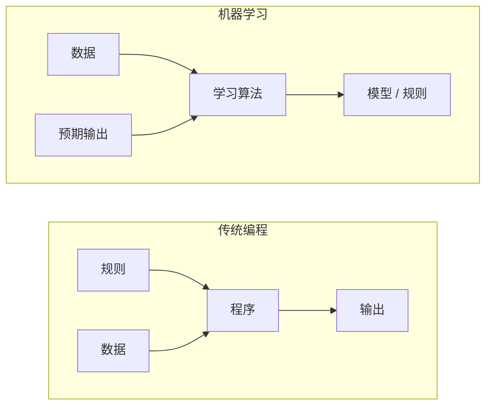
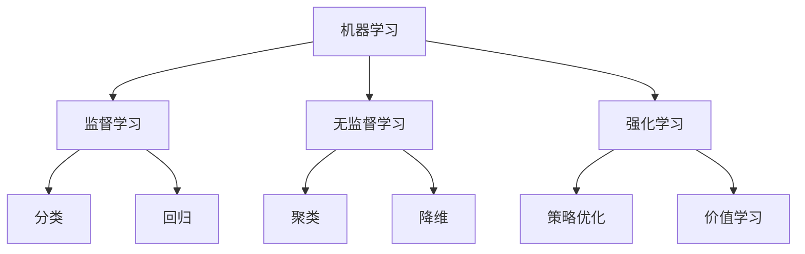
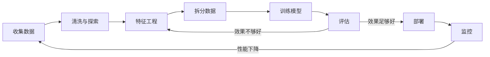
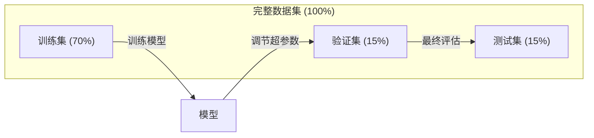
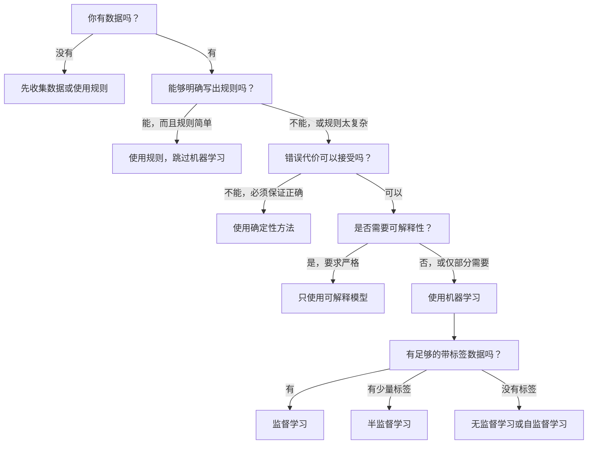

# 什么是机器学习

> 机器学习不是由人手写规则，而是让计算机从数据中发现模式。

**Type:** 学习
**Languages:** Python
**Prerequisites:** 阶段 1（数学基础）
**Time:** 约 45 分钟

## 学习目标

- 解释监督学习、无监督学习和强化学习之间的区别，并判断给定问题适合哪一类方法
- 从零实现最近质心分类器，并将其与随机基线进行比较评估
- 区分分类任务与回归任务，并为二者选择合适的损失函数
- 评估给定业务问题适合使用机器学习，还是更适合用确定性规则解决

## 问题背景

你想构建一个垃圾邮件过滤器。传统做法是坐下来编写数百条规则：「如果邮件包含『FREE MONEY』，就标记为垃圾邮件；如果感叹号超过 3 个，也标记为垃圾邮件。」你花了几周时间编写规则，随后垃圾邮件发送者换了措辞，规则便失效了。于是你继续添加规则，循环永无止境。

机器学习把这个过程反了过来。你不再手写规则，而是向计算机提供数千封带标签的邮件（「垃圾邮件」或「非垃圾邮件」），让它自行归纳规则。计算机能够发现你从未想到过的模式。垃圾邮件发送者改变策略时，你只需用新数据重新训练，而不必重写代码。

从「编写规则」转向「从数据中学习」，正是机器学习的核心。推荐引擎、语音助手、自动驾驶汽车和语言模型都以这种方式工作。

## 核心概念

### 从数据而非规则中学习

传统编程与机器学习解决问题的方向正好相反。



传统编程：你编写规则，程序将规则应用于数据并产生输出。

机器学习：你提供数据和预期输出，由算法发现规则。

训练得到的「模型」本身就是规则，只不过这些规则被编码为数字（权重和参数）。模型从见过的样本中总结规律，再对从未见过的数据作出预测，这就是泛化。

### 机器学习的三种类型



**监督学习**：你拥有输入—输出对，模型学习如何把输入映射为输出。
- 「这里有 10,000 张标注为猫或狗的照片，请学会区分它们。」
- 「这里有房屋特征和对应价格，请学会预测房价。」

**无监督学习**：你只有输入，没有标签，模型自行发现数据的结构。
- 「这里有 10,000 名客户的购买记录，请找出自然形成的分组。」
- 「这里有 1,000 维的数据点，请在保留结构的同时降到 2 维。」

**强化学习**：智能体在环境中采取行动并获得奖励或惩罚，通过学习策略（policy）使总奖励最大化。
- 「玩这个游戏。获胜得 +1，失败得 -1，请找出制胜策略。」
- 「控制这只机械臂。拾起物体得 +1，每浪费 1 秒扣 0.01 分。」

实际构建的大多数系统都会使用监督学习。无监督学习常用于预处理和探索，强化学习则支撑游戏 AI、机器人技术以及语言模型的 RLHF。

### 三大类型之外

上述三类划分很清晰，但现实中的机器学习往往没有如此明确的边界。

**半监督学习**使用少量有标签数据和大量无标签数据。例如，你可能只有 100 张带标签的医学图像，却有 100,000 张无标签图像。常见技术包括：

- **标签传播：** 建立一张连接相似数据点的图，让标签沿图从有标签节点传播到相邻的无标签节点。
- **伪标签：** 先用有标签数据训练模型，再让模型为无标签数据预测标签，最后在全部数据上重新训练。模型借此自行扩充训练集。
- **一致性正则化：** 对同一个输入及其轻微扰动版本，模型应给出相同预测。即使没有标签，这种方法也能发挥作用。

**自监督学习**从数据自身构造监督信号，完全不需要人工标签。模型利用数据结构为自己创建预测任务。

- **掩码语言建模 (BERT)：** 隐去句子中 15% 的词，训练模型预测缺失内容。「标签」直接来自原始文本。
- **对比学习 (SimCLR)：** 对一张图像生成两个增强版本，训练模型识别它们源自同一张图像，同时将它们与其他图像的增强版本区分开来。
- **下一词元预测 (GPT)：** 根据此前所有词元预测下一个词元，使每篇文本文档都能成为训练样本。

它们并不是独立于三大类型的新类别，而是融合监督与无监督思想的策略。从技术上说，自监督学习仍然属于监督式任务（模型需要预测某个目标），只是标签由系统自动生成，而非人工提供。

### 分类与回归

它们是监督学习中的两类主要任务。

| 方面 | 分类 | 回归 |
|--------|---------------|------------|
| 输出 | 离散类别 | 连续数值 |
| 示例 | 「这封邮件是垃圾邮件吗？」 | 「这套房子的价格是多少？」 |
| 输出空间 | {猫, 狗, 鸟} | 任意实数 |
| 损失函数或指标 | 交叉熵、准确率 | 均方误差、MAE |
| 决策形式 | 类别之间的边界 | 拟合数据的曲线 |

分类回答「属于哪个类别？」，回归回答「数值是多少？」

有些问题可以用任一种方式表述。预测股票上涨还是下跌属于分类，预测其确切价格则属于回归。

### 机器学习工作流

无论采用哪种算法，每个机器学习项目都遵循同一套流程。



**收集数据**：获取原始数据。数据通常越多越好，但质量比数量更重要。

**清洗与探索**：处理缺失值、删除重复项、可视化数据分布并发现异常。这一步通常占项目总时间的 60%～80%。

**特征工程**：把原始数据转换为模型可用的特征，例如从日期提取星期信息、对数值列归一化、编码类别变量。优质特征往往比花哨的算法更重要。

**拆分数据**：将数据划分为训练集、验证集和测试集。模型在训练数据上学习，你依据验证数据调节超参数，最后在测试数据上报告最终性能。

**训练模型**：把训练数据交给算法，算法调整内部参数，使损失函数最小化。

**评估**：在验证数据或测试数据上衡量性能。如果效果不能接受，就返回前面的步骤，尝试不同的特征、算法或超参数。

**部署**：把模型投入生产环境，让它对新数据作出预测。

**监控**：持续跟踪模型性能。数据分布会变化（数据漂移），模型效果也会衰退；性能下降时应重新训练。

### 训练集、验证集与测试集的划分

这是初学者最容易弄错、也最重要的概念。必须使用模型在训练期间从未见过的数据进行评估，否则测到的只是记忆能力，而不是学习能力。



| 数据划分 | 用途 | 使用时机 | 典型比例 |
|-------|---------|-----------|-------------|
| 训练集 | 模型从这些数据中学习 | 训练期间 | 60%～80% |
| 验证集 | 调节超参数、比较模型 | 每轮训练之后 | 10%～20% |
| 测试集 | 得到无偏的最终性能估计 | 只在最后使用一次 | 10%～20% |

测试集不可随意触碰，你只能查看一次。如果不断根据测试性能调整模型，就相当于在测试集上训练，最终报告的数字也就失去了意义。

对于小型数据集，可以使用 k 折交叉验证：把数据分成 k 份，每次用其中 k-1 份训练、剩余 1 份验证，轮换验证集后对结果取平均。

### 过拟合与欠拟合


**欠拟合**：模型过于简单，无法捕捉数据中的模式，例如试图用直线拟合曲线关系。此时训练误差高，测试误差也高。

**过拟合**：模型过于复杂，把训练数据乃至其中的噪声都记了下来。例如，一条弯弯曲曲、穿过每个训练点的曲线，却无法处理新数据。此时训练误差低，测试误差高。

**拟合良好**：模型捕捉到真实模式，却没有记忆噪声。训练误差和测试误差都处于合理的低水平。

过拟合的迹象：
- 训练准确率远高于验证准确率
- 模型在训练数据上表现良好，在新数据上表现很差
- 增加训练数据能够改善性能（说明模型此前只是在记忆，而不是学习）

应对过拟合的方法：
- 获取更多训练数据
- 降低模型复杂度（减少参数、简化架构）
- 使用正则化（对过大的权重施加惩罚）
- 使用 Dropout（训练期间随机将部分神经元输出置零）
- 使用提前停止（验证误差开始上升时停止训练）

应对欠拟合的方法：
- 使用更复杂的模型
- 增加更多特征
- 减弱正则化
- 延长训练时间

### 偏差—方差权衡

这是解释过拟合与欠拟合的数学框架。

**偏差**：模型错误假设造成的误差。如果真实关系是非线性的，线性模型就会产生高偏差。高偏差会导致欠拟合。

**方差**：模型对训练数据中细微波动过于敏感而产生的误差。高方差模型在不同数据子集上训练后，会给出差异很大的预测。高方差会导致过拟合。

| 模型复杂度 | 偏差 | 方差 | 结果 |
|-----------------|------|----------|--------|
| 过低（用线性模型拟合曲线数据） | 高 | 低 | 欠拟合 |
| 恰到好处 | 中 | 中 | 泛化良好 |
| 过高（用 20 次多项式拟合 10 个点） | 低 | 高 | 过拟合 |

总误差 = 偏差^2 + 方差 + 不可约噪声

不可约噪声来自数据本身的随机性，无法降低。我们的目标是找到使「偏差^2 + 方差」最小的平衡点。

### 没有免费午餐定理

不存在一种对所有问题都表现最佳的算法。某种算法在一类问题上表现出色，就可能在另一类问题上表现不佳。因此，数据科学家需要尝试多种算法并比较结果。

实践中的选择取决于：
- 你拥有多少数据
- 数据包含多少特征
- 数据关系是线性还是非线性
- 是否需要可解释性
- 能够承担多少计算成本

### 何时不应使用机器学习

机器学习功能强大，却并非始终是正确工具。在使用模型之前，先问问自己是否真的需要它。

**以下情况不要使用机器学习：**

- **规则简单且定义明确。** 税额计算、排序算法、单位换算都属于此类。如果用几个 `if` 语句就能写出完整逻辑，引入模型只会增加复杂度，不会带来收益。
- **没有数据或数据极少。** 机器学习需要从样本中学习。只有 10 个数据点时，无法训练出有意义的模型，应先收集数据。
- **错误代价是灾难性的，必须保证正确。** 例如医疗剂量计算、核反应堆控制、密码学验证。机器学习模型具有概率性，偶尔一定会出错。如果「偶尔出错」也不能接受，就应使用确定性方法。
- **查询表或启发式方法已经能解决问题。** 如果简单阈值或表格能够覆盖 99% 的情况，加入机器学习只会增加维护成本，却不会带来有意义的改进。
- **决策无法解释，但业务要求可解释。** 受监管行业（信贷、保险、刑事司法）有时要求每项决策都能得到完整解释。部分机器学习模型具有可解释性（如线性回归、小型决策树），但大多数模型并非如此。
- **问题变化速度超过重新训练速度。** 如果规则每天都变化，而重新训练需要一周，模型就会始终过时。

可以使用下面的决策流程图：



## 动手构建

`code/ml_intro.py` 中的代码从零实现了最近质心分类器，这是最简单的机器学习算法之一。它展示了机器学习的核心思想：先从数据中学习，再对新数据作出预测。

### 第 1 步：从零实现最近质心分类器

最近质心分类器计算训练数据中每个类别的中心（均值）。预测时，它把每个新数据点分配给中心距离最近的类别。

```python
class NearestCentroid:
    def fit(self, X, y):
        self.classes = np.unique(y)
        self.centroids = np.array([
            X[y == c].mean(axis=0) for c in self.classes
        ])

    def predict(self, X):
        distances = np.array([
            np.sqrt(((X - c) ** 2).sum(axis=1))
            for c in self.centroids
        ])
        return self.classes[distances.argmin(axis=0)]
```

这就是完整算法。拟合过程计算两个均值，预测过程计算距离。不需要梯度下降、迭代或超参数。

### 第 2 步：在合成数据上训练

我们生成一个包含两个类别且略有重叠的二维分类数据集。质心分类器会在两个类别中心之间画出线性决策边界。

```python
rng = np.random.RandomState(42)
X_class0 = rng.randn(100, 2) + np.array([1.0, 1.0])
X_class1 = rng.randn(100, 2) + np.array([-1.0, -1.0])
X = np.vstack([X_class0, X_class1])
y = np.array([0] * 100 + [1] * 100)
```

### 第 3 步：与基线比较

每个机器学习模型都应与一个简单基线比较。这里的基线随机预测类别。如果模型连随机猜测都无法胜过，就说明存在问题。

```python
baseline_preds = rng.choice([0, 1], size=len(y_test))
baseline_acc = np.mean(baseline_preds == y_test)
```

在这个干净的数据集上，质心分类器的准确率应达到约 90% 以上，而随机基线约为 50%。

### 为什么这很重要

最近质心分类器极其简单，没有超参数、迭代或梯度下降，却体现了机器学习的基本模式：

1. 从训练数据中**学习**一种表示（质心）
2. 使用这种表示对新数据进行**预测**（选择最近距离）
3. 以基线为参照进行**评估**（随机猜测）

从逻辑回归到 Transformer，每种机器学习算法都遵循同样的三步模式。数据表示会变得越来越复杂，但工作流始终不变。

### 第 4 步：质心分类器做不到什么

最近质心分类器假设每个类别都形成单一的数据簇，并使用线性决策边界。它会在以下情况下失效：

- 一个类别包含多个数据簇（例如数字「1」可能有多种不同写法）
- 决策边界是非线性的（例如一个类别包围另一个类别）
- 特征尺度差异很大（距离会被尺度最大的特征主导）

这些局限正是学习其他算法的动机。K 近邻能够处理多个数据簇，决策树能够处理非线性边界，特征缩放能够解决尺度问题。每一课都会在上一课所揭示的局限之上继续推进。

## 使用现成工具

sklearn 提供了 `NearestCentroid` 和合成数据生成器：

```python
from sklearn.neighbors import NearestCentroid
from sklearn.datasets import make_classification
from sklearn.model_selection import train_test_split

X, y = make_classification(
    n_samples=500, n_features=2, n_redundant=0,
    n_clusters_per_class=1, random_state=42
)
X_train, X_test, y_train, y_test = train_test_split(X, y, test_size=0.3)

clf = NearestCentroid()
clf.fit(X_train, y_train)
print(f"Accuracy: {clf.score(X_test, y_test):.3f}")
```

## 交付成果

本课会产出 `outputs/prompt-ml-problem-framer.md`：一个把模糊业务问题转化为具体机器学习任务的提示词。向它提供问题描述（例如「我们想降低客户流失率」或「预测下一季度需求」），它就会识别学习类型、定义预测目标、列出候选特征、选择成功指标、建立基线，并提示数据泄漏或类别不平衡等风险。在任何机器学习项目开始时使用它，可以避免一开始就构建错误的方案。

## 关键术语

| 术语 | 人们常说 | 实际含义 |
|------|----------------|----------------------|
| 模型 | 「那个 AI」 | 一种包含可学习参数、把输入映射为输出的数学函数 |
| 训练 | 「教会 AI」 | 运行优化算法调整模型参数，使预测结果与已知输出相匹配 |
| 特征 | 「一个输入列」 | 模型用于作出预测的数据可测量属性 |
| 标签 | 「答案」 | 训练样本的已知输出，用于计算误差信号 |
| 超参数 | 「需要调的设置」 | 训练前设定、用于控制学习过程的参数（如学习率、层数） |
| 损失函数 | 「模型错得有多离谱」 | 衡量预测输出与实际输出之间差距的函数，训练过程会尝试将它最小化 |
| 过拟合 | 「它把测试内容记住了」 | 模型学到训练数据特有的噪声而非普遍模式，因此无法处理新数据 |
| 欠拟合 | 「它什么也没学会」 | 模型过于简单，无法捕捉数据中的真实模式 |
| 泛化 | 「它在新数据上也有效」 | 模型对未参与训练的数据作出准确预测的能力 |
| 交叉验证 | 「在不同数据块上测试」 | 反复把数据划分为训练折与测试折并对结果取平均，以获得更稳健的性能估计 |
| 正则化 | 「让权重保持较小」 | 向损失函数添加惩罚项，抑制过于复杂的模型 |
| 数据漂移 | 「世界发生了变化」 | 输入数据的统计分布随时间改变，导致模型性能下降 |

## 练习

1. 选择任意数据集（例如 Iris 或 Titanic），按 70/15/15 的比例划分为训练集、验证集和测试集。解释为什么不应在测试集上调节超参数。
2. 列出 3 个现实问题。对每个问题，判断它属于分类、回归还是聚类，以及属于监督学习还是无监督学习。
3. 某模型在训练数据上的准确率为 99%，在测试数据上却只有 60%。诊断问题，并列出 3 种你会尝试的修复方法。

## 延伸阅读

- [An Introduction to Statistical Learning](https://www.statlearning.com/)：免费教材，通过实践示例介绍各种经典机器学习方法
- [Google 的机器学习速成课程](https://developers.google.com/machine-learning/crash-course)：简洁、可视化的机器学习概念入门
- [Scikit-learn 用户指南](https://scikit-learn.org/stable/user_guide.html)：使用 Python 实现机器学习的实用参考资料
