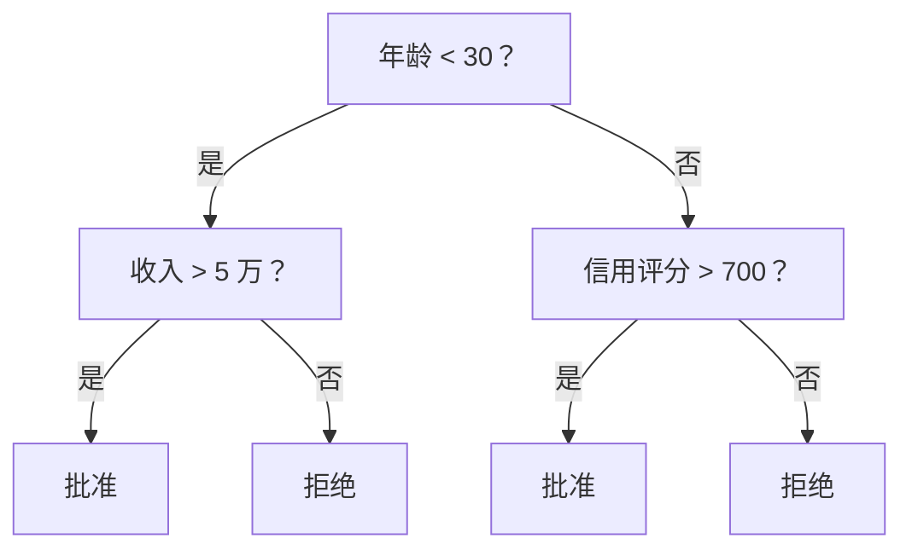
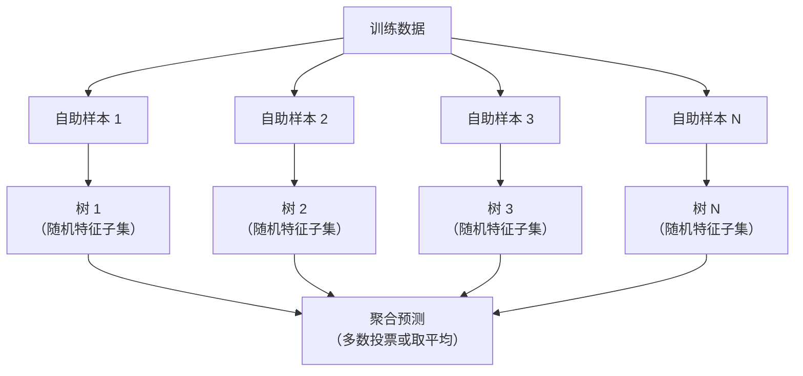

# 决策树与随机森林

> 决策树本质上就是流程图，而由许多决策树组成的森林却是机器学习中最强大的工具之一。

**Type:** Build
**Language:** Python
**Prerequisites:** Phase 1 (Lessons 09 Information Theory, 06 Probability)
**Time:** ~90 minutes

## 学习目标

- 实现基尼不纯度、熵和信息增益的计算，以寻找最优决策树划分
- 从零构建带预剪枝控制（最大深度、最小样本数）的决策树分类器
- 使用自助采样与特征随机化构建随机森林，并解释其降低方差的原因
- 比较 MDI 特征重要性与排列重要性，并识别 MDI 存在偏差的情形

## 问题

你有一份表格数据：行表示样本，列表示特征，另有一列是希望预测的目标。你当然可以直接使用神经网络，但对于表格数据，基于树的模型（决策树、随机森林、梯度提升树）一直优于深度学习。Kaggle 的结构化数据竞赛由 XGBoost 和 LightGBM 主导，而不是 Transformer。

为什么？树无需预处理就能处理混合类型的特征（数值型和分类型），无需特征工程就能处理非线性关系，并且具有可解释性：直接查看树结构，就能准确理解模型为何作出某项预测。随机森林通过对多棵树取平均，在中等规模的数据集上还能有效抵抗过拟合。

本课将使用递归划分从零构建决策树，再以此为基础构建随机森林。你会实现划分准则背后的数学计算（基尼不纯度、熵、信息增益），并理解为什么弱学习器的集成能够成为强学习器。

## 核心概念

### 决策树的作用

决策树通过依次提出一系列“是/否”问题，将特征空间划分为矩形区域。



每个内部节点都会将某个特征与阈值进行比较，每个叶节点则给出预测。要对新数据点分类，可以从根节点出发，沿分支前进，直到抵达叶节点。

决策树自顶向下构建：在每个节点选择最能分开数据的特征和阈值。所谓“最优”由划分准则定义。

### 划分准则：衡量不纯度

每个节点都包含一组样本。我们的目标是划分这些样本，使生成的子节点尽可能“纯”，也就是让每个子节点主要包含同一类别。

**基尼不纯度**衡量这样一种概率：从节点中随机选取一个样本，并按照该节点的类别分布为其赋予标签时，它被错误分类的概率。

```
Gini(S) = 1 - sum(p_k^2)

where p_k is the proportion of class k in set S.
```

对于纯节点（全部属于同一类别），Gini = 0。对于两个类别各占 50% 的二分类节点，Gini = 0.5。数值越低越好。

```
Example: 6 cats, 4 dogs

Gini = 1 - (0.6^2 + 0.4^2) = 1 - (0.36 + 0.16) = 0.48
```

**熵**衡量节点中的信息量（混乱程度），已在第 1 阶段第 09 课讲解。

```
Entropy(S) = -sum(p_k * log2(p_k))
```

对于纯节点，熵 = 0；对于两个类别各占 50% 的二分类节点，熵 = 1.0。数值越低越好。

```
Example: 6 cats, 4 dogs

Entropy = -(0.6 * log2(0.6) + 0.4 * log2(0.4))
        = -(0.6 * -0.737 + 0.4 * -1.322)
        = 0.442 + 0.529
        = 0.971 bits
```

**信息增益**是划分后不纯度（熵或基尼不纯度）的减少量。

```
IG(S, feature, threshold) = Impurity(S) - weighted_avg(Impurity(S_left), Impurity(S_right))

where the weights are the proportions of samples in each child.
```

每个节点采用贪心算法：尝试所有特征和所有可能的阈值，选择使信息增益最大的（特征，阈值）组合。

### 划分过程

对于当前节点包含 n 个特征、m 个样本的数据集：

1. 对每个特征 j（j = 1 到 n）：
   - 按特征 j 对样本排序
   - 将相邻不同取值之间的每个中点都作为候选阈值
   - 计算每个阈值对应的信息增益
2. 选择信息增益最大的特征和阈值
3. 将数据划分到左侧（特征 <= 阈值）和右侧（特征 > 阈值）
4. 对每个子节点递归执行上述过程

这种贪心方法不能保证得到全局最优树。寻找最优树是 NP 难问题，但贪心划分在实践中效果良好。

### 停止条件

如果没有停止条件，树会一直生长到每个叶节点都是纯节点（每个叶节点只有一个样本）。这会完美记住训练数据，却具有极差的泛化能力。

**预剪枝**在树完全生长前将其停止：
- 最大深度：树达到设定深度时停止划分
- 每个叶节点的最小样本数：节点中的样本少于 k 个时停止
- 最小信息增益：最佳划分带来的不纯度改善低于阈值时停止
- 最大叶节点数：限制叶节点总数

**后剪枝**先让树完整生长，再将其修剪：
- 代价复杂度剪枝（scikit-learn 使用）：加入与叶节点数量成比例的惩罚项；提高惩罚可得到更小的树
- 错误率降低剪枝：如果移除子树不会增大验证误差，就将其移除

预剪枝更简单、更快速。后剪枝通常能生成更好的树，因为它不会过早阻止那些可能进一步产生有效划分的分支。

### 用于回归的决策树

在回归任务中，叶节点的预测值是该叶节点内目标值的均值，划分准则也会相应改变：

使用**方差减少量**替代信息增益：

```
VR(S, feature, threshold) = Var(S) - weighted_avg(Var(S_left), Var(S_right))
```

选择使方差减少最多的划分。树会把输入空间划分为多个区域，并在每个区域中预测一个常数（均值）。

### 随机森林：集成的力量

单棵决策树具有高方差，数据的细微变化就可能生成完全不同的树。随机森林通过对多棵树取平均来解决这一问题。



两种随机性来源使各棵树保持多样性：

**装袋法（自助聚合）：** 每棵树都在一个自助样本上训练，该样本通过从训练数据中有放回地随机抽样得到。每个自助样本大约包含 63% 的原始样本（其余为袋外样本，可用于验证）。

**特征随机化：** 每次划分时只考虑随机选取的特征子集。分类任务默认选择 sqrt(n_features) 个特征，回归任务默认选择 n_features/3 个。这可以防止所有树都在同一个主导特征上进行划分。

关键在于：对许多不相关的树取平均，可以在不增加偏差的情况下降低方差。每棵树单独看或许表现平平，但集成后会非常强大。

### 特征重要性

随机森林能够自然地给出特征重要性分数。最常见的方法是：

**平均不纯度减少量（MDI）：** 对每个特征，将所有树中使用该特征的所有节点所带来的不纯度减少量求和。在较早划分中带来更大不纯度下降的特征更重要。

```
importance(feature_j) = sum over all nodes where feature_j is used:
    (n_samples_at_node / n_total_samples) * impurity_decrease
```

这种方法速度很快（在训练期间即可计算），但会偏向基数高、可能划分点较多的特征。

另一种方法是**排列重要性**：打乱某个特征的取值，衡量模型准确率下降了多少。它更可靠，但速度更慢。

### 树模型何时优于神经网络

在表格数据上，决策树与随机森林通常胜过神经网络，原因包括：

| 因素 | 树模型 | 神经网络 |
|--------|-------|----------------|
| 混合类型（数值型 + 分类型） | 原生支持 | 需要编码 |
| 小型数据集（少于 1 万行） | 表现良好 | 容易过拟合 |
| 特征交互 | 通过划分自动发现 | 需要设计架构 |
| 可解释性 | 完全透明 | 黑盒 |
| 训练时间 | 分钟级 | 小时级 |
| 对超参数的敏感度 | 低 | 高 |

当数据具有空间或时序结构（图像、文本、音频）时，神经网络更有优势。对于扁平的特征表格，树模型是默认选择。

```figure
decision-tree-depth
```

## 动手构建

### 第 1 步：基尼不纯度与熵

从零构建这两种划分准则，并验证它们对优质划分的判断一致。

```python
import math

def gini_impurity(labels):
    n = len(labels)
    if n == 0:
        return 0.0
    counts = {}
    for label in labels:
        counts[label] = counts.get(label, 0) + 1
    return 1.0 - sum((c / n) ** 2 for c in counts.values())

def entropy(labels):
    n = len(labels)
    if n == 0:
        return 0.0
    counts = {}
    for label in labels:
        counts[label] = counts.get(label, 0) + 1
    return -sum(
        (c / n) * math.log2(c / n) for c in counts.values() if c > 0
    )
```

### 第 2 步：寻找最佳划分

尝试每个特征和每个阈值，返回信息增益最大的组合。

```python
def information_gain(parent_labels, left_labels, right_labels, criterion="gini"):
    measure = gini_impurity if criterion == "gini" else entropy
    n = len(parent_labels)
    n_left = len(left_labels)
    n_right = len(right_labels)
    if n_left == 0 or n_right == 0:
        return 0.0
    parent_impurity = measure(parent_labels)
    child_impurity = (
        (n_left / n) * measure(left_labels) +
        (n_right / n) * measure(right_labels)
    )
    return parent_impurity - child_impurity
```

### 第 3 步：构建 DecisionTree 类

实现递归划分、预测和特征重要性跟踪。`_build` 是决策树的核心：当节点已纯或达到预剪枝限制时停止，否则采用最佳划分，并对两个子节点递归执行。

```python
import random

class DecisionTree:
    def __init__(self, max_depth=None, min_samples_split=2,
                 min_samples_leaf=1, criterion="gini",
                 max_features=None):
        self.max_depth = max_depth
        self.min_samples_split = min_samples_split
        self.min_samples_leaf = min_samples_leaf
        self.criterion = criterion
        self.max_features = max_features
        self.tree = None
        self.feature_importances_ = None

    def fit(self, X, y):
        self.n_features = len(X[0])
        self.feature_importances_ = [0.0] * self.n_features
        self.n_samples = len(X)
        self.tree = self._build(X, y, depth=0)
        total = sum(self.feature_importances_)
        if total > 0:
            self.feature_importances_ = [
                fi / total for fi in self.feature_importances_
            ]

    def predict(self, X):
        return [self._predict_one(x, self.tree) for x in X]

    def _build(self, X, y, depth):
        if len(set(y)) == 1:
            return {"leaf": True, "value": y[0]}

        if self.max_depth is not None and depth >= self.max_depth:
            return self._make_leaf(y)

        if len(y) < self.min_samples_split:
            return self._make_leaf(y)

        best_feature, best_threshold, best_gain = self._best_split(X, y)

        if best_feature is None or best_gain <= 0:
            return self._make_leaf(y)

        left_X, left_y, right_X, right_y = self._split_data(
            X, y, best_feature, best_threshold
        )

        if len(left_y) < self.min_samples_leaf or len(right_y) < self.min_samples_leaf:
            return self._make_leaf(y)

        weight = len(y) / self.n_samples
        self.feature_importances_[best_feature] += weight * best_gain

        return {
            "leaf": False,
            "feature": best_feature,
            "threshold": best_threshold,
            "left": self._build(left_X, left_y, depth + 1),
            "right": self._build(right_X, right_y, depth + 1),
        }

    def _make_leaf(self, y):
        counts = {}
        for label in y:
            counts[label] = counts.get(label, 0) + 1
        return {"leaf": True, "value": max(counts, key=counts.get)}

    def _best_split(self, X, y):
        best_feature = None
        best_threshold = None
        best_gain = -1.0

        if self.max_features == "sqrt":
            k = max(1, int(math.sqrt(self.n_features)))
            feature_indices = random.sample(range(self.n_features), k)
        elif isinstance(self.max_features, int):
            if self.max_features < 1:
                raise ValueError("max_features must be at least 1 when given as an integer")
            k = min(self.max_features, self.n_features)
            feature_indices = random.sample(range(self.n_features), k)
        else:
            feature_indices = list(range(self.n_features))

        for feature_idx in feature_indices:
            values = sorted(set(X[i][feature_idx] for i in range(len(X))))
            if len(values) <= 1:
                continue

            for i in range(len(values) - 1):
                threshold = (values[i] + values[i + 1]) / 2.0
                left_y = [y[j] for j in range(len(X)) if X[j][feature_idx] <= threshold]
                right_y = [y[j] for j in range(len(X)) if X[j][feature_idx] > threshold]

                if len(left_y) < self.min_samples_leaf or len(right_y) < self.min_samples_leaf:
                    continue

                gain = information_gain(y, left_y, right_y, self.criterion)
                if gain > best_gain:
                    best_gain = gain
                    best_feature = feature_idx
                    best_threshold = threshold

        return best_feature, best_threshold, best_gain

    def _split_data(self, X, y, feature, threshold):
        left_X, left_y, right_X, right_y = [], [], [], []
        for i in range(len(X)):
            if X[i][feature] <= threshold:
                left_X.append(X[i])
                left_y.append(y[i])
            else:
                right_X.append(X[i])
                right_y.append(y[i])
        return left_X, left_y, right_X, right_y

    def _predict_one(self, x, node):
        if node["leaf"]:
            return node["value"]
        if x[node["feature"]] <= node["threshold"]:
            return self._predict_one(x, node["left"])
        return self._predict_one(x, node["right"])
```

### 第 4 步：构建 RandomForest 类

实现自助采样、特征随机化和多数投票。

```python
class RandomForest:
    def __init__(self, n_trees=100, max_depth=None,
                 min_samples_split=2, max_features="sqrt",
                 criterion="gini"):
        self.n_trees = n_trees
        self.max_depth = max_depth
        self.min_samples_split = min_samples_split
        self.max_features = max_features
        self.criterion = criterion
        self.trees = []

    def fit(self, X, y):
        n = len(X)
        for _ in range(self.n_trees):
            indices = [random.randint(0, n - 1) for _ in range(n)]
            X_boot = [X[i] for i in indices]
            y_boot = [y[i] for i in indices]
            tree = DecisionTree(
                max_depth=self.max_depth,
                min_samples_split=self.min_samples_split,
                max_features=self.max_features,
                criterion=self.criterion,
            )
            tree.fit(X_boot, y_boot)
            self.trees.append(tree)

    def predict(self, X):
        all_preds = [tree.predict(X) for tree in self.trees]
        predictions = []
        for i in range(len(X)):
            votes = {}
            for preds in all_preds:
                v = preds[i]
                votes[v] = votes.get(v, 0) + 1
            predictions.append(max(votes, key=votes.get))
        return predictions
```

包含所有辅助方法的完整实现请参阅 `code/trees.py`。

## 实际应用

使用 scikit-learn，只需三行代码即可训练随机森林：

```python
from sklearn.ensemble import RandomForestClassifier
from sklearn.datasets import load_iris
from sklearn.model_selection import train_test_split

X, y = load_iris(return_X_y=True)
X_train, X_test, y_train, y_test = train_test_split(X, y, random_state=42)

rf = RandomForestClassifier(n_estimators=100, random_state=42)
rf.fit(X_train, y_train)
print(f"Accuracy: {rf.score(X_test, y_test):.4f}")
print(f"Feature importances: {rf.feature_importances_}")
```

实践中，梯度提升树（XGBoost、LightGBM、CatBoost）往往比随机森林更强，因为它们按顺序构建树，每棵树都会纠正前面树的错误。但随机森林不易配置出错，而且几乎不需要调优超参数。

## 交付成果

本课将产出 `outputs/prompt-tree-interpreter.md`——一个面向业务相关方解释决策树划分的提示词。向它提供已训练决策树的结构（深度、特征、划分阈值、准确率），它就会将模型转换为通俗易懂的规则，对特征重要性排序，标记过拟合或数据泄漏，并建议后续步骤。每当需要向不阅读代码的人解释树模型时，都可以使用它。

## 练习

1. 在包含 3 个类别的二维数据集上训练单棵决策树。手动追踪划分并绘制矩形决策边界，比较 max_depth=2 与 max_depth=10 时的边界。

2. 为回归树实现基于方差减少量的划分。生成 200 个满足 y = sin(x) + 噪声的数据点并拟合回归树，将树的分段常数预测与真实曲线绘制在一起。

3. 分别使用 1、5、10、50 和 200 棵树构建随机森林。绘制训练准确率和测试准确率随树数量变化的曲线。观察测试准确率趋于稳定但不会下降（随机森林能够抵抗过拟合）。

4. 在 5 个不同数据集上比较以基尼不纯度和熵作为划分准则的结果，测量准确率和树深度。大多数情况下，两者产生的结果几乎相同。解释其中原因。

5. 实现排列重要性。在一个包含高基数随机噪声特征的数据集上，将其与 MDI 重要性比较。MDI 会把噪声特征排在较高位置，而排列重要性不会。

## 关键术语

| 术语 | 常见说法 | 实际含义 |
|------|----------------|----------------------|
| 决策树 | “用于预测的流程图” | 通过学习一系列 if/else 划分，将特征空间切分为矩形区域的模型 |
| 基尼不纯度 | “节点有多混杂” | 节点中随机样本被错误分类的概率。0 表示纯节点，0.5 是二分类的最大不纯度 |
| 熵 | “节点的混乱程度” | 节点中的信息量。0 表示纯节点，1.0 是二分类的最大不确定性，源自信息论 |
| 信息增益 | “划分有多好” | 划分后不纯度的减少量，是选择划分的贪心准则 |
| 预剪枝 | “让树提前停止” | 通过设置最大深度、最小样本数或最小增益阈值，提前停止树的生长 |
| 后剪枝 | “树长成后再修剪” | 先让树完整生长，再移除无法改善验证性能的子树 |
| 装袋法 | “在随机子集上训练” | 自助聚合；在不同的有放回随机样本上训练各个模型 |
| 随机森林 | “一群树” | 决策树集成；每棵树都在自助样本上训练，并在每次划分时使用随机特征子集 |
| 特征重要性（MDI） | “哪些特征重要” | 每个特征贡献的不纯度减少总量，在所有树和节点上求和 |
| 排列重要性 | “打乱后检查” | 随机打乱某个特征的值后准确率的下降量；对噪声特征而言比 MDI 更可靠 |
| 方差减少量 | “回归版信息增益” | 回归树中的信息增益对应物，选择使目标方差减少最多的划分 |
| 自助样本 | “允许重复的随机样本” | 从原始数据集中有放回抽取的随机样本，大小相同但包含重复项 |

## 延伸阅读

- [Breiman：随机森林（2001）](https://link.springer.com/article/10.1023/A:1010933404324)——随机森林的原始论文
- [Grinsztajn 等：为什么基于树的模型在表格数据上仍优于深度学习？（2022）](https://arxiv.org/abs/2207.08815)——严谨比较树模型与神经网络在表格任务上的表现
- [scikit-learn 决策树文档](https://scikit-learn.org/stable/modules/tree.html)——包含可视化工具的实用指南
- [XGBoost：可扩展的树提升系统（Chen 与 Guestrin，2016）](https://arxiv.org/abs/1603.02754)——在 Kaggle 中占据主导地位的梯度提升论文
