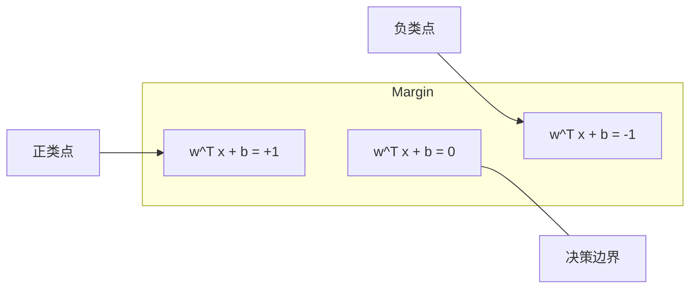
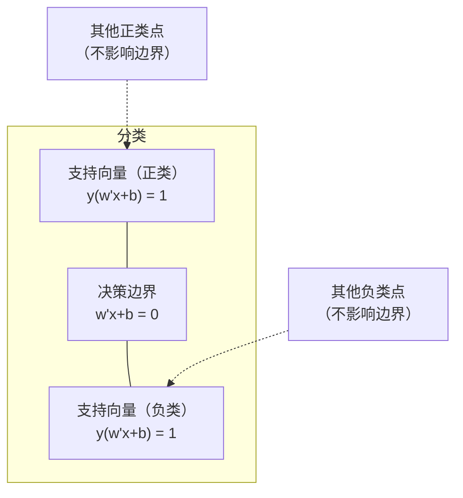
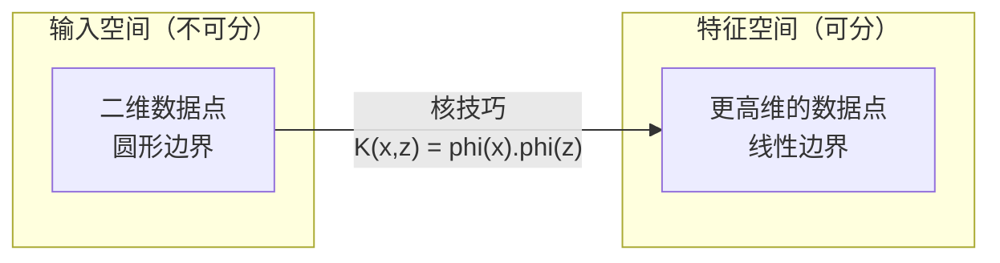

# 支持向量机

> 在两个类别之间找出最宽的街道，这就是支持向量机的全部思想。

**Type:** Build
**Language:** Python
**Prerequisites:** Phase 1 (Lessons 08 Optimization, 14 Norms and Distances, 18 Convex Optimization)
**Time:** ~90 minutes

## 学习目标

- 使用铰链损失和原始形式上的梯度下降，从零实现线性 SVM
- 解释最大间隔原理，并从训练好的模型中识别支持向量
- 比较线性核、多项式核和 RBF 核，并解释核技巧如何避免显式的高维映射
- 评估 C 参数在间隔宽度与分类错误之间控制的权衡

## 问题

你有两类数据点，需要画一条直线（或超平面）将它们分开。能够完成分隔的直线有无数条，应该选择哪一条？

选择间隔最大的那一条。间隔是决策边界与两侧最近数据点之间的距离。间隔越宽，分类器越有把握，也越能泛化到未见过的数据。

这一直觉引出了支持向量机，它是机器学习中数学形式最优雅的算法之一。在深度学习兴起之前，SVM 是主导性的分类方法；对于小型数据集、高维数据，以及需要原理清晰、易于理解并具有理论保证的模型时，它至今仍是最佳选择。

SVM 与第 1 阶段直接相连：其优化问题是凸的（第 18 课），间隔用范数衡量（第 14 课），核技巧则利用点积处理非线性边界，无需真正进入高维空间计算。

## 核心概念

### 最大间隔分类器

给定标签 y_i 属于 {-1, +1}、特征向量为 x_i 的线性可分数据，我们希望找到一个能够分隔类别的超平面 w^T x + b = 0。

点 x_i 到超平面的距离为：

```
distance = |w^T x_i + b| / ||w||
```

对于正确分类的点：y_i * (w^T x_i + b) > 0。间隔等于超平面到任一侧最近点距离的两倍。



优化问题如下：

```
maximize    2 / ||w||     (the margin width)
subject to  y_i * (w^T x_i + b) >= 1  for all i
```

等价形式如下（最小化 ||w||^2 更容易优化）：

```
minimize    (1/2) ||w||^2
subject to  y_i * (w^T x_i + b) >= 1  for all i
```

这是一个凸二次规划问题，具有唯一的全局解。恰好位于间隔边界上（即 y_i * (w^T x_i + b) = 1）的数据点就是支持向量。只有这些点决定决策边界；移动或删除任何非支持向量点，都不会改变边界。

### 支持向量：关键的少数点



大多数训练点都无关紧要，只有支持向量真正起作用。这就是 SVM 在预测时内存效率很高的原因：只需存储支持向量，而不必保存整个训练集。

支持向量的数量还能给出泛化误差的界。相对于数据集规模，支持向量越少，泛化能力越好。

### 软间隔：使用 C 参数处理噪声

真实数据很少能完美分隔。有些点可能位于边界错误的一侧，或落在间隔之内。软间隔形式通过引入松弛变量来允许这些违例。

```
minimize    (1/2) ||w||^2 + C * sum(xi_i)
subject to  y_i * (w^T x_i + b) >= 1 - xi_i
            xi_i >= 0  for all i
```

松弛变量 xi_i 衡量点 i 违反间隔约束的程度。C 控制以下权衡：

| C 值 | 行为 |
|---------|----------|
| 较大的 C | 严厉惩罚违例。间隔窄、误分类少，容易过拟合 |
| 较小的 C | 允许更多违例。间隔宽、误分类多，容易欠拟合 |

C 与正则化强度成反比。C 越大，正则化越弱；C 越小，正则化越强。

### 铰链损失：SVM 的损失函数

软间隔 SVM 可以改写为无约束优化问题：

```
minimize    (1/2) ||w||^2 + C * sum(max(0, 1 - y_i * (w^T x_i + b)))
```

max(0, 1 - y_i * f(x_i)) 这一项就是铰链损失。当数据点被正确分类且位于间隔之外时，损失为零；当数据点位于间隔之内或被错误分类时，损失呈线性增长。

```
Hinge loss for a single point:

loss
  |
  | \
  |  \
  |   \
  |    \
  |     \_______________
  |
  +-----|-----|-------->  y * f(x)
       0     1

Zero loss when y*f(x) >= 1 (correctly classified, outside margin).
Linear penalty when y*f(x) < 1.
```

将其与逻辑损失（逻辑回归）比较：

```
Hinge:     max(0, 1 - y*f(x))          Hard cutoff at margin
Logistic:  log(1 + exp(-y*f(x)))        Smooth, never exactly zero
```

铰链损失会产生稀疏解（只有支持向量的贡献非零），而逻辑损失会使用所有数据点。因此，SVM 在预测时更节省内存。

### 使用梯度下降训练线性 SVM

可以对铰链损失加 L2 正则化后使用梯度下降来训练线性 SVM，而无需求解有约束的二次规划：

```
L(w, b) = (lambda/2) * ||w||^2 + (1/n) * sum(max(0, 1 - y_i * (w^T x_i + b)))

Gradient with respect to w:
  If y_i * (w^T x_i + b) >= 1:  dL/dw = lambda * w
  If y_i * (w^T x_i + b) < 1:   dL/dw = lambda * w - y_i * x_i

Gradient with respect to b:
  If y_i * (w^T x_i + b) >= 1:  dL/db = 0
  If y_i * (w^T x_i + b) < 1:   dL/db = -y_i
```

这称为原始形式。每轮运行复杂度为 O(n * d)，其中 n 是样本数，d 是特征数。对于大型、稀疏、高维的数据（如文本分类），这种方法速度很快。

### 对偶形式与核技巧

SVM 问题的拉格朗日对偶（参见第 1 阶段第 18 课的 KKT 条件）为：

```
maximize    sum(alpha_i) - (1/2) * sum_ij(alpha_i * alpha_j * y_i * y_j * (x_i . x_j))
subject to  0 <= alpha_i <= C
            sum(alpha_i * y_i) = 0
```

对偶形式只涉及数据点之间的点积 x_i . x_j，这正是关键所在。将每个点积替换为核函数 K(x_i, x_j)，SVM 就能学习非线性边界，而无需显式计算变换。

```
Linear kernel:      K(x, z) = x . z
Polynomial kernel:  K(x, z) = (x . z + c)^d
RBF (Gaussian):     K(x, z) = exp(-gamma * ||x - z||^2)
```

RBF 核将数据映射到无限维空间。在输入空间中距离较近的点，其核值接近 1；距离较远的点，其核值接近 0。它能够学习任意平滑的决策边界。



核技巧无需真正进入高维空间，就能计算其中的点积。对于 D 维空间中的 d 次多项式核，显式特征空间有 O(D^d) 个维度，但计算 K(x, z) 只需 O(D) 时间。

### 用于回归的 SVM（SVR）

支持向量回归会在数据周围拟合一条宽度为 epsilon 的管道。管道内的数据点损失为零，管道外的数据点受到线性惩罚。

```
minimize    (1/2) ||w||^2 + C * sum(xi_i + xi_i*)
subject to  y_i - (w^T x_i + b) <= epsilon + xi_i
            (w^T x_i + b) - y_i <= epsilon + xi_i*
            xi_i, xi_i* >= 0
```

epsilon 参数控制管道宽度。管道越宽，支持向量越少，拟合越平滑；管道越窄，支持向量越多，拟合越紧密。

### SVM 为何输给深度学习（以及何时仍能胜出）

从 20 世纪 90 年代末到 2010 年代初，SVM 一直主导着机器学习。随后深度学习凭借以下原因超越了它：

| 因素 | SVM | 深度学习 |
|--------|------|---------------|
| 特征工程 | 需要 | 自动学习特征 |
| 可扩展性 | 核方法为 O(n^2) 到 O(n^3) | 使用 SGD 时每轮为 O(n) |
| 图像/文本/音频 | 需要手工特征 | 从原始数据中学习 |
| 大型数据集（超过 10 万条） | 速度慢 | 扩展性好 |
| GPU 加速 | 收益有限 | 大幅提速 |

SVM 在以下场景中仍有优势：
- 小型数据集（数百到数千个样本）
- 高维稀疏数据（使用 TF-IDF 特征的文本）
- 需要数学保证时（间隔界）
- 训练时间必须尽可能短时（线性 SVM 非常快）
- 具有清晰间隔结构的二分类
- 异常检测（单类 SVM）

```figure
svm-margin
```

## 动手构建

### 第 1 步：铰链损失与梯度

这是实现基础。计算一个批次的铰链损失及其梯度。

```python
def hinge_loss(X, y, w, b):
    n = len(X)
    total_loss = 0.0
    for i in range(n):
        margin = y[i] * (dot(w, X[i]) + b)
        total_loss += max(0.0, 1.0 - margin)
    return total_loss / n
```

### 第 2 步：通过梯度下降实现线性 SVM

通过最小化正则化铰链损失进行训练，无需二次规划求解器。

```python
class LinearSVM:
    def __init__(self, lr=0.001, lambda_param=0.01, n_epochs=1000):
        self.lr = lr
        self.lambda_param = lambda_param
        self.n_epochs = n_epochs
        self.w = None
        self.b = 0.0

    def fit(self, X, y):
        n_features = len(X[0])
        self.w = [0.0] * n_features
        self.b = 0.0

        for epoch in range(self.n_epochs):
            for i in range(len(X)):
                margin = y[i] * (dot(self.w, X[i]) + self.b)
                if margin >= 1:
                    self.w = [wj - self.lr * self.lambda_param * wj
                              for wj in self.w]
                else:
                    self.w = [wj - self.lr * (self.lambda_param * wj - y[i] * X[i][j])
                              for j, wj in enumerate(self.w)]
                    self.b -= self.lr * (-y[i])

    def predict(self, X):
        return [1 if dot(self.w, x) + self.b >= 0 else -1 for x in X]
```

### 第 3 步：核函数

实现线性核、多项式核和 RBF 核。

```python
def linear_kernel(x, z):
    return dot(x, z)

def polynomial_kernel(x, z, degree=3, c=1.0):
    return (dot(x, z) + c) ** degree

def rbf_kernel(x, z, gamma=0.5):
    diff = [xi - zi for xi, zi in zip(x, z)]
    return math.exp(-gamma * dot(diff, diff))
```

### 第 4 步：识别间隔与支持向量

训练完成后，识别哪些点是支持向量，并计算间隔宽度。

```python
def find_support_vectors(X, y, w, b, tol=1e-3):
    support_vectors = []
    for i in range(len(X)):
        margin = y[i] * (dot(w, X[i]) + b)
        if abs(margin - 1.0) < tol:
            support_vectors.append(i)
    return support_vectors
```

包含所有演示的完整实现请参阅 `code/svm.py`。

## 实际应用

使用 scikit-learn：

```python
from sklearn.svm import SVC, LinearSVC, SVR
from sklearn.preprocessing import StandardScaler
from sklearn.pipeline import Pipeline

clf = Pipeline([
    ("scaler", StandardScaler()),
    ("svm", SVC(kernel="rbf", C=1.0, gamma="scale")),
])
clf.fit(X_train, y_train)
print(f"Accuracy: {clf.score(X_test, y_test):.4f}")
print(f"Support vectors: {clf['svm'].n_support_}")
```

注意：训练 SVM 前一定要缩放特征。SVM 对特征量级很敏感，因为间隔取决于 ||w||，未缩放的特征会扭曲几何结构。

对于大型数据集，应使用 `LinearSVC`（原始形式，每轮 O(n)），而不是 `SVC`（对偶形式，O(n^2) 到 O(n^3)）：

```python
from sklearn.svm import LinearSVC

clf = Pipeline([
    ("scaler", StandardScaler()),
    ("svm", LinearSVC(C=1.0, max_iter=10000)),
])
```

## 练习

1. 生成一个二维线性可分数据集。训练 LinearSVM 并识别支持向量，验证支持向量就是最靠近决策边界的点。

2. 在有噪声的数据集上将 C 从 0.001 调整到 1000。绘制每个 C 值对应的决策边界，观察模型从宽间隔（欠拟合）向窄间隔（过拟合）的转变。

3. 创建类别边界为圆形（非线性）的数据集，展示线性 SVM 的失败。计算 RBF 核矩阵，并证明这些类别在核所诱导的特征空间中变得可分。

4. 在同一数据集上比较铰链损失与逻辑损失。训练线性 SVM 和逻辑回归，统计有多少训练点对各模型的决策边界有贡献（支持向量与所有点）。

5. 实现 SVR（epsilon 不敏感损失），并拟合 y = sin(x) + 噪声。在预测值周围绘制 epsilon 管道，并突出显示支持向量（管道外的点）。

## 关键术语

| 术语 | 实际含义 |
|------|----------------------|
| 支持向量 | 最靠近决策边界的训练点，也是决定超平面的唯一数据点 |
| 间隔 | 决策边界与最近支持向量之间的距离，SVM 会将其最大化 |
| 铰链损失 | max(0, 1 - y*f(x))。正确分类且位于间隔外时为零，否则施加线性惩罚 |
| C 参数 | 控制间隔宽度与分类错误之间的权衡。C 大表示间隔窄，C 小表示间隔宽 |
| 软间隔 | 通过松弛变量允许违反间隔约束的 SVM 形式，用于处理线性不可分数据 |
| 核技巧 | 无需显式映射到高维特征空间，就能计算该空间中的点积 |
| 线性核 | K(x, z) = x . z，等价于标准点积，适用于线性可分数据 |
| RBF 核 | K(x, z) = exp(-gamma * \|\|x-z\|\|^2)，映射到无限维空间，能够学习任意平滑边界 |
| 多项式核 | K(x, z) = (x . z + c)^d，映射到由多项式组合构成的特征空间 |
| 对偶形式 | 仅依赖数据点之间点积的 SVM 问题重写形式，使核方法成为可能 |
| SVR | 支持向量回归，在数据周围拟合 epsilon 管道，管道内的点损失为零 |
| 松弛变量 | xi_i：衡量数据点违反间隔约束的程度；正确分类且位于间隔外的点取值为零 |
| 最大间隔 | 选择使超平面到每个类别最近点的距离最大化的原则 |

## 延伸阅读

- [Vapnik：统计学习理论的本质（1995）](https://link.springer.com/book/10.1007/978-1-4757-3264-1)——SVM 与统计学习的奠基著作
- [Cortes 与 Vapnik：支持向量网络（1995）](https://link.springer.com/article/10.1007/BF00994018)——SVM 的原始论文
- [Platt：序列最小优化（1998）](https://www.microsoft.com/en-us/research/publication/sequential-minimal-optimization-a-fast-algorithm-for-training-support-vector-machines/)——让 SVM 训练真正实用的 SMO 算法
- [scikit-learn SVM 文档](https://scikit-learn.org/stable/modules/svm.html)——包含实现细节的实用指南
- [LIBSVM：支持向量机程序库](https://www.csie.ntu.edu.tw/~cjlin/libsvm/)——大多数 SVM 实现背后的 C++ 库
