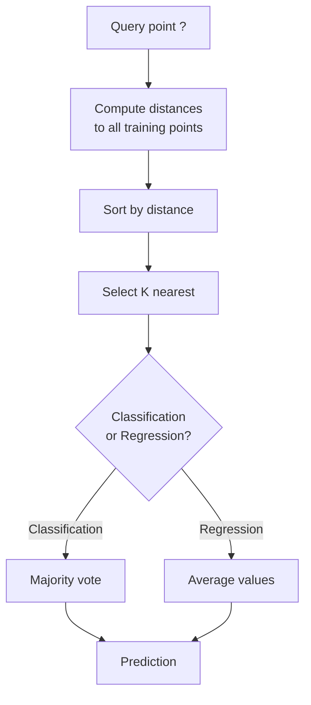
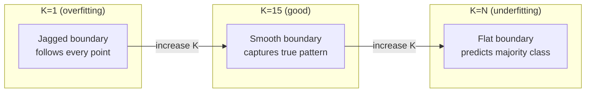
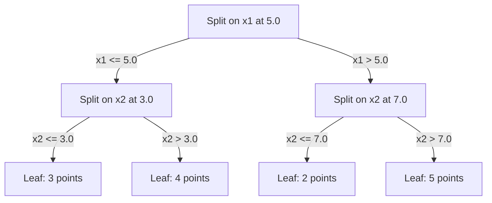

# K近邻与距离

> 保存所有数据。通过查看邻居进行预测。实际上能工作的最简单算法。

**类型:** 构建  
**语言:** Python  
**前提条件:** 第一阶段（第14课 范数与距离）  
**时间:** ~90分钟

## 学习目标

- 从头开始实现带可配置K值和距离加权投票的K近邻分类和回归
- 比较L1、L2、余弦和Minkowski距离度量，并为给定的数据类型选择适当的度量
- 解释维度灾难，并演示为什么K近邻在高维空间中性能下降
- 构建KD树以实现高效的最近邻搜索，并分析其何时优于暴力搜索

## 问题

你有一个数据集。一个新的数据点到达。你需要对它进行分类或预测其值。你不需要从数据中学习参数（如线性回归或SVM），而是找到与新点最接近的K个训练点，让它们进行投票。

这就是K近邻算法。没有训练阶段。没有需要学习的参数。没有需要最小化的损失函数。你保存整个训练集，并在预测时计算距离。

听起来太简单了，似乎无法奏效。但K近邻在许多问题中出人意料地具有竞争力，尤其是对小到中等规模的数据集，深入理解它揭示了基本概念：距离度量的选择（与第一阶段第14课相关）、维度灾难，以及懒惰学习与积极学习之间的区别。

K近邻在现代AI中无处不在，只是名称不同而已。向量数据库在嵌入上执行K近邻搜索。检索增强生成（RAG）查找K个最接近的文档块。推荐系统查找相似的用户或物品。算法是相同的。规模和数据结构不同。

## 概念

### K近邻的工作原理

给定一个带标签点的数据集和一个新的查询点：

1. 计算查询点与数据集中每个点之间的距离
2. 按距离排序
3. 取出K个最近的点
4. 对于分类：对K个邻居进行多数投票
5. 对于回归：对K个邻居的值进行平均（或加权平均）



这就是整个算法。没有任何拟合。没有任何梯度下降。没有任何训练轮次。

### 选择 K

K 是唯一的超参数。它控制偏差-方差的权衡：

| K | 行为 |
|---|-----|
| K = 1 | 决策边界跟随每一个点。训练误差为零。高方差。过拟合 |
| 小 K（3-5） | 对局部结构敏感。可以捕捉复杂的边界 |
| 大 K | 边界更平滑。对噪声更鲁棒。可能会欠拟合 |
| K = N | 对每一个点都预测多数类。最大偏差 |

一个常见的起点是对于包含 N 个点的数据集，K = sqrt(N)。在二分类中使用奇数的 K 以避免平票。



### 距离度量

距离函数定义了“近”的含义。不同的度量方式会产生不同的邻居，不同的预测结果。

**L2（欧几里得）** 是默认的。直线距离。

```
d(a, b) = sqrt(sum((a_i - b_i)^2))
```

对特征尺度敏感。在使用 L2 与 KNN 时，始终要对特征进行标准化。

**L1（曼哈顿）** 计算绝对差异之和。与 L2 相比，对异常值更鲁棒，因为它不会对差异进行平方。

```
d(a, b) = sum(|a_i - b_i|)
```**余弦距离** 测量向量之间的角度，忽略幅度。对于文本和嵌入数据至关重要。

```
d(a, b) = 1 - (a . b) / (||a|| * ||b||)
```**Minkowski** 用参数 p 一般化了 L1 和 L2。

```
d(a, b) = (sum(|a_i - b_i|^p))^(1/p)

p=1: Manhattan
p=2: Euclidean
p->inf: Chebyshev (max absolute difference)
```

使用哪种度量标准取决于数据：

| 数据类型 | 最佳度量标准 | 原因 |
|---------|--------------|------|
| 数值特征，相似量级 | L2（欧几里得） | 默认，适用于空间数据 |
| 数值特征，存在异常值 | L1（曼哈顿） | 稳健，不会放大大的差异 |
| 文本嵌入 | 余弦 | 幅度是噪声，方向是意义 |
| 高维稀疏 | 余弦或L1 | L2会受到维度灾难的影响 |
| 混合类型 | 自定义距离 | 按特征类型组合度量标准 |

### 加权KNN

标准KNN给所有K个邻居赋予相同的权重。但距离为0.1的邻居应该比距离为5.0的邻居更重要。

**距离加权KNN** 按距离的倒数对每个邻居进行加权：

```
weight_i = 1 / (distance_i + epsilon)

For classification: weighted vote
For regression:     weighted average = sum(w_i * y_i) / sum(w_i)
```epsilon 用于防止当查询点恰好与训练点匹配时出现除以零的情况。

加权 KNN 对 K 的选择不太敏感，因为无论 K 的值如何，远处的邻居对结果的贡献都非常小。

### 维度灾难

KNN 在高维空间中的性能会下降。这不是一个模糊的担忧，而是一个数学事实。

**问题 1：距离趋于收敛。** 随着维度的增加，最大距离与最小距离的比值趋于 1。所有点都变得与查询点一样“远”。

```
In d dimensions, for random uniform points:

d=2:    max_dist / min_dist = varies widely
d=100:  max_dist / min_dist ~ 1.01
d=1000: max_dist / min_dist ~ 1.001

When all distances are nearly equal, "nearest" is meaningless.
```**问题 2：体积膨胀。** 为了在数据的一个固定比例内捕获 K 个邻居，你需要将搜索半径扩展到覆盖特征空间的更大比例。在高维空间中，“邻域”几乎涵盖了整个空间。

**问题 3：角落主导。** 在 d 维单位超立方体中，大部分体积集中在角落附近，而不是中心。随着 d 增加，内切于立方体的球体所包含的体积比例趋于消失。

实际影响：KNN 在最多约 20-50 个特征时表现良好。超过这个范围后，在应用 KNN 之前需要进行降维（如 PCA、UMAP、t-SNE），或者需要使用基于树的搜索结构，以利用数据内在的低维特性。

### KD 树：快速最近邻搜索

暴力 KNN 计算查询点到每个训练点的距离。每次查询的复杂度为 O(n * d)。对于大型数据集，这种方法太慢。

KD 树沿特征轴递归地划分空间。在每一层，它沿着一个维度在中位数处进行划分。



要找到最近邻，遍历树直到包含查询点的叶节点，然后回溯并仅检查可能包含更近点的邻近区域。

平均查询时间：低维情况下为 O(log n)。但是，KD-树在高维情况下（d > 20）会退化到 O(n)，因为回溯过程消除的分支越来越少。

### 球树：适合中等维度

球树将数据划分为嵌套的超球体，而不是轴对齐的矩形。每个节点定义一个球（中心 + 半径），包含该子树中的所有点。

相比 KD-树的优势：
- 在中等维度（最多约 50）表现更好
- 可以处理非轴对齐的结构
- 紧密的边界体积意味着搜索过程中可以剪枝更多的分支

KD-树和球树都是精确算法。对于真正的大规模搜索（数百万个点，数百个维度），会使用近似最近邻方法（HNSW、IVF、乘积量化）代替。这些内容将在第一阶段第十四课中讲解。

### 懒惰学习 vs 懒惰学习

KNN 是一个懒惰学习者：在训练时不做任何工作，所有工作都在预测时完成。其他大多数算法（线性回归、支持向量机、神经网络）是积极学习者：在训练时进行大量计算以构建一个紧凑的模型，然后预测速度很快。

| 方面 | 懒惰（KNN） | 积极（SVM、神经网络） |
|------|-------------|------------------------|
| 训练时间 | O(1)，只需存储数据 | O(n * epochs) |
| 预测时间 | 每个查询 O(n * d) | O(d) 或 O(参数) |
| 预测时内存 | 存储整个训练集 | 仅存储模型参数 |
| 适应新数据 | 瞬间添加点 | 重新训练模型 |
| 决策边界 | 隐式，实时计算 | 显式，训练后固定 |

懒惰学习适合以下情况：
- 数据集频繁变化（无需重新训练即可添加/删除点）
- 仅需要对少量查询进行预测
- 需要零训练时间
- 数据集足够小，暴力搜索很快

### 回归中的 KNN

与多数投票不同，回归中的 KNN 对 K 个邻居的目标值取平均。

```
prediction = (1/K) * sum(y_i for i in K nearest neighbors)

Or with distance weighting:
prediction = sum(w_i * y_i) / sum(w_i)
where w_i = 1 / distance_i
```KNN回归生成分段常数（或通过加权生成分段平滑）的预测。它无法对训练数据范围之外的数据进行外推。如果训练目标都在0到100之间，KNN将永远不会预测200。

```figure
knn-smoothness
```

## 构建它

### 第一步：距离函数

实现 L1、L2、余弦和 Minkowski 距离。这些内容直接连接到第一阶段第十四课。

```python
import math

def l2_distance(a, b):
    return math.sqrt(sum((ai - bi) ** 2 for ai, bi in zip(a, b)))

def l1_distance(a, b):
    return sum(abs(ai - bi) for ai, bi in zip(a, b))

def cosine_distance(a, b):
    dot_val = sum(ai * bi for ai, bi in zip(a, b))
    norm_a = math.sqrt(sum(ai ** 2 for ai in a))
    norm_b = math.sqrt(sum(bi ** 2 for bi in b))
    if norm_a == 0 or norm_b == 0:
        return 1.0
    return 1.0 - dot_val / (norm_a * norm_b)

def minkowski_distance(a, b, p=2):
    if p == float('inf'):
        return max(abs(ai - bi) for ai, bi in zip(a, b))
    return sum(abs(ai - bi) ** p for ai, bi in zip(a, b)) ** (1 / p)
```

### 步骤 2：KNN 分类器和回归器

构建完整的 KNN，支持可配置的 K 值、距离度量方式以及可选的距离加权。

```python
class KNN:
    def __init__(self, k=5, distance_fn=l2_distance, weighted=False,
                 task="classification"):
        self.k = k
        self.distance_fn = distance_fn
        self.weighted = weighted
        self.task = task
        self.X_train = None
        self.y_train = None

    def fit(self, X, y):
        self.X_train = X
        self.y_train = y

    def predict(self, X):
        return [self._predict_one(x) for x in X]
```

### 步骤 3：KD-tree 用于高效搜索

从零开始构建一个 KD-tree，该树递归地根据每个维度的中位数进行分割。

```python
class KDTree:
    def __init__(self, X, indices=None, depth=0):
        # Recursively partition the data
        self.axis = depth % len(X[0])
        # Split on median of the current axis
        ...

    def query(self, point, k=1):
        # Traverse to leaf, then backtrack
        ...
```

请参见 `code/knn.py` 以查看包含所有辅助方法和演示的完整实现。

### 步骤 4：特征缩放

KNN 需要特征缩放，因为距离对特征的幅度敏感。范围从 0 到 1000 的特征将主导范围从 0 到 1 的特征。

```python
def standardize(X):
    n = len(X)
    d = len(X[0])
    means = [sum(X[i][j] for i in range(n)) / n for j in range(d)]
    stds = [
        max(1e-10, (sum((X[i][j] - means[j]) ** 2 for i in range(n)) / n) ** 0.5)
        for j in range(d)
    ]
    return [[((X[i][j] - means[j]) / stds[j]) for j in range(d)] for i in range(n)], means, stds
```

## 使用它

使用 scikit-learn:

```python
from sklearn.neighbors import KNeighborsClassifier
from sklearn.preprocessing import StandardScaler
from sklearn.pipeline import Pipeline

clf = Pipeline([
    ("scaler", StandardScaler()),
    ("knn", KNeighborsClassifier(n_neighbors=5, metric="euclidean")),
])
clf.fit(X_train, y_train)
print(f"Accuracy: {clf.score(X_test, y_test):.4f}")
```Scikit-learn 在数据集足够大且维度足够低时，会自动使用 KD 树或球树。对于高维数据，它会退回到暴力搜索。你可以通过 `algorithm` 参数来控制这一点。

对于大规模最近邻搜索（数百万个向量），请使用 FAISS、Annoy 或向量数据库：

```python
import faiss

index = faiss.IndexFlatL2(dimension)
index.add(embeddings)
distances, indices = index.search(query_vectors, k=5)
```

## 练习

1. 在一个具有3个类别的2D数据集上实现KNN分类。绘制K=1、K=5、K=15和K=N的决策边界。观察从过拟合到欠拟合的转变。

2. 在2、5、10、50、100和500维空间中生成1000个随机点。对于每个维度，计算最大成对距离与最小成对距离的比率。绘制比率与维度的关系图，以可视化维度灾难。

3. 在文本分类问题上比较L1、L2和余弦距离用于KNN的效果（使用TF-IDF向量）。哪种度量方法的准确率最高？为什么余弦距离在文本分类中通常表现更好？

4. 实现KD树，并测量查询时间与暴力搜索在2D、10D和50D空间中包含1k、10k和100k点的数据集上的表现。在什么维度下KD树不再比暴力搜索更快？

5. 构建一个加权KNN回归器，用于y = sin(x) + 噪声。将其与未加权KNN进行比较，K=3、10、30。展示加权方法能产生更平滑的预测，尤其是在较大的K值时。

## 关键术语

| 术语 | 实际含义 |
|------|----------|
| K近邻 | 一种非参数算法，通过找到查询点的K个最近训练点来进行预测 |
| 懒惰学习 | 训练时不进行计算。所有工作在预测时完成。KNN是其典型例子 |
| 活跃学习 | 在训练时进行大量计算以构建一个紧凑的模型。大多数机器学习算法都是活跃学习 |
| 维度灾难 | 在高维空间中，距离趋于收敛，邻域扩展以覆盖大部分空间，使得KNN变得无效 |
| KD树 | 一种二叉树，沿特征轴递归划分空间。在低维空间中查询时间为O(log n) |
| 球树 | 由嵌套超球体组成的树。在中等维度（最多约50）上比KD树表现更好 |
| 加权KNN | 邻居按距离的倒数加权。更近的邻居对预测有更大的影响 |
| 特征缩放 | 将特征标准化为可比较的范围。对于基于距离的方法（如KNN）是必需的 |
| 多数投票 | 通过统计K个邻居中最常见的类别来进行分类 |
| 暴力搜索 | 计算到每个训练点的距离。每个查询的复杂度为O(n*d)。精确但对大n来说很慢 |
| 近似最近邻 | 算法（如HNSW、LSH、IVF）可以比精确搜索更快找到近似最近点 |
| Voronoi图 | 空间的划分，每个区域包含所有比其他任何训练点更接近一个训练点的点。K=1 KNN产生Voronoi边界 |

## 进一步阅读

- [Cover & Hart: Nearest Neighbor Pattern Classification (1967)](https://ieeexplore.ieee.org/document/1053964) - 原始的KNN论文，证明其误差率最多是贝叶斯最优的两倍
- [Friedman, Bentley, Finkel: An Algorithm for Finding Best Matches in Logarithmic Expected Time (1977)](https://dl.acm.org/doi/10.1145/355744.355745) - 原始的KD树论文
- [Beyer et al.: When Is "Nearest Neighbor" Meaningful? (1999)](https://link.springer.com/chapter/10.1007/3-540-49257-7_15) - 对最近邻方法的维度灾难进行形式化分析
- [scikit-learn Nearest Neighbors documentation](https://scikit-learn.org/stable/modules/neighbors.html) - 算法选择的实用指南
- [FAISS: A Library for Efficient Similarity Search](https://github.com/facebookresearch/faiss) - Meta用于十亿级近似最近邻搜索的库
