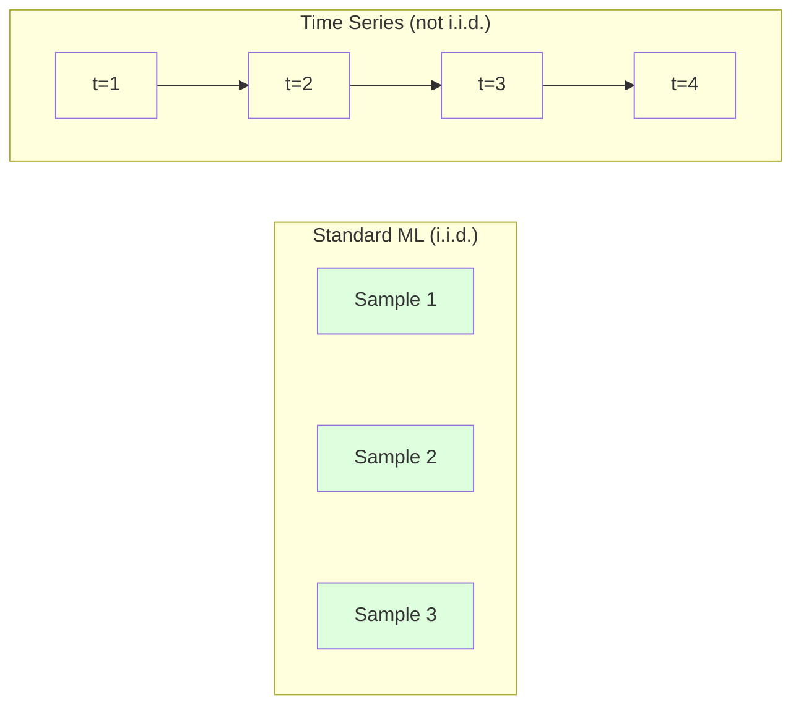

# 时间序列基础

> 过去的表现确实可以预测未来的结果——但前提是首先检查平稳性。

**类型:** 构建  
**语言:** Python  
**先决条件:** 第二阶段，第 01-09 课  
**时间:** ~90 分钟

## 学习目标

- 将时间序列分解为趋势、季节性和残差成分，并检验平稳性
- 实现滞后特征和滚动统计，将时间序列转换为监督学习问题
- 构建一个向前验证框架，防止未来数据泄露到训练集中
- 解释为什么随机划分训练/测试集对时间序列无效，并演示与正确时间划分的性能差距

## 问题

你拥有按时间排序的数据。每日销售额、每小时温度、每分钟CPU使用率、每周股票价格。你想要预测下一个值、下一周、下一季度的数值。

你尝试使用标准的机器学习工具包：随机划分训练/测试集、交叉验证、特征矩阵输入、预测输出。每一步都是错误的。

时间序列打破了标准机器学习所依赖的假设。样本不是独立的——今天的温度取决于昨天的。随机划分会将未来的信息泄露到过去。在回测中表现很好的特征在生产中会失败，因为它们依赖于随时间变化的模式。

一个在随机交叉验证中获得95%准确率的模型，可能在正确的时间评估中仅获得55%的准确率。这种差异不是技术细节。这是纸上可行的模型与生产中可行的模型之间的差异。

本课程涵盖基础内容：时间数据的不同之处、如何诚实地评估模型，以及如何将时间序列转换为标准机器学习模型可以使用的特征。

## 概念

### 使时间序列不同的因素

标准机器学习假设数据是i.i.d.（独立同分布）——每个样本都从相同的分布中独立抽取。时间序列违反了这两个假设：

- **不独立。** 今天的股价取决于昨天的。本周的销售额与上周的销售额相关。
- **不独立同分布。** 分布会随时间变化。12月的销售额与3月的销售额看起来不同。

这些违反是重大的。它们改变了你构建特征的方式、评估模型的方式，以及哪些算法是有效的。



在标准的机器学习中，样本是可互换的。将它们打乱顺序不会改变任何东西。在时间序列中，顺序至关重要。打乱顺序会破坏信号。

### 时间序列的组成部分

每一个时间序列都是以下部分的组合：

```mermaid
flowchart TD
    A[Observed Time Series] --> B[Trend]
    A --> C[Seasonality]
    A --> D[Residual/Noise]

    B --> E[Long-term direction: up, down, flat]
    C --> F[Repeating patterns: daily, weekly, yearly]
    D --> G[Random variation after removing trend and seasonality]
```- **趋势**: 长期方向。收入每年增长 10%。全球气温上升。
- **季节性**: 固定间隔内重复的模式。零售销售在 12 月激增。空调使用量在 7 月达到高峰。
- **残差**: 去除趋势和季节性后剩下的部分。如果残差看起来像白噪声，说明分解已经捕捉到了信号。

### 稳定性

如果一个时间序列的统计特性（均值、方差、自相关）不随时间变化，那么这个时间序列是稳定的。大多数预测方法都假设时间序列是稳定的。

**为什么重要**: 非稳定的时间序列均值会漂移。在 1 月训练的模型所学习到的均值与 2 月的均值不同。这会导致系统性错误。

**如何检查**: 计算窗口上的滚动均值和滚动标准差。如果它们漂移，说明时间序列是非稳定的。

**如何修复**: 差分。不要对原始值进行建模，而是对连续值之间的变化进行建模：

```
diff[t] = value[t] - value[t-1]
```

如果一轮差分后序列仍未平稳，可以再次进行差分（二阶差分）。大多数现实世界的序列最多只需要两轮差分即可。

**示例：**

原始序列：[100, 102, 106, 112, 120]
一阶差分：[2, 4, 6, 8]（仍呈上升趋势）
二阶差分：[2, 2, 2]（平稳）

原始序列具有二次趋势。一阶差分将其转化为一次趋势。二阶差分使其变为平稳。在实际应用中，很少需要超过两轮差分。

**正式检验：** 增广迪基-福勒（Augmented Dickey-Fuller, ADF）检验是平稳性的标准统计检验方法。原假设是“序列是非平稳的”。p值低于0.05意味着可以拒绝原假设并得出平稳的结论。我们不从零开始实现ADF（它需要渐近分布表），但代码中的滚动统计方法提供了一个实用的视觉检查。

### 自相关

自相关衡量时间t的值与时间t-k（k步之前）的值之间的相关程度。自相关函数（ACF）为每个滞后k绘制这种相关性。

**ACF告诉你：**
- 序列能记住多久。如果ACF在滞后5后降至零，那么超过5步之前的值就无关紧要。
- 是否存在季节性。如果ACF在滞后12（月度数据）处出现峰值，那么存在年度季节性。
- 应该创建多少滞后特征。使用ACF变得可以忽略不计之前的滞后。

**PACF（偏自相关函数）** 去除了间接相关性。如果今天与三天前的相关性仅仅是因为两者都与昨天相关，那么在滞后3的PACF将为零，而滞后3的ACF不会为零。

### 滞后特征：将时间序列转换为监督学习

标准的机器学习模型需要一个特征矩阵X和一个目标y。时间序列只给你一个值的列。桥梁是滞后特征。

以序列 [10, 12, 14, 13, 15] 为例，创建滞后1和滞后2特征：

| lag_2 | lag_1 | target |
|-------|-------|--------|
| 10    | 12    | 14     |
| 12    | 14    | 13     |
| 14    | 13    | 15     |

现在你有了一个标准的回归问题。任何机器学习模型（线性回归、随机森林、梯度提升）都可以从滞后特征预测目标。

可以构建的其他特征：
- **滚动统计：** 最近k个值的平均值、标准差、最小值、最大值
- **日历特征：** 星期几、月份、是否是节假日、是否是周末
- **差分值：** 与前一步的差异
- **扩展统计：** 累计平均值、累计总和
- **比率特征：** 当前值 / 滚动平均值（距离最近平均值的远近）
- **交互特征：** lag_1 * 星期几（工作日对动量的影响）

**应该使用多少滞后？** 使用自相关函数。如果ACF在滞后10处仍显著，至少使用10个滞后。如果有每周的季节性，包括滞后7（可能包括滞后14）。更多滞后会为模型提供更多的历史信息，但也会增加需要拟合的特征数量，增加过拟合的风险。

**目标对齐陷阱。** 创建滞后特征时，目标必须是时间t的值，而所有特征必须使用时间t-1或更早的值。如果你不小心将时间t的值作为特征，你将拥有一个完美的预测器——但这是一个完全无用的模型。这是时间序列特征工程中最常见的错误。

### 前向验证

这是本节课中最重要的概念。标准的k折交叉验证会随机分配样本到训练集和测试集。对于时间序列，这会泄露未来信息。

```mermaid
flowchart TD
    subgraph WRONG["Random Split (WRONG)"]
        direction LR
        W1[Jan] --> W2[Mar]
        W2 --> W3[Feb]
        W3 --> W4[May]
        W4 --> W5[Apr]
        style W1 fill:#fdd
        style W3 fill:#fdd
        style W5 fill:#fdd
        style W2 fill:#dfd
        style W4 fill:#dfd
    end

    subgraph RIGHT["Walk-Forward (CORRECT)"]
        direction LR
        R1["Train: Jan-Mar"] --> R2["Test: Apr"]
        R3["Train: Jan-Apr"] --> R4["Test: May"]
        R5["Train: Jan-May"] --> R6["Test: Jun"]
        style R1 fill:#dfd
        style R2 fill:#fdd
        style R3 fill:#dfd
        style R4 fill:#fdd
        style R5 fill:#dfd
        style R6 fill:#fdd
    end
```Walk-forward验证：
1. 使用到时间t的数据进行训练
2. 在时间t+1进行预测（或者t+1到t+k进行多步预测）
3. 滑动窗口
4. 重复

每个测试折叠只包含所有训练数据之后的数据。没有未来信息泄露。这可以给你一个关于模型部署时表现的诚实估计。

**扩展窗口** 使用所有历史数据进行训练（窗口增长）。**滑动窗口** 使用固定大小的训练窗口（窗口滑动）。当认为旧数据仍然相关时使用扩展窗口。当世界发生变化，旧数据有害时使用滑动窗口。

### ARIMA直觉

ARIMA是经典的时序模型。它有三个组成部分：

- **AR（自回归）：** 从过去值进行预测。AR(p)使用最后p个值。
- **I（差分）：** 差分以达到平稳性。I(d)应用d轮差分。
- **MA（移动平均）：** 从过去的预测误差进行预测。MA(q)使用最后q个误差。

ARIMA(p, d, q)结合了所有三个部分。你根据ACF/PACF分析或自动搜索（auto-ARIMA）来选择p, d, q。

我们不会从头开始实现ARIMA——它需要数值优化，这超出了本课的范围。关键的见解是理解每个组件的作用，这样你才能解释ARIMA的结果，并知道何时使用它。

### 何时使用什么

| 方法 | 最适合 | 处理季节性 | 处理外部特征 |
|------|--------|---------|----------|
| 滞后特征 + ML | 包含许多外部特征的表格数据 | 有日历特征 | 是 |
| ARIMA | 单变量时间序列，短期 | SARIMA变种 | 否（ARIMAX有限） |
| 指数平滑 | 简单趋势 + 季节性 | 是（Holt-Winters） | 否 |
| Prophet | 商业预测，节假日 | 是（傅里叶项） | 有限 |
| 神经网络（LSTM，Transformer） | 长序列，许多序列 | 学习 | 是 |

对于大多数实际问题，滞后特征 + 梯度提升是最佳的起点。它自然处理外部特征，不需要平稳性，且容易调试。

### 预测范围和策略

单步预测预测一个时间点。多步预测预测多个时间点。有三种策略：

**递归（迭代）：** 预测一步，然后将预测结果作为下一步的输入。简单但误差累积——每个预测都使用前一个预测，因此错误累积。

**直接：** 为每个预测范围训练一个单独的模型。模型1预测t+1，模型5预测t+5。没有误差累积，但每个模型的训练样本较少，它们不共享信息。

**多输出：** 训练一个模型，同时输出所有范围。在范围内共享信息，但需要一个支持多输出的模型（或自定义损失函数）。

对于大多数实际问题，短范围（1-5步）使用递归，长范围使用直接。

### 时间序列中的常见错误

| 错误 | 为什么会发生 | 如何修复 |
|------|---------|---------|
| 随机训练/测试分割 | 从标准机器学习的习惯 | 使用walk-forward或时间分割 |
| 使用未来特征 | 错误地在时间t包含特征 | 审查每个特征的时间对齐 |
| 过拟合季节性 | 模型记忆了日历模式 | 在测试集中保留一个完整的季节周期 |
| 忽略规模变化 | 收入翻倍但模式保持 | 模型预测百分比变化而不是绝对值 |
| 太多滞后特征 | “更多的历史更好” | 使用ACF确定相关滞后 |
| 不差分 | “模型会自己处理” | 树模型处理趋势；线性模型需要平稳性 |

## 构建它

`code/time_series.py`中的代码实现了从头开始的核心构建模块。

### 滞后特征创建器

```python
def make_lag_features(series, n_lags):
    n = len(series)
    X = np.full((n, n_lags), np.nan)
    for lag in range(1, n_lags + 1):
        X[lag:, lag - 1] = series[:-lag]
    valid = ~np.isnan(X).any(axis=1)
    return X[valid], series[valid]
```

这将一个1D序列转换为一个特征矩阵，其中每一行的最后`n_lags`个值作为特征，当前值作为目标。

### 走向前交叉验证

```python
def walk_forward_split(n_samples, n_splits=5, min_train=50):
    assert min_train < n_samples, "min_train must be less than n_samples"
    step = max(1, (n_samples - min_train) // n_splits)
    for i in range(n_splits):
        train_end = min_train + i * step
        test_end = min(train_end + step, n_samples)
        if train_end >= n_samples:
            break
        yield slice(0, train_end), slice(train_end, test_end)
```

每个分割确保训练数据严格在测试数据之前。随着每次折叠的进行，训练窗口会扩大。

### 简单的自回归模型

一个纯粹的自回归模型只是对滞后特征进行线性回归：

```python
class SimpleAR:
    def __init__(self, n_lags=5):
        self.n_lags = n_lags
        self.weights = None
        self.bias = None

    def fit(self, series):
        X, y = make_lag_features(series, self.n_lags)
        # Solve via normal equations
        X_b = np.column_stack([np.ones(len(X)), X])
        theta = np.linalg.lstsq(X_b, y, rcond=None)[0]
        self.bias = theta[0]
        self.weights = theta[1:]
        return self
```

这在概念上与第 02 课中的线性回归相同，但应用于同一变量的时间滞后版本。

### 稳态检查

该代码计算滚动统计量，以直观和数值方式评估稳态：

 /no_think

<>

This is conceptually identical to linear regression from Lesson 02, but applied to time-lagged versions of the same variable.

### Stationarity Check

The code computes rolling statistics to visually and numerically assess stationarity:

 /no_think

<>

This is conceptually identical to linear regression from Lesson 02, but applied to time-lagged versions of the same variable.

### Stationarity Check

The code computes rolling statistics to visually and numerically assess stationarity:

 /no_think

<>

This is conceptually identical to linear regression from Lesson 02, but applied to time-lagged versions of the same variable.

### Stationarity Check

The code computes rolling statistics to visually and numerically assess stationarity:

 /no_think

<>

This is conceptually identical to linear regression from Lesson 02, but applied to time-lagged versions of the same variable.

### Stationarity Check

The code computes rolling statistics to visually and numerically assess stationarity:

 /no_think

<>

This is conceptually identical to linear regression from Lesson 02, but applied to time-lagged versions of the same variable.

### Stationarity Check

The code computes rolling statistics to visually and numerically assess stationarity:

 /no_think

<>

This is conceptually identical to linear regression from Lesson 02, but applied to time-lagged versions of the same variable.

### Stationarity Check

The code computes rolling statistics to visually and numerically assess stationarity:

 /no_think

<>

This is conceptually identical to linear regression from Lesson 02, but applied to time-lagged versions of the same variable.

### Stationarity Check

The code computes rolling statistics to visually and numerically assess stationarity:

 /no_think

<>

This is conceptually identical to linear regression from Lesson 02, but applied to time-lagged versions of the same variable.

### Stationarity Check

The code computes rolling statistics to visually and numerically assess stationarity:

 /no_think

<>

This is conceptually identical to linear regression from Lesson 02, but applied to time-lagged versions of the same variable.

### Stationarity Check

The code computes rolling statistics to visually and numerically assess stationarity:

 /no_think

<>

This is conceptually identical to linear regression from Lesson 02, but applied to time-lagged versions of the same variable.

### Stationarity Check

The code computes rolling statistics to visually and numerically assess stationarity:

 /no_think

<>

This is conceptually identical to linear regression from Lesson 02, but applied to time-lagged versions of the same variable.

### Stationarity Check

The code computes rolling statistics to visually and numerically assess stationarity:

 /no_think

<>

This is conceptually identical to linear regression from Lesson 02, but applied to time-lagged versions of the same variable.

### Stationarity Check

The code computes rolling statistics to visually and numerically assess stationarity:

 /no_think

<>

This is conceptually identical to linear regression from Lesson 02, but applied to time-lagged versions of the same variable.

### Stationarity Check

The code computes rolling statistics to visually and numerically assess stationarity:

 /no_think

<>

This is conceptually identical to linear regression from Lesson 02, but applied to time-lagged versions of the same variable.

### Stationarity Check

The code computes rolling statistics to visually and numerically assess stationarity:

 /no_think

<>

This is conceptually identical to linear regression from Lesson 02, but applied to time-lagged versions of the same variable.

### Stationarity Check

The code computes rolling statistics to visually and numerically assess stationarity:

 /no_think

<>

This is conceptually identical to linear regression from Lesson 02, but applied to time-lagged versions of the same variable.

### Stationarity Check

The code computes rolling statistics to visually and numerically assess stationarity:

 /no_think

<>

This is conceptually identical to linear regression from Lesson 02, but applied to time-lagged versions of the same variable.

### Stationarity Check

The code computes rolling statistics to visually and numerically assess stationarity:

 /no_think

<>

This is conceptually identical to linear regression from Lesson 02, but applied to time-lagged versions of the same variable.

### Stationarity Check

The code computes rolling statistics to visually and numerically assess stationarity:

 /no_think

<>

This is conceptually identical to linear regression from Lesson 02, but applied to time-lagged versions of the same variable.

### Stationarity Check

The code computes rolling statistics to visually and numerically assess stationarity:

 /no_think

<>

This is conceptually identical to linear regression from Lesson 02, but applied to time-lagged versions of the same variable.

### Stationarity Check

The code computes rolling statistics to visually and numerically assess stationarity:

 /no_think

<>

This is conceptually identical to linear regression from Lesson 02, but applied to time-lagged versions of the same variable.

### Stationarity Check

The code computes rolling statistics to visually and numerically assess stationarity:

 /no_think

<>

This is conceptually identical to linear regression from Lesson 02, but applied to time-lagged versions of the same variable.

### Stationarity Check

The code computes rolling statistics to visually and numerically assess stationarity:

 /no_think

<>

This is conceptually identical to linear regression from Lesson 02, but applied to time-lagged versions of the same variable.

### Stationarity Check

The code computes rolling statistics to visually and numerically assess stationarity:

 /no_think

<>

This is conceptually identical to linear regression from Lesson 02, but applied to time-lagged versions of the same variable.

### Stationarity Check

The code computes rolling statistics to visually and numerically assess stationarity:

 /no_think

<>

This is conceptually identical to linear regression from Lesson 02, but applied to time-lagged versions of the same variable.

### Stationarity Check

The code computes rolling statistics to visually and numerically assess stationarity:

 /no_think

<>

This is conceptually identical to linear regression from Lesson 02, but applied to time-lagged versions of the same variable.

### Stationarity Check

The code computes rolling statistics to visually and numerically assess stationarity:

 /no_think

<>

This is conceptually identical to linear regression from Lesson 02, but applied to time-lagged versions of the same variable.

### Stationarity Check

The code computes rolling statistics to visually and numerically assess stationarity:

 /no_think

<>

This is conceptually identical to linear regression from Lesson 02, but applied to time-lagged versions of the same variable.

### Stationarity Check

The code computes rolling statistics to visually and numerically assess stationarity:

 /no_think

<>

This is conceptually identical to linear regression from Lesson 02, but applied to time-lagged versions of the same variable.

### Stationarity Check

The code computes rolling statistics to visually and numerically assess stationarity:

 /no_think

<>

This is conceptually identical to linear regression from Lesson 02, but applied to time-lagged versions of the same variable.

### Stationarity Check

The code computes rolling statistics to visually and numerically assess stationarity:

 /no_think

<>

This is conceptually identical to linear regression from Lesson 02, but applied to time-lagged versions of the same variable.

### Stationarity Check

The code computes rolling statistics to visually and numerically assess stationarity:

 /no_think

<>

This is conceptually identical to linear regression from Lesson 02, but applied to time-lagged versions of the same variable.

### Stationarity Check

The code computes rolling statistics to visually and numerically assess stationarity:

 /no_think

<>

This is conceptually identical to linear regression from Lesson 02, but applied to time-lagged versions of the same variable.

### Stationarity Check

The code computes rolling statistics to visually and numerically assess stationarity:

 /no_think

<>

This is conceptually identical to linear regression from Lesson 02, but applied to time-lagged versions of the same variable.

### Stationarity Check

The code computes rolling statistics to visually and numerically assess stationarity:

 /no_think

<>

This is conceptually identical to linear regression from Lesson 02, but applied to time-lagged versions of the same variable.

### Stationarity Check

The code computes rolling statistics to visually and numerically assess stationarity:

 /no_think

<>

This is conceptually identical to linear regression from Lesson 02, but applied to time-lagged versions of the same variable.

### Stationarity Check

The code computes rolling statistics to visually and numerically assess stationarity:

 /no_think

<>

This is conceptually identical to linear regression from Lesson 02, but applied to time-lagged versions of the same variable.

### Stationarity Check

The code computes rolling statistics to visually and numerically assess stationarity:

 /no_think

<>

This is conceptually identical to linear regression from Lesson 02, but applied to time-lagged versions of the same variable.

### Stationarity Check

The code computes rolling statistics to visually and numerically assess stationarity:

 /no_think

<>

This is conceptually identical to linear regression from Lesson 02, but applied to time-lagged versions of the same variable.

### Stationarity Check

The code computes rolling statistics to visually and numerically assess stationarity:

 /no_think

<>

This is conceptually identical to linear regression from Lesson 02, but applied to time-lagged versions of the same variable.

### Stationarity Check

The code computes rolling statistics to visually and numerically assess stationarity:

 /no_think

<>

This is conceptually identical to linear regression from Lesson 02, but applied to time-lagged versions of the same variable.

### Stationarity Check

The code computes rolling statistics to visually and numerically assess stationarity:

 /no_think

<>

This is conceptually identical to linear regression from Lesson 02, but applied to time-lagged versions of the same variable.

### Stationarity Check

The code computes rolling statistics to visually and numerically assess stationarity:

 /no_think

<>

This is conceptually identical to linear regression from Lesson 02, but applied to time-lagged versions of the same variable.

### Stationarity Check

The code computes rolling statistics to visually and numerically assess stationarity:

 /no_think

<>

This is conceptually identical to linear regression from Lesson 02, but applied to time-lagged versions of the same variable.

### Stationarity Check

The code computes rolling statistics to visually and numerically assess stationarity:

 /no_think

<>

This is conceptually identical to linear regression from Lesson 02, but applied to time-lagged versions of the same variable.

### Stationarity Check

The code computes rolling statistics to visually and numerically assess stationarity:

 /no_think

<>

This is conceptually identical to linear regression from Lesson 02, but applied to time-lagged versions of the same variable.

### Stationarity Check

The code computes rolling statistics to visually and numerically assess stationarity:

 /no_think

<>

This is conceptually identical to linear regression from Lesson 02, but applied to time-lagged versions of the same variable.

### Stationarity Check

The code computes rolling statistics to visually and numerically assess stationarity:

 /no_think

<>

This is conceptually identical to linear regression from Lesson 02, but applied to time-lagged versions of the same variable.

### Stationarity Check

The code computes rolling statistics to visually and numerically assess stationarity:

 /no_think

<>

This is conceptually identical to linear regression from Lesson 02, but applied to time-lagged versions of the same variable.

### Stationarity Check

The code computes rolling statistics to visually and numerically assess stationarity:

 /no_think

<>

This is conceptually identical to linear regression from Lesson 02, but applied to time-lagged versions of the same variable.

### Stationarity Check

The code computes rolling statistics to visually and numerically assess stationarity:

 /no_think

<>

This is conceptually identical to linear regression from Lesson 02, but applied to time-lagged versions of the same variable.

### Stationarity Check

The code computes rolling statistics to visually and numerically assess stationarity:

 /no_think

<>

This is conceptually identical to linear regression from Lesson 02, but applied to time-lagged versions of the same variable.

### Stationarity Check

The code computes rolling statistics to visually and numerically assess stationarity:

 /no_think

<>

This is conceptually identical to linear regression from Lesson 02, but applied to time-lagged versions of the same variable.

### Stationarity Check

The code computes rolling statistics to visually and numerically assess stationarity:

 /no_think

<>

This is conceptually identical to linear regression from Lesson 02, but applied to time-lagged versions of the same variable.

### Stationarity Check

The code computes rolling statistics to visually and numerically assess stationarity:

 /no_think

<>

This is conceptually identical to linear regression from Lesson 02, but applied to time-lagged versions of the same variable.

### Stationarity Check

The code computes rolling statistics to visually and numerically assess stationarity:

 /no_think

<>

This is conceptually identical to linear regression from Lesson 02, but applied to time-lagged versions of the same variable.

### Stationarity Check

The code computes rolling statistics to visually and numerically assess stationarity:

 /no_think

<>

This is conceptually identical to linear regression from Lesson 02, but applied to time-lagged versions of the same variable.

### Stationarity Check

The code computes rolling statistics to visually and numerically assess stationarity:

 /no_think

<>

This is conceptually identical to linear regression from Lesson 02, but applied to time-lagged versions of the same variable.

### Stationarity Check

The code computes rolling statistics to visually and numerically assess stationarity:

 /no_think

<>

This is conceptually identical to linear regression from Lesson 02, but applied to time-lagged versions of the same variable.

### Stationarity Check

The code computes rolling statistics to visually and numerically assess stationarity:

 /no_think

<>

This is conceptually identical to linear regression from Lesson 02, but applied to time-lagged versions of the same variable.

### Stationarity Check

The code computes rolling statistics to visually and numerically assess stationarity:

 /no_think

<>

This is conceptually identical to linear regression from Lesson 02, but applied to time-lagged versions of the same variable.

### Stationarity Check

The code computes rolling statistics to visually and numerically assess stationarity:

 /no_think

<>

This is conceptually identical to linear regression from Lesson 02, but applied to time-lagged versions of the same variable.

### Stationarity Check

The code computes rolling statistics to visually and numerically assess stationarity:

 /no_think

<>

This is conceptually identical to linear regression from Lesson 02, but applied to time-lagged versions of the same variable.

### Stationarity Check

The code computes rolling statistics to visually and numerically assess stationarity:

 /no_think

<>

This is conceptually identical to linear regression from Lesson 02, but applied to time-lagged versions of the same variable.

### Stationarity Check

The code computes rolling statistics to visually and numerically assess stationarity:

 /no_think

<>

This is conceptually identical to linear regression from Lesson 02, but applied to time-lagged versions of the same variable.

### Stationarity Check

The code computes rolling statistics to visually and numerically assess stationarity:

 /no_think

<>

This is conceptually identical to linear regression from Lesson 02, but applied to time-lagged versions of the same variable.

### Stationarity Check

The code computes rolling statistics to visually and numerically assess stationarity:

 /no_think

<>

This is conceptually identical to linear regression from Lesson 02, but applied to time-lagged versions of the same variable.

### Stationarity Check

The code computes rolling statistics to visually and numerically assess stationarity:

 /no_think

<>

This is conceptually identical to linear regression from Lesson 02, but applied to time-lagged versions of the same variable.

### Stationarity Check

The code computes rolling statistics to visually and numerically assess stationarity:

 /no_think

<>

This is conceptually identical to linear regression from Lesson 02, but applied to time-lagged versions of the same variable.

### Stationarity Check

The code computes rolling statistics to visually and numerically assess stationarity:

 /no_think

```python
def check_stationarity(series, window=50):
    rolling_mean = np.array([
        series[max(0, i - window):i].mean()
        for i in range(1, len(series) + 1)
    ])
    rolling_std = np.array([
        series[max(0, i - window):i].std()
        for i in range(1, len(series) + 1)
    ])
    return rolling_mean, rolling_std
```

如果滚动均值发生偏移或滚动标准差发生变化，则该序列是非平稳的。应用差分并再次检查。

代码还通过比较序列的前半部分和后半部分来检查平稳性。如果均值差异超过半个标准差，或方差比超过2倍，则该序列会被标记为非平稳。

### 自相关性

```python
def autocorrelation(series, max_lag=20):
    n = len(series)
    mean = series.mean()
    var = series.var()
    acf = np.zeros(max_lag + 1)
    for k in range(max_lag + 1):
        cov = np.mean((series[:n-k] - mean) * (series[k:] - mean))
        acf[k] = cov / var if var > 0 else 0
    return acf
```

## 使用方法

使用 sklearn，你可以直接将滞后特征与任何回归器一起使用：

```python
from sklearn.linear_model import Ridge
from sklearn.ensemble import GradientBoostingRegressor

X, y = make_lag_features(series, n_lags=10)

for train_idx, test_idx in walk_forward_split(len(X)):
    model = Ridge(alpha=1.0)
    model.fit(X[train_idx], y[train_idx])
    predictions = model.predict(X[test_idx])
```

对于 ARIMA，使用 statsmodels：

```python
from statsmodels.tsa.arima.model import ARIMA

model = ARIMA(train_series, order=(5, 1, 2))
fitted = model.fit()
forecast = fitted.forecast(steps=30)
```

`time_series.py` 中的代码演示了这两种方法，并使用前向验证进行比较。

### sklearn 时间序列分割

sklearn 提供了 `TimeSeriesSplit`，它实现了前向验证：

```python
from sklearn.model_selection import TimeSeriesSplit

tscv = TimeSeriesSplit(n_splits=5)
for train_index, test_index in tscv.split(X):
    X_train, X_test = X[train_index], X[test_index]
    y_train, y_test = y[train_index], y[test_index]
    model.fit(X_train, y_train)
    score = model.score(X_test, y_test)
```

这等同于我们从零开始实现的 `walk_forward_split`，但已集成到 sklearn 的交叉验证框架中。你可以用它与 `cross_val_score` 一起使用：

```python
from sklearn.model_selection import cross_val_score

scores = cross_val_score(model, X, y, cv=TimeSeriesSplit(n_splits=5))
print(f"Mean score: {scores.mean():.4f} +/- {scores.std():.4f}")
```

### 评估指标

时间序列预测使用回归指标，但带有时间感知的上下文：

- **MAE（平均绝对误差）：** |y_true - y_pred|的平均值。在原始单位中易于解释。“平均而言，预测偏差为3.2度。”
- **RMSE（均方根误差）：** 均方误差的平方根。比MAE对大误差的惩罚更大。当大误差比许多小误差更糟糕时使用。
- **MAPE（平均绝对百分比误差）：** |误差 / 真实值| * 100的平均值。与尺度无关，适用于不同序列之间的比较。但当真实值为零时无法定义。
- **朴素基线比较：** 始终与简单基线进行比较。季节性朴素基线预测一个周期前的值（昨天、上周）。如果模型无法击败朴素基线，说明有问题。

### 滚动特征

代码演示了如何向滞后特征添加滚动统计信息（7天和14天窗口的均值、标准差、最小值、最大值）。这些特征为模型提供了滞后特征本身无法捕捉的近期趋势和波动的信息。

例如，如果滚动均值在上升，表明有上升趋势。如果滚动标准差在增加，表明波动性在增长。这些是树模型可以学习但线性模型无法学习的模式。

## 部署它

本课内容包括：
- `outputs/prompt-time-series-advisor.md` -- 用于构建时间序列问题的提示
- `code/time_series.py` -- 滞后特征、向前验证、AR模型、平稳性检查

### 你必须超越的基线

在构建任何模型之前，先建立基线：

1. **最后值（持续性）：** 预测明天与今天相同。对于许多序列，这似乎难以超越。
2. **季节性朴素：** 预测今天与上周（或去年）的同一天相同。如果模型无法超越这一基线，说明模型除了季节性之外没有学到任何有用的模式。
3. **移动平均：** 预测最近k个值的平均值。虽然可以平滑噪声，但无法捕捉突然变化。

如果你的复杂机器学习模型输给季节性朴素基线，说明你有bug。最常见的原因：特征中存在未来泄漏、评估方法错误，或者序列本身是真正随机且不可预测的。

### 实用技巧

1. **从绘图开始：** 在任何建模之前，绘制原始序列。寻找趋势、季节性、异常值、结构性断点（行为突然变化）。30秒的视觉检查通常比一个小时的自动分析更有用。

2. **先差分，再建模：** 如果序列有明显趋势，创建滞后特征之前先进行差分。树模型可以处理趋势，但线性模型不能，差分从不会造成伤害。

3. **至少保留一个完整的季节周期：** 如果你有周季节性，测试集至少需要一个完整的周。如果是月，至少需要一个完整的月。否则无法评估模型是否捕捉到季节性模式。

4. **在生产中监控：** 随着世界的变化，时间序列模型会逐渐退化。跟踪预测误差，进行滚动评估。当误差开始增加时，使用最近的数据重新训练模型。

5. **注意制度变化：** 使用疫情前数据训练的模型无法预测疫情后的行为。将已知制度变化的指标作为特征，或使用遗忘旧数据的滑动窗口。

6. **对偏斜序列进行对数变换：** 收入、价格和数量通常右偏。对数变换可以稳定方差，并将乘法模式转换为加法模式，这适合线性模型。在对数空间中进行预测，然后指数化以返回原始单位。

## 练习

1. **平稳性实验：** 生成一个具有线性趋势的序列。使用滚动统计信息检查平稳性。进行一阶差分。再次检查。对具有二次趋势的序列需要多少轮差分才能使其平稳？

2. **滞后选择：** 对具有季节性的序列（周期=7）计算ACF。哪些滞后具有最高的自相关性？仅使用这些滞后创建滞后特征（不使用连续滞后）。与使用滞后1到7相比，准确率是否提高？

3. **向前验证 vs 随机划分：** 在滞后特征上训练一个岭回归。使用随机80/20划分和向前验证进行评估。随机划分对性能的估计高估了多少？

4. **特征工程：** 向滞后特征中添加滚动均值（窗口=7）、滚动标准差（窗口=7）和星期几特征。使用向前验证比较添加这些特征前后的准确性。

5. **多步预测：** 修改AR模型，预测5步而不是1步。比较两种策略：(a) 一步一步预测，使用预测结果作为下一步的输入（递归），(b) 为每个预测范围训练单独的模型（直接）。哪种方法更准确？

## 关键术语

| 术语 | 人们说 | 实际含义 |
|------|----------------|------------------------|
| 平稳性 | “统计量不随时间变化” | 一个序列的均值、方差和自相关结构在时间上是恒定的 |
| 差分 | “减去连续值” | 计算y[t] - y[t-1]以消除趋势并实现平稳性 |
| 自相关（ACF） | “序列如何与自身相关” | 时间序列与其滞后副本之间的相关性，作为滞后函数 |
| 偏自相关（PACF） | “仅直接相关” | 在去除所有较短滞后影响后，滞后k处的自相关 |
| 滞后特征 | “过去的值作为输入” | 使用y[t-1]、y[t-2]、...、y[t-k]作为特征来预测y[t] |
| 向前验证 | “时间尊重的交叉验证” | 评估时训练数据始终在测试数据之前按时间顺序 |
| ARIMA | “经典时间序列模型” | 自回归积分滑动平均：结合过去值（AR）、差分（I）和过去误差（MA） |
| 季节性 | “重复的日历模式” | 与日历周期（每日、每周、每年）相关的时间序列中的规律可预测周期 |
| 趋势 | “长期方向” | 时间序列水平的持续增加或减少 |
| 扩展窗口 | “使用所有历史” | 向前验证中训练集随每个折叠增长 |
| 滑动窗口 | “固定大小的历史” | 向前验证中训练集是一个固定长度的窗口，向前滑动 |

## 进一步阅读

- [Hyndman and Athanasopoulos, Forecasting: Principles and Practice (3rd ed.)](https://otexts.com/fpp3/) -- 时间序列预测的最佳免费教科书
- [scikit-learn Time Series Split](https://scikit-learn.org/stable/modules/generated/sklearn.model_selection.TimeSeriesSplit.html) -- sklearn的向前验证分割器
- [statsmodels ARIMA docs](https://www.statsmodels.org/stable/generated/statsmodels.tsa.arima.model.ARIMA.html) -- 带有诊断的ARIMA实现
- [Makridakis et al., The M5 Competition (2022)](https://www.sciencedirect.com/science/article/pii/S0169207021001874) -- 展示机器学习方法与统计方法的大规模预测竞赛
