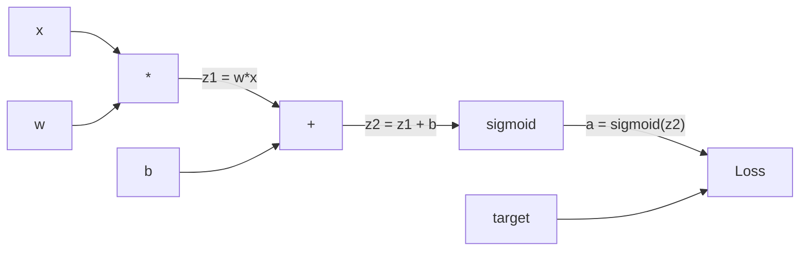
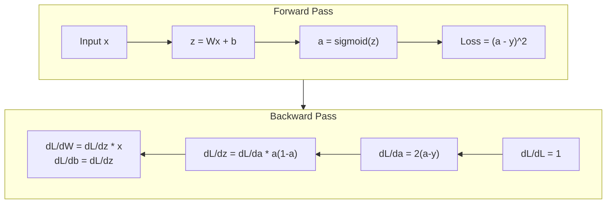
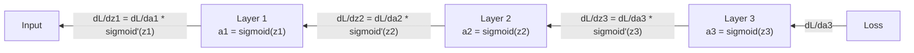

# 从零开始的反向传播

> 反向传播是使学习成为可能的算法。没有它，神经网络只是昂贵的随机数生成器。

**类型:** 构建  
**语言:** Python  
**先决条件:** 第03.02课（多层网络）  
**时间:** ~120分钟

## 学习目标

- 实现一个基于值的自动微分引擎，构建计算图并通过拓扑排序计算梯度
- 使用链式法则推导加法、乘法和sigmoid的反向传播
- 仅使用从零开始的反向传播引擎，在XOR和圆分类任务上训练多层网络
- 识别深度sigmoid网络中的梯度消失问题，并解释为什么梯度呈指数级缩小

## 问题

你的网络有一个隐藏层，输入为768个，输出为3072个。这总共有2,359,296个权重。它做出了一个错误的预测。哪些权重导致了这个错误？单独测试每个权重意味着需要进行230万次前向传播。反向传播可以在一次反向传播中计算所有230万个梯度。这不是优化，这是可训练和不可训练之间的区别。

天真的方法：选取一个权重，稍微调整它，再次运行前向传播，测量损失是否上升或下降。这可以给你这个权重的梯度。现在对网络中的每个权重都这样做。乘以数千次训练步骤和数百万个数据点。你将需要地质时代的时间才能训练出任何有用的东西。

反向传播解决了这个问题。一次前向传播，一次反向传播，所有梯度都计算出来。诀窍是将微积分中的链式法则系统地应用于计算图。这使得深度学习变得实用。没有它，我们仍将困在玩具问题中。

## 概念

### 应用于网络的链式法则

你在第一阶段的第5课中见过链式法则。快速回顾：如果 y = f(g(x))，那么 dy/dx = f'(g(x)) * g'(x)。你沿着链乘以导数。

在神经网络中，“链”是从输入到损失的一系列操作。每一层都应用权重，加上偏置，通过激活函数。损失函数将最终输出与目标进行比较。反向传播沿着这个链向后追踪，计算每个操作对误差的贡献。

### 计算图

每次前向传播都构建一个图。每个节点是一个操作（乘法、加法、sigmoid）。每条边在正向传播中携带值，在反向传播中携带梯度。



前向传播：值从左向右流动。x 和 w 生成 z1 = w*x。加上 b 得到 z2。Sigmoid 函数给出激活值 a。使用损失函数将 a 与目标 y 进行比较。

反向传播：梯度从右向左流动。从 dL/da 开始（损失如何随激活值变化）。乘以 da/dz2（Sigmoid 的导数）。这给出了 dL/dz2。拆分为 dL/db（等于 dL/dz2，因为 z2 = z1 + b）和 dL/dz1。然后 dL/dw = dL/dz1 * x，dL/dx = dL/dz1 * w。

在反向传播过程中，图中的每个节点都有一个任务：将来自上方的梯度乘以它的局部导数，然后传递下去。

### 前向与反向



前向传播会存储每一个中间值：z、a 以及每一层的输入。反向传播需要这些存储的值来计算梯度。这是反向传播的核心内存-计算权衡。你用内存（存储激活值）换取速度（一次传递而不是数百万次）。

### 梯度在网络中的流动

对于一个3层网络，梯度会通过每一层进行链式传递：



在每一层，梯度都会乘以sigmoid导数。sigmoid导数是*a*(1 - a)，其最大值为0.25（当a = 0.5时）。三层深度时，梯度最多被乘以0.25^3 = 0.0156。十层深度时：0.25^10 = 0.000001。

### 消失的梯度

这就是消失梯度问题。Sigmoid函数将输出压缩在0到1之间。它的导数始终小于0.25。堆叠足够多的sigmoid层会导致梯度缩小到几乎为零。早期层几乎无法学习，因为它们接收到的梯度接近于零。

```
sigmoid(z):     Output range [0, 1]
sigmoid'(z):    Max value 0.25 (at z = 0)

After 5 layers:   gradient * 0.25^5 = 0.001x original
After 10 layers:  gradient * 0.25^10 = 0.000001x original
```

这就是为什么深度sigmoid网络几乎难以训练的原因。解决方法——ReLU及其变体——是第04课的主题。目前，理解反向传播是完美运作的。问题在于它所处理的内容。

### 为两层网络推导梯度

具体数学推导，针对一个输入为x，隐藏层使用sigmoid激活函数，输出层也使用sigmoid激活函数，并且损失函数为均方误差（MSE）的网络。

前向传播：
 /no_think

<>

这是为什么深度 sigmoid 网络几乎难以训练的原因。解决方法——ReLU 及其变体——是第 04 课的主题。目前，理解反向传播是完美运作的。问题在于它所处理的内容。

### 为两层网络推导梯度

具体数学推导，针对一个输入为 x，隐藏层使用 sigmoid，输出层使用 sigmoid，损失函数为均方误差（MSE）的网络。

前向传播：

```
z1 = W1 * x + b1
a1 = sigmoid(z1)
z2 = W2 * a1 + b2
a2 = sigmoid(z2)
L = (a2 - y)^2
```

反向传播（逐步应用链式法则）：

```
dL/da2 = 2(a2 - y)
da2/dz2 = a2 * (1 - a2)
dL/dz2 = dL/da2 * da2/dz2 = 2(a2 - y) * a2 * (1 - a2)

dL/dW2 = dL/dz2 * a1
dL/db2 = dL/dz2

dL/da1 = dL/dz2 * W2
da1/dz1 = a1 * (1 - a1)
dL/dz1 = dL/da1 * da1/dz1

dL/dW1 = dL/dz1 * x
dL/db1 = dL/dz1
```

每个梯度都是从损失函数回溯到局部导数的乘积。这就是反向传播的全部内容。

```figure
backprop-vanishing
```

## 构建它

### 第一步：值节点

我们计算中的每个数字都成为一个 Value。它存储其数据、梯度以及它是如何被创建的（这样它就知道如何反向计算梯度）。

```python
class Value:
    def __init__(self, data, children=(), op=''):
        self.data = data
        self.grad = 0.0
        self._backward = lambda: None
        self._children = set(children)
        self._op = op

    def __repr__(self):
        return f"Value(data={self.data:.4f}, grad={self.grad:.4f})"
```

尚未有梯度（0.0）。尚未有反向函数（无操作）。`_children` 跟踪哪些 Values 产生了这个 Value，这样我们之后可以对图进行拓扑排序。

### 步骤 2：具有反向函数的操作

每个操作都会创建一个新的 Value，并定义梯度如何通过它反向流动。

```python
def __add__(self, other):
    other = other if isinstance(other, Value) else Value(other)
    out = Value(self.data + other.data, (self, other), '+')

    def _backward():
        self.grad += out.grad
        other.grad += out.grad

    out._backward = _backward
    return out

def __mul__(self, other):
    other = other if isinstance(other, Value) else Value(other)
    out = Value(self.data * other.data, (self, other), '*')

    def _backward():
        self.grad += other.data * out.grad
        other.grad += self.data * out.grad

    out._backward = _backward
    return out
```

对于加法：d(a+b)/da = 1，d(a+b)/db = 1。因此，两个输入都会直接获得输出的梯度。

对于乘法：d(a*b)/da = b，d(a*b)/db = a。每个输入会获得另一个输入的值乘以输出的梯度。

`+=` 是关键。一个 Value 可能会被用于多个操作。它的梯度是所有路径梯度的总和。

### 步骤 3：Sigmoid 和 Loss

```python
import math

def sigmoid(self):
    x = self.data
    x = max(-500, min(500, x))
    s = 1.0 / (1.0 + math.exp(-x))
    out = Value(s, (self,), 'sigmoid')

    def _backward():
        self.grad += (s * (1 - s)) * out.grad

    out._backward = _backward
    return out
```Sigmoid导数：sigmoid(x) * (1 - sigmoid(x))。我们在前向传播过程中计算了sigmoid(x) = s。重复使用它。无需额外工作。

```python
def mse_loss(predicted, target):
    diff = predicted + Value(-target)
    return diff * diff
```

单个输出的 MSE：(预测值 - 目标值)^2。我们将减法表示为带有负值的加法。

### 步骤 4：反向传播

拓扑排序确保我们按正确的顺序处理节点——在通过某个节点传播之前，它的梯度已经被完全累积。

```python
def backward(self):
    topo = []
    visited = set()

    def build_topo(v):
        if v not in visited:
            visited.add(v)
            for child in v._children:
                build_topo(child)
            topo.append(v)

    build_topo(self)
    self.grad = 1.0
    for v in reversed(topo):
        v._backward()
```

从损失开始（梯度 = 1.0，因为 dL/dL = 1）。按排序后的图向后遍历。每个节点的 `_backward` 将梯度传递给其子节点。

### 步骤 5：层和网络

```python
import random

class Neuron:
    def __init__(self, n_inputs):
        scale = (2.0 / n_inputs) ** 0.5
        self.weights = [Value(random.uniform(-scale, scale)) for _ in range(n_inputs)]
        self.bias = Value(0.0)

    def __call__(self, x):
        act = sum((wi * xi for wi, xi in zip(self.weights, x)), self.bias)
        return act.sigmoid()

    def parameters(self):
        return self.weights + [self.bias]


class Layer:
    def __init__(self, n_inputs, n_outputs):
        self.neurons = [Neuron(n_inputs) for _ in range(n_outputs)]

    def __call__(self, x):
        out = [n(x) for n in self.neurons]
        return out[0] if len(out) == 1 else out

    def parameters(self):
        params = []
        for n in self.neurons:
            params.extend(n.parameters())
        return params


class Network:
    def __init__(self, sizes):
        self.layers = []
        for i in range(len(sizes) - 1):
            self.layers.append(Layer(sizes[i], sizes[i + 1]))

    def __call__(self, x):
        for layer in self.layers:
            x = layer(x)
            if not isinstance(x, list):
                x = [x]
        return x[0] if len(x) == 1 else x

    def parameters(self):
        params = []
        for layer in self.layers:
            params.extend(layer.parameters())
        return params

    def zero_grad(self):
        for p in self.parameters():
            p.grad = 0.0
```

一个神经元接收输入，计算加权和加上偏置，然后应用sigmoid函数。权重初始化按sqrt(2/n_inputs)进行缩放，以防止在更深的网络中出现sigmoid饱和。一个层是一组神经元的列表。一个网络是一组层的列表。`parameters()`方法收集所有可学习的值，这样我们就可以更新它们。

### 步骤6：在XOR上进行训练

```python
random.seed(42)
net = Network([2, 4, 1])

xor_data = [
    ([0.0, 0.0], 0.0),
    ([0.0, 1.0], 1.0),
    ([1.0, 0.0], 1.0),
    ([1.0, 1.0], 0.0),
]

learning_rate = 1.0

for epoch in range(1000):
    total_loss = Value(0.0)
    for inputs, target in xor_data:
        x = [Value(i) for i in inputs]
        pred = net(x)
        loss = mse_loss(pred, target)
        total_loss = total_loss + loss

    net.zero_grad()
    total_loss.backward()

    for p in net.parameters():
        p.data -= learning_rate * p.grad

    if epoch % 100 == 0:
        print(f"Epoch {epoch:4d} | Loss: {total_loss.data:.6f}")

print("\nXOR Results:")
for inputs, target in xor_data:
    x = [Value(i) for i in inputs]
    pred = net(x)
    print(f"  {inputs} -> {pred.data:.4f} (expected {target})")
```

观察损失值的下降。从随机预测到正确的 XOR 输出，完全由反向传播计算梯度并调整权重方向驱动。

### 第 7 步：圆分类

在第 02 课中，你手动调整了圆分类的权重。现在让网络自行学习这些权重。

```python
random.seed(7)

def generate_circle_data(n=100):
    data = []
    for _ in range(n):
        x1 = random.uniform(-1.5, 1.5)
        x2 = random.uniform(-1.5, 1.5)
        label = 1.0 if x1 * x1 + x2 * x2 < 1.0 else 0.0
        data.append(([x1, x2], label))
    return data

circle_data = generate_circle_data(80)

circle_net = Network([2, 8, 1])
learning_rate = 0.5

for epoch in range(2000):
    random.shuffle(circle_data)
    total_loss_val = 0.0
    for inputs, target in circle_data:
        x = [Value(i) for i in inputs]
        pred = circle_net(x)
        loss = mse_loss(pred, target)
        circle_net.zero_grad()
        loss.backward()
        for p in circle_net.parameters():
            p.data -= learning_rate * p.grad
        total_loss_val += loss.data

    if epoch % 200 == 0:
        correct = 0
        for inputs, target in circle_data:
            x = [Value(i) for i in inputs]
            pred = circle_net(x)
            predicted_class = 1.0 if pred.data > 0.5 else 0.0
            if predicted_class == target:
                correct += 1
        accuracy = correct / len(circle_data) * 100
        print(f"Epoch {epoch:4d} | Loss: {total_loss_val:.4f} | Accuracy: {accuracy:.1f}%")
```

我们在这里使用在线 SGD -- 在每个样本之后更新权重，而不是累积整个批次。这可以更快地打破对称性，并避免在完整的损失景观上出现 sigmoid 饱和。每个 epoch 都对数据进行洗牌，可以防止网络记住数据的顺序。

不需要手动调整。网络自行发现圆形的决策边界。这就是反向传播的力量：你定义网络结构、损失函数和数据。算法会自动计算出权重。

## 使用方法

PyTorch 只需几行代码就可以实现上述所有操作。核心思想是一致的 -- autograd 在前向传播过程中构建计算图，并在反向传播过程中追踪它以计算梯度。

```python
import torch
import torch.nn as nn

model = nn.Sequential(
    nn.Linear(2, 4),
    nn.Sigmoid(),
    nn.Linear(4, 1),
    nn.Sigmoid(),
)
optimizer = torch.optim.SGD(model.parameters(), lr=1.0)
criterion = nn.MSELoss()

X = torch.tensor([[0,0],[0,1],[1,0],[1,1]], dtype=torch.float32)
y = torch.tensor([[0],[1],[1],[0]], dtype=torch.float32)

for epoch in range(1000):
    pred = model(X)
    loss = criterion(pred, y)
    optimizer.zero_grad()
    loss.backward()
    optimizer.step()

print("PyTorch XOR Results:")
with torch.no_grad():
    for i in range(4):
        pred = model(X[i])
        print(f"  {X[i].tolist()} -> {pred.item():.4f} (expected {y[i].item()})")
```

`loss.backward()` 是你的 `total_loss.backward()`。`optimizer.step()` 是你的手动 `p.data -= lr * p.grad`。`optimizer.zero_grad()` 是你的 `net.zero_grad()`。相同的算法，工业级的实现。PyTorch 处理 GPU 加速、混合精度、梯度检查点以及数百种层类型。但反向传播过程是应用在相同计算图上的相同链式法则。

训练过程运行前向传播，然后运行反向传播，然后更新权重。推理只运行前向传播。没有梯度，没有更新。这个区别很重要，因为推理是生产环境中发生的事情。当你调用像 Claude 或 GPT 这样的 API 时，你运行的是推理——你的提示通过网络向前传播，然后从另一端输出标记。权重不会改变。理解反向传播很重要，因为它塑造了网络中的每一个权重。

## 发布它

本课生成的内容包括：
- `outputs/prompt-gradient-debugger.md` -- 一个可重复使用的提示，用于诊断任何神经网络中的梯度问题（消失、爆炸、NaN）

## 练习

1. 向 Value 类添加一个 `__sub__` 方法（a - b = a + (-1 * b)）。然后实现一个 `__neg__` 方法。通过与手动计算比较，验证像 (a - b)^2 这样的简单表达式的梯度是否正确。

2. 向 Value 添加一个 `relu` 方法（输出 max(0, x)，导数是如果 x > 0 为 1，否则为 0）。在隐藏层中用 ReLU 替换 Sigmoid，再次在 XOR 上训练。比较收敛速度。你应该看到更快的训练——这预览了第 04 课。

3. 在 Value 上实现一个 `__pow__` 方法，用于整数幂。用它替换 `mse_loss` 为正确的 `(predicted - target) ** 2` 表达式。验证梯度是否与原始实现匹配。

4. 在训练循环中添加梯度裁剪：在调用 `backward()` 之后，将所有梯度裁剪到 [-1, 1]。训练一个更深的网络（4+ 层带 Sigmoid），并比较有无裁剪的损失曲线。这是你第一次防御梯度爆炸。

5. 构建一个可视化：在 XOR 上训练后，打印网络中每个参数的梯度。识别哪个层的梯度最小。这展示了你在概念部分读到的梯度消失问题。

## 关键术语

| 术语 | 人们常说 | 实际含义 |
|------|----------------|----------------------|
| 反向传播 | "网络在学习" | 一种算法，通过计算图的反向应用链式法则，为每个权重计算 dL/dw |
| 计算图 | "网络结构" | 一个有向无环图，其中节点是操作，边携带值（前向）和梯度（反向） |
| 链式法则 | "相乘导数" | 如果 y = f(g(x))，那么 dy/dx = f'(g(x)) * g'(x) —— 反向传播的数学基础 |
| 梯度 | "最陡上升的方向" | 损失相对于参数的偏导数 —— 告诉你如何改变参数以减少损失 |
| 梯度消失 | "深度网络不学习" | 梯度在通过具有饱和激活函数（如 Sigmoid）的层传播时指数级缩小 |
| 前向传播 | "运行网络" | 通过顺序应用每一层的操作，从输入计算输出并存储中间值 |
| 反向传播 | "计算梯度" | 反向遍历计算图，在每个节点使用链式法则累积梯度 |
| 学习率 | "学习速度" | 一个标量，控制更新权重时的步长：w_new = w_old - lr * gradient |
| 拓扑排序 | "正确的顺序" | 图节点的排序，每个节点出现在它依赖的所有节点之后 —— 确保传播前梯度完全累积 |
| Autograd | "自动微分" | 在前向计算期间构建计算图并自动计算梯度的系统 —— 这就是 PyTorch 引擎所做的 |

## 进一步阅读

- Rumelhart, Hinton & Williams, "通过反向传播错误学习表示"（1986）——使反向传播主流并解锁多层网络训练的论文
- 3Blue1Brown, "神经网络"系列（https://www.youtube.com/playlist?list=PLZHQObOWTQDNU6R1_67000Dx_ZCJB-3pi）——对反向传播和梯度在网络中的流动最好的视觉解释
