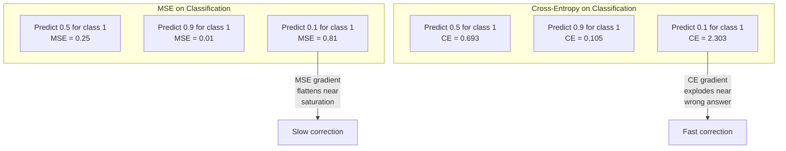
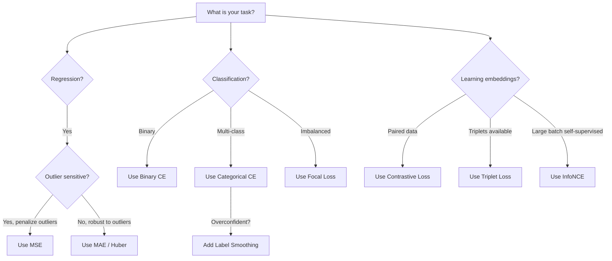
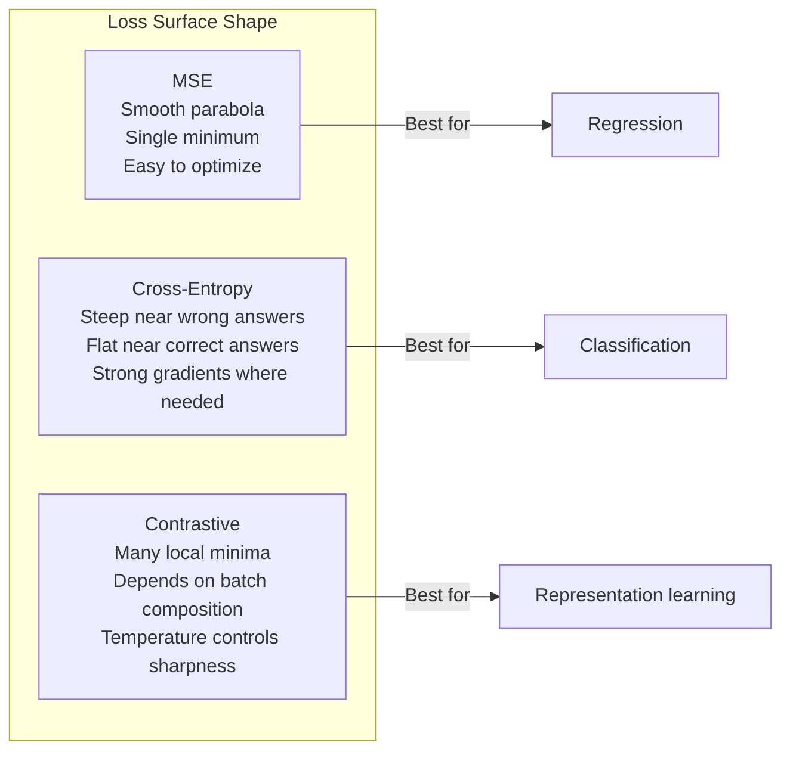

# 损失函数

> 你的网络做出一个预测。真实情况却说不是这样。它错得有多离谱？这个数字就是损失。选择错误的损失函数，你的模型会完全优化错误的目标。

**类型:** 构建
**语言:** Python
**先决条件:** 第03.04课 (激活函数)
**时间:** ~75 分钟

## 学习目标

- 从零开始实现均方误差（MSE）、二元交叉熵、分类交叉熵和对比损失（InfoNCE）及其梯度
- 通过演示“对所有输入都预测0.5”的失败模式，解释均方误差（MSE）在分类任务中的失效原因
- 将标签平滑应用到交叉熵中，并描述其如何防止模型做出过于自信的预测
- 为回归、二元分类、多类分类和嵌入学习任务选择正确的损失函数

## 问题

一个在分类问题中最小化均方误差（MSE）的模型会自信地对所有输入预测0.5。它确实在最小化损失。但它毫无用处。

损失函数是你的模型实际优化的唯一东西。不是准确率。不是F1分数。不是你向经理报告的任何指标。优化器会根据损失函数的梯度调整权重，使这个数字变小。如果损失函数没有捕捉到你真正关心的内容，模型会找到数学上最便宜的方式来满足它，而这种方式几乎从不是你想要的。

这里有一个具体的例子。你有一个二元分类任务。两个类别，各占50%。你使用均方误差（MSE）作为损失函数。模型对每个输入都预测0.5。平均均方误差是0.25，这是在没有真正学习任何东西的情况下可能的最小值。模型没有任何区分能力，但技术上已经最小化了你的损失函数。换成交叉熵损失，同样的模型必须将预测推向0或1，因为 -log(0.5) = 0.693 是一个糟糕的损失，而 -log(0.99) = 0.01 奖励了自信的正确预测。损失函数的选择是模型学习和模型只为了优化指标而作弊之间的区别。

情况会更糟。在自监督学习中，你甚至没有标签。对比损失完全定义了学习信号：什么被认为是相似的，什么被认为是不同的，以及模型应该将它们分开到多大的程度。如果对比损失选择错误，你的嵌入会坍塌为一个点——每个输入都映射到相同的向量。技术上损失为零。但完全毫无价值。

## 概念

### 均方误差（MSE）

回归的默认选择。计算预测值和目标值之间的平方差，并对所有样本取平均。

```
MSE = (1/n) * sum((y_pred - y_true)^2)
```

平方的重要性：它对大误差进行二次惩罚。误差为2时，其代价是误差为1时的4倍；误差为10时，其代价是误差为1时的100倍。这使得均方误差（MSE）对异常值敏感——一个极端错误的预测会主导整个损失。

实数：如果你的模型预测房价，大部分房子的预测误差为10,000美元，但有一座豪宅的预测误差为200,000美元，MSE会强烈地试图修正这座豪宅的预测误差，这可能会损害对其他99座房子的预测性能。

MSE关于预测的梯度为：

```
dMSE/dy_pred = (2/n) * (y_pred - y_true)
```

误差呈线性关系。较大的误差会产生更大的梯度。这是回归任务的一个特性（大的误差需要大的修正），但在分类任务中则是一个缺陷（你希望对那些非常自信但错误的答案进行指数级的惩罚，而不是线性惩罚）。

### 交叉熵损失

分类任务的损失函数。源自信息论——它衡量预测概率分布与真实分布之间的差异。

**二元交叉熵（BCE）:**

```
BCE = -(y * log(p) + (1 - y) * log(1 - p))
```

其中 y 是真实标签（0 或 1），p 是预测概率。

为什么 -log(p) 起作用：当真实标签是 1，你预测 p = 0.99 时，损失是 -log(0.99) = 0.01。当你预测 p = 0.01 时，损失是 -log(0.01) = 4.6。这 460 倍的差异就是交叉熵起作用的原因。它对那些自信但错误的预测进行严厉惩罚，而对那些自信但正确的预测几乎不进行惩罚。

梯度讲述着同样的故事：

```
dBCE/dp = -(y/p) + (1-y)/(1-p)
```

当 y = 1 且 p 接近零时，梯度是 -1/p，这会趋近于负无穷。模型接收到一个巨大的信号来修正它的错误。当 p 接近 1 时，梯度非常小。已经正确，无需修正。

**分类交叉熵：**

用于具有 one-hot 编码目标的多类分类。

```
CCE = -sum(y_i * log(p_i))
```

只有正确的类别会对损失产生贡献（因为其他所有 y_i 都是零）。如果有 10 个类别，正确的类别得到概率 0.1（随机猜测），那么损失为 -log(0.1) = 2.3。如果正确的类别得到概率 0.9，那么损失为 -log(0.9) = 0.105。模型学习将概率质量集中在正确的答案上。

### 为什么 MSE 在分类任务中表现不佳



当预测值接近 0 或 1 时，MSE 梯度会变平（由于 sigmoid 饱和）。交叉熵梯度弥补了这一点 -- -log 会抵消 sigmoid 的平坦区域，在最需要的地方提供强大的梯度。

### 标签平滑

标准的 one-hot 标签表示“这 100% 是类别 3，其他类别都是 0%。”这是一个很强的声明。标签平滑对其进行了软化：

 /no_think

<>

MSE gradients flatten when predictions are near 0 or 1 (due to sigmoid saturation). Cross-entropy gradients compensate for this -- the -log cancels the sigmoid's flat regions, giving strong gradients exactly where they are needed most.

### Label Smoothing

Standard one-hot labels say "this is 100% class 3 and 0% everything else." That's a strong claim. Label smoothing softens it:

 /no_think

<>

MSE 梯度在预测接近 0 或 1 时会变平（由于 sigmoid 饱和）。交叉熵梯度弥补了这一点 -- -log 抵消了 sigmoid 的平坦区域，在最需要的地方提供强大的梯度。

### 标签平滑

标准的 one-hot 标签表示“这 100% 是类别 3，其他类别都是 0%。”这是一个很强的声明。标签平滑对其进行了软化：

 /no_think

<>

MSE gradients flatten when predictions are near 0 or 1 (due to sigmoid saturation). Cross-entropy gradients compensate for this -- the -log cancels the sigmoid's flat regions, giving strong gradients exactly where they are needed most.

### Label Smoothing

Standard one-hot labels say "this is 100% class 3 and 0% everything else." That's a strong claim. Label smoothing softens it:

 /no_think

<>

MSE 梯度在预测接近 0 或 1 时会变平（由于 sigmoid 饱和）。交叉熵梯度弥补了这一点 -- -log 抵消了 sigmoid 的平坦区域，在最需要的地方提供强大的梯度。

### 标签平滑

标准的 one-hot 标签表示“这 100% 是类别 3，其他类别都是 0%。”这是一个很强的声明。标签平滑对其进行了软化：

 /no_think

<>

MSE gradients flatten when predictions are near 0 or 1 (due to sigmoid saturation). Cross-entropy gradients compensate for this -- the -log cancels the sigmoid's flat regions, giving strong gradients exactly where they are needed most.

### Label Smoothing

Standard one-hot labels say "this is 100% class 3 and 0% everything else." That's a strong claim. Label smoothing softens it:

 /no_think

<>

MSE 梯度在预测接近 0 或 1 时会变平（由于 sigmoid 饱和）。交叉熵梯度弥补了这一点 -- -log 抵消了 sigmoid 的平坦区域，在最需要的地方提供强大的梯度。

### 标签平滑

标准的 one-hot 标签表示“这 100% 是类别 3，其他类别都是 0%。”这是一个很强的声明。标签平滑对其进行了软化：

 /no_think

<>

MSE gradients flatten when predictions are near 0 or 1 (due to sigmoid saturation). Cross-entropy gradients compensate for this -- the -log cancels the sigmoid's flat regions, giving strong gradients exactly where they are needed most.

### Label Smoothing

Standard one-hot labels say "this is 100% class 3 and 0% everything else." That's a strong claim. Label smoothing softens it:

 /no_think

<>

MSE 梯度在预测接近 0 或 1 时会变平（由于 sigmoid 饱和）。交叉熵梯度弥补了这一点 -- -log 抵消了 sigmoid 的平坦区域，在最需要的地方提供强大的梯度。

### 标签平滑

标准的 one-hot 标签表示“这 100% 是类别 3，其他类别都是 0%。”这是一个很强的声明。标签平滑对其进行了软化：

 /no_think

<>

MSE gradients flatten when predictions are near 0 or 1 (due to sigmoid saturation). Cross-entropy gradients compensate for this -- the -log cancels the sigmoid's flat regions, giving strong gradients exactly where they are needed most.

### Label Smoothing

Standard one-hot labels say "this is 100% class 3 and 0% everything else." That's a strong claim. Label smoothing softens it:

 /no_think

<>

MSE 梯度在预测接近 0 或 1 时会变平（由于 sigmoid 饱和）。交叉熵梯度弥补了这一点 -- -log 抵消了 sigmoid 的平坦区域，在最需要的地方提供强大的梯度。

### 标签平滑

标准的 one-hot 标签表示“这 100% 是类别 3，其他类别都是 0%。”这是一个很强的声明。标签平滑对其进行了软化：

 /no_think

<>

MSE gradients flatten when predictions are near 0 or 1 (due to sigmoid saturation). Cross-entropy gradients compensate for this -- the -log cancels the sigmoid's flat regions, giving strong gradients exactly where they are needed most.

### Label Smoothing

Standard one-hot labels say "this is 100% class 3 and 0% everything else." That's a strong claim. Label smoothing softens it:

 /no_think

<>

MSE 梯度在预测接近 0 或 1 时会变平（由于 sigmoid 饱和）。交叉熵梯度弥补了这一点 -- -log 抵消了 sigmoid 的平坦区域，在最需要的地方提供强大的梯度。

### 标签平滑

标准的 one-hot 标签表示“这 100% 是类别 3，其他类别都是 0%。”这是一个很强的声明。标签平滑对其进行了软化：

 /no_think

<>

MSE gradients flatten when predictions are near 0 or 1 (due to sigmoid saturation). Cross-entropy gradients compensate for this -- the -log cancels the sigmoid's flat regions, giving strong gradients exactly where they are needed most.

### Label Smoothing

Standard one-hot labels say "this is 100% class 3 and 0% everything else." That's a strong claim. Label smoothing softens it:

 /no_think

<>

MSE 梯度在预测接近 0 或 1 时会变平（由于 sigmoid 饱和）。交叉熵梯度弥补了这一点 -- -log 抵消了 sigmoid 的平坦区域，在最需要的地方提供强大的梯度。

### 标签平滑

标准的 one-hot 标签表示“这 100% 是类别 3，其他类别都是 0%。”这是一个很强的声明。标签平滑对其进行了软化：

 /no_think

<>

MSE gradients flatten when predictions are near 0 or 1 (due to sigmoid saturation). Cross-entropy gradients compensate for this -- the -log cancels the sigmoid's flat regions, giving strong gradients exactly where they are needed most.

### Label Smoothing

Standard one-hot labels say "this is 100% class 3 and 0% everything else." That's a strong claim. Label smoothing softens it:

 /no_think

<>

MSE 梯度在预测接近 0 或 1 时会变平（由于 sigmoid 饱和）。交叉熵梯度弥补了这一点 -- -log 抵消了 sigmoid 的平坦区域，在最需要的地方提供强大的梯度。

### 标签平滑

标准的 one-hot 标签表示“这 100% 是类别 3，其他类别都是 0%。”这是一个很强的声明。标签平滑对其进行了软化：

 /no_think

<>

MSE gradients flatten when predictions are near 0 or 1 (due to sigmoid saturation). Cross-entropy gradients compensate for this -- the -log cancels the sigmoid's flat regions, giving strong gradients exactly where they are needed most.

### Label Smoothing

Standard one-hot labels say "this is 100% class 3 and 0% everything else." That's a strong claim. Label smoothing softens it:

 /no_think

<>

MSE 梯度在预测接近 0 或 1 时会变平（由于 sigmoid 饱和）。交叉熵梯度弥补了这一点 -- -log 抵消了 sigmoid 的平坦区域，在最需要的地方提供强大的梯度。

### 标签平滑

标准的 one-hot 标签表示“这 100% 是类别 3，其他类别都是 0%。”这是一个很强的声明。标签平滑对其进行了软化：

 /no_think

<>

MSE gradients flatten when predictions are near 0 or 1 (due to sigmoid saturation). Cross-entropy gradients compensate for this -- the -log cancels the sigmoid's flat regions, giving strong gradients exactly where they are needed most.

### Label Smoothing

Standard one-hot labels say "this is 100% class 3 and 0% everything else." That's a strong claim. Label smoothing softens it:

 /no_think

<>

MSE 梯度在预测接近 0 或 1 时会变平（由于 sigmoid 饱和）。交叉熵梯度弥补了这一点 -- -log 抵消了 sigmoid 的平坦区域，在最需要的地方提供强大的梯度。

### 标签平滑

标准的 one-hot 标签表示“这 100% 是类别 3，其他类别都是 0%。”这是一个很强的声明。标签平滑对其进行了软化：

 /no_think

<>

MSE gradients flatten when predictions are near 0 or 1 (due to sigmoid saturation). Cross-entropy gradients compensate for this -- the -log cancels the sigmoid's flat regions, giving strong gradients exactly where they are needed most.

### Label Smoothing

Standard one-hot labels say "this is 100% class 3 and 0% everything else." That's a strong claim. Label smoothing softens it:

 /no_think

<>

MSE 梯度在预测接近 0 或 1 时会变平（由于 sigmoid 饱和）。交叉熵梯度弥补了这一点 -- -log 抵消了 sigmoid 的平坦区域，在最需要的地方提供强大的梯度。

### 标签平滑

标准的 one-hot 标签表示“这 100% 是类别 3，其他类别都是 0%。”这是一个很强的声明。标签平滑对其进行了软化：

 /no_think

<>

MSE gradients flatten when predictions are near 0 or 1 (due to sigmoid saturation). Cross-entropy gradients compensate for this -- the -log cancels the sigmoid's flat regions, giving strong gradients exactly where they are needed most.

### Label Smoothing

Standard one-hot labels say "this is 100% class 3 and 0% everything else." That's a strong claim. Label smoothing softens it:

 /no_think

<>

MSE 梯度在预测接近 0 或 1 时会变平（由于 sigmoid 饱和）。交叉熵梯度弥补了这一点 -- -log 抵消了 sigmoid 的平坦区域，在最需要的地方提供强大的梯度。

### 标签平滑

标准的 one-hot 标签表示“这 100% 是类别 3，其他类别都是 0%。”这是一个很强的声明。标签平滑对其进行了软化：

 /no_think

<>

MSE gradients flatten when predictions are near 0 or 1 (due to sigmoid saturation). Cross-entropy gradients compensate for this -- the -log cancels the sigmoid's flat regions, giving strong gradients exactly where they are needed most.

### Label Smoothing

Standard one-hot labels say "this is 100% class 3 and 0% everything else." That's a strong claim. Label smoothing softens it:

 /no_think

<>

MSE 梯度在预测接近 0 或 1 时会变平（由于 sigmoid 饱和）。交叉熵梯度弥补了这一点 -- -log 抵消了 sigmoid 的平坦区域，在最需要的地方提供强大的梯度。

### 标签平滑

标准的 one-hot 标签表示“这 100% 是类别 3，其他类别都是 0%。”这是一个很强的声明。标签平滑对其进行了软化：

 /no_think

<>

MSE gradients flatten when predictions are near 0 or 1 (due to sigmoid saturation). Cross-entropy gradients compensate for this -- the -log cancels the sigmoid's flat regions, giving strong gradients exactly where they are needed most.

### Label Smoothing

Standard one-hot labels say "this is 100% class 3 and 0% everything else." That's a strong claim. Label smoothing softens it:

 /no_think

<>

MSE 梯度在预测接近 0 或 1 时会变平（由于 sigmoid 饱和）。交叉熵梯度弥补了这一点 -- -log 抵消了 sigmoid 的平坦区域，在最需要的地方提供强大的梯度。

### 标签平滑

标准的 one-hot 标签表示“这 100% 是类别 3，其他类别都是 0%。”这是一个很强的声明。标签平滑对其进行了软化：

 /no_think

<>

MSE gradients flatten when predictions are near 0 or 1 (due to sigmoid saturation). Cross-entropy gradients compensate for this -- the -log cancels the sigmoid's flat regions, giving strong gradients exactly where they are needed most.

### Label Smoothing

Standard one-hot labels say "this is 100% class 3 and 0% everything else." That's a strong claim. Label smoothing softens it:

 /no_think

```
smooth_label = (1 - alpha) * one_hot + alpha / num_classes
```

使用 alpha = 0.1 和 10 个类别：目标不再是 [0, 0, 1, 0, ...]，而是变为 [0.01, 0.01, 0.91, 0.01, ...]。模型的目标是达到 0.91 而不是 1.0。

为什么这有效：一个试图通过 softmax 输出正好 1.0 的模型，需要将 logit 推向正无穷。这会导致过度自信，影响泛化能力，并使模型对分布变化变得脆弱。标签平滑将目标限制在 0.9（alpha=0.1 时），从而保持 logit 在合理的范围内。GPT 和大多数现代模型都使用标签平滑或其等效方法。

### 对比损失

没有标签。没有类别。只有输入对和一个问题：这些是相似还是不同？

**SimCLR 风格的对比损失（NT-Xent / InfoNCE）：**

取一张图像。创建它的两个增强视图（裁剪、旋转、颜色抖动）。这些是“正样本对”——它们的嵌入应该相似。批次中的每一张其他图像则形成“负样本对”——它们的嵌入应该不同。

```
L = -log(exp(sim(z_i, z_j) / tau) / sum(exp(sim(z_i, z_k) / tau)))
```

其中 sim() 是余弦相似度，z_i 和 z_j 是正样本对，求和是对所有负样本进行的，tau（温度）控制分布的锐度。温度较低 = 更难的负样本 = 更激进的分离。

实数：批量大小为 256 意味着每个正样本对有 255 个负样本。温度 tau = 0.07（SimCLR 默认值）。损失函数看起来像是相似度上的 softmax —— 它希望正样本对的相似度在所有 256 个选项中是最大的。

**三元组损失（Triplet Loss）：**

需要三个输入：锚点（anchor）、正样本（positive，同类）、负样本（negative，不同类）。

```
L = max(0, d(anchor, positive) - d(anchor, negative) + margin)
```

边距（通常为 0.2-1.0）强制规定了正样本和负样本之间的最小间隔。如果负样本已经足够远，损失为零——没有梯度，也没有更新。这使训练变得高效，但需要仔细进行三元组挖掘（选择与锚点接近的难负样本）。

### 焦点损失

用于处理不平衡数据集。标准的交叉熵损失对所有正确分类的样本一视同仁。焦点损失对容易分类的样本进行权重降低：

```
FL = -alpha * (1 - p_t)^gamma * log(p_t)
```

其中 p_t 是真实类别的预测概率，gamma 控制着聚焦效果。当 gamma = 0 时，这是标准的交叉熵损失。当 gamma = 2（默认值）时：

- 简单例子（p_t = 0.9）：权重 = (0.1)^2 = 0.01。实际上被忽略。
- 困难例子（p_t = 0.1）：权重 = (0.9)^2 = 0.81。获得完整的梯度信号。

Focal loss 是由 Lin 等人引入用于目标检测的，其中 99% 的候选区域都是背景（简单的负样本）。没有 focal loss 的话，模型会被简单的背景例子淹没，无法学习检测目标。有了 focal loss，模型会将其能力集中在那些重要且难以判断的案例上。

### 损失函数决策树



### 损失景观



```figure
cross-entropy-loss
```

## 构建它

### 第一步：MSE 及其梯度

```python
def mse(predictions, targets):
    n = len(predictions)
    total = 0.0
    for p, t in zip(predictions, targets):
        total += (p - t) ** 2
    return total / n

def mse_gradient(predictions, targets):
    n = len(predictions)
    grads = []
    for p, t in zip(predictions, targets):
        grads.append(2.0 * (p - t) / n)
    return grads
```

### 步骤 2：二元交叉熵

log(0) 的问题确实是存在的。如果模型对一个正样本预测了恰好 0，那么 log(0) 就等于负无穷。裁剪可以防止这种情况发生。

```python
import math

def binary_cross_entropy(predictions, targets, eps=1e-15):
    n = len(predictions)
    total = 0.0
    for p, t in zip(predictions, targets):
        p_clipped = max(eps, min(1 - eps, p))
        total += -(t * math.log(p_clipped) + (1 - t) * math.log(1 - p_clipped))
    return total / n

def bce_gradient(predictions, targets, eps=1e-15):
    grads = []
    for p, t in zip(predictions, targets):
        p_clipped = max(eps, min(1 - eps, p))
        grads.append(-(t / p_clipped) + (1 - t) / (1 - p_clipped))
    return grads
```

### 第三步：使用 Softmax 的分类交叉熵

Softmax 将原始的 logits 转换为概率。然后我们计算与 one-hot 编码目标的交叉熵。

```python
def softmax(logits):
    max_val = max(logits)
    exps = [math.exp(x - max_val) for x in logits]
    total = sum(exps)
    return [e / total for e in exps]

def categorical_cross_entropy(logits, target_index, eps=1e-15):
    probs = softmax(logits)
    p = max(eps, probs[target_index])
    return -math.log(p)

def cce_gradient(logits, target_index):
    probs = softmax(logits)
    grads = list(probs)
    grads[target_index] -= 1.0
    return grads
```softmax 加 cross-entropy 的梯度简化得非常漂亮：对于真实类别，梯度是（预测概率 - 1），而对于其他所有类别，梯度是（预测概率）。这个优美的简化并非偶然——这就是为什么 softmax 和 cross-entropy 会被配对使用的原因。

### 步骤 4：标签平滑（Label Smoothing）

```python
def label_smoothed_cce(logits, target_index, num_classes, alpha=0.1, eps=1e-15):
    probs = softmax(logits)
    loss = 0.0
    for i in range(num_classes):
        if i == target_index:
            smooth_target = 1.0 - alpha + alpha / num_classes
        else:
            smooth_target = alpha / num_classes
        p = max(eps, probs[i])
        loss += -smooth_target * math.log(p)
    return loss
```

### 步骤 5：对比损失（简化 InfoNCE）

```python
def cosine_similarity(a, b):
    dot = sum(x * y for x, y in zip(a, b))
    norm_a = math.sqrt(sum(x * x for x in a))
    norm_b = math.sqrt(sum(x * x for x in b))
    if norm_a < 1e-10 or norm_b < 1e-10:
        return 0.0
    return dot / (norm_a * norm_b)

def contrastive_loss(anchor, positive, negatives, temperature=0.07):
    sim_pos = cosine_similarity(anchor, positive) / temperature
    sim_negs = [cosine_similarity(anchor, neg) / temperature for neg in negatives]

    max_sim = max(sim_pos, max(sim_negs)) if sim_negs else sim_pos
    exp_pos = math.exp(sim_pos - max_sim)
    exp_negs = [math.exp(s - max_sim) for s in sim_negs]
    total_exp = exp_pos + sum(exp_negs)

    return -math.log(max(1e-15, exp_pos / total_exp))
```

### 第6步：分类中的MSE与交叉熵

使用两种损失函数训练第04课中的相同网络（圆数据集）。观察交叉熵收敛得更快。

```python
import random

def sigmoid(x):
    x = max(-500, min(500, x))
    return 1.0 / (1.0 + math.exp(-x))

def make_circle_data(n=200, seed=42):
    random.seed(seed)
    data = []
    for _ in range(n):
        x = random.uniform(-2, 2)
        y = random.uniform(-2, 2)
        label = 1.0 if x * x + y * y < 1.5 else 0.0
        data.append(([x, y], label))
    return data


class LossComparisonNetwork:
    def __init__(self, loss_type="bce", hidden_size=8, lr=0.1):
        random.seed(0)
        self.loss_type = loss_type
        self.lr = lr
        self.hidden_size = hidden_size

        self.w1 = [[random.gauss(0, 0.5) for _ in range(2)] for _ in range(hidden_size)]
        self.b1 = [0.0] * hidden_size
        self.w2 = [random.gauss(0, 0.5) for _ in range(hidden_size)]
        self.b2 = 0.0

    def forward(self, x):
        self.x = x
        self.z1 = []
        self.h = []
        for i in range(self.hidden_size):
            z = self.w1[i][0] * x[0] + self.w1[i][1] * x[1] + self.b1[i]
            self.z1.append(z)
            self.h.append(max(0.0, z))

        self.z2 = sum(self.w2[i] * self.h[i] for i in range(self.hidden_size)) + self.b2
        self.out = sigmoid(self.z2)
        return self.out

    def backward(self, target):
        if self.loss_type == "mse":
            d_loss = 2.0 * (self.out - target)
        else:
            eps = 1e-15
            p = max(eps, min(1 - eps, self.out))
            d_loss = -(target / p) + (1 - target) / (1 - p)

        d_sigmoid = self.out * (1 - self.out)
        d_out = d_loss * d_sigmoid

        for i in range(self.hidden_size):
            d_relu = 1.0 if self.z1[i] > 0 else 0.0
            d_h = d_out * self.w2[i] * d_relu
            self.w2[i] -= self.lr * d_out * self.h[i]
            for j in range(2):
                self.w1[i][j] -= self.lr * d_h * self.x[j]
            self.b1[i] -= self.lr * d_h
        self.b2 -= self.lr * d_out

    def compute_loss(self, pred, target):
        if self.loss_type == "mse":
            return (pred - target) ** 2
        else:
            eps = 1e-15
            p = max(eps, min(1 - eps, pred))
            return -(target * math.log(p) + (1 - target) * math.log(1 - p))

    def train(self, data, epochs=200):
        losses = []
        for epoch in range(epochs):
            total_loss = 0.0
            correct = 0
            for x, y in data:
                pred = self.forward(x)
                self.backward(y)
                total_loss += self.compute_loss(pred, y)
                if (pred >= 0.5) == (y >= 0.5):
                    correct += 1
            avg_loss = total_loss / len(data)
            accuracy = correct / len(data) * 100
            losses.append((avg_loss, accuracy))
            if epoch % 50 == 0 or epoch == epochs - 1:
                print(f"    Epoch {epoch:3d}: loss={avg_loss:.4f}, accuracy={accuracy:.1f}%")
        return losses
```

## 使用它

PyTorch 提供了所有标准的损失函数，并内置了数值稳定性：

 /no_stability

```python
import torch
import torch.nn as nn
import torch.nn.functional as F

predictions = torch.tensor([0.9, 0.1, 0.7], requires_grad=True)
targets = torch.tensor([1.0, 0.0, 1.0])

mse_loss = F.mse_loss(predictions, targets)
bce_loss = F.binary_cross_entropy(predictions, targets)

logits = torch.randn(4, 10)
labels = torch.tensor([3, 7, 1, 9])
ce_loss = F.cross_entropy(logits, labels)
ce_smooth = F.cross_entropy(logits, labels, label_smoothing=0.1)
```

使用 `F.cross_entropy`（不要使用 `F.nll_loss` 加上手动 softmax）。它将 log-softmax 和负对数似然合并到一个数值稳定的操作中。单独应用 softmax 然后取对数的稳定性较差 —— 在大指数的减法过程中会损失精度。

对于对比学习，大多数团队使用自定义实现或者像 `lightly` 或 `pytorch-metric-learning` 这样的库。核心循环始终相同：计算成对相似度，在正样本和负样本上创建 softmax，然后反向传播。

## 发布它

本课程将产出：
- `outputs/prompt-loss-function-selector.md` -- 一个可重复使用的提示，用于选择合适的损失函数
- `outputs/prompt-loss-debugger.md` -- 一个诊断提示，用于当损失曲线看起来不正确时

## 练习

1. 实现 Huber 损失（平滑 L1 损失），它在小误差时为 MSE，在大误差时为 MAE。训练一个回归网络，预测 y = sin(x)，使用 MSE 和 Huber 损失进行训练，其中 5% 的训练目标添加了随机噪声（离群点）。比较最终的测试误差。

2. 在二分类训练循环中添加 focal loss。创建一个不平衡的数据集（90% 为类别 0，10% 为类别 1）。在 200 个训练周期后，比较标准 BCE 与 focal loss（gamma=2）在少数类别召回率上的表现。

3. 实现带有半硬负样本挖掘的 triplet loss。为 5 个类别生成 2D 嵌入数据。对于每个锚点，找到仍比正样本更远的最难负样本（半硬）。比较收敛速度与随机 triplet 选择的差异。

4. 运行 MSE 与交叉熵的比较，但跟踪训练过程中每一层的梯度幅度。绘制每个训练周期的平均梯度范数。验证当模型最不确定时，交叉熵在早期周期会产生更大的梯度。

5. 实现 KL 散度损失，并验证当真实分布是 one-hot 时，最小化 KL(true || predicted) 与交叉熵产生的梯度相同。然后尝试软目标（如知识蒸馏），其中“真实”分布来自于教师模型的 softmax 输出。

## 关键术语

| 术语 | 人们常说 | 实际含义 |
|------|----------------|----------------|
| 损失函数 | “模型错误的程度” | 一个可微函数，将预测和目标映射到一个标量，由优化器最小化 |
| MSE | “平均平方误差” | 预测与目标之间平方差的平均值；对大误差进行二次惩罚 |
| 交叉熵 | “分类损失” | 使用 -log(p) 来衡量预测概率分布与真实分布之间的差异 |
| 二元交叉熵 | “BCE” | 两分类的交叉熵：-(y*log(p) + (1-y)*log(1-p)) |
| 标签平滑 | “软化目标” | 用软值（如 0.1/0.9）替换硬 0/1 目标，以防止过度自信并提高泛化能力 |
| 对比损失 | “拉近、推远” | 一种损失函数，通过使相似对在嵌入空间中靠近、不相似对远离来学习表示 |
| InfoNCE | “CLIP/SimCLR 的损失” | 在相似度分数上进行归一化温度缩放的交叉熵；将对比学习视为分类 |
| Focal loss | “不平衡数据的解决方法” | 用 (1-p_t)^gamma 加权的交叉熵，以降低容易样本的权重并关注困难样本 |
| Triplet loss | “锚点-正样本-负样本” | 在嵌入空间中通过至少一个边距使锚点比负样本更接近正样本 |
| 温度 | “锐度调节器” | 一个对 logit/相似度的标量除数，控制结果分布的尖锐程度；温度越低，分布越尖锐 |

## 进一步阅读

- Lin 等人，"Focal Loss for Dense Object Detection"（2017）-- 引入 focal loss 用于处理目标检测中的极端类别不平衡（RetinaNet）
- Chen 等人，"A Simple Framework for Contrastive Learning of Visual Representations"（SimCLR，2020）-- 定义了使用 NT-Xent 损失的现代对比学习流程
- Szegedy 等人，"Rethinking the Inception Architecture"（2016）-- 引入标签平滑作为正则化技术，现在大多数大型模型的标准做法
- Hinton 等人，"Distilling the Knowledge in a Neural Network"（2015）-- 使用软目标和 KL 散度进行知识蒸馏，是模型压缩的基础
