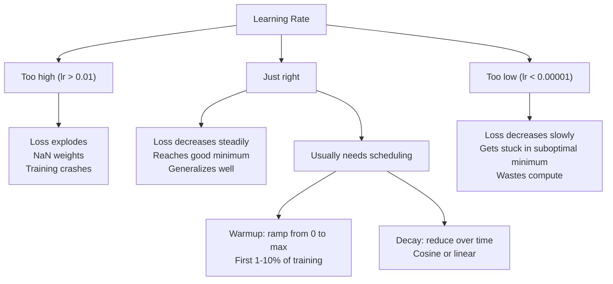
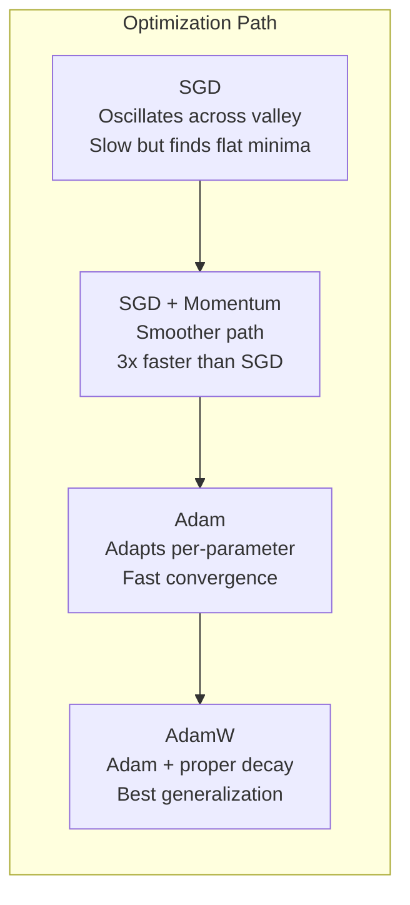
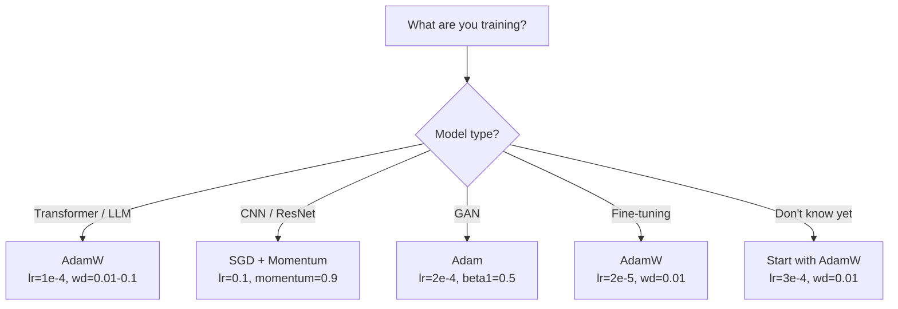

# 优化器

> 梯度下降告诉你应该朝哪个方向移动。它对移动多远或多快没有说明。SGD 是指南针。Adam 是带有交通数据的 GPS。

**类型:** 构建
**语言:** Python
**前提条件:** 第 03.05 课（损失函数）
**时间:** ~75 分钟

## 学习目标

- 从头开始在 Python 中实现 SGD、带动量的 SGD、Adam 和 AdamW 优化器
- 解释 Adam 的偏差校正如何补偿早期训练步骤中零初始化的矩估计
- 展示为什么 AdamW 在相同任务中使用 L2 正则化时比 Adam 产生更好的泛化性能
- 为变换器（Transformers）、卷积神经网络（CNNs）、生成对抗网络（GANs）和微调选择适当的优化器和默认超参数

## 问题

你已经计算了梯度。你知道权重 #4,721 应该减少 0.003 以减少损失。但 0.003 的单位是什么？它应该按什么比例缩放？而且你是否在第一步和第 1,000 步移动相同量？

普通的梯度下降在每一步中对所有参数使用相同的 learning rate：w = w - lr * gradient。这在实践中带来了三个问题，使神经网络的训练变得痛苦。

首先，振荡。损失的地形很少像一个光滑的碗。它更像是一个又长又窄的山谷。梯度指向山谷的跨方向（陡峭方向），而不是沿山谷方向（浅方向）。梯度下降在窄维度上来回跳动，而在有用的方向上只取得微小进展。你已经见过这种情况：损失快速下降，然后停滞，不是因为模型已经收敛，而是因为振荡。

其次，所有参数使用一个 learning rate 是错误的。一些权重需要较大的更新（它们处于早期、欠拟合的阶段）。而其他权重则需要较小的更新（它们已经接近最优值）。对前者有效的 learning rate 会破坏后者，反之亦然。

第三，鞍点。在高维空间中，损失地形有广阔的平坦区域，梯度接近于零。普通 SGD 以梯度速度通过这些区域，这实际上等于零。模型看起来卡住了。实际上它并没有卡住，它处于一个平坦区域，另一侧有有效的下降方向。但 SGD 没有机制来推动它穿过。

Adam 解决了这三个问题。它为每个参数维护两个运行平均值——平均梯度（动量，处理振荡）和平均梯度平方（自适应率，处理不同尺度）。结合前几步的偏差校正，它提供了一个单一的优化器，使用默认超参数可以解决 80% 的问题。本课将从头构建它，以便你完全理解它在其余 20% 的问题中为何以及何时失败。

## 概念

### 随机梯度下降（SGD）

最简单的优化器。在小批量上计算梯度，并向相反方向进行更新。

```
w = w - lr * gradient
```

“stochastic” 的意思是，你使用数据的一个随机子集（小批量）来估计梯度，而不是使用整个数据集。这种噪声实际上是很有用的 —— 它有助于逃离尖锐的局部最小值。但这种噪声也会导致震荡。

学习率是唯一可以调节的参数。学习率太高：损失会发散。学习率太低：训练会耗费很长时间。最优值取决于网络结构、数据、批量大小以及训练的当前阶段。对于现代网络上的普通 SGD，典型的学习率范围从 0.01 到 0.1。但即使在单次训练运行中，理想的学习率也会发生变化。

### 动量

虽然“滚球下山”的类比被过度使用，但它是准确的。你不再仅仅根据梯度进行步进，而是保持一个速度，该速度累积了过去的梯度。

```
m_t = beta * m_{t-1} + gradient
w = w - lr * m_t
```Beta（通常为 0.9）控制保留多少历史信息。当 beta = 0.9 时，动量大致等于最后 10 个梯度的平均值（1 / (1 - 0.9) = 10）。

为什么这能解决震荡问题：方向一致的梯度会累积。而方向相反的梯度会相互抵消。在那个狭窄的山谷中，“横向”分量在每一步都会改变符号并被衰减。“纵向”分量则保持一致并被放大。结果是在有用的方向上实现了平滑加速。

实际数值：在条件恶劣的损失曲面上，单独使用 SGD 可能需要 10,000 步。使用动量的 SGD（beta=0.9）在同样的问题上通常只需要 3,000-5,000 步。加速效果并不是微不足道的。

### RMSProp

第一个真正有效的每参数自适应学习率方法。由 Hinton 在 Coursera 课程中提出（从未正式发表过）。

```
s_t = beta * s_{t-1} + (1 - beta) * gradient^2
w = w - lr * gradient / (sqrt(s_t) + epsilon)
```s_t 跟踪梯度平方的移动平均值。梯度持续较大的参数会被除以一个较大的数（有效学习率较小）。梯度较小的参数会被除以一个较小的数（有效学习率较大）。

这解决了“所有参数使用相同学习率”的问题。一个已经获得较大更新的权重可能已经接近其目标——减慢它的更新速度。一个获得微小更新的权重可能训练不足——加快它的更新速度。

Epsilon（通常为 1e-8）用于防止参数未被更新时出现除以零的情况。

### Adam：动量 + RMSProp

Adam 结合了这两种方法。它为每个参数维护两个指数移动平均值：

```
m_t = beta1 * m_{t-1} + (1 - beta1) * gradient        (first moment: mean)
v_t = beta2 * v_{t-1} + (1 - beta2) * gradient^2       (second moment: variance)
```**偏差校正**是大多数解释中忽略的关键细节。在第1步，m_1 = (1 - beta1) * gradient。当beta1 = 0.9时，就是0.1 * gradient -- 比实际值小了十倍。移动平均值尚未预热。偏差校正进行补偿：

```
m_hat = m_t / (1 - beta1^t)
v_hat = v_t / (1 - beta2^t)
```

在步骤1，beta1 = 0.9时：m_hat = m_1 / (1 - 0.9) = m_1 / 0.1 = 实际梯度。在步骤100时：(1 - 0.9^100) 近似等于1.0，因此修正项消失。偏差修正对前约10步有影响，在约50步之后则无关紧要。

更新：

```
w = w - lr * m_hat / (sqrt(v_hat) + epsilon)
```Adam 默认值：lr = 0.001, beta1 = 0.9, beta2 = 0.999, epsilon = 1e-8。这些默认值对 80% 的问题有效。当它们无效时，首先更改 lr。然后更改 beta2。几乎从不更改 beta1 或 epsilon。

### AdamW：正确实现权重衰减

L2 正则化将 lambda * w^2 添加到损失中。在普通的 SGD 中，这等价于权重衰减（在每一步中从权重中减去 lambda * w）。在 Adam 中，这种等价性被破坏了。

Loshchilov & Hutter 的洞察：当你将 L2 添加到损失中，然后 Adam 处理梯度时，自适应学习率也会对正则化项进行缩放。梯度方差大的参数会得到更少的正则化。梯度方差小的参数会得到更多的正则化。这不是你想要的——你希望无论梯度统计信息如何，都进行统一的正则化。

AdamW 通过在 Adam 更新之后直接对权重应用权重衰减来解决这个问题：

```
w = w - lr * m_hat / (sqrt(v_hat) + epsilon) - lr * lambda * w
```

权重衰减项（lr * lambda * w）没有被 Adam 的自适应因子缩放。每个参数都会以相同的比例缩小。

这看起来像是一个微不足道的细节。但事实并非如此。在几乎所有任务中，AdamW 都会比 Adam 加 L2 正则化收敛到更好的解。它是 PyTorch 中用于训练 Transformer、扩散模型和大多数现代架构的默认优化器。BERT、GPT、LLaMA、Stable Diffusion —— 所有这些模型都是使用 AdamW 训练的。

### 学习率：最重要的超参数



如果你要调整一个超参数，调整学习率。学习率变化 10 倍的影响比你将要做出的任何架构决策都更为重要。常见默认值：

- SGD：lr = 0.01 到 0.1
- Adam/AdamW：lr = 1e-4 到 3e-4
- 微调预训练模型：lr = 1e-5 到 5e-5
- 学习率预热：在前 1-10% 的步骤上进行线性上升

### 优化器对比



### 每种优化器何时表现最佳



```figure
optimizer-trajectory
```

## 构建它

### 第一步：普通 SGD

```python
class SGD:
    def __init__(self, lr=0.01):
        self.lr = lr

    def step(self, params, grads):
        for i in range(len(params)):
            params[i] -= self.lr * grads[i]
```

### 步骤 2：带有动量的 SGD

```python
class SGDMomentum:
    def __init__(self, lr=0.01, beta=0.9):
        self.lr = lr
        self.beta = beta
        self.velocities = None

    def step(self, params, grads):
        if self.velocities is None:
            self.velocities = [0.0] * len(params)
        for i in range(len(params)):
            self.velocities[i] = self.beta * self.velocities[i] + grads[i]
            params[i] -= self.lr * self.velocities[i]
```

### 第三步：Adam

```python
import math

class Adam:
    def __init__(self, lr=0.001, beta1=0.9, beta2=0.999, epsilon=1e-8):
        self.lr = lr
        self.beta1 = beta1
        self.beta2 = beta2
        self.epsilon = epsilon
        self.m = None
        self.v = None
        self.t = 0

    def step(self, params, grads):
        if self.m is None:
            self.m = [0.0] * len(params)
            self.v = [0.0] * len(params)

        self.t += 1

        for i in range(len(params)):
            self.m[i] = self.beta1 * self.m[i] + (1 - self.beta1) * grads[i]
            self.v[i] = self.beta2 * self.v[i] + (1 - self.beta2) * grads[i] ** 2

            m_hat = self.m[i] / (1 - self.beta1 ** self.t)
            v_hat = self.v[i] / (1 - self.beta2 ** self.t)

            params[i] -= self.lr * m_hat / (math.sqrt(v_hat) + self.epsilon)
```

### 步骤 4: AdamW

```python
class AdamW:
    def __init__(self, lr=0.001, beta1=0.9, beta2=0.999, epsilon=1e-8, weight_decay=0.01):
        self.lr = lr
        self.beta1 = beta1
        self.beta2 = beta2
        self.epsilon = epsilon
        self.weight_decay = weight_decay
        self.m = None
        self.v = None
        self.t = 0

    def step(self, params, grads):
        if self.m is None:
            self.m = [0.0] * len(params)
            self.v = [0.0] * len(params)

        self.t += 1

        for i in range(len(params)):
            self.m[i] = self.beta1 * self.m[i] + (1 - self.beta1) * grads[i]
            self.v[i] = self.beta2 * self.v[i] + (1 - self.beta2) * grads[i] ** 2

            m_hat = self.m[i] / (1 - self.beta1 ** self.t)
            v_hat = self.v[i] / (1 - self.beta2 ** self.t)

            params[i] -= self.lr * m_hat / (math.sqrt(v_hat) + self.epsilon)
            params[i] -= self.lr * self.weight_decay * params[i]
```

### 步骤 5：训练比较

使用所有四种优化器，在第 05 课的 circle 数据集上训练相同的两层网络。比较收敛情况。

```python
import random

def sigmoid(x):
    x = max(-500, min(500, x))
    return 1.0 / (1.0 + math.exp(-x))

def make_circle_data(n=200, seed=42):
    random.seed(seed)
    data = []
    for _ in range(n):
        x = random.uniform(-2, 2)
        y = random.uniform(-2, 2)
        label = 1.0 if x * x + y * y < 1.5 else 0.0
        data.append(([x, y], label))
    return data


class OptimizerTestNetwork:
    def __init__(self, optimizer, hidden_size=8):
        random.seed(0)
        self.hidden_size = hidden_size
        self.optimizer = optimizer

        self.w1 = [[random.gauss(0, 0.5) for _ in range(2)] for _ in range(hidden_size)]
        self.b1 = [0.0] * hidden_size
        self.w2 = [random.gauss(0, 0.5) for _ in range(hidden_size)]
        self.b2 = 0.0

    def get_params(self):
        params = []
        for row in self.w1:
            params.extend(row)
        params.extend(self.b1)
        params.extend(self.w2)
        params.append(self.b2)
        return params

    def set_params(self, params):
        idx = 0
        for i in range(self.hidden_size):
            for j in range(2):
                self.w1[i][j] = params[idx]
                idx += 1
        for i in range(self.hidden_size):
            self.b1[i] = params[idx]
            idx += 1
        for i in range(self.hidden_size):
            self.w2[i] = params[idx]
            idx += 1
        self.b2 = params[idx]

    def forward(self, x):
        self.x = x
        self.z1 = []
        self.h = []
        for i in range(self.hidden_size):
            z = self.w1[i][0] * x[0] + self.w1[i][1] * x[1] + self.b1[i]
            self.z1.append(z)
            self.h.append(max(0.0, z))

        self.z2 = sum(self.w2[i] * self.h[i] for i in range(self.hidden_size)) + self.b2
        self.out = sigmoid(self.z2)
        return self.out

    def compute_grads(self, target):
        eps = 1e-15
        p = max(eps, min(1 - eps, self.out))
        d_loss = -(target / p) + (1 - target) / (1 - p)
        d_sigmoid = self.out * (1 - self.out)
        d_out = d_loss * d_sigmoid

        grads = [0.0] * (self.hidden_size * 2 + self.hidden_size + self.hidden_size + 1)
        idx = 0
        for i in range(self.hidden_size):
            d_relu = 1.0 if self.z1[i] > 0 else 0.0
            d_h = d_out * self.w2[i] * d_relu
            grads[idx] = d_h * self.x[0]
            grads[idx + 1] = d_h * self.x[1]
            idx += 2

        for i in range(self.hidden_size):
            d_relu = 1.0 if self.z1[i] > 0 else 0.0
            grads[idx] = d_out * self.w2[i] * d_relu
            idx += 1

        for i in range(self.hidden_size):
            grads[idx] = d_out * self.h[i]
            idx += 1

        grads[idx] = d_out
        return grads

    def train(self, data, epochs=300):
        losses = []
        for epoch in range(epochs):
            total_loss = 0.0
            correct = 0
            for x, y in data:
                pred = self.forward(x)
                grads = self.compute_grads(y)
                params = self.get_params()
                self.optimizer.step(params, grads)
                self.set_params(params)

                eps = 1e-15
                p = max(eps, min(1 - eps, pred))
                total_loss += -(y * math.log(p) + (1 - y) * math.log(1 - p))
                if (pred >= 0.5) == (y >= 0.5):
                    correct += 1
            avg_loss = total_loss / len(data)
            accuracy = correct / len(data) * 100
            losses.append((avg_loss, accuracy))
            if epoch % 75 == 0 or epoch == epochs - 1:
                print(f"    Epoch {epoch:3d}: loss={avg_loss:.4f}, accuracy={accuracy:.1f}%")
        return losses
```

## 使用它

PyTorch 优化器处理参数组、梯度裁剪和学习率调度：

```python
import torch
import torch.optim as optim

model = torch.nn.Sequential(
    torch.nn.Linear(784, 256),
    torch.nn.ReLU(),
    torch.nn.Linear(256, 10),
)

optimizer = optim.AdamW(model.parameters(), lr=3e-4, weight_decay=0.01)

scheduler = optim.lr_scheduler.CosineAnnealingLR(optimizer, T_max=100)

for epoch in range(100):
    optimizer.zero_grad()
    output = model(torch.randn(32, 784))
    loss = torch.nn.functional.cross_entropy(output, torch.randint(0, 10, (32,)))
    loss.backward()
    torch.nn.utils.clip_grad_norm_(model.parameters(), max_norm=1.0)
    optimizer.step()
    scheduler.step()
```

模式始终是：zero_grad、forward、loss、backward、（clip）、step、（schedule）。请记住这个顺序。出错（例如在调用optimizer.step()之前调用scheduler.step()）是导致细微错误的常见原因。

对于卷积神经网络（CNNs），许多实践者仍然倾向于使用SGD + momentum（lr=0.1，momentum=0.9，weight_decay=1e-4）配合step或cosine schedule。SGD能找到更平坦的极小值，这通常具有更好的泛化能力。对于transformers和大型语言模型（LLMs），AdamW配合warmup + cosine decay是通用的默认选择。在没有充分理由的情况下，不要与共识对抗。

## 发布它

本课将产出：
- `outputs/prompt-optimizer-selector.md` -- 用于选择任何架构的正确优化器和学习率的决策提示

## 练习

1. 实现Nesterov momentum，其中你计算“lookahead”位置（w - lr * beta * v）的梯度，而不是当前位置的梯度。在circle数据集上与标准momentum的收敛情况进行比较。

2. 实现一个学习率warmup schedule：在训练的前10%步骤中，从0线性增加到max_lr，然后进行cosine decay到0。使用Adam + warmup和Adam不使用warmup进行训练。测量在circle数据集上达到90%准确率需要多少个epochs。

3. 在Adam训练过程中跟踪每个参数的有效学习率。有效率是lr * m_hat / (sqrt(v_hat) + eps)。绘制10、50和200步后有效率的分布。所有参数是否以相同的速度被更新？

4. 实现梯度裁剪（按全局范数裁剪）。将最大梯度范数设为1.0。使用和不使用裁剪，在高学习率（Adam的lr=0.01）下进行训练。计算在10个随机种子下，有和没有裁剪时有多少次运行发散（loss变为NaN）。

5. 在一个具有大权重的网络上比较Adam和AdamW。将所有权重初始化为[-5, 5]范围内的随机值（比正常值大得多）。使用weight_decay=0.1训练200个epochs。绘制两个优化器在训练过程中权重的L2范数。AdamW应显示更快的权重收缩。

## 关键术语

| 术语 | 人们常说 | 它实际含义 |
|------|----------------|----------------|
| 学习率 | "步长" | 梯度更新的标量乘数；训练中最具影响力的单个超参数 |
| SGD | "基础梯度下降" | 随机梯度下降：通过减去lr * gradient（在小批量上计算）来更新权重 |
| Momentum | "滚动球类比" | 过去梯度的指数移动平均；减少震荡并加速一致方向 |
| RMSProp | "自适应学习率" | 用最近梯度的运行RMS除以每个参数的梯度；使学习率均衡 |
| Adam | "默认优化器" | 结合动量（一阶矩）和RMSProp（二阶矩），并带有初始步骤的偏差校正 |
| AdamW | "正确实现的Adam" | 带有解耦权重衰减的Adam；直接对权重应用正则化，而不是通过梯度 |
| 偏差校正 | "运行平均值的warmup" | 通过除以(1 - beta^t)来补偿Adam的矩估计的零初始化 |
| 权重衰减 | "收缩权重" | 每一步减去权重值的一个分数；对大权重施加惩罚的正则化项 |
| 学习率schedule | "随时间变化的学习率" | 在训练过程中调整学习率的函数；warmup + cosine decay是现代默认 |
| 梯度裁剪 | "截断梯度范数" | 当梯度向量的范数超过阈值时将其缩放；防止梯度爆炸更新 |

## 进一步阅读

- Kingma & Ba, "Adam: A Method for Stochastic Optimization" (2014) -- 原始的Adam论文，包含收敛分析和偏差校正推导
- Loshchilov & Hutter, "Decoupled Weight Decay Regularization" (2017) -- 证明在Adam中L2正则化和权重衰减并不等价，并提出AdamW
- Smith, "Cyclical Learning Rates for Training Neural Networks" (2017) -- 引入了LR范围测试和循环schedule，消除了调整固定学习率的需要
- Ruder, "An Overview of Gradient Descent Optimization Algorithms" (2016) -- 所有优化器变体的最佳单篇综述，有清晰的比较和直觉
