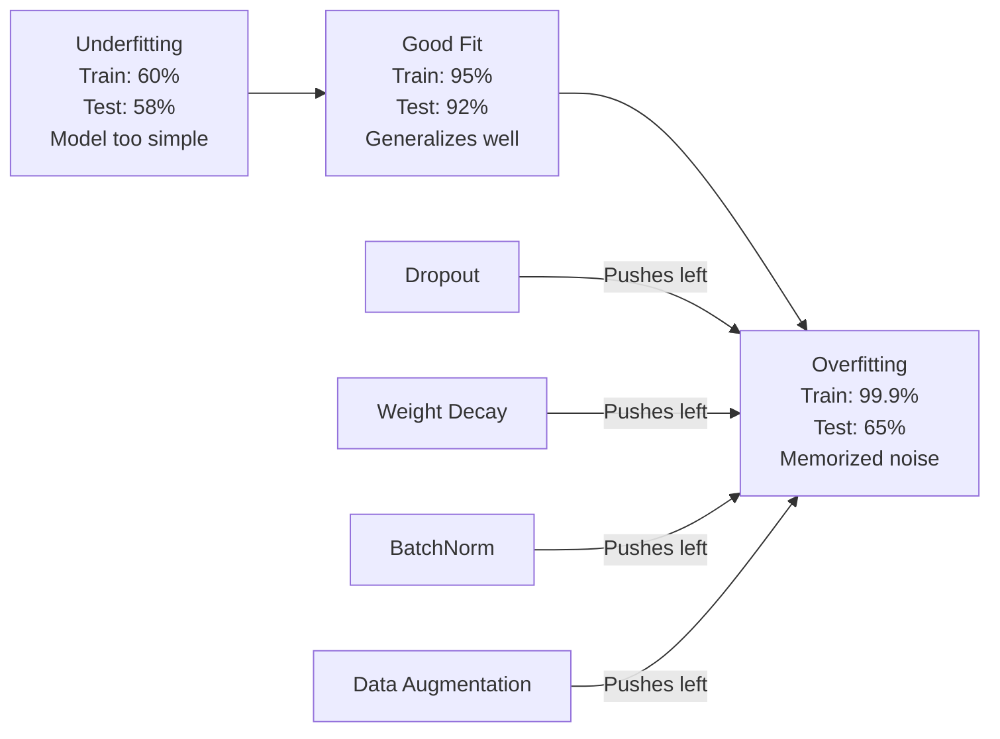
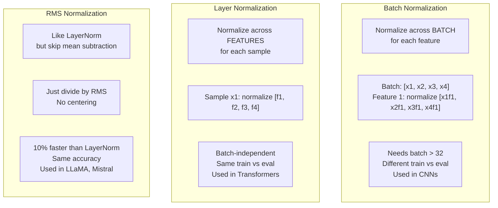
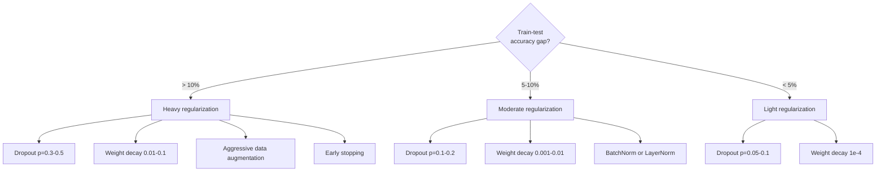

# 正则化

> 你的模型在训练数据上得到 99%，在测试数据上只得到 60%。它只是记住了数据，而不是真正学习。正则化是对复杂性的“税”，迫使模型实现泛化。

**类型:** 构建  
**语言:** Python  
**先决条件:** 第 03.06 课（优化器）  
**时间:** ~75 分钟

## 学习目标

- 从零开始实现倒置缩放的 dropout、L2 权重衰减、批量归一化、层归一化和 RMSNorm
- 通过正则化实验测量训练-测试准确率的差距并诊断过拟合
- 解释为什么 Transformer 使用 LayerNorm 而不是 BatchNorm，以及现代大语言模型更倾向于 RMSNorm
- 根据过拟合的严重程度，应用正确的正则化技术组合

## 问题

一个参数足够多的神经网络可以记住任何数据集。这不是假设——Zhang 等人（2017）通过训练带有随机标签的标准网络在 ImageNet 上证明了这一点。这些网络在完全随机的标签分配下达到了接近零的训练损失。它们记住了一百万个没有规律可循的随机输入-输出对。训练损失完美无缺，但测试准确率却是零。

这就是过拟合问题，而且随着模型变大，问题会变得更严重。GPT-3 有 1750 亿个参数。训练集有大约 5000 亿个 token。有了这么多参数，模型有足够的容量，可以逐字记住训练数据中的大量内容。如果没有正则化，它只会重复训练示例，而不是学习可推广的模式。

训练性能和测试性能之间的差距是过拟合的差距。本课中的每种技术都从不同的角度攻击这个差距。Dropout 强制网络不依赖任何单个神经元。权重衰减防止任何单个权重变得太大。批量归一化平滑损失曲面，使优化器找到更平坦、更通用的最小值。层归一化在批量归一化无法工作的地方（小批量、可变长度序列）也做同样的事情。RMSNorm 通过省略均值计算，比其他方法快 10%。每种技术都很简单。它们一起使用，是区分一个记住数据的模型和一个泛化模型的关键。

## 概念

### 过拟合光谱

每个模型都位于一个从欠拟合（太简单，无法捕捉模式）到过拟合（太复杂，捕捉了噪声）的光谱中的某个位置。最佳点位于中间，正则化则从过拟合的一侧推动模型向这个最佳点靠近。



### Dropout

最简单且解释最优雅的正则化技术。在训练过程中，以概率 p 随机将每个神经元的输出设为零。

```
output = activation(z) * mask    where mask[i] ~ Bernoulli(1 - p)
```

当 p = 0.5 时，每次前向传播时有一半的神经元被置零。网络必须学习冗余的表示，因为它无法预测哪些神经元会可用。这防止了共适应（co-adaptation）——神经元学习依赖于其他特定神经元的存在。

集成解释：一个拥有 N 个神经元的网络，使用 dropout 会创建 2^N 个可能的子网络（所有神经元开或关的组合）。使用 dropout 进行训练时，大约同时训练了所有 2^N 个子网络，每个子网络使用不同的小批量数据。在测试时，使用所有神经元（无 dropout），并按 (1 - p) 的比例缩放输出，以匹配训练时的期望值。这等价于对 2^N 个子网络的预测结果进行平均——即从单个模型中获得一个巨大的集成模型。

在实践中，缩放是在训练时进行，而不是测试时（称为倒置 dropout）：

```
During training:  output = activation(z) * mask / (1 - p)
During testing:   output = activation(z)   (no change needed)
```

这样更简洁，因为测试代码根本不需要了解dropout。

默认比率：transformers中p = 0.1，MLPs中p = 0.5，CNNs中p = 0.2-0.3。更高的dropout意味着更强的正则化，也意味着更大的欠拟合风险。

### 权重衰减（L2正则化）

将所有权重的平方幅度加到损失中：

```
total_loss = task_loss + (lambda / 2) * sum(w_i^2)
```

正则化项的梯度是 lambda * w。这意味着在每一步中，每个权重都会按其大小成比例地向零收缩。较大的权重受到的惩罚更多。模型被推向没有单一权重占主导地位的解。

这有助于泛化的原因：过拟合的模型往往具有较大的权重，这些权重会放大训练数据中的噪声。权重衰减保持权重较小，这限制了模型的有效容量，并迫使模型依赖于稳健、可泛化的特征，而不是记忆中的特殊现象。

超参数 lambda 控制正则化的强度。典型值如下：

- 使用 AdamW 时，transformers 模型通常使用 0.01
- 使用 SGD 时，CNN 模型通常使用 1e-4
- 对于严重过拟合的模型，通常使用 0.1

如第 06 课中所讨论的：在 SGD 中，权重衰减和 L2 正则化是等价的，但在 Adam 中并不等价。在使用 Adam 进行训练时，始终使用 AdamW（解耦的权重衰减）。

### 批量归一化

在将输出传递给下一层之前，对每个层的输出在小批量上进行归一化。

对于某一层的激活值的小批量：

```markdown
```

```
mu = (1/B) * sum(x_i)           (batch mean)
sigma^2 = (1/B) * sum((x_i - mu)^2)   (batch variance)
x_hat = (x_i - mu) / sqrt(sigma^2 + eps)   (normalize)
y = gamma * x_hat + beta        (scale and shift)
```Gamma 和 beta 是可学习的参数，它们让网络在需要时可以撤销归一化操作。如果没有它们，你将强制每一层的输出都为零均值和单位方差，而这可能不是网络想要的。

**训练与推理的区分：** 在训练过程中，mu 和 sigma 来自当前的小批量数据。在推理过程中，你使用训练期间累积的运行平均值（动量为 0.1 的指数移动平均，即 90% 旧值 + 10% 新值）。

为什么 BatchNorm 能够有效工作仍存在争议。原始论文声称它减少了“内部协变量偏移”（即随着前面层的更新，层输入的分布发生变化）。Santurkar 等人（2018）展示了这一解释是错误的。实际的原因是：BatchNorm 使损失曲面更平滑。梯度更具预测性，Lipschitz 常数更小，优化器可以更安全地采用更大的步长。这就是为什么 BatchNorm 让你能够使用更高的学习率并更快收敛。

BatchNorm 存在一个根本性的限制：它依赖于批量统计信息。当批量大小为 1 时，均值和方差没有意义。当批量较小时（< 32），统计信息会变得嘈杂并影响性能。这对于诸如目标检测（其中内存限制了批量大小）和语言建模（其中序列长度变化）等任务来说尤为重要。

### 层归一化

不是在批量上进行归一化，而是在特征上进行归一化。对于单个样本：

```
mu = (1/D) * sum(x_j)           (feature mean)
sigma^2 = (1/D) * sum((x_j - mu)^2)   (feature variance)
x_hat = (x_j - mu) / sqrt(sigma^2 + eps)
y = gamma * x_hat + beta
```D 是特征维度。每个样本独立进行归一化处理，不依赖于批量大小。这就是为什么变换器使用 LayerNorm 而不是 BatchNorm 的原因。序列的长度是可变的，批量大小通常较小（在生成过程中甚至可能为 1），并且训练和推理过程中的计算是相同的。

变换器中的 LayerNorm 在每个自注意力块和每个前馈块之后应用（Post-LN），或者在它们之前应用（Pre-LN，这在训练过程中更加稳定）。

### RMSNorm

不进行均值减法的 LayerNorm。由 Zhang & Sennrich（2019）提出。

```
rms = sqrt((1/D) * sum(x_j^2))
y = gamma * x / rms
```

就是这样。没有均值计算，也没有 beta 参数。观察结果：LayerNorm 中的重新中心化（均值减法）对模型性能的贡献非常小，但却消耗计算资源。去除它可以在带来约 10% 计算开销减少的同时保持相同的准确率。

LLaMA、LLaMA 2、LLaMA 3、Mistral 以及大多数现代大型语言模型使用 RMSNorm 而非 LayerNorm。在数十亿参数和数万亿 token 的规模下，这 10% 的节省具有重要意义。

### 归一化比较



### 数据增强作为正则化

不是模型修改，而是数据修改。在保留标签的同时转换训练输入：

- 图像：随机裁剪、翻转、旋转、颜色抖动、遮挡
- 文本：同义词替换、反向翻译、随机删除
- 音频：时间拉伸、音高偏移、噪声添加

其效果与正则化相同：它增加了训练集的有效大小，使得模型更难记住特定的示例。一个只看到每个图像一次原始形式的模型可以记住它。而一个看到每个图像50个增强版本的模型则被迫学习不变的结构。

### 早停法

最简单的正则化方法：当验证损失开始增加时停止训练。此时模型尚未过拟合。在实践中，你每个训练周期都跟踪验证损失，保存最佳模型，并继续训练一个“耐心”窗口（通常为5到20个训练周期）。如果在耐心窗口内验证损失没有改善，你将停止训练并加载之前保存的最佳模型。

### 何时应用什么



```figure
l2-regularization
```

## 构建它

### 第一步：Dropout（训练和评估模式）

```python
import random
import math


class Dropout:
    def __init__(self, p=0.5):
        self.p = p
        self.training = True
        self.mask = None

    def forward(self, x):
        if not self.training:
            return list(x)
        self.mask = []
        output = []
        for val in x:
            if random.random() < self.p:
                self.mask.append(0)
                output.append(0.0)
            else:
                self.mask.append(1)
                output.append(val / (1 - self.p))
        return output

    def backward(self, grad_output):
        grads = []
        for g, m in zip(grad_output, self.mask):
            if m == 0:
                grads.append(0.0)
            else:
                grads.append(g / (1 - self.p))
        return grads
```

### 步骤 2：L2 权重衰减

```python
def l2_regularization(weights, lambda_reg):
    penalty = 0.0
    for w in weights:
        penalty += w * w
    return lambda_reg * 0.5 * penalty

def l2_gradient(weights, lambda_reg):
    return [lambda_reg * w for w in weights]
```

### 步骤 3：批量归一化

```python
class BatchNorm:
    def __init__(self, num_features, momentum=0.1, eps=1e-5):
        self.gamma = [1.0] * num_features
        self.beta = [0.0] * num_features
        self.eps = eps
        self.momentum = momentum
        self.running_mean = [0.0] * num_features
        self.running_var = [1.0] * num_features
        self.training = True
        self.num_features = num_features

    def forward(self, batch):
        batch_size = len(batch)
        if self.training:
            mean = [0.0] * self.num_features
            for sample in batch:
                for j in range(self.num_features):
                    mean[j] += sample[j]
            mean = [m / batch_size for m in mean]

            var = [0.0] * self.num_features
            for sample in batch:
                for j in range(self.num_features):
                    var[j] += (sample[j] - mean[j]) ** 2
            var = [v / batch_size for v in var]

            for j in range(self.num_features):
                self.running_mean[j] = (1 - self.momentum) * self.running_mean[j] + self.momentum * mean[j]
                self.running_var[j] = (1 - self.momentum) * self.running_var[j] + self.momentum * var[j]
        else:
            mean = list(self.running_mean)
            var = list(self.running_var)

        self.x_hat = []
        output = []
        for sample in batch:
            normalized = []
            out_sample = []
            for j in range(self.num_features):
                x_h = (sample[j] - mean[j]) / math.sqrt(var[j] + self.eps)
                normalized.append(x_h)
                out_sample.append(self.gamma[j] * x_h + self.beta[j])
            self.x_hat.append(normalized)
            output.append(out_sample)
        return output
```

### 步骤 4：层归一化

```python
class LayerNorm:
    def __init__(self, num_features, eps=1e-5):
        self.gamma = [1.0] * num_features
        self.beta = [0.0] * num_features
        self.eps = eps
        self.num_features = num_features

    def forward(self, x):
        mean = sum(x) / len(x)
        var = sum((xi - mean) ** 2 for xi in x) / len(x)

        self.x_hat = []
        output = []
        for j in range(self.num_features):
            x_h = (x[j] - mean) / math.sqrt(var + self.eps)
            self.x_hat.append(x_h)
            output.append(self.gamma[j] * x_h + self.beta[j])
        return output
```

### 步骤 5：RMSNorm

```python
class RMSNorm:
    def __init__(self, num_features, eps=1e-6):
        self.gamma = [1.0] * num_features
        self.eps = eps
        self.num_features = num_features

    def forward(self, x):
        rms = math.sqrt(sum(xi * xi for xi in x) / len(x) + self.eps)
        output = []
        for j in range(self.num_features):
            output.append(self.gamma[j] * x[j] / rms)
        return output
```

### 步骤 6：有正则化和无正则化的训练

```python
def sigmoid(x):
    x = max(-500, min(500, x))
    return 1.0 / (1.0 + math.exp(-x))


def make_circle_data(n=200, seed=42):
    random.seed(seed)
    data = []
    for _ in range(n):
        x = random.uniform(-2, 2)
        y = random.uniform(-2, 2)
        label = 1.0 if x * x + y * y < 1.5 else 0.0
        data.append(([x, y], label))
    return data


class RegularizedNetwork:
    def __init__(self, hidden_size=16, lr=0.05, dropout_p=0.0, weight_decay=0.0):
        random.seed(0)
        self.hidden_size = hidden_size
        self.lr = lr
        self.dropout_p = dropout_p
        self.weight_decay = weight_decay
        self.dropout = Dropout(p=dropout_p) if dropout_p > 0 else None

        self.w1 = [[random.gauss(0, 0.5) for _ in range(2)] for _ in range(hidden_size)]
        self.b1 = [0.0] * hidden_size
        self.w2 = [random.gauss(0, 0.5) for _ in range(hidden_size)]
        self.b2 = 0.0

    def forward(self, x, training=True):
        self.x = x
        self.z1 = []
        self.h = []
        for i in range(self.hidden_size):
            z = self.w1[i][0] * x[0] + self.w1[i][1] * x[1] + self.b1[i]
            self.z1.append(z)
            self.h.append(max(0.0, z))

        if self.dropout and training:
            self.dropout.training = True
            self.h = self.dropout.forward(self.h)
        elif self.dropout:
            self.dropout.training = False
            self.h = self.dropout.forward(self.h)

        self.z2 = sum(self.w2[i] * self.h[i] for i in range(self.hidden_size)) + self.b2
        self.out = sigmoid(self.z2)
        return self.out

    def backward(self, target):
        eps = 1e-15
        p = max(eps, min(1 - eps, self.out))
        d_loss = -(target / p) + (1 - target) / (1 - p)
        d_sigmoid = self.out * (1 - self.out)
        d_out = d_loss * d_sigmoid

        for i in range(self.hidden_size):
            d_relu = 1.0 if self.z1[i] > 0 else 0.0
            d_h = d_out * self.w2[i] * d_relu
            self.w2[i] -= self.lr * (d_out * self.h[i] + self.weight_decay * self.w2[i])
            for j in range(2):
                self.w1[i][j] -= self.lr * (d_h * self.x[j] + self.weight_decay * self.w1[i][j])
            self.b1[i] -= self.lr * d_h
        self.b2 -= self.lr * d_out

    def evaluate(self, data):
        correct = 0
        total_loss = 0.0
        for x, y in data:
            pred = self.forward(x, training=False)
            eps = 1e-15
            p = max(eps, min(1 - eps, pred))
            total_loss += -(y * math.log(p) + (1 - y) * math.log(1 - p))
            if (pred >= 0.5) == (y >= 0.5):
                correct += 1
        return total_loss / len(data), correct / len(data) * 100

    def train_model(self, train_data, test_data, epochs=300):
        history = []
        for epoch in range(epochs):
            total_loss = 0.0
            correct = 0
            for x, y in train_data:
                pred = self.forward(x, training=True)
                self.backward(y)
                eps = 1e-15
                p = max(eps, min(1 - eps, pred))
                total_loss += -(y * math.log(p) + (1 - y) * math.log(1 - p))
                if (pred >= 0.5) == (y >= 0.5):
                    correct += 1
            train_loss = total_loss / len(train_data)
            train_acc = correct / len(train_data) * 100
            test_loss, test_acc = self.evaluate(test_data)
            history.append((train_loss, train_acc, test_loss, test_acc))
            if epoch % 75 == 0 or epoch == epochs - 1:
                gap = train_acc - test_acc
                print(f"    Epoch {epoch:3d}: train_acc={train_acc:.1f}%, test_acc={test_acc:.1f}%, gap={gap:.1f}%")
        return history
```

## 使用它

PyTorch 将所有归一化和正则化作为模块提供：

 /no_think

<>

## 使用它

PyTorch 将所有归一化和正则化作为模块提供：

```python
import torch
import torch.nn as nn

model = nn.Sequential(
    nn.Linear(784, 256),
    nn.BatchNorm1d(256),
    nn.ReLU(),
    nn.Dropout(0.3),
    nn.Linear(256, 128),
    nn.BatchNorm1d(128),
    nn.ReLU(),
    nn.Dropout(0.3),
    nn.Linear(128, 10),
)

model.train()
out_train = model(torch.randn(32, 784))

model.eval()
out_test = model(torch.randn(1, 784))
```

`model.train()` / `model.eval()` 切换是至关重要的。它用于开启或关闭 dropout，并告诉 BatchNorm 使用批量统计还是运行时统计。在推理之前忘记关闭 `model.eval()` 是深度学习中最常见的错误之一。由于 dropout 仍然处于激活状态且 BatchNorm 使用的是小批量统计，您的测试准确率将会随机波动。

对于 transformers，模式是不同的：

```python
class TransformerBlock(nn.Module):
    def __init__(self, d_model=512, nhead=8, dropout=0.1):
        super().__init__()
        self.attention = nn.MultiheadAttention(d_model, nhead, dropout=dropout)
        self.norm1 = nn.LayerNorm(d_model)
        self.ff = nn.Sequential(
            nn.Linear(d_model, d_model * 4),
            nn.GELU(),
            nn.Linear(d_model * 4, d_model),
            nn.Dropout(dropout),
        )
        self.norm2 = nn.LayerNorm(d_model)
        self.dropout = nn.Dropout(dropout)

    def forward(self, x):
        attended, _ = self.attention(x, x, x)
        x = self.norm1(x + self.dropout(attended))
        x = self.norm2(x + self.ff(x))
        return x
```

使用 LayerNorm，而不是 BatchNorm。Dropout 的 p=0.1，而不是 p=0.5。这些都是 Transformer 的默认设置。

## 发布它

本课将产出：
- `outputs/prompt-regularization-advisor.md` -- 一个提示，用于诊断过拟合并推荐正确的正则化策略

## 练习

1. 为 2D 数据实现空间 Dropout：不是丢弃单个神经元，而是丢弃整个特征通道。通过将连续的特征组视为通道并丢弃整个组来模拟这一过程。在 hidden_size=32 的圆数据集上，与标准 Dropout 相比，比较训练-测试的差距。

2. 实现第 05 课中的标签平滑，并结合本课的 Dropout。使用四种配置进行训练：都不使用、仅使用 Dropout、仅使用标签平滑、两者都使用。测量每种配置的最终训练-测试准确率差距。哪种组合能产生最小的差距？

3. 在隐藏层和激活函数之间添加一个 BatchNorm 层。在学习率分别为 0.01、0.05 和 0.1 的情况下，使用和不使用 BatchNorm 进行训练。BatchNorm 应该允许在更高学习率下进行稳定训练，而普通网络会发散。

4. 实现早停法：每个 epoch 跟踪测试损失，保存最佳权重，如果测试损失在 20 个 epoch 内没有改善，则停止训练。对正则化网络进行 1000 个 epoch 的训练。报告哪个 epoch 的测试准确率最高，以及节省了多少计算 epoch。

5. 在 4 层网络（不只是 2 层）上比较 LayerNorm 和 RMSNorm。使用相同的权重初始化两者。训练 200 个 epoch，比较最终准确率、训练速度（每 epoch 时间）和第一层的梯度大小。验证 RMSNorm 在保持相同准确率的情况下更快。

## 关键术语

| 术语 | 人们常说 | 实际含义 |
|------|----------------|------------------|
| 过拟合 | “模型记住了数据” | 当模型的训练性能显著高于测试性能时，表明模型学习了噪声而不是信号 |
| 正则化 | “防止过拟合” | 任何限制模型复杂度以提高泛化能力的技术：Dropout、权重衰减、归一化、数据增强 |
| Dropout | “随机删除神经元” | 在训练过程中以概率 p 将随机神经元置零，迫使冗余表示；等价于训练一个集成 |
| 权重衰减 | “L2 惩罚” | 每一步都从权重中减去 lambda * w，使所有权重趋向于零；通过权重大小惩罚复杂度 |
| 批归一化 | “按批次归一化” | 在训练过程中使用批次统计量，在推理过程中使用运行平均值，对层输出在批次维度上进行归一化 |
| 层归一化 | “按样本归一化” | 在每个样本的特征上进行归一化；与批次无关，用于批次大小变化的 Transformer |
| RMSNorm | “没有均值的 LayerNorm” | 均方根归一化；从 LayerNorm 中移除均值减法，以相同的准确率提高 10% 的速度 |
| 早停法 | “在过拟合前停止” | 当验证损失不再改善时停止训练；最简单的正则化方法，通常与其他方法一起使用 |
| 数据增强 | “从少量数据获得更多” | 通过对训练输入进行变换（翻转、裁剪、噪声）来增加有效数据集大小并强制学习不变性 |
| 泛化差距 | “训练-测试划分” | 训练和测试性能之间的差异；正则化的目的是最小化这个差距 |

## 进一步阅读

- Srivastava 等人，"Dropout: A Simple Way to Prevent Neural Networks from Overfitting" (2014) -- 原始的 Dropout 论文，包含集成解释和大量实验
- Ioffe & Szegedy，"Batch Normalization: Accelerating Deep Network Training by Reducing Internal Covariate Shift" (2015) -- 引入了 BatchNorm 及其训练过程，是引用次数最多的深度学习论文之一
- Zhang & Sennrich，"Root Mean Square Layer Normalization" (2019) -- 展示 RMSNorm 在减少计算量的同时与 LayerNorm 的准确率匹配；被 LLaMA 和 Mistral 采用
- Zhang 等人，"Understanding Deep Learning Requires Rethinking Generalization" (2017) -- 展示神经网络可以记住随机标签的里程碑论文，挑战传统的泛化观点
