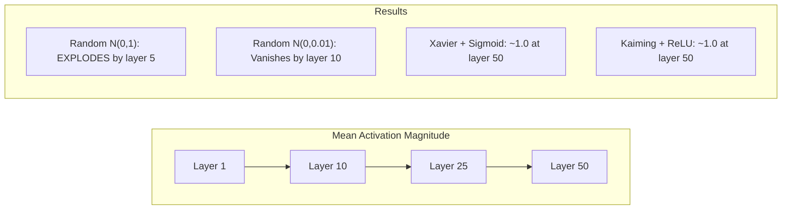
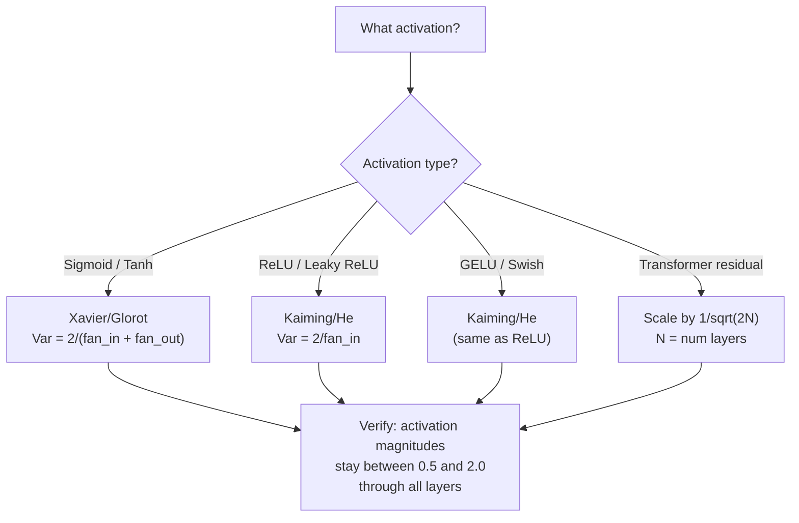

# 权重初始化与训练稳定性

> 初始化错误，训练无法开始。初始化正确，50层的训练会像3层一样平稳。

**类型:** 构建  
**语言:** Python  
**先决条件:** 第03.04课（激活函数），第03.07课（正则化）  
**时间:** ~90分钟

## 学习目标

- 实现零初始化、随机初始化、Xavier/Glorot初始化和Kaiming/He初始化策略，并通过50层测量它们对激活值大小的影响
- 推导Xavier初始化使用Var(w) = 2/(fan_in + fan_out)和Kaiming初始化使用Var(w) = 2/fan_in的原因
- 演示零初始化的对称性问题，并解释为什么仅使用随机尺度是不够的
- 将正确的初始化策略与激活函数匹配：Xavier用于sigmoid/tanh，Kaiming用于ReLU/GELU

## 问题

将所有权重初始化为零。什么也学不到。每个神经元计算相同的函数，接收相同的梯度，并以相同的方式更新。经过10,000个周期后，你的512个神经元的隐藏层仍然是512个相同神经元的复制。你支付了512个参数的代价，却只得到了1个。

将它们初始化得太大。激活值在网络中爆炸。到第10层时，数值达到1e15。到第20层时，它们溢出到无穷大。梯度则以相反的轨迹沿着网络传播。

从标准正态分布中随机初始化它们。对于3层有效。在50层时，信号会因为随机尺度稍微过小或稍微过大而坍缩到零或爆炸到无穷大。"有效"和"失效"之间的界限非常细微。

权重初始化是深度学习中最被低估的决定。架构会带来论文。优化器会带来博客文章。初始化则只是一个脚注。但如果你搞错了，其他一切都无关紧要——你的网络在训练开始前就已经死了。

## 概念

### 对称性问题

一层中每个神经元的结构都相同：将输入乘以权重，加上偏置，应用激活函数。如果所有权重都从相同的值（零是极端情况）开始，每个神经元计算的输出都相同。在反向传播过程中，每个神经元接收的梯度也相同。在更新步骤中，每个神经元的变化量也相同。

你被困住了。网络有数百个参数，但它们都以相同的方式移动。这被称为对称性，而随机初始化是打破对称性的暴力方法。每个神经元在权重空间中以不同的起点开始，因此每个神经元学习不同的特征。

但“随机”是不够的。*随机的尺度*决定了网络是否能够训练。

### 通过层的方差传播

考虑一个具有fan_in输入的单层：

```
z = w1*x1 + w2*x2 + ... + w_n*x_n
```

如果每个权重 $ w_i $ 是从一个方差为 $ \text{Var}(w) $ 的分布中抽取的，每个输入 $ x_i $ 的方差为 $ \text{Var}(x) $，则输出方差为：

```
Var(z) = fan_in * Var(w) * Var(x)
```

如果 Var(w) = 1 且 fan_in = 512，输出方差是输入方差的 512 倍。经过 10 层后：512^10 = 1.2e27。你的信号已经爆炸了。

如果 Var(w) = 0.001，输出方差每层缩小 0.001 * 512 = 0.512。经过 10 层后：0.512^10 = 0.00013。你的信号已经消失了。

目标：选择 Var(w)，使得 Var(z) = Var(x)。信号幅度在各层之间保持恒定。

### Xavier/Glorot 初始化

Glorot 和 Bengio（2010）为 sigmoid 和 tanh 激活函数推导了解决方案。为了在正向和反向传播中保持方差恒定：

```
Var(w) = 2 / (fan_in + fan_out)
```

实际上，权重是从以下位置获取的：

```
w ~ Uniform(-limit, limit)  where limit = sqrt(6 / (fan_in + fan_out))
```

或者：

```
w ~ Normal(0, sqrt(2 / (fan_in + fan_out)))
```

这之所以有效，是因为 sigmoid 和 tanh 在零附近大致是线性的，而经过适当初始化的激活值就位于这个区域。方差在数十层中保持稳定。

### Kaiming/He 初始化

ReLU 会将一半的输出置零（所有负值都变为零）。由于平均有一半的输入被置零，因此有效输入数量（fan_in）被减半。Xavier 初始化没有考虑到这一点——它低估了所需的方差。

He 等人（2015）调整了公式：

```
Var(w) = 2 / fan_in
```

权重来自：

```
w ~ Normal(0, sqrt(2 / fan_in))
```

因子2补偿了ReLU将一半激活值置零的问题。如果没有这个因子，信号每层会缩小约0.5倍。50层后：0.5^50 = 8.8e-16。Kaiming初始化可以防止这种情况。

### Transformer 初始化

GPT-2 引入了不同的模式。残差连接将每个子层的输出加到其输入上：

```
x = x + sublayer(x)
```

每次添加都会增加方差。拥有 N 个残差层时，方差与 N 成正比增长。GPT-2 通过将残差层的权重按 1/sqrt(2N) 进行缩放，其中 N 是层数，从而保持累积信号幅度的稳定。

Llama 3（405B 参数，126 层）使用了类似的方案。如果没有这种缩放，残差流在经过 126 层注意力和前馈模块时会无限制增长。

```mermaid
flowchart TD
    subgraph "Zero Init"
        Z1["Layer 1<br/>All weights = 0"] --> Z2["Layer 2<br/>All neurons identical"]
        Z2 --> Z3["Layer 3<br/>Still identical"]
        Z3 --> ZR["Result: 1 effective neuron<br/>regardless of width"]
    end

    subgraph "Xavier Init"
        X1["Layer 1<br/>Var = 2/(fan_in+fan_out)"] --> X2["Layer 2<br/>Signal stable"]
        X2 --> X3["Layer 50<br/>Signal stable"]
        X3 --> XR["Result: Trains with<br/>sigmoid/tanh"]
    end

    subgraph "Kaiming Init"
        K1["Layer 1<br/>Var = 2/fan_in"] --> K2["Layer 2<br/>Signal stable"]
        K2 --> K3["Layer 50<br/>Signal stable"]
        K3 --> KR["Result: Trains with<br/>ReLU/GELU"]
    end
```



### 50层中的激活幅度



### 选择合适的 Init



```figure
weight-init-variance
```

## 构建它

### 第一步：初始化策略

初始化权重矩阵的四种方式。每种方式都返回一个二维矩阵（列表的列表），具有 fan_in 列和 fan_out 行。

```python
import math
import random


def zero_init(fan_in, fan_out):
    return [[0.0 for _ in range(fan_in)] for _ in range(fan_out)]


def random_init(fan_in, fan_out, scale=1.0):
    return [[random.gauss(0, scale) for _ in range(fan_in)] for _ in range(fan_out)]


def xavier_init(fan_in, fan_out):
    std = math.sqrt(2.0 / (fan_in + fan_out))
    return [[random.gauss(0, std) for _ in range(fan_in)] for _ in range(fan_out)]


def kaiming_init(fan_in, fan_out):
    std = math.sqrt(2.0 / fan_in)
    return [[random.gauss(0, std) for _ in range(fan_in)] for _ in range(fan_out)]
```

### 步骤 2：激活函数

我们需要 sigmoid、tanh 和 ReLU，以便用其对应的激活函数来测试每种初始化策略。

```python
def sigmoid(x):
    x = max(-500, min(500, x))
    return 1.0 / (1.0 + math.exp(-x))


def tanh_act(x):
    return math.tanh(x)


def relu(x):
    return max(0.0, x)
```

### 步骤 3：通过 50 层的前向传播

将随机数据通过一个深度网络进行传播，并在每一层测量平均激活幅度。

```python
def forward_deep(init_fn, activation_fn, n_layers=50, width=64, n_samples=100):
    random.seed(42)
    layer_magnitudes = []

    inputs = [[random.gauss(0, 1) for _ in range(width)] for _ in range(n_samples)]

    for layer_idx in range(n_layers):
        weights = init_fn(width, width)
        biases = [0.0] * width

        new_inputs = []
        for sample in inputs:
            output = []
            for neuron_idx in range(width):
                z = sum(weights[neuron_idx][j] * sample[j] for j in range(width)) + biases[neuron_idx]
                output.append(activation_fn(z))
            new_inputs.append(output)
        inputs = new_inputs

        magnitudes = []
        for sample in inputs:
            magnitudes.append(sum(abs(v) for v in sample) / width)
        mean_mag = sum(magnitudes) / len(magnitudes)
        layer_magnitudes.append(mean_mag)

    return layer_magnitudes
```

### 步骤 4：实验

运行所有组合：零初始化、随机 N(0,1)、随机 N(0,0.01)、带 sigmoid 的 Xavier、带 tanh 的 Xavier、带 ReLU 的 Kaiming。打印关键层的幅度。

```python
def run_experiment():
    configs = [
        ("Zero init + Sigmoid", lambda fi, fo: zero_init(fi, fo), sigmoid),
        ("Random N(0,1) + ReLU", lambda fi, fo: random_init(fi, fo, 1.0), relu),
        ("Random N(0,0.01) + ReLU", lambda fi, fo: random_init(fi, fo, 0.01), relu),
        ("Xavier + Sigmoid", xavier_init, sigmoid),
        ("Xavier + Tanh", xavier_init, tanh_act),
        ("Kaiming + ReLU", kaiming_init, relu),
    ]

    print(f"{'Strategy':<30} {'L1':>10} {'L5':>10} {'L10':>10} {'L25':>10} {'L50':>10}")
    print("-" * 80)

    for name, init_fn, act_fn in configs:
        mags = forward_deep(init_fn, act_fn)
        row = f"{name:<30}"
        for idx in [0, 4, 9, 24, 49]:
            val = mags[idx]
            if val > 1e6:
                row += f" {'EXPLODED':>10}"
            elif val < 1e-6:
                row += f" {'VANISHED':>10}"
            else:
                row += f" {val:>10.4f}"
        print(row)
```

### 步骤 5：对称性演示

展示零初始化如何产生相同的神经元。

```python
def symmetry_demo():
    random.seed(42)
    weights = zero_init(2, 4)
    biases = [0.0] * 4

    inputs = [0.5, -0.3]
    outputs = []
    for neuron_idx in range(4):
        z = sum(weights[neuron_idx][j] * inputs[j] for j in range(2)) + biases[neuron_idx]
        outputs.append(sigmoid(z))

    print("\nSymmetry Demo (4 neurons, zero init):")
    for i, out in enumerate(outputs):
        print(f"  Neuron {i}: output = {out:.6f}")
    all_same = all(abs(outputs[i] - outputs[0]) < 1e-10 for i in range(len(outputs)))
    print(f"  All identical: {all_same}")
    print(f"  Effective parameters: 1 (not {len(weights) * len(weights[0])})")
```

### 步骤 6：逐层幅度报告

打印一个通过 50 层激活幅度的可视化条形图。

```python
def magnitude_report(name, magnitudes):
    print(f"\n{name}:")
    for i, mag in enumerate(magnitudes):
        if i % 5 == 0 or i == len(magnitudes) - 1:
            if mag > 1e6:
                bar = "X" * 50 + " EXPLODED"
            elif mag < 1e-6:
                bar = "." + " VANISHED"
            else:
                bar_len = min(50, max(1, int(mag * 10)))
                bar = "#" * bar_len
            print(f"  Layer {i+1:3d}: {bar} ({mag:.6f})")
```

## 使用它

PyTorch 提供这些作为内置函数：

```python
import torch
import torch.nn as nn

layer = nn.Linear(512, 256)

nn.init.xavier_uniform_(layer.weight)
nn.init.xavier_normal_(layer.weight)

nn.init.kaiming_uniform_(layer.weight, nonlinearity='relu')
nn.init.kaiming_normal_(layer.weight, nonlinearity='relu')

nn.init.zeros_(layer.bias)
```

当你调用 `nn.Linear(512, 256)` 时，PyTorch 默认使用 Kaiming 均匀初始化。这就是为什么大多数简单网络“直接可用”的原因 —— PyTorch 已经做出了正确的选择。但当你构建自定义架构或层数超过 20 层时，你需要理解正在发生的事情，并可能覆盖默认设置。

对于 Transformer，HuggingFace 模型通常在其 `_init_weights` 方法中处理初始化。GPT-2 的实现通过 1/sqrt(N) 对残差投影进行缩放。如果你从零开始构建 Transformer，你需要自己添加这个功能。

## 发布它

本课将产出：
- `outputs/prompt-init-strategy.md` —— 一个用于诊断权重初始化问题并推荐合适策略的提示

## 练习

1. 添加 LeCun 初始化（Var = 1/fan_in，专为 SELU 激活函数设计）。使用 LeCun 初始化 + tanh 运行 50 层实验，并与 Xavier + tanh 进行比较。

2. 实现 GPT-2 的残差缩放：在将每一层的输出添加到残差流之前，将其乘以 1/sqrt(2*N)。运行有和没有缩放的 50 层网络，测量残差幅度增长的速度。

3. 创建一个“初始化健康检查”函数，该函数接收网络的层维度和激活类型，然后推荐正确的初始化方法，并在当前初始化可能导致问题时发出警告。

4. 运行 fan_in = 16 与 fan_in = 1024 的实验。Xavier 和 Kaiming 初始化会适应 fan_in，但随机初始化不会。展示随着层数变大，“正常工作”与“崩溃”之间的差距如何扩大。

5. 实现正交初始化（生成一个随机矩阵，计算其 SVD，使用正交矩阵 U）。在 50 层的 ReLU 网络中与 Kaiming 初始化进行比较。

## 关键术语

| 术语 | 人们常说 | 实际含义 |
|------|----------------|-----------------------------|
| 权重初始化 | “随机设置初始权重” | 选择初始权重值的策略，决定了网络是否能够训练 |
| 对称性打破 | “使神经元不同” | 使用随机初始化确保神经元学习不同的特征，而不是计算相同的函数 |
| fan-in | “神经元的输入数量” | 输入连接的数量，决定了加权和中输入方差的累积方式 |
| fan-out | “神经元的输出数量” | 输出连接的数量，在反向传播过程中与梯度方差的保持有关 |
| Xavier/Glorot 初始化 | “Sigmoid 初始化” | Var(w) = 2/(fan_in + fan_out)，专为通过 Sigmoid 和 Tanh 激活函数保持方差而设计 |
| Kaiming/He 初始化 | “ReLU 初始化” | Var(w) = 2/fan_in，考虑了 ReLU 会将一半激活值置零 |
| 方差传播 | “信号如何在各层增长或缩小” | 通过数学分析，研究激活方差如何逐层变化，基于权重的尺度 |
| 残差缩放 | “GPT-2 的初始化技巧” | 通过 1/sqrt(2N) 缩放残差连接权重，防止通过 N 个 Transformer 层时方差增长 |
| 死亡网络 | “什么都没训练” | 由于初始化不当导致所有梯度都为零或所有激活都饱和的网络 |
| 激活值爆炸 | “值趋向于无穷大” | 当权重方差过高时，导致激活值幅度在各层指数级增长 |

## 进一步阅读

- Glorot & Bengio, "Understanding the difficulty of training deep feedforward neural networks" (2010) —— 原始的 Xavier 初始化论文，包含方差分析
- He 等, "Delving Deep into Rectifiers" (2015) —— 为 ReLU 网络引入了 Kaiming 初始化
- Radford 等, "Language Models are Unsupervised Multitask Learners" (2019) —— 包含残差缩放初始化的 GPT-2 论文
- Mishkin & Matas, "All You Need is a Good Init" (2016) —— 层序单位方差初始化，是一种经验性的替代分析公式的方法
