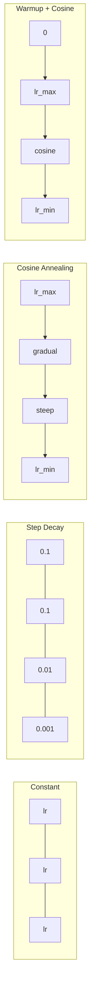
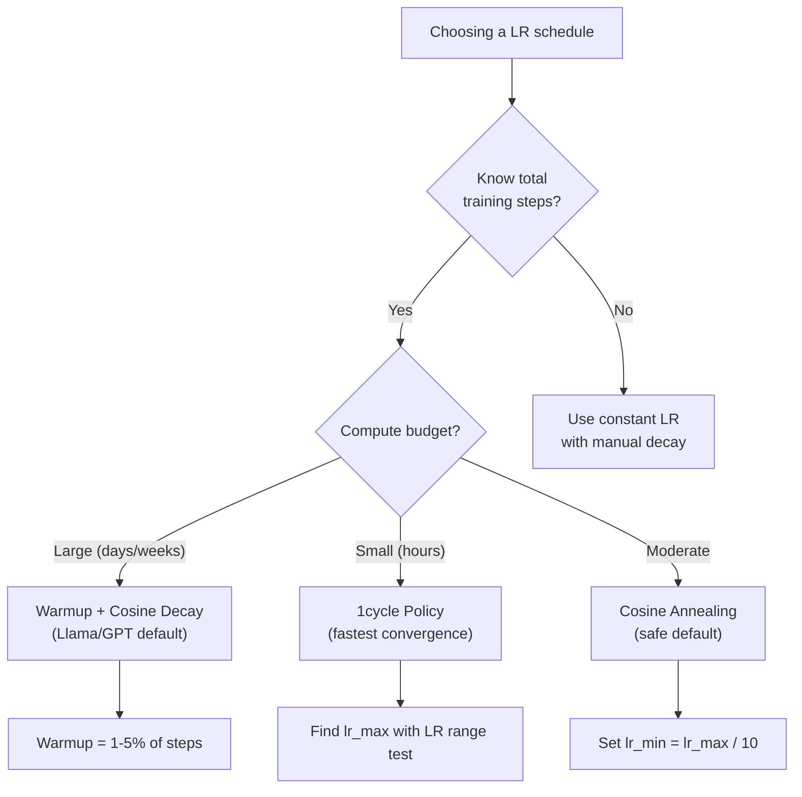
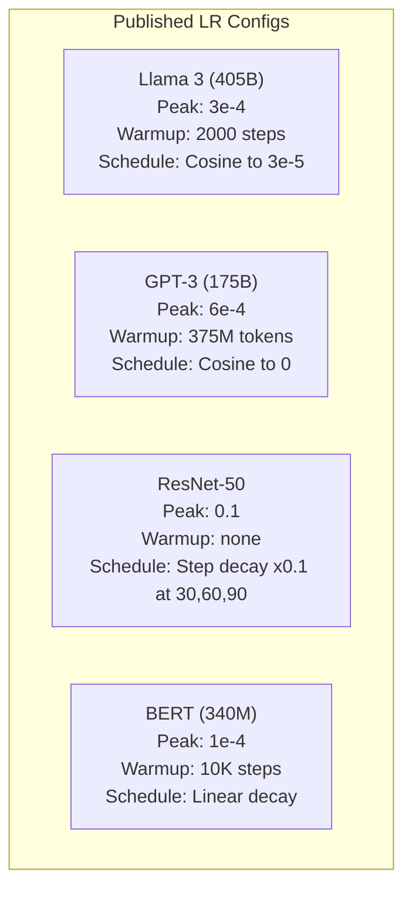

# 学习率调度和预热

> 学习率是最重要的超参数。不是架构。不是数据集大小。不是激活函数。是学习率。如果你不调整其他任何东西，就调整这个。

**类型:** 构建
**语言:** Python
**先决条件:** 第03.06课（优化器），第03.08课（权重初始化）
**时间:** ~90分钟

## 学习目标

- 从零开始实现常数、分步衰减、余弦退火、预热 + 余弦和1cycle学习率调度
- 演示学习率选择的三种失败模式：发散（过高）、停滞（过低）和震荡（无衰减）
- 解释为什么基于Adam的优化器需要预热以及它如何稳定早期训练
- 在相同任务上比较所有五种调度的收敛速度，并根据给定的训练预算选择适当的调度

## 问题

将学习率设置为0.1。训练发散——损失在3步内跳到无限大。将其设置为0.0001。训练缓慢——经过100个epochs后，模型几乎没有任何变化。将其设置为0.01。训练在50个epochs后有效，但损失在无法达到的最小值周围震荡，因为步长太大。

最优学习率不是常数。它在训练过程中发生变化。早期，你希望有较大的步长，以快速覆盖地面。在训练后期，你希望有微小的步长，以稳定到一个尖锐的最小值。90%准确率模型和95%准确率模型之间的差异通常只是调度的不同。

过去三年发表的每个重要模型都使用了学习率调度。Llama 3使用了peak lr=3e-4，2000步预热和余弦衰减到3e-5。GPT-3使用了lr=6e-4，并在3.75亿个token上进行预热。这些选择并非随意。它们是大量超参数扫描的结果，这些扫描花费了数百万美元。

你需要理解调度，因为默认设置不会适用于你的问题。当你微调一个预训练模型时，正确的调度与从头开始训练不同。当你增加批量大小时，预热期需要改变。当训练在第10,000步时崩溃，你需要知道这是调度问题还是其他问题。

## 概念

### 常数学习率

最简单的方法。选择一个数字，每一步都使用它。

```
lr(t) = lr_0
```

很少达到最优。学习率要么在训练后期太高（在最小值附近震荡），要么在训练初期太低（在微小的步骤上浪费计算资源）。对于小型模型和调试来说工作良好。但对于任何训练时间超过一小时的任务来说，这是一个糟糕的选择。

### 步长衰减（Step Decay）

来自ResNet时代的传统方法。在固定的一些epoch之后，将学习率按一个固定比例（通常是10倍）降低。

```
lr(t) = lr_0 * gamma^(floor(epoch / step_size))
```

其中 gamma = 0.1 且 step_size = 30 表示：每 30 个 epoch，学习率（lr）下降为原来的 1/10。ResNet-50 使用了这个设置 -- 初始 lr=0.1，在第 30、60 和 90 个 epoch 时，学习率下降为原来的 1/10。

问题在于：最优的衰减点取决于数据集和模型架构。当转移到不同的问题时，需要重新调整衰减的时间点。这些变化是突然的 -- 当学习率突然变化时，损失可能会出现尖峰。

### 余弦退火（Cosine Annealing）

从最大学习率平滑地衰减到最小值，遵循余弦曲线：

```
lr(t) = lr_min + 0.5 * (lr_max - lr_min) * (1 + cos(pi * t / T))
```

其中，t 是当前步骤，T 是总步骤数。

在 t=0 时，余弦项为 1，因此 lr = lr_max。在 t=T 时，余弦项为 -1，因此 lr = lr_min。学习率的衰减在开始时较为平缓，中间阶段加速，接近结束时又变得平缓。

这是大多数现代训练运行的默认设置。除了 lr_max 和 lr_min 之外，无需调整其他超参数。余弦形状与经验观察相符，即大多数学习发生在训练的中期——你希望在这一关键阶段有合理的学习率步长。

### 预热（Warmup）：为什么你从很小的学习率开始

Adam 和其他自适应优化器会维护梯度均值和方差的运行估计。在第 0 步时，这些估计值被初始化为零。前几步的梯度更新基于垃圾统计信息。如果在此期间学习率较大，模型会迈出巨大且方向不明确的步骤。

预热可以解决这个问题。从一个极小的学习率（通常为 lr_max / warmup_steps，甚至为零）开始，然后在前 N 步内线性增加到 lr_max。当你达到完整的学习率时，Adam 的统计信息已经稳定。

```
lr(t) = lr_max * (t / warmup_steps)     for t < warmup_steps
```

典型的预热阶段：总训练步数的1-5%。Llama 3训练了约1.8万亿个token，并进行了2000步的预热。GPT-3预热了超过3.75亿个token。

### 线性预热 + 余弦衰减

现代的默认方法。线性增加，然后使用余弦函数衰减：

```
if t < warmup_steps:
    lr(t) = lr_max * (t / warmup_steps)
else:
    progress = (t - warmup_steps) / (total_steps - warmup_steps)
    lr(t) = lr_min + 0.5 * (lr_max - lr_min) * (1 + cos(pi * progress))
```

这就是 Llama、GPT、PaLM 和大多数现代 transformer 模型所使用的方法。预热阶段可以防止早期的不稳定性。余弦衰减则使模型收敛到一个较好的最小值。

### 1cycle 策略

Leslie Smith 的发现（2018）：在训练的前半段，将学习率从一个低值增加到一个高值，然后在后半段再将其降低回来。这似乎违反直觉——为什么要在训练中途 *增加* 学习率？

理论依据：较高的学习率通过向优化轨迹添加噪声，起到了正则化的作用。在学习率上升阶段，模型可以探索损失景观的更多区域，找到更优的盆地。随后的学习率下降阶段则会在找到的最佳盆地中进行精细化调整。

```
Phase 1 (0 to T/2):    lr ramps from lr_max/25 to lr_max
Phase 2 (T/2 to T):    lr ramps from lr_max to lr_max/10000
```1cycle 通常在固定的计算预算下比余弦退火训练得更快。权衡：你必须提前知道总步数。

### 调度形状



### 决策流程图



### 从已发布模型中获取实数



```figure
lr-schedule
```

## 构建它

### 第一步：安排函数

每个函数接收当前步骤，并返回该步骤的学习率。

```python
import math


def constant_schedule(step, lr=0.01, **kwargs):
    return lr


def step_decay_schedule(step, lr=0.1, step_size=100, gamma=0.1, **kwargs):
    return lr * (gamma ** (step // step_size))


def cosine_schedule(step, lr=0.01, total_steps=1000, lr_min=1e-5, **kwargs):
    if step >= total_steps:
        return lr_min
    return lr_min + 0.5 * (lr - lr_min) * (1 + math.cos(math.pi * step / total_steps))


def warmup_cosine_schedule(step, lr=0.01, total_steps=1000, warmup_steps=100, lr_min=1e-5, **kwargs):
    if total_steps <= warmup_steps:
        return lr * (step / max(warmup_steps, 1))
    if step < warmup_steps:
        return lr * step / warmup_steps
    progress = (step - warmup_steps) / (total_steps - warmup_steps)
    return lr_min + 0.5 * (lr - lr_min) * (1 + math.cos(math.pi * progress))


def one_cycle_schedule(step, lr=0.01, total_steps=1000, **kwargs):
    mid = max(total_steps // 2, 1)
    if step < mid:
        return (lr / 25) + (lr - lr / 25) * step / mid
    else:
        progress = (step - mid) / max(total_steps - mid, 1)
        return lr * (1 - progress) + (lr / 10000) * progress
```

### 步骤 2：可视化所有计划

打印一个基于文本的图表，显示每个计划在训练过程中的演变情况。

```python
def visualize_schedule(name, schedule_fn, total_steps=500, **kwargs):
    steps = list(range(0, total_steps, total_steps // 20))
    if total_steps - 1 not in steps:
        steps.append(total_steps - 1)

    lrs = [schedule_fn(s, total_steps=total_steps, **kwargs) for s in steps]
    max_lr = max(lrs) if max(lrs) > 0 else 1.0

    print(f"\n{name}:")
    for s, lr_val in zip(steps, lrs):
        bar_len = int(lr_val / max_lr * 40)
        bar = "#" * bar_len
        print(f"  Step {s:4d}: lr={lr_val:.6f} {bar}")
```

### 第三步：训练网络

在圆数据集上使用一个简单的两层网络，与之前的课程相同，但现在我们改变训练计划。

```python
import random


def sigmoid(x):
    x = max(-500, min(500, x))
    return 1.0 / (1.0 + math.exp(-x))


def relu(x):
    return max(0.0, x)


def relu_deriv(x):
    return 1.0 if x > 0 else 0.0


def make_circle_data(n=200, seed=42):
    random.seed(seed)
    data = []
    for _ in range(n):
        x = random.uniform(-2, 2)
        y = random.uniform(-2, 2)
        label = 1.0 if x * x + y * y < 1.5 else 0.0
        data.append(([x, y], label))
    return data


def train_with_schedule(schedule_fn, schedule_name, data, epochs=300, base_lr=0.05, **kwargs):
    random.seed(0)
    hidden_size = 8
    total_steps = epochs * len(data)

    std = math.sqrt(2.0 / 2)
    w1 = [[random.gauss(0, std) for _ in range(2)] for _ in range(hidden_size)]
    b1 = [0.0] * hidden_size
    w2 = [random.gauss(0, std) for _ in range(hidden_size)]
    b2 = 0.0

    step = 0
    epoch_losses = []

    for epoch in range(epochs):
        total_loss = 0
        correct = 0

        for x, target in data:
            lr = schedule_fn(step, lr=base_lr, total_steps=total_steps, **kwargs)

            z1 = []
            h = []
            for i in range(hidden_size):
                z = w1[i][0] * x[0] + w1[i][1] * x[1] + b1[i]
                z1.append(z)
                h.append(relu(z))

            z2 = sum(w2[i] * h[i] for i in range(hidden_size)) + b2
            out = sigmoid(z2)

            error = out - target
            d_out = error * out * (1 - out)

            for i in range(hidden_size):
                d_h = d_out * w2[i] * relu_deriv(z1[i])
                w2[i] -= lr * d_out * h[i]
                for j in range(2):
                    w1[i][j] -= lr * d_h * x[j]
                b1[i] -= lr * d_h
            b2 -= lr * d_out

            total_loss += (out - target) ** 2
            if (out >= 0.5) == (target >= 0.5):
                correct += 1
            step += 1

        avg_loss = total_loss / len(data)
        accuracy = correct / len(data) * 100
        epoch_losses.append(avg_loss)

    return epoch_losses
```

### 步骤 4：比较所有计划

使用每个计划训练相同的网络，并比较最终损失和收敛行为。

```python
def compare_schedules(data):
    configs = [
        ("Constant", constant_schedule, {}),
        ("Step Decay", step_decay_schedule, {"step_size": 15000, "gamma": 0.1}),
        ("Cosine", cosine_schedule, {"lr_min": 1e-5}),
        ("Warmup+Cosine", warmup_cosine_schedule, {"warmup_steps": 3000, "lr_min": 1e-5}),
        ("1cycle", one_cycle_schedule, {}),
    ]

    print(f"\n{'Schedule':<20} {'Start Loss':>12} {'Mid Loss':>12} {'End Loss':>12} {'Best Loss':>12}")
    print("-" * 70)

    for name, schedule_fn, extra_kwargs in configs:
        losses = train_with_schedule(schedule_fn, name, data, epochs=300, base_lr=0.05, **extra_kwargs)
        mid_idx = len(losses) // 2
        best = min(losses)
        print(f"{name:<20} {losses[0]:>12.6f} {losses[mid_idx]:>12.6f} {losses[-1]:>12.6f} {best:>12.6f}")
```

### 步骤 5：学习率过高 vs 过低

演示三种失败模式：过高（发散）、过低（缓慢收敛）和恰到好处。

```python
def lr_sensitivity(data):
    learning_rates = [1.0, 0.1, 0.01, 0.001, 0.0001]

    print("\nLR Sensitivity (constant schedule, 100 epochs):")
    print(f"  {'LR':>10} {'Start Loss':>12} {'End Loss':>12} {'Status':>15}")
    print("  " + "-" * 52)

    for lr in learning_rates:
        losses = train_with_schedule(constant_schedule, f"lr={lr}", data, epochs=100, base_lr=lr)
        start = losses[0]
        end = losses[-1]

        if end > start or math.isnan(end) or end > 1.0:
            status = "DIVERGED"
        elif end > start * 0.9:
            status = "BARELY MOVED"
        elif end < 0.15:
            status = "CONVERGED"
        else:
            status = "LEARNING"

        end_str = f"{end:.6f}" if not math.isnan(end) else "NaN"
        print(f"  {lr:>10.4f} {start:>12.6f} {end_str:>12} {status:>15}")
```

## 使用它

PyTorch 在 `torch.optim.lr_scheduler` 中提供了调度器：

```python
import torch
import torch.optim as optim
from torch.optim.lr_scheduler import CosineAnnealingLR, OneCycleLR, StepLR

model = nn.Sequential(nn.Linear(10, 64), nn.ReLU(), nn.Linear(64, 1))
optimizer = optim.Adam(model.parameters(), lr=3e-4)

scheduler = CosineAnnealingLR(optimizer, T_max=1000, eta_min=1e-5)

for step in range(1000):
    loss = train_step(model, optimizer)
    scheduler.step()
```

对于 warmup + cosine，使用一个 lambda 调度器或来自 HuggingFace 的 `get_cosine_schedule_with_warmup`：

```python
from transformers import get_cosine_schedule_with_warmup

scheduler = get_cosine_schedule_with_warmup(
    optimizer,
    num_warmup_steps=2000,
    num_training_steps=100000,
)
```HuggingFace 函数是大多数 Llama 和 GPT 微调脚本所使用的。如有疑问，使用预热 + 余弦函数，预热步数为总步数的 3-5%。这种方法几乎适用于所有情况。

## 发布它

本课将产出：
- `outputs/prompt-lr-schedule-advisor.md` -- 一个提示，推荐适合你的训练设置的学习率计划和超参数

## 练习

1. 实现指数衰减：lr(t) = lr_0 * gamma^t，其中 gamma = 0.999。在圆数据集上与余弦退火进行比较。

2. 实现学习率范围测试（Leslie Smith）：在训练几百步的过程中，将学习率从 1e-7 指数增加到 1。绘制损失与学习率的关系图。最佳最大学习率是在损失开始增加之前。

3. 使用预热 + 余弦函数进行训练，但改变预热的长度：0%、1%、5%、10%、20% 的总步数。找到训练最稳定的最佳点。

4. 实现带有预热重启的余弦退火（SGDR）：每 T 步将学习率重置为 lr_max 并再次衰减。与标准余弦退火在更长的训练运行中进行比较。

5. 构建一个“调度手术师”，它监控训练损失，并在损失稳定时自动从预热切换到余弦退火，如果损失长时间停滞，则降低学习率。

## 关键术语

| 术语 | 人们常说 | 实际含义 |
|------|----------------|------------------------|
| 学习率 | “模型学习的速度” | 一个标量，用于乘以梯度以确定参数更新的大小 |
| 调度 | “随着时间改变学习率” | 一个将训练步骤映射到学习率的函数，用于优化收敛 |
| 预热 | “从一个小学习率开始” | 在最初的 N 步中，线性地将学习率从接近零增加到目标值，以稳定优化器统计信息 |
| 余弦退火 | “平滑的学习率衰减” | 在训练过程中，根据余弦曲线从 lr_max 降低到 lr_min 的学习率 |
| 步长衰减 | “在里程碑处降低学习率” | 在固定的周期间隔中，将学习率乘以一个因子（通常是 0.1） |
| 1cycle 策略 | “先上升后下降” | Leslie Smith 提出的在单个周期中先上升后下降学习率的方法，以实现更快的收敛 |
| 学习率范围测试 | “找到最佳学习率” | 在短时间内增加学习率进行训练，以找到损失开始发散的值 |
| 带有预热重启的余弦退火 | “重置并重复” | 周期性地将学习率重置为 lr_max 并再次衰减（SGDR） |
| Eta min | “学习率的下限” | 调度衰减到的最小学习率 |
| 峰值学习率 | “最大学习率” | 训练过程中达到的最高学习率，通常在预热之后 |

## 进一步阅读

- Loshchilov & Hutter, "SGDR: Stochastic Gradient Descent with Warm Restarts" (2017) -- 引入了余弦退火和预热重启
- Smith, "Super-Convergence: Very Fast Training of Neural Networks Using Large Learning Rates" (2018) -- 1cycle 策略论文
- Touvron 等人, "Llama 2: Open Foundation and Fine-Tuned Chat Models" (2023) -- 记录了在大规模训练中使用的预热 + 余弦计划
- Goyal 等人, "Accurate, Large Minibatch SGD: Training ImageNet in 1 Hour" (2017) -- 大批量训练的线性缩放规则和预热
