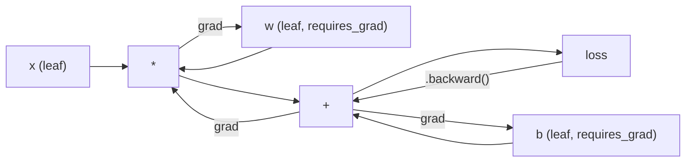
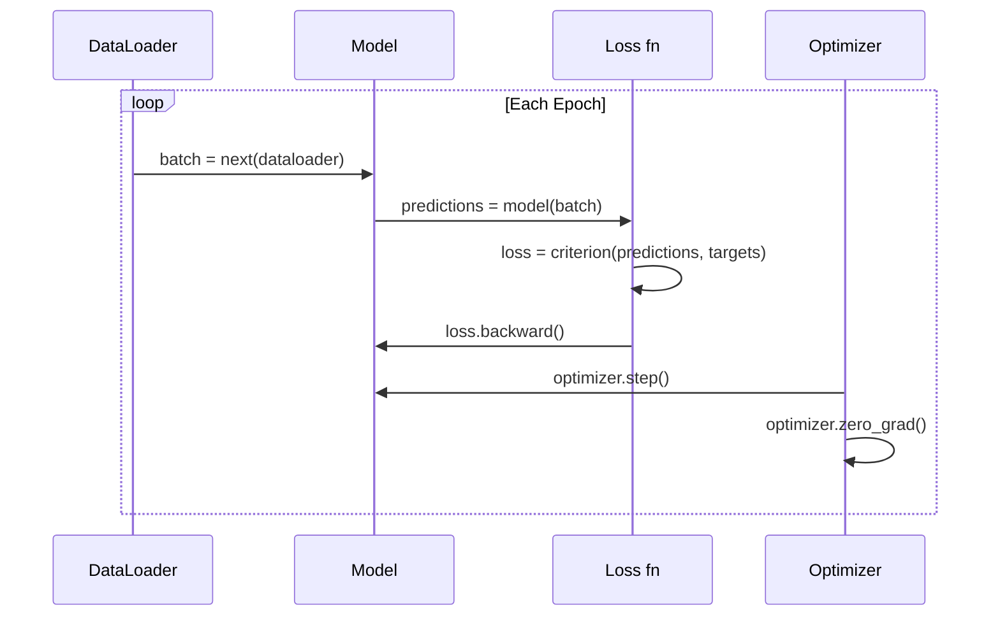

# PyTorch 简介

> 你用活塞和曲轴制造了引擎。现在来学习大家实际驾驶的那个。

**类型:** 构建  
**语言:** Python  
**先决条件:** 第 03.10 课（构建你自己的小型框架）  
**时间:** ~75 分钟

## 学习目标

- 使用 PyTorch 的 `nn.Module`、`nn.Sequential` 和 `autograd` 构建和训练神经网络
- 使用 PyTorch 张量、GPU 加速和标准训练循环（zero_grad、forward、loss、backward、step）
- 将你从头开始构建的小型框架组件转换为 PyTorch 的等效组件
- 对比分析你在纯 Python 框架和 PyTorch 上执行相同任务的训练速度

## 问题描述

你已经拥有了一个可用的小型框架。线性层、ReLU、Dropout、BatchNorm、Adam、DataLoader、训练循环。它在纯 Python 中训练一个用于圆分类问题的 4 层网络。

它在相同问题上比 PyTorch 慢 500 倍。

你的小型框架使用嵌套的 Python 循环一次处理一个样本。而 PyTorch 将相同的操作分派给优化过的 C++/CUDA 内核，并在 GPU 上运行。在一个 NVIDIA A100 上，PyTorch 在 ImageNet（1.28M 图像）上训练一个 ResNet-50（25.6M 参数）大约需要 6 小时。你的框架在相同任务上需要大约 3000 小时——如果它不会先因内存不足而崩溃的话。

速度并不是唯一的差距。你的框架没有 GPU 支持。没有自动微分——你为每个模块手动编写了 `backward()`。没有序列化。没有分布式训练。没有混合精度。没有不使用打印语句的方式调试梯度流动。

PyTorch 填补了所有这些差距。同时，它保持了你已经构建的相同思维模型：Module、forward()、parameters()、backward()、optimizer.step()。这些概念一一对应。语法几乎相同。区别在于，PyTorch 在你从零设计的接口后封装了十年的系统工程。

## 概念

### 为什么 PyTorch 赢了

2015 年，TensorFlow 要求你在运行任何操作之前定义一个静态的计算图。你构建图、编译它，然后将数据通过它。调试意味着盯着图的可视化。改变架构意味着从头重新构建图。

2017 年，PyTorch 以不同的哲学推出：即时执行。你编写 Python 代码，它立即运行。`y = model(x)` 实际上现在就计算 y，而不是“添加一个稍后会计算 y 的节点”。这意味着标准的 Python 调试工具可以工作。`print()` 可以工作。`pdb` 可以工作。你的前向传递中的 `if/else` 可以工作。

到 2020 年，市场已经说话了。PyTorch 在机器学习研究论文中的占比从 2017 年的 7% 增加到 2022 年的 75% 以上。Meta、Google DeepMind、OpenAI、Anthropic 和 Hugging Face 都将 PyTorch 作为其主要框架。TensorFlow 2.x 随后采用了即时执行——默许承认 PyTorch 的设计是正确的。

教训：开发人员体验会复合增长。一个比 PyTorch 慢 10% 但调试速度快 50% 的框架每次都会赢。

### 张量

张量是一个具有三个关键属性的多维数组：形状、数据类型和设备。

```python
import torch

x = torch.zeros(3, 4)           # shape: (3, 4), dtype: float32, device: cpu
x = torch.randn(2, 3, 224, 224) # batch of 2 RGB images, 224x224
x = torch.tensor([1, 2, 3])     # from a Python list
```**Shape** 是维度。标量的形状为 ()，向量的形状为 (n,)，矩阵的形状为 (m, n)，图像批次的形状为 (batch, channels, height, width)。

**Dtype** 控制精度和内存。

| dtype | Bits | Range | Use case |
|-------|------|-------|----------|
| float32 | 32 | ~7 位小数 | 默认训练 |
| float16 | 16 | ~3.3 位小数 | 混合精度 |
| bfloat16 | 16 | 与 float32 相同的范围，但精度较低 | 大型语言模型训练 |
| int8 | 8 | -128 到 127 | 量化推理 |

**Device** 确定计算发生的位置。

```python
device = torch.device("cuda" if torch.cuda.is_available() else "cpu")
x = torch.randn(3, 4, device=device)
x = x.to("cuda")
x = x.cpu()
```

每个操作都需要所有张量位于同一设备上。这是新手最常遇到的 #1 PyTorch 错误：`RuntimeError: Expected all tensors to be on the same device`。在计算之前，通过将所有内容移动到同一设备上来解决这个问题。

**重塑**是常数时间操作 -- 它改变的是元数据，而不是数据本身。

```python
x = torch.randn(2, 3, 4)
x.view(2, 12)      # reshape to (2, 12) -- must be contiguous
x.reshape(6, 4)    # reshape to (6, 4) -- works always
x.permute(2, 0, 1) # reorder dimensions
x.unsqueeze(0)     # add dimension: (1, 2, 3, 4)
x.squeeze()        # remove size-1 dimensions
```

### 自动求导

你的小框架要求你为每个模块实现 backward()。PyTorch 不需要。它将对张量的每个操作记录到一个有向无环图中（计算图），然后通过反向遍历该图来自动计算梯度。



与你的框架的关键区别在于：PyTorch 使用基于磁带（tape-based）的自动微分。在前向传播过程中，每个操作都会追加到一个“磁带”上。调用 `.backward()` 会以相反的顺序重放这个磁带。

```python
x = torch.randn(3, requires_grad=True)
y = x ** 2 + 3 * x
z = y.sum()
z.backward()
print(x.grad)  # dz/dx = 2x + 3
```

自动梯度（autograd）的三条规则：

1. 仅带有 `requires_grad=True` 的叶张量会累积梯度
2. 梯度默认会累积 -- 在每次反向传播之前调用 `optimizer.zero_grad()`
3. `torch.no_grad()` 禁用梯度追踪（在评估期间使用）

### nn.Module

`nn.Module` 是 PyTorch 中每个神经网络组件的基类。你在第 10 课已经构建了这个抽象。PyTorch 的版本增加了自动参数注册、递归模块发现、设备管理和状态字典序列化。

```python
import torch.nn as nn

class MLP(nn.Module):
    def __init__(self, input_dim, hidden_dim, output_dim):
        super().__init__()
        self.layer1 = nn.Linear(input_dim, hidden_dim)
        self.relu = nn.ReLU()
        self.layer2 = nn.Linear(hidden_dim, output_dim)

    def forward(self, x):
        x = self.layer1(x)
        x = self.relu(x)
        x = self.layer2(x)
        return x
```

当你在 `__init__` 中将 `nn.Module` 或 `nn.Parameter` 作为属性进行赋值时，PyTorch 会自动进行注册。`model.parameters()` 会递归地收集每一个已注册的参数。这就是你无需像在小型框架中那样手动收集权重的原因。

关键构建模块：

| 模块 | 功能 | 参数 |
|--------|-------------|------------|
| nn.Linear(in, out) | Wx + b | in*out + out |
| nn.Conv2d(in_ch, out_ch, k) | 二维卷积 | in_ch*out_ch*k*k + out_ch |
| nn.BatchNorm1d(features) | 激活归一化 | 2 * features |
| nn.Dropout(p) | 随机置零 | 0 |
| nn.ReLU() | max(0, x) | 0 |
| nn.GELU() | 高斯误差线性 | 0 |
| nn.Embedding(vocab, dim) | 查找表 | vocab * dim |
| nn.LayerNorm(dim) | 每个样本的归一化 | 2 * dim |

### 损失函数与优化器

PyTorch 提供了你所构建的所有内容的生产就绪版本。

**损失函数**（来自 `torch.nn`）：

| 损失 | 任务 | 输入 |
|------|------|-------|
| nn.MSELoss() | 回归 | 任意形状 |
| nn.CrossEntropyLoss() | 多类分类 | Logits（非softmax） |
| nn.BCEWithLogitsLoss() | 二分类 | Logits（非sigmoid） |
| nn.L1Loss() | 回归（鲁棒） | 任意形状 |
| nn.CTCLoss() | 序列对齐 | Log概率 |

注意：`CrossEntropyLoss` 内部结合了 `LogSoftmax` + `NLLLoss`。请传递原始的logits，而不是softmax输出。这是常见的错误，会导致静默生成错误的梯度。

**优化器**（来自 `torch.optim`）：

| 优化器 | 使用场景 | 典型学习率 |
|-----------|-------------|-----------|
| SGD(params, lr, momentum) | 卷积神经网络，经过良好调优的流程 | 0.01--0.1 |
| Adam(params, lr) | 默认起点 | 1e-3 |
| AdamW(params, lr, weight_decay) | 变换器，微调 | 1e-4--1e-3 |
| LBFGS(params) | 小规模，二阶优化 | 1.0 |

### 训练循环

每一个 PyTorch 训练循环都遵循相同的五步模式。你已经在第10课中了解过这一点。



规范模式：

 /no_think

<>

规范模式：

 /no_think

```python
for epoch in range(num_epochs):
    model.train()
    for inputs, targets in train_loader:
        inputs, targets = inputs.to(device), targets.to(device)
        optimizer.zero_grad()
        outputs = model(inputs)
        loss = criterion(outputs, targets)
        loss.backward()
        optimizer.step()
```

批处理循环中的五行代码。这五行代码训练了 GPT-4、Stable Diffusion 和 LLaMA。架构改变了，数据改变了，这五行代码没有改变。

### 数据集和数据加载器

PyTorch 的 `Dataset` 是一个抽象类，包含两个方法：`__len__` 和 `__getitem__`。`DataLoader` 用批处理、洗牌和多进程数据加载来包装它。

```python
from torch.utils.data import Dataset, DataLoader

class MNISTDataset(Dataset):
    def __init__(self, images, labels):
        self.images = images
        self.labels = labels

    def __len__(self):
        return len(self.labels)

    def __getitem__(self, idx):
        return self.images[idx], self.labels[idx]

loader = DataLoader(dataset, batch_size=64, shuffle=True, num_workers=4)
```

`num_workers=4` 启动 4 个进程以并行加载数据，而 GPU 则在当前批次上进行训练。在磁盘受限的工作负载（大图像、音频）中，仅此一项就可将训练速度提高一倍。

### GPU 训练

将模型移动到 GPU：

```python
device = torch.device("cuda" if torch.cuda.is_available() else "cpu")
model = model.to(device)
```

这会递归地将每个参数和缓冲区移动到 GPU。然后在训练期间移动每个批次：

```python
inputs, targets = inputs.to(device), targets.to(device)
```**混合精度**通过在现代 GPU（A100、H100、RTX 4090）上使用 float16 运行前向/反向传播，同时将主权重保持在 float32 中，从而将内存使用量减半并使吞吐量翻倍：

```python
from torch.amp import autocast, GradScaler

scaler = GradScaler()
for inputs, targets in loader:
    with autocast(device_type="cuda"):
        outputs = model(inputs)
        loss = criterion(outputs, targets)
    scaler.scale(loss).backward()
    scaler.step(optimizer)
    scaler.update()
    optimizer.zero_grad()
```

### 对比：Mini Framework vs PyTorch vs JAX

| 特性 | Mini Framework (L10) | PyTorch | JAX |
|-----|---------------------|--------|-----|
| 自动微分 | 手动 backward() | 基于磁带的自动梯度 | 函数式变换 |
| 执行 | 立即执行（Python 循环） | 立即执行（C++ 内核） | 跟踪 + JIT 编译 |
| GPU 支持 | 否 | 是（CUDA, ROCm, MPS） | 是（CUDA, TPU） |
| 速度（MNIST MLP） | ~300s/epoch | ~0.5s/epoch | ~0.3s/epoch |
| 模块系统 | 自定义 Module 类 | nn.Module | 无状态函数（Flax/Equinox） |
| 调试 | print() | print(), pdb, breakpoint() | 更困难（JIT 跟踪会中断 print） |
| 生态系统 | 无 | Hugging Face, Lightning, timm | Flax, Optax, Orbax |
| 学习曲线 | 你亲手构建它 | 中等 | 陡峭（函数式范式） |
| 生产使用 | 玩具问题 | Meta, OpenAI, Anthropic, HF | Google DeepMind, Midjourney |

```figure
dropout-mask
```

## 构建它

一个使用仅 PyTorch 原语训练的 3 层 MLP，用于 MNIST。不使用高级封装器。不使用 `torchvision.datasets`。我们自行下载并解析原始数据。

### 步骤 1：从原始文件加载 MNIST

MNIST 以 4 个压缩文件的形式提供：训练图像（60,000 x 28 x 28）、训练标签、测试图像（10,000 x 28 x 28）、测试标签。我们下载它们并解析二进制格式。

```python
import torch
import torch.nn as nn
import struct
import gzip
import urllib.request
import os

def download_mnist(path="./mnist_data"):
    base_url = "https://storage.googleapis.com/cvdf-datasets/mnist/"
    files = [
        "train-images-idx3-ubyte.gz",
        "train-labels-idx1-ubyte.gz",
        "t10k-images-idx3-ubyte.gz",
        "t10k-labels-idx1-ubyte.gz",
    ]
    os.makedirs(path, exist_ok=True)
    for f in files:
        filepath = os.path.join(path, f)
        if not os.path.exists(filepath):
            urllib.request.urlretrieve(base_url + f, filepath)

def load_images(filepath):
    with gzip.open(filepath, "rb") as f:
        magic, num, rows, cols = struct.unpack(">IIII", f.read(16))
        data = f.read()
        images = torch.frombuffer(bytearray(data), dtype=torch.uint8)
        images = images.reshape(num, rows * cols).float() / 255.0
    return images

def load_labels(filepath):
    with gzip.open(filepath, "rb") as f:
        magic, num = struct.unpack(">II", f.read(8))
        data = f.read()
        labels = torch.frombuffer(bytearray(data), dtype=torch.uint8).long()
    return labels
```

### 步骤 2：定义模型

一个 3 层的 MLP：784 -> 256 -> 128 -> 10。使用 ReLU 激活函数。使用 Dropout 进行正则化。为了保持简单，不使用批量归一化。

```python
class MNISTModel(nn.Module):
    def __init__(self):
        super().__init__()
        self.net = nn.Sequential(
            nn.Linear(784, 256),
            nn.ReLU(),
            nn.Dropout(0.2),
            nn.Linear(256, 128),
            nn.ReLU(),
            nn.Dropout(0.2),
            nn.Linear(128, 10),
        )

    def forward(self, x):
        return self.net(x)
```

输出层生成 10 个原始 logit（每个数字对应一个）。不需要 softmax -- `CrossEntropyLoss` 会内部处理。

参数数量：784*256 + 256 + 256*128 + 128 + 128*10 + 10 = 235,146。按现代标准来看非常小。GPT-2 小型模型有 124M。这可以在几秒钟内训练完成。

### 步骤 3：训练循环

经典的前向-损失-反向-步骤模式。

```python
def train_one_epoch(model, loader, criterion, optimizer, device):
    model.train()
    total_loss = 0
    correct = 0
    total = 0
    for images, labels in loader:
        images, labels = images.to(device), labels.to(device)
        optimizer.zero_grad()
        outputs = model(images)
        loss = criterion(outputs, labels)
        loss.backward()
        optimizer.step()
        total_loss += loss.item() * images.size(0)
        _, predicted = outputs.max(1)
        correct += predicted.eq(labels).sum().item()
        total += labels.size(0)
    return total_loss / total, correct / total


def evaluate(model, loader, criterion, device):
    model.eval()
    total_loss = 0
    correct = 0
    total = 0
    with torch.no_grad():
        for images, labels in loader:
            images, labels = images.to(device), labels.to(device)
            outputs = model(images)
            loss = criterion(outputs, labels)
            total_loss += loss.item() * images.size(0)
            _, predicted = outputs.max(1)
            correct += predicted.eq(labels).sum().item()
            total += labels.size(0)
    return total_loss / total, correct / total
```

在评估期间注意使用 `torch.no_grad()`。这会禁用自动求导，减少内存使用并加快推理速度。如果不使用它，PyTorch 会构建一个你从未使用的计算图。

### 步骤 4：将所有部分连接起来

```python
def main():
    device = torch.device("cuda" if torch.cuda.is_available() else "cpu")

    download_mnist()
    train_images = load_images("./mnist_data/train-images-idx3-ubyte.gz")
    train_labels = load_labels("./mnist_data/train-labels-idx1-ubyte.gz")
    test_images = load_images("./mnist_data/t10k-images-idx3-ubyte.gz")
    test_labels = load_labels("./mnist_data/t10k-labels-idx1-ubyte.gz")

    train_dataset = torch.utils.data.TensorDataset(train_images, train_labels)
    test_dataset = torch.utils.data.TensorDataset(test_images, test_labels)
    train_loader = torch.utils.data.DataLoader(
        train_dataset, batch_size=64, shuffle=True
    )
    test_loader = torch.utils.data.DataLoader(
        test_dataset, batch_size=256, shuffle=False
    )

    model = MNISTModel().to(device)
    criterion = nn.CrossEntropyLoss()
    optimizer = torch.optim.Adam(model.parameters(), lr=1e-3)

    num_params = sum(p.numel() for p in model.parameters())
    print(f"Device: {device}")
    print(f"Parameters: {num_params:,}")
    print(f"Train samples: {len(train_dataset):,}")
    print(f"Test samples: {len(test_dataset):,}")
    print()

    for epoch in range(10):
        train_loss, train_acc = train_one_epoch(
            model, train_loader, criterion, optimizer, device
        )
        test_loss, test_acc = evaluate(
            model, test_loader, criterion, device
        )
        print(
            f"Epoch {epoch+1:2d} | "
            f"Train Loss: {train_loss:.4f} | Train Acc: {train_acc:.4f} | "
            f"Test Loss: {test_loss:.4f} | Test Acc: {test_acc:.4f}"
        )

    torch.save(model.state_dict(), "mnist_mlp.pt")
    print(f"\nModel saved to mnist_mlp.pt")
    print(f"Final test accuracy: {test_acc:.4f}")
```10个周期后的预期输出：~97.8%的测试准确率。在CPU上的训练时间：~30秒。在GPU上：~5秒。在您自己的小框架中使用相同架构：~45分钟。

## 使用它

### 快速比较：小框架 vs PyTorch

| 小框架（第10课） | PyTorch |
|---------------------------|---------|
| `model = Sequential(Linear(784, 256), ReLU(), ...)` | `model = nn.Sequential(nn.Linear(784, 256), nn.ReLU(), ...)` |
| `pred = model.forward(x)` | `pred = model(x)` |
| `optimizer.zero_grad()` | `optimizer.zero_grad()` |
| `grad = criterion.backward()` 然后 `model.backward(grad)` | `loss.backward()` |
| `optimizer.step()` | `optimizer.step()` |
| 没有GPU | `model.to("cuda")` |
| 每个模块都需要手动反向传播 | Autograd处理所有事情 |

接口几乎相同。区别在于内部实现。

### 保存和加载模型

```python
torch.save(model.state_dict(), "model.pt")

model = MNISTModel()
model.load_state_dict(torch.load("model.pt", weights_only=True))
model.eval()
```

始终保存 `state_dict()`（参数字典），而不是模型对象。保存模型对象会使用 pickle，当你重构代码时会出错。状态字典是可移植的。

### 学习率调度

```python
scheduler = torch.optim.lr_scheduler.CosineAnnealingLR(
    optimizer, T_max=10
)
for epoch in range(10):
    train_one_epoch(model, train_loader, criterion, optimizer, device)
    scheduler.step()
```PyTorch 提供了 15 多种调度器：StepLR、ExponentialLR、CosineAnnealingLR、OneCycleLR、ReduceLROnPlateau。所有调度器都可以插入到相同的优化器接口中。

## 发布它

本课生成两个成果：

- `outputs/prompt-pytorch-debugger.md` -- 用于诊断常见 PyTorch 训练失败的提示
- `outputs/skill-pytorch-patterns.md` -- PyTorch 训练模式的技能参考

## 练习

1. **添加批量归一化。** 在每个线性层（激活函数之前）插入 `nn.BatchNorm1d`。与仅使用 dropout 的版本相比，比较测试准确率和训练速度。批量归一化应在更少的 epoch 内达到 98% 以上。

2. **实现学习率查找器。** 以指数增长的学习率（从 1e-7 到 1.0）训练一个 epoch。绘制损失与学习率的关系图。最佳的学习率是在损失开始上升之前。使用这个方法为 MNIST 模型选择一个更好的学习率。

3. **使用混合精度移植到 GPU。** 在训练循环中添加 `torch.amp.autocast` 和 `GradScaler`。在 GPU 上使用和不使用混合精度时测量吞吐量（每秒样本数）。在 A100 上，预计速度提高约 2 倍。

4. **构建自定义 Dataset。** 下载 Fashion-MNIST（与 MNIST 格式相同，但包含服装物品）。实现带有 `FashionMNISTDataset(Dataset)` 类的 `__getitem__` 和 `__len__`。训练相同的 MLP 并比较准确率。Fashion-MNIST 更难 -- 预计准确率约为 88% 对比 98%。

5. **将 Adam 替换为 SGD + 动量。** 使用 `SGD(params, lr=0.01, momentum=0.9)` 进行训练。比较收敛曲线。然后添加 `CosineAnnealingLR` 调度器，并查看 SGD 是否在第 10 个 epoch 时赶上 Adam。

## 关键术语

| 术语 | 人们常说 | 它实际意味着 |
|------|----------------|-----------------|
| Tensor | "一个多维数组" | 一个类型化的、设备感知的数组，每个操作都内置了自动微分支持 |
| Autograd | "自动反向传播" | 一种基于磁带的系统，在正向传递过程中记录操作，然后反向重放以计算精确梯度 |
| nn.Module | "一个层" | 任何可微分计算块的基类 -- 注册参数，支持嵌套，处理 train/eval 模式 |
| state_dict | "模型权重" | 一个 OrderedDict，将参数名称映射到张量 -- 训练模型的可移植、可序列化表示 |
| .backward() | "计算梯度" | 反向遍历计算图，为所有 requires_grad=True 的叶张量计算并累积梯度 |
| .to(device) | "移动到 GPU" | 递归地将所有参数和缓冲区转移到指定的设备（CPU、CUDA、MPS） |
| DataLoader | "数据管道" | 一个迭代器，从 Dataset 中批量、洗牌并可选并行加载数据 |
| 混合精度 | "使用 float16" | 用 float16 进行前向和反向传播以提高速度，同时保留 float32 主权重以保证数值稳定性 |
| Eager execution | "立即运行" | 调用时立即执行操作，而不是延迟到后续编译步骤 -- 与 TF 1.x 相比，PyTorch 的核心设计选择 |
| zero_grad | "重置梯度" | 在下一次反向传递之前将所有参数梯度设为零，因为 PyTorch 默认会累积梯度 |

## 进一步阅读

- Paszke 等人，"PyTorch: An Imperative Style, High-Performance Deep Learning Library" (2019) -- 解释 PyTorch 设计权衡的原始论文
- PyTorch 教程： "Learning PyTorch with Examples" (https://pytorch.org/tutorials/beginner/pytorch_with_examples.html) -- 从张量到 nn.Module 的官方学习路径
- PyTorch 性能调优指南 (https://pytorch.org/tutorials/recipes/recipes/tuning_guide.html) -- 混合精度、DataLoader 工作线程、固定内存和其他生产优化
- Horace He, "Making Deep Learning Go Brrrr" (https://horace.io/brrr_intro.html) -- 为什么 GPU 训练这么快，包含 PyTorch 特定的优化策略
