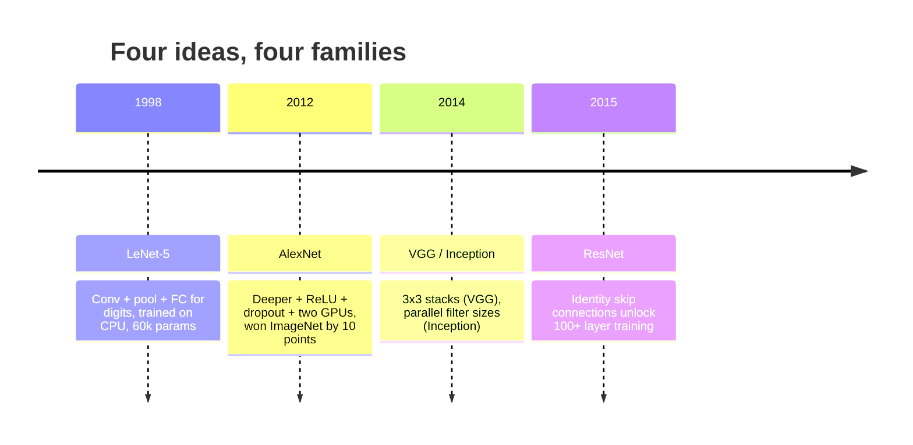
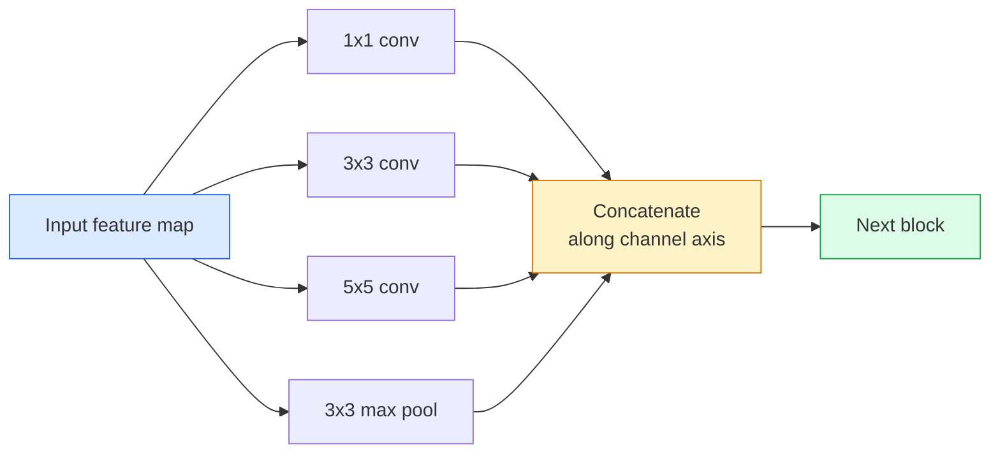
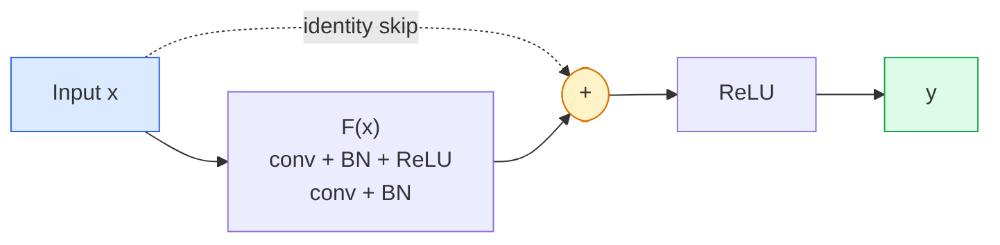

# 卷积神经网络 —— 从 LeNet 到 ResNet

> 过去三十年中每一个重要的卷积神经网络都遵循相同的卷积-非线性-下采样的配方，并附加了一个新的想法。按顺序学习这些想法。

**类型:** 学习 + 构建
**语言:** Python
**先决条件:** 第三阶段第11课（PyTorch）、第四阶段第01课（图像基础）、第四阶段第02课（从零开始卷积）
**时间:** 约75分钟

## 学习目标

- 追溯从 LeNet-5 到 AlexNet、VGG、Inception、ResNet 的架构演变，并说明每个家族贡献的单一新想法
- 在 PyTorch 中实现 LeNet-5、一个 VGG 风格的模块和一个 ResNet BasicBlock，每段代码不超过40行
- 解释为什么残差连接能让一个1000层的网络从无法训练变成最先进的模型
- 阅读一个现代主干网络（ResNet-18、ResNet-50），在不查看源代码的情况下预测其输出形状、感受野和参数数量

## 问题

2011年，最好的 ImageNet 分类器的准确率约为74%。2012年 AlexNet 的准确率达到了85%。2015年 ResNet 的准确率达到了96%。没有新的数据，也没有新的 GPU 一代。这些提升来自于架构上的想法。一个合格的视觉工程师必须知道每个想法来自哪篇论文，因为2026年你部署的每一个生产主干网络都是这些模块的重新组合 —— 并且这些想法还在不断转移：分组卷积从 CNN 传到了 Transformer，残差连接从 ResNet 传到了每一个现有的大型语言模型，批量归一化则存在于扩散模型中。

按顺序研究这些网络也能防止你犯一个常见的错误：当一个 LeNet 大小的网络就能解决问题时，却去选择最大的可用模型。MNIST 并不需要 ResNet。了解每个家族的扩展曲线能告诉你该选择哪一个。

## 概念

### 改变视觉的四个想法



在经典视觉领域中，没有其他事情比这四个跳跃更重要。

### LeNet-5 (1998)

Yann LeCun 的数字识别器。60,000 个参数。两个卷积-池化模块，两个全连接层，tanh 激活函数。它定义了每个卷积神经网络继承的模板：

```
input (1, 32, 32)
  conv 5x5 -> (6, 28, 28)
  avg pool 2x2 -> (6, 14, 14)
  conv 5x5 -> (16, 10, 10)
  avg pool 2x2 -> (16, 5, 5)
  flatten -> 400
  dense -> 120
  dense -> 84
  dense -> 10
```

现代世界所称的 CNN —— 交替进行卷积和下采样，然后将结果输入一个小型分类器头部 —— 其实就是 LeNet，只不过层数更多、通道数更大、激活函数更好。

### AlexNet（2012）

三项改变共同打破了 ImageNet 的记录：

1. **ReLU** 代替 tanh。梯度不再消失。训练速度提高了六倍。
2. **Dropout** 应用于全连接头部。正则化成为了一层，而不是一种技巧。
3. **深度和宽度**。五个卷积层，三个全连接层，6000万参数，使用两个 GPU 进行训练，模型在两个 GPU 上进行分割。

论文的图 2 仍然显示了 GPU 分割为两个并行流。这种并行性是一种硬件上的变通方法，而不是架构上的洞察 —— 但上述三个想法仍然是你所使用模型中的核心部分。

### VGG（2014）

VGG 提出的问题是：如果我们只使用 3x3 卷积并增加深度，会发生什么呢？

```
stack:   conv 3x3 -> conv 3x3 -> pool 2x2
repeat:  16 or 19 conv layers
```

两个 3x3 卷积层看到相同的 5x5 输入区域，就像一个 5x5 卷积层，但参数更少（2*9*C² = 18C² vs 25*C²），并且中间还有一个额外的 ReLU。VGG 将这一观察转化为整个架构。这种简单性——一种模块类型，重复使用——使其成为之后所有架构的参考基准。

成本：1.38 亿个参数，训练速度慢，在推理时成本高。

### Inception（2014 年，同年）

Google 对“我应该使用什么卷积核大小？”的回答是：全部使用，但并行进行。



每个分支都有其专门的功能 —— 1x1 用于通道混合，3x3 用于局部纹理，5x5 用于更大范围的模式，池化用于位移不变特征 —— 而 concat 操作可以让下一层选择对它有用的分支。Inception v1 在每个分支内部使用了 1x1 卷积作为瓶颈，以保持参数数量的合理。

### 退化问题

到 2015 年，VGG-19 能够正常工作，而 VGG-32 却不行。深度本应有助于提升性能，但超过约 20 层后，训练和测试损失都变差了。这不是过拟合。这是优化器无法找到有用的权重，因为梯度在每一层中成倍缩小。

```
Plain deep network:
  y = f_L( f_{L-1}( ... f_1(x) ... ) )

Gradient wrt early layer:
  dL/dW_1 = dL/dy * df_L/df_{L-1} * ... * df_2/df_1 * df_1/dW_1

Each multiplicative term has magnitude roughly (weight magnitude) * (activation gain).
Stack 100 of them with gains < 1 and the gradient is effectively zero.
```VGG 在 19 层时表现良好，因为 batch norm（同时发表）保持了激活值的良好缩放。但即使使用 batch norm，也无法挽救超过大约 30 层的深度。

### ResNet (2015)

He, Zhang, Ren, Sun 提出了一项改进，解决了所有问题：

```
standard block:   y = F(x)
residual block:   y = F(x) + x
```

`+ x` 表示该层可以通过将 `F(x)` 驱动为零来始终选择不做任何事情。现在，一个 1,000 层的 ResNet 最多只会和一个 1 层网络一样糟糕，因为每个额外的块都有一个简单的逃生通道。有了这个保证，优化器愿意让每个块都*稍微*有用一些——而稍微有用，堆叠 100 次，就是最先进的技术。



块的两种变体随处可见：

- **BasicBlock**（ResNet-18，ResNet-34）：两个 3x3 卷积，跳过这两个卷积。
- **Bottleneck**（ResNet-50，-101，-152）：1x1 降维，3x3 中间层，1x1 升维，跳过这三者。当通道数量较高时，这种结构更经济。

当跳过连接需要跨越下采样（步长=2）时，恒等路径会被一个 1x1 步长=2 的卷积所替代，以匹配形状。

### 为何残差连接在视觉以外的领域也很重要

这个想法并不只是关于图像分类。它的目的是将深度网络从“祈祷并希望梯度能存活下来”的状态，转变为一种可靠且可扩展的工程工具。在下个阶段你将读到的每一个 Transformer，其每个块中都有完全相同的跳过连接。没有 ResNet，就不会有 GPT。

```figure
pooling
```

## 构建它

### 步骤 1：LeNet-5

一个最小且忠实的 LeNet。使用 Tanh 激活函数，平均池化。唯一对现代性的妥协是，我们使用 `nn.CrossEntropyLoss` 而不是原始的高斯连接进行下游处理。

```python
import torch
import torch.nn as nn
import torch.nn.functional as F

class LeNet5(nn.Module):
    def __init__(self, num_classes=10):
        super().__init__()
        self.conv1 = nn.Conv2d(1, 6, kernel_size=5)
        self.conv2 = nn.Conv2d(6, 16, kernel_size=5)
        self.pool = nn.AvgPool2d(2)
        self.fc1 = nn.Linear(16 * 5 * 5, 120)
        self.fc2 = nn.Linear(120, 84)
        self.fc3 = nn.Linear(84, num_classes)

    def forward(self, x):
        x = self.pool(torch.tanh(self.conv1(x)))
        x = self.pool(torch.tanh(self.conv2(x)))
        x = torch.flatten(x, 1)
        x = torch.tanh(self.fc1(x))
        x = torch.tanh(self.fc2(x))
        return self.fc3(x)

net = LeNet5()
x = torch.randn(1, 1, 32, 32)
print(f"output: {net(x).shape}")
print(f"params: {sum(p.numel() for p in net.parameters()):,}")
```

预期输出：`output: torch.Size([1, 10])`, `params: 61,706`。这就是启动现代视觉的完整数字分类器。

### 步骤 2：一个 VGG 模块

一个可重复使用的模块：两个 3x3 卷积层，ReLU，批量归一化，最大池化。

```python
class VGGBlock(nn.Module):
    def __init__(self, in_c, out_c):
        super().__init__()
        self.conv1 = nn.Conv2d(in_c, out_c, kernel_size=3, padding=1)
        self.bn1 = nn.BatchNorm2d(out_c)
        self.conv2 = nn.Conv2d(out_c, out_c, kernel_size=3, padding=1)
        self.bn2 = nn.BatchNorm2d(out_c)
        self.pool = nn.MaxPool2d(2)

    def forward(self, x):
        x = F.relu(self.bn1(self.conv1(x)))
        x = F.relu(self.bn2(self.conv2(x)))
        return self.pool(x)

class MiniVGG(nn.Module):
    def __init__(self, num_classes=10):
        super().__init__()
        self.stack = nn.Sequential(
            VGGBlock(3, 32),
            VGGBlock(32, 64),
            VGGBlock(64, 128),
        )
        self.head = nn.Sequential(
            nn.AdaptiveAvgPool2d(1),
            nn.Flatten(),
            nn.Linear(128, num_classes),
        )

    def forward(self, x):
        return self.head(self.stack(x))

net = MiniVGG()
x = torch.randn(1, 3, 32, 32)
print(f"output: {net(x).shape}")
print(f"params: {sum(p.numel() for p in net.parameters()):,}")
```

在 CIFAR 尺寸输入上使用三个 VGG 块，一个自适应池化层，一个线性层。约 290,000 个参数。对于 CIFAR-10 来说绰绰有余。

### 步骤 3：ResNet 基本块

ResNet-18 和 ResNet-34 的核心构建块。

```python
class BasicBlock(nn.Module):
    def __init__(self, in_c, out_c, stride=1):
        super().__init__()
        self.conv1 = nn.Conv2d(in_c, out_c, kernel_size=3, stride=stride, padding=1, bias=False)
        self.bn1 = nn.BatchNorm2d(out_c)
        self.conv2 = nn.Conv2d(out_c, out_c, kernel_size=3, stride=1, padding=1, bias=False)
        self.bn2 = nn.BatchNorm2d(out_c)
        if stride != 1 or in_c != out_c:
            self.shortcut = nn.Sequential(
                nn.Conv2d(in_c, out_c, kernel_size=1, stride=stride, bias=False),
                nn.BatchNorm2d(out_c),
            )
        else:
            self.shortcut = nn.Identity()

    def forward(self, x):
        out = F.relu(self.bn1(self.conv1(x)))
        out = self.bn2(self.conv2(out))
        out = out + self.shortcut(x)
        return F.relu(out)
```

`bias=False` 在卷积层中是一种批量归一化（batch-norm）的惯例 —— 批量归一化的 beta 参数已经处理了偏置，因此同时携带卷积偏置是浪费。只有当步长或通道数量变化时，`shortcut` 才需要真正的卷积；否则它是一个无操作（no-op）的恒等映射。

### 步骤 4：一个微型 ResNet

堆叠四组 BasicBlocks，以获得一个适用于 CIFAR 尺寸输入的可用 ResNet。

```python
class TinyResNet(nn.Module):
    def __init__(self, num_classes=10):
        super().__init__()
        self.stem = nn.Sequential(
            nn.Conv2d(3, 32, kernel_size=3, stride=1, padding=1, bias=False),
            nn.BatchNorm2d(32),
            nn.ReLU(inplace=True),
        )
        self.layer1 = self._make_group(32, 32, num_blocks=2, stride=1)
        self.layer2 = self._make_group(32, 64, num_blocks=2, stride=2)
        self.layer3 = self._make_group(64, 128, num_blocks=2, stride=2)
        self.layer4 = self._make_group(128, 256, num_blocks=2, stride=2)
        self.head = nn.Sequential(
            nn.AdaptiveAvgPool2d(1),
            nn.Flatten(),
            nn.Linear(256, num_classes),
        )

    def _make_group(self, in_c, out_c, num_blocks, stride):
        blocks = [BasicBlock(in_c, out_c, stride=stride)]
        for _ in range(num_blocks - 1):
            blocks.append(BasicBlock(out_c, out_c, stride=1))
        return nn.Sequential(*blocks)

    def forward(self, x):
        x = self.stem(x)
        x = self.layer1(x)
        x = self.layer2(x)
        x = self.layer3(x)
        x = self.layer4(x)
        return self.head(x)

net = TinyResNet()
x = torch.randn(1, 3, 32, 32)
print(f"output: {net(x).shape}")
print(f"params: {sum(p.numel() for p in net.parameters()):,}")
```

每组两个模块，共四组。在第2、3、4组开始时，步长为2。每次下采样后通道数翻倍。大约2.8M参数。这就是可以干净地扩展到ResNet-152的标准配方。

### 步骤5：比较参数与特征的效率

将相同的输入通过所有三个网络，并比较参数数量。

```python
def summary(name, net, x):
    y = net(x)
    params = sum(p.numel() for p in net.parameters())
    print(f"{name:12s}  input {tuple(x.shape)} -> output {tuple(y.shape)}  params {params:>10,}")

x = torch.randn(1, 3, 32, 32)
summary("LeNet5",     LeNet5(),       torch.randn(1, 1, 32, 32))
summary("MiniVGG",    MiniVGG(),      x)
summary("TinyResNet", TinyResNet(),   x)
```

三个模型，三个时代，参数数量相差三个数量级。对于 CIFAR-10 准确率，你需要大致：LeNet 60%，MiniVGG 89%，TinyResNet 在训练几个周期后达到 93%。

## 使用方法

`torchvision.models` 为上述所有模型提供了预训练版本。所有家族的调用签名都相同，这正是骨干抽象的核心理念。

```python
from torchvision.models import resnet18, ResNet18_Weights, vgg16, VGG16_Weights

r18 = resnet18(weights=ResNet18_Weights.IMAGENET1K_V1)
r18.eval()

print(f"ResNet-18 params: {sum(p.numel() for p in r18.parameters()):,}")
print(r18.layer1[0])
print()

v16 = vgg16(weights=VGG16_Weights.IMAGENET1K_V1)
v16.eval()
print(f"VGG-16   params: {sum(p.numel() for p in v16.parameters()):,}")
```ResNet-18 有 11.7M 个参数。VGG-16 有 138M 个参数。相似的 ImageNet top-1 准确率（69.8% 对 71.6%）。残差连接让你获得 12 倍的参数效率优势。这就是为什么从 2016 年到 ViT 在 2021 年出现之前，ResNet 的变体一直占据主导地位 —— 而且在计算资源是限制因素的现实世界部署中，仍然占据主导地位。

对于迁移学习，配方始终是相同的：加载预训练模型，冻结主干网络，替换分类器头部。

```python
for p in r18.parameters():
    p.requires_grad = False
r18.fc = nn.Linear(r18.fc.in_features, 10)
```

三行代码。你现在拥有了一个继承 ImageNet 所训练出的表示的 10 类 CIFAR 分类器。

## 发布它

这节课将产出以下内容：

- `outputs/prompt-backbone-selector.md` — 一个提示，根据任务、数据集大小和计算预算来选择合适的 CNN 家族（LeNet/VGG/ResNet/MobileNet/ConvNeXt）。
- `outputs/skill-residual-block-reviewer.md` — 一项技能，可以读取一个 PyTorch 模块并标记跳连接错误（在步长改变时缺少快捷连接，快捷连接的激活顺序，BN 相对于加法的位置）。

## 练习

1. **(简单)** 逐层手动计算 `TinyResNet` 的参数数量。与 `sum(p.numel() for p in net.parameters())` 进行比较。参数预算的大部分用在哪里 —— 卷积层、BN 还是分类器头？
2. **(中等)** 实现 Bottleneck 块（1x1 -> 3x3 -> 1x1，带跳连接），并使用它构建一个 ResNet-50 风格的网络用于 CIFAR。将参数数量与 `TinyResNet` 进行比较。
3. **(困难)** 从 `BasicBlock` 中移除跳连接，分别训练一个 34 块的“普通”网络和一个 34 块的 ResNet，在 CIFAR-10 上各训练 10 个 epoch。为两者绘制训练损失与 epoch 的对比图。复现 He 等人论文中的图 1 结果，即普通深度网络收敛到比其较浅的孪生网络更高的损失。

## 关键术语

| 术语 | 人们常说 | 实际含义 |
|------|----------------|----------------|
| Backbone | “模型” | 产生特征图并传送到任务头的一系列卷积块 |
| Residual connection | “跳连接” | `y = F(x) + x`；允许优化器通过设置 F 为零来学习恒等映射，从而使任意深度的网络可训练 |
| BasicBlock | “两个 3x3 卷积与跳连接” | ResNet-18/34 的基本构建块：conv-BN-ReLU-conv-BN-加法-ReLU |
| Bottleneck | “1x1 下采样、3x3、1x1 上采样” | ResNet-50/101/152 的块；在高通道数时很便宜，因为 3x3 卷积运行在较窄的宽度上 |
| Degradation problem | “更深更差” | 超过约 20 层普通卷积层后，训练和测试误差均会增加；通过残差连接解决，而非更多数据 |
| Stem | “第一层” | 将三通道输入转换为基本特征宽度的初始卷积层；通常 ImageNet 使用 7x7 步长 2，CIFAR 使用 3x3 步长 1 |
| Head | “分类器” | 最终骨干块之后的层：自适应池化、展平、线性层 |
| Transfer learning | “预训练权重” | 加载一个在 ImageNet 上训练好的骨干网络，并仅在你的任务上微调头部 |

## 进一步阅读

- [用于图像识别的深度残差学习 (He 等, 2015)](https://arxiv.org/abs/1512.03385) —— ResNet 论文；每张图都值得研究
- [非常深的卷积网络 (Simonyan & Zisserman, 2014)](https://arxiv.org/abs/1409.1556) —— VGG 论文；仍然是解释“为什么使用 3x3”的最佳参考资料
- [使用深度 CNN 进行 ImageNet 分类 (Krizhevsky 等, 2012)](https://papers.nips.cc/paper_files/paper/2012/hash/c399862d3b9d6b76c8436e924a68c45b-Abstract.html) —— AlexNet；结束手工特征时代的论文
- [使用卷积进行深度学习 (Szegedy 等, 2014)](https://arxiv.org/abs/1409.4842) —— Inception v1；并行滤波器的概念仍然出现在视觉变换器中
