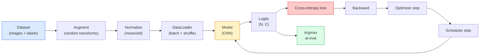

# 图像分类

> 分类器是从像素到各类别概率分布的函数。其余的一切都是管道。

**类型:** 构建  
**语言:** Python  
**先决条件:** 第二阶段第9课（模型评估），第三阶段第10课（小型框架），第四阶段第3课（卷积神经网络）  
**时间:** ~75 分钟

## 学习目标

- 在 CIFAR-10 上构建端到端的图像分类流水线：数据集、增强、模型、训练循环、评估
- 解释每个组件（数据加载器、损失、优化器、调度器、增强）的作用，并预测如果其中任何一个组件出现问题，损失曲线将如何表现
- 从头开始实现 mixup、cutout 和标签平滑，并说明在什么情况下每个技术值得添加
- 通过阅读混淆矩阵和每个类别的精确率/召回率表，诊断超出整体准确率的模型和数据集问题

## 问题

每个视觉任务最终都会归结为图像分类。检测对区域进行分类。分割对像素进行分类。检索按照与类别中心的相似性进行排序。正确处理分类问题——数据集循环、增强策略、损失函数、评估——是将技能转移到阶段内所有其他任务的关键。

大多数分类错误不在模型中。它们存在于流水线中：错误的归一化、未打乱的训练集、导致标签扭曲的增强、被训练数据污染的验证分割、在第30个epoch后静默发散的学习率。一个在正确设置下在 CIFAR-10 上可以达到93%的CNN，在设置错误时通常只能达到70-75%，而损失曲线看起来却始终合理。

本课将手动连接整个流水线，以便每个部分都可以被检查。你将不会使用任何来自 `torchvision.datasets` 的内容，这些内容可能会隐藏错误。

## 概念

### 分类流水线



这个循环中的每一行都可能隐藏着一个错误。交叉熵损失函数使用的是原始的logits，而不是softmax输出，因此任何在损失计算之前对`model(x).softmax()`的处理都会静默地计算出错误的梯度。数据增强仅应用于输入，而不是标签——除了mixup，它会同时混合输入和标签。`optimizer.zero_grad()`必须在每一步都执行一次；跳过它会导致梯度累积，并表现为学习率极其不稳定。这些错误都会使学习曲线变得平缓，但不会引发任何错误。

### 交叉熵、logits和softmax

分类器为每张图像生成称为logits的`C`个数值。应用softmax函数可以将它们转换为概率分布：

```
softmax(z)_i = exp(z_i) / sum_j exp(z_j)
```

交叉熵衡量正确类别负对数概率：

$$
$$

```
CE(z, y) = -log( softmax(z)_y )
        = -z_y + log( sum_j exp(z_j) )
```

右侧的形式是数值稳定的（log-sum-exp）。PyTorch 的 `nn.CrossEntropyLoss` 将 softmax + NLL 合并为一个操作，并直接接受原始的 logits。先自己应用 softmax 通常是错误的 —— 你会计算 log(softmax(softmax(z)))，这是一个没有意义的量。

### 为什么增强有效

CNN 因权重共享具有平移的归纳偏置，但对裁剪、翻转、颜色抖动或遮挡没有内置的不变性。唯一能教会它这些不变性的方法，就是向它展示能够体现这些不变性的像素。训练期间的每一次随机变换都相当于在说：“这两张图片有相同的标签；学习忽略它们之间差异的特征。”

```
Original crop:  "dog facing left"
Flip:           "dog facing right"       <- same label, different pixels
Rotate(+15):    "dog, slight tilt"
Colour jitter:  "dog in warmer light"
RandomErasing:  "dog with patch missing"
```

规则：增强必须保留标签。对数字进行切割（Cutout）和旋转时，可能会将“6”翻转成“9”；为此，数据集使用较小的旋转范围，并选择尊重数字特定不变性的增强方法。

### Mixup 和 Cutmix

普通的增强方法只变换像素，但保持标签为独热编码。**Mixup** 和 **cutmix** 通过同时对像素和标签进行插值，打破了这一规则。

```
Mixup:
  lambda ~ Beta(a, a)
  x = lambda * x_i + (1 - lambda) * x_j
  y = lambda * y_i + (1 - lambda) * y_j

Cutmix:
  paste a random rectangle of x_j into x_i
  y = area-weighted mix of y_i and y_j
```

为什么有帮助：模型不再记忆尖锐的独热目标，而是学会在类别之间进行插值。训练损失上升，测试准确率也上升。这是对任何分类器最便宜的鲁棒性升级方式。

### 标签平滑

mixup 的一种近亲。不是训练对抗 `[0, 0, 1, 0, 0]`，而是对一个很小的 `eps`（比如 0.1）训练对抗 `[eps/C, eps/C, 1-eps, eps/C, eps/C]`。这阻止模型产生任意尖锐的对数几率，并几乎不增加成本地提高校准性能。从 PyTorch 1.10 开始，`nn.CrossEntropyLoss(label_smoothing=0.1)` 中已内置该功能。

### 超越准确率的评估

总体准确率隐藏了不平衡问题。一个总是预测多数类的 90-10 二分类器，准确率是 90%。真正能告诉你发生了什么的工具有：

- **每类准确率** — 每个类别一个数字；可以立即发现表现不佳的类别。
- **混淆矩阵** — C x C 的网格，第 i 行第 j 列表示真实类别 i 被预测为类别 j 的数量；对角线是正确的预测，非对角线是模型表现的地方。
- **Top-1 / Top-5** — 正确类别是否在前 1 或前 5 预测中；对于 ImageNet，Top-5 有重要意义，因为像“诺威奇梗犬”与“诺福克梗犬”这样的类别确实是真正模糊的。
- **校准（ECE）** — 0.8 的置信度预测是否在 80% 的情况下是正确的？现代网络系统性地过于自信；可以通过温度缩放或标签平滑来修正。

```figure
receptive-field
```

## 构建它

### 第一步：确定性合成数据集

CIFAR-10 存储在磁盘上。为了使本课程可重复且运行速度快，我们构建一个类似于 CIFAR 的合成数据集——32x32 的 RGB 图像，具有模型必须学习的类别特异性结构。相同的处理流程在真实的 CIFAR-10 上也完全适用。

```python
import numpy as np
import torch
from torch.utils.data import Dataset


def synthetic_cifar(num_per_class=1000, num_classes=10, seed=0):
    rng = np.random.default_rng(seed)
    X = []
    Y = []
    for c in range(num_classes):
        centre = rng.uniform(0, 1, (3,))
        freq = 2 + c
        for _ in range(num_per_class):
            yy, xx = np.meshgrid(np.linspace(0, 1, 32), np.linspace(0, 1, 32), indexing="ij")
            r = np.sin(xx * freq) * 0.5 + centre[0]
            g = np.cos(yy * freq) * 0.5 + centre[1]
            b = (xx + yy) * 0.5 * centre[2]
            img = np.stack([r, g, b], axis=-1)
            img += rng.normal(0, 0.08, img.shape)
            img = np.clip(img, 0, 1)
            X.append(img.astype(np.float32))
            Y.append(c)
    X = np.stack(X)
    Y = np.array(Y)
    idx = rng.permutation(len(X))
    return X[idx], Y[idx]


class ArrayDataset(Dataset):
    def __init__(self, X, Y, transform=None):
        self.X = X
        self.Y = Y
        self.transform = transform

    def __len__(self):
        return len(self.X)

    def __getitem__(self, i):
        img = self.X[i]
        if self.transform is not None:
            img = self.transform(img)
        img = torch.from_numpy(img).permute(2, 0, 1)
        return img, int(self.Y[i])
```

每个类别都有自己的颜色调色板和频率模式，并添加高斯噪声，以迫使模型学习信号而不是记忆像素。共十个类别，每个类别有一千张图像，图像顺序被打乱。

### 第二步：归一化和增强

每个视觉处理流程都包含的两个转换。

```python
def standardize(mean, std):
    mean = np.array(mean, dtype=np.float32)
    std = np.array(std, dtype=np.float32)
    def _fn(img):
        return (img - mean) / std
    return _fn


def random_hflip(p=0.5):
    def _fn(img):
        if np.random.random() < p:
            return img[:, ::-1, :].copy()
        return img
    return _fn


def random_crop(pad=4):
    def _fn(img):
        h, w = img.shape[:2]
        padded = np.pad(img, ((pad, pad), (pad, pad), (0, 0)), mode="reflect")
        y = np.random.randint(0, 2 * pad)
        x = np.random.randint(0, 2 * pad)
        return padded[y:y + h, x:x + w, :]
    return _fn


def compose(*fns):
    def _fn(img):
        for fn in fns:
            img = fn(img)
        return img
    return _fn
```

在裁剪之前使用反射填充（reflect-pad），而不是零填充（zero-pad），因为黑色边框是一种模型可能会以无用的方式学习忽略的信号。

### 步骤3：Mixup

在训练步骤中混合两张图像和两个标签。作为批量转换实现，因此它位于前向传播旁边，而不是在数据集内部。

```python
def mixup_batch(x, y, num_classes, alpha=0.2):
    if alpha <= 0:
        return x, torch.nn.functional.one_hot(y, num_classes).float()
    lam = float(np.random.beta(alpha, alpha))
    idx = torch.randperm(x.size(0), device=x.device)
    x_mixed = lam * x + (1 - lam) * x[idx]
    y_onehot = torch.nn.functional.one_hot(y, num_classes).float()
    y_mixed = lam * y_onehot + (1 - lam) * y_onehot[idx]
    return x_mixed, y_mixed


def soft_cross_entropy(logits, soft_targets):
    log_probs = torch.log_softmax(logits, dim=-1)
    return -(soft_targets * log_probs).sum(dim=-1).mean()
```

`soft_cross_entropy` 是针对软标签分布的交叉熵。当目标恰好是独热编码时，它退化为通常的独热编码情况。

### 第4步：训练循环

完整的流程：对数据进行一次遍历，每批数据计算一次梯度，每个训练周期更新一次调度器。

```python
import torch
import torch.nn as nn
from torch.utils.data import DataLoader
from torch.optim import SGD
from torch.optim.lr_scheduler import CosineAnnealingLR

def train_one_epoch(model, loader, optimizer, device, num_classes, use_mixup=True):
    model.train()
    total, correct, loss_sum = 0, 0, 0.0
    for x, y in loader:
        x, y = x.to(device), y.to(device)
        if use_mixup:
            x_m, y_soft = mixup_batch(x, y, num_classes)
            logits = model(x_m)
            loss = soft_cross_entropy(logits, y_soft)
        else:
            logits = model(x)
            loss = nn.functional.cross_entropy(logits, y, label_smoothing=0.1)
        optimizer.zero_grad()
        loss.backward()
        optimizer.step()
        loss_sum += loss.item() * x.size(0)
        total += x.size(0)
        # Training accuracy vs the un-mixed labels `y` is only an approximation
        # when mixup is on (the model saw soft targets, not y). Treat it as a
        # rough progress signal; rely on val accuracy for real performance.
        with torch.no_grad():
            pred = logits.argmax(dim=-1)
            correct += (pred == y).sum().item()
    return loss_sum / total, correct / total


@torch.no_grad()
def evaluate(model, loader, device, num_classes):
    model.eval()
    total, correct = 0, 0
    loss_sum = 0.0
    cm = torch.zeros(num_classes, num_classes, dtype=torch.long)
    for x, y in loader:
        x, y = x.to(device), y.to(device)
        logits = model(x)
        loss = nn.functional.cross_entropy(logits, y)
        pred = logits.argmax(dim=-1)
        for t, p in zip(y.cpu(), pred.cpu()):
            cm[t, p] += 1
        loss_sum += loss.item() * x.size(0)
        total += x.size(0)
        correct += (pred == y).sum().item()
    return loss_sum / total, correct / total, cm
```

每次编写训练循环时都要检查的五个不变量：

1. `model.train()` 在训练前，`model.eval()` 在评估前 —— 改变 dropout 和 batchnorm 的行为。
2. `.zero_grad()` 在 `.backward()` 之前。
3. `.item()` 在累积指标时，确保没有任何东西保持计算图的存活。
4. `@torch.no_grad()` 在评估期间 —— 节省内存和时间，防止细微的事故。
5. 对原始 logits 而不是 softmax 使用 argmax —— 结果相同，少一个操作。

### 第五步：将它们组合在一起

使用上一课中的 `TinyResNet`，训练几个周期，进行评估。

```python
from main import synthetic_cifar, ArrayDataset
from main import standardize, random_hflip, random_crop, compose
from main import mixup_batch, soft_cross_entropy
from main import train_one_epoch, evaluate
# TinyResNet comes from the previous lesson (03-cnns-lenet-to-resnet).
# Adjust the import path to wherever you stored the previous lesson's code.
from cnns_lenet_to_resnet import TinyResNet  # example placeholder

X, Y = synthetic_cifar(num_per_class=500)
split = int(0.9 * len(X))
X_train, Y_train = X[:split], Y[:split]
X_val, Y_val = X[split:], Y[split:]

mean = [0.5, 0.5, 0.5]
std = [0.25, 0.25, 0.25]
train_tf = compose(random_hflip(), random_crop(pad=4), standardize(mean, std))
eval_tf = standardize(mean, std)

train_ds = ArrayDataset(X_train, Y_train, transform=train_tf)
val_ds = ArrayDataset(X_val, Y_val, transform=eval_tf)

train_loader = DataLoader(train_ds, batch_size=128, shuffle=True, num_workers=0)
val_loader = DataLoader(val_ds, batch_size=256, shuffle=False, num_workers=0)

device = "cuda" if torch.cuda.is_available() else "cpu"
model = TinyResNet(num_classes=10).to(device)
optimizer = SGD(model.parameters(), lr=0.1, momentum=0.9, weight_decay=5e-4, nesterov=True)
scheduler = CosineAnnealingLR(optimizer, T_max=10)

for epoch in range(10):
    tr_loss, tr_acc = train_one_epoch(model, train_loader, optimizer, device, 10, use_mixup=True)
    va_loss, va_acc, _ = evaluate(model, val_loader, device, 10)
    scheduler.step()
    print(f"epoch {epoch:2d}  lr {scheduler.get_last_lr()[0]:.4f}  "
          f"train {tr_loss:.3f}/{tr_acc:.3f}  val {va_loss:.3f}/{va_acc:.3f}")
```

在合成数据集上，这个模型在五个训练周期内就能达到接近完美的验证准确率，这正是要点：训练流程是正确的，模型能够学习到可以学习到的内容。将数据集换成真实的 CIFAR-10，同样的训练循环在不进行任何修改的情况下也能达到约 90% 的准确率。

### 第六步：阅读混淆矩阵

准确率本身永远无法告诉你模型在哪些地方失败了。混淆矩阵可以做到这一点。

```python
def print_confusion(cm, labels=None):
    c = cm.shape[0]
    labels = labels or [str(i) for i in range(c)]
    print(f"{'':>6}" + "".join(f"{l:>5}" for l in labels))
    for i in range(c):
        row = cm[i].tolist()
        print(f"{labels[i]:>6}" + "".join(f"{v:>5}" for v in row))
    print()
    tp = cm.diag().float()
    fp = cm.sum(dim=0).float() - tp
    fn = cm.sum(dim=1).float() - tp
    prec = tp / (tp + fp).clamp_min(1)
    rec = tp / (tp + fn).clamp_min(1)
    f1 = 2 * prec * rec / (prec + rec).clamp_min(1e-9)
    for i in range(c):
        print(f"{labels[i]:>6}  prec {prec[i]:.3f}  rec {rec[i]:.3f}  f1 {f1[i]:.3f}")

_, _, cm = evaluate(model, val_loader, device, 10)
print_confusion(cm)
```

行代表真实类别，列代表预测结果。类别 3 和 5 之间对角线以外的计数聚类表示模型将这两个类别混淆，这为你提供了有针对性的数据收集或类别特定增强的起点。

## 使用方法

`torchvision` 将以上所有内容封装成惯用的组件。对于真实的 CIFAR-10 数据集，完整的流程只需四行代码加上一个训练循环。

```python
from torchvision.datasets import CIFAR10
from torchvision.transforms import Compose, RandomCrop, RandomHorizontalFlip, ToTensor, Normalize

mean = (0.4914, 0.4822, 0.4465)
std = (0.2470, 0.2435, 0.2616)
train_tf = Compose([
    RandomCrop(32, padding=4, padding_mode="reflect"),
    RandomHorizontalFlip(),
    ToTensor(),
    Normalize(mean, std),
])
eval_tf = Compose([ToTensor(), Normalize(mean, std)])

train_ds = CIFAR10(root="./data", train=True,  download=True, transform=train_tf)
val_ds   = CIFAR10(root="./data", train=False, download=True, transform=eval_tf)
```

需要注意的两点是：均值/标准差是**数据集特定**的 —— 是在CIFAR-10训练集上计算得出的，而不是ImageNet —— 并且反射填充是社区默认的裁剪策略。在这里复制粘贴ImageNet的统计数据会导致大约1%的精度泄露，直到有人对模型进行剖析时才会被发现。

## 发布它

本课将产生以下内容：

- `outputs/prompt-classifier-pipeline-auditor.md` — 一个提示，用于审计训练脚本，检查以上五个不变量，并指出第一个违规情况。
- `outputs/skill-classification-diagnostics.md` — 一种技能，给定一个混淆矩阵和一个类名列表，可以总结每个类别的失败情况，并提出最有效的修复方法。

## 练习

1. **(简单)** 在合成数据集上，使用和不使用mixup分别训练同一个模型五轮。绘制两种情况下的训练和验证损失曲线。解释为什么使用mixup时训练损失更高，但验证精度却相似或更好。
2. **(中等)** 实现Cutout —— 在每张训练图像中随机将一个8x8的方块设为零 —— 并进行消融实验，与无增强、hflip+crop、hflip+crop+cutout、hflip+crop+mixup进行比较。报告每种情况下的验证精度。
3. **(困难)** 构建一个CIFAR-100流水线（100个类别，相同输入尺寸），并重现ResNet-34训练运行，其精度与已发表结果的误差不超过1%。额外任务：扫描三个学习率和两个权重衰减，记录到本地CSV，生成最终的混淆矩阵中前几个混淆项表格。

## 关键术语

| 术语 | 人们常说 | 实际含义 |
|------|----------------|------------------|
| Logits | “原始输出” | 每张图像的C个数值的预softmax向量；交叉熵期望这些值，而不是softmax后的值 |
| Cross-entropy | “损失” | 正确类别的负对数概率；将log-softmax和NLL合并为一个稳定的运算 |
| DataLoader | “批处理器” | 将数据集包装为带洗牌、批处理和（可选）多线程加载的组件；一半的训练错误都归咎于它 |
| Augmentation | “随机变换” | 任何在训练时保留标签的像素级变换；教会CNN那些本不具备的不变性 |
| Mixup / Cutmix | “混合两张图像” | 将输入和标签都混合，使分类器学习平滑插值，而不是硬边界 |
| Label smoothing | “更柔和的目标” | 将one-hot替换为（1-eps, eps/(C-1), ...）；提高校准并略微提升精度 |
| Top-k accuracy | “Top-5” | 正确类别在k个概率最高的预测中；用于具有真正模糊类别的数据集 |
| Confusion matrix | “错误所在” | 一个C x C的表格，其中(i, j)项统计真实类别为i但预测为j的图像数量；对角线是正确的，非对角线告诉你需要修复什么 |

## 进一步阅读

- [CS231n: 训练神经网络](https://cs231n.github.io/neural-networks-3/) —— 仍然是最清晰的单页训练流水线介绍
- [图像分类的技巧包 (He et al., 2019)](https://arxiv.org/abs/1812.01187) —— 每个微小技巧组合在一起在ImageNet上可提升ResNet精度3-4%
- [mixup: 超越经验风险最小化 (Zhang et al., 2017)](https://arxiv.org/abs/1710.09412) —— 原始mixup论文；三页理论加令人信服的实验
- [为什么温度缩放很重要 (Guo et al., 2017)](https://arxiv.org/abs/1706.04599) —— 证明现代网络存在校准问题，并用一个标量参数解决的论文
