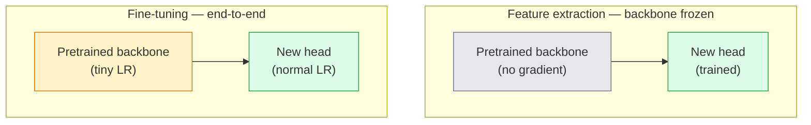

# 迁移学习与微调

> 有人已经花费了数百万个GPU小时来教会网络边缘、纹理和物体部件的外观。你应该在训练自己的模型之前借用这些特征。

**类型:** 构建
**语言:** Python
**先决条件:** 第四阶段第03课（卷积神经网络），第四阶段第04课（图像分类）
**时间:** ~75分钟

## 学习目标

- 区分特征提取和微调，并根据数据集大小、领域距离和计算预算选择合适的方法
- 加载一个预训练的主干网络，替换其分类头，并在不到20行代码中仅训练该头以达到一个可用的基线
- 使用有区别的学习率逐步解冻层，使早期通用特征的更新比晚期任务特定特征的更新更小
- 诊断三种常见故障：未冻结块的过高学习率导致的特征漂移，在小数据集上批量归一化统计量的崩溃，以及灾难性遗忘

## 问题

在ImageNet上训练一个ResNet-50需要大约2000个GPU小时。很少有团队为他们部署的每个任务都拥有这样的预算。实际上几乎所有团队部署的是一个预训练的主干网络，加上在数百或数千张任务特定图像上训练的新头。

这不是一种捷径。任何在ImageNet上训练的CNN的第一卷积块学习的是边缘和类似Gabor的滤波器。接下来的几个块学习的是纹理和简单的图案。中间的块学习的是物体部件。最后的块学习的是开始看起来像ImageNet的1000个类别的组合。这个层次结构的前90%几乎不变地转移到医学影像、工业检测、卫星数据和每个其他视觉任务中——因为自然界的边缘和纹理的词汇是有限的。最后的10%才是你实际训练的部分。

正确实现迁移学习时，有三个潜在的错误在等着你：使用过高的学习率破坏预训练的特征，冻结太多导致模型信息匮乏，以及让批量归一化的运行统计量朝着网络其他部分从未学习过的小数据集漂移。这节课会特意讲解每一个问题。

## 概念

### 特征提取与微调

两种模式，根据你对预训练特征的信任程度以及你拥有的数据量来选择。



经验法则：

| 数据集大小 | 领域距离 | 方案 |
|--------------|-----------------|--------|
| < 1k 张图片 | 接近 ImageNet | 冻结主干，仅训练头部 |
| 1k-10k | 接近 | 冻结前 2-3 阶段，微调其余部分 |
| 10k-100k | 任意 | 使用有区别的学习率进行端到端微调 |
| 100k+ | 远离 | 微调所有部分；如果领域足够远，考虑从头开始训练 |

“接近 ImageNet”大致意味着自然 RGB 照片，包含类似物体的内容。医学 CT 扫描、航拍卫星图像和显微镜图像属于远距离领域——特征仍然有帮助，但你需要让更多的层进行适应。

### 为什么冻结任何层都能起作用

CNN 在 ImageNet 上学到的特征并不是专门针对 1000 个类别的。它们是专门针对自然图像的统计特性：特定方向的边缘、纹理、对比度模式、形状原语。这些统计特性在人类能命名的几乎所有视觉领域中都是稳定的。这就是为什么在 ImageNet 上训练的模型，仅使用新的线性头部（不微调主干）在 CIFAR-10 上进行零样本评估时，准确率可以达到 80% 以上。头部正在学习对于这个任务，应该使用哪些已经学到的特征并赋予相应的权重。

### 有区别的学习率

当你解冻层时，早期层的学习速度应该比晚期层慢。早期层编码的是通用特征，你希望保留这些特征；晚期层编码的是任务特定的结构，你需要对它们进行大量调整。

```
Typical recipe:

  stage 0 (stem + first group): lr = base_lr / 100    (mostly fixed)
  stage 1:                       lr = base_lr / 10
  stage 2:                       lr = base_lr / 3
  stage 3 (last backbone group): lr = base_lr
  head:                          lr = base_lr  (or slightly higher)
```

在 PyTorch 中，这只是一个传递给优化器的参数组列表。一个模型，五个学习率，不需要任何额外的代码。

### BatchNorm 的问题

BN 层保存了在 ImageNet 上计算得到的 `running_mean` 和 `running_var` 缓冲区。如果你的任务具有不同的像素分布——不同的光照、不同的传感器、不同的颜色空间——这些缓冲区就是错误的。按优先顺序有三种选择：

1. **以训练模式微调 BN。** 让 BN 在训练过程中更新其运行时统计信息。当任务数据集规模中等（>= 5k 个样本）时，默认选择。
2. **以评估模式冻结 BN。** 保留 ImageNet 的统计信息，只训练权重。当你的数据集足够小，使得 BN 的移动平均值会变得嘈杂时，这是正确的方式。
3. **将 BN 替换为 GroupNorm。** 完全消除移动平均值的问题。用于检测和分割主干网络中每个 GPU 的批量大小非常小的情况。

错误地处理这个问题会静默地导致准确率下降 5-15%。

### Head 设计

分类器头部是 1-3 个线性层，加上一个可选的 dropout。每个 torchvision 的主干网络都附带一个默认的头部，你可以将其替换为：

 /no_think

<>

```python
class MyClassifier(nn.Module):
    def __init__(self, num_classes):
        super().__init__()
        self.head = nn.Sequential(
            nn.Linear(2048, 1024),
            nn.ReLU(),
            nn.Dropout(0.5),
            nn.Linear(1024, num_classes)
        )

    def forward(self, x):
        return self.head(x)
```

```
backbone.fc = nn.Linear(backbone.fc.in_features, num_classes)          # ResNet
backbone.classifier[1] = nn.Linear(..., num_classes)                    # EfficientNet, MobileNet
backbone.heads.head = nn.Linear(..., num_classes)                       # torchvision ViT
```

对于小数据集，通常一个线性层就足够了。当任务分布与主干网络的训练分布差异较大时，添加一个隐藏层（Linear -> ReLU -> Dropout -> Linear）会有帮助。

### 按层衰减的学习率

现代微调（如 BEiT、DINOv2、ViT-B 微调）中使用的一种更平滑的判别学习率版本。与将层分组为阶段的方式不同，给每一层比上一层稍小的学习率：

```
lr_layer_k = base_lr * decay^(L - k)
```

当 decay = 0.75 且 L = 12 个 transformer 块时，第一个块以 `0.75^11 ≈ 0.04x` 的头的 LR 进行训练。对于 transformer 的微调来说，这比 CNN 更重要，在 CNN 中通常分阶段的 LR 就足够了。

### 需要评估的内容

迁移学习运行需要两个在从零开始运行时不会跟踪的数字：

- **仅预训练准确率** — 冻结主干网络时头的准确率。这是你的下限。
- **微调准确率** — 经过端到端训练后的相同模型。这是你的上限。

如果微调后的准确率低于仅预训练的准确率，说明你存在学习率或 BN 的错误。始终打印这两个数值。

## 构建它

### 步骤 1：加载预训练的主干网络并检查它

```python
import torch
import torch.nn as nn
from torchvision.models import resnet18, ResNet18_Weights

backbone = resnet18(weights=ResNet18_Weights.IMAGENET1K_V1)
print(backbone)
print()
print("classifier head:", backbone.fc)
print("feature dim:", backbone.fc.in_features)
```

`ResNet18` 有四个阶段 (`layer1..layer4`) 加上一个茎部和一个 `fc` 头。每个 torchvision 分类主干结构都有类似的结构。

### 步骤 2：特征提取 — 冻结所有参数，替换头部分

```python
def make_feature_extractor(num_classes=10):
    model = resnet18(weights=ResNet18_Weights.IMAGENET1K_V1)
    for p in model.parameters():
        p.requires_grad = False
    model.fc = nn.Linear(model.fc.in_features, num_classes)
    return model

model = make_feature_extractor(num_classes=10)
trainable = sum(p.numel() for p in model.parameters() if p.requires_grad)
frozen = sum(p.numel() for p in model.parameters() if not p.requires_grad)
print(f"trainable: {trainable:>10,}")
print(f"frozen:    {frozen:>10,}")
```

仅 `model.fc` 可训练。主干网络是一个冻结的特征提取器。

### 步骤 3：判别式微调

一个构建具有阶段特定学习率的参数组的工具。

```python
def discriminative_param_groups(model, base_lr=1e-3, decay=0.3):
    stages = [
        ["conv1", "bn1"],
        ["layer1"],
        ["layer2"],
        ["layer3"],
        ["layer4"],
        ["fc"],
    ]
    groups = []
    for i, names in enumerate(stages):
        lr = base_lr * (decay ** (len(stages) - 1 - i))
        params = [p for n, p in model.named_parameters()
                  if any(n.startswith(k) for k in names)]
        if params:
            groups.append({"params": params, "lr": lr, "name": "_".join(names)})
    return groups

model = resnet18(weights=ResNet18_Weights.IMAGENET1K_V1)
model.fc = nn.Linear(model.fc.in_features, 10)
for p in model.parameters():
    p.requires_grad = True

groups = discriminative_param_groups(model)
for g in groups:
    print(f"{g['name']:>10s}  lr={g['lr']:.2e}  params={sum(p.numel() for p in g['params']):>8,}")
```

`decay=0.3` 表示每个阶段的训练速度是下一阶段的 30%。`fc` 得到 `base_lr`，`layer4` 得到 `0.3 * base_lr`，`conv1` 得到 `0.3^5 * base_lr ≈ 0.00243 * base_lr`。听起来极端；但实证表明它是有效的。

### 第 4 步：BatchNorm 处理

帮助在不冻结其权重的情况下，冻结 BN 的运行统计信息。

```python
def freeze_bn_stats(model):
    for m in model.modules():
        if isinstance(m, (nn.BatchNorm1d, nn.BatchNorm2d, nn.BatchNorm3d)):
            m.eval()
            for p in m.parameters():
                p.requires_grad = False
    return model
```

在每次 epoch 开始时设置 `model.train()` 后调用它。`model.train()` 将所有内容切换到训练模式；这仅对 BN 层进行反转。

### 步骤 5：一个最小的端到端微调循环

```python
from torch.optim import SGD
from torch.utils.data import DataLoader
from torch.optim.lr_scheduler import CosineAnnealingLR
import torch.nn.functional as F

def fine_tune(model, train_loader, val_loader, device, epochs=5, base_lr=1e-3, freeze_bn=False):
    model = model.to(device)
    groups = discriminative_param_groups(model, base_lr=base_lr)
    optimizer = SGD(groups, momentum=0.9, weight_decay=1e-4, nesterov=True)
    scheduler = CosineAnnealingLR(optimizer, T_max=epochs)

    for epoch in range(epochs):
        model.train()
        if freeze_bn:
            freeze_bn_stats(model)
        tr_loss, tr_correct, tr_total = 0.0, 0, 0
        for x, y in train_loader:
            x, y = x.to(device), y.to(device)
            logits = model(x)
            loss = F.cross_entropy(logits, y, label_smoothing=0.1)
            optimizer.zero_grad()
            loss.backward()
            optimizer.step()
            tr_loss += loss.item() * x.size(0)
            tr_total += x.size(0)
            tr_correct += (logits.argmax(-1) == y).sum().item()
        scheduler.step()

        model.eval()
        va_total, va_correct = 0, 0
        with torch.no_grad():
            for x, y in val_loader:
                x, y = x.to(device), y.to(device)
                pred = model(x).argmax(-1)
                va_total += x.size(0)
                va_correct += (pred == y).sum().item()
        print(f"epoch {epoch}  train {tr_loss/tr_total:.3f}/{tr_correct/tr_total:.3f}  "
              f"val {va_correct/va_total:.3f}")
    return model
```

在 CIFAR-10 上使用上述配方进行五次训练周期，将 `ResNet18-IMAGENET1K_V1` 的零样本线性探针准确率从约 70% 提升到约 93% 的微调准确率。如果仅训练头部而不触碰主干网络，准确率将仅达到约 86% 并趋于平稳。

### 第 6 步：渐进解冻

一种从末尾向开头每周期解冻一个阶段的计划。通过增加一些额外的训练周期来缓解特征漂移问题。

```python
def progressive_unfreeze_schedule(model):
    stages = ["layer4", "layer3", "layer2", "layer1"]
    yielded = set()

    def start():
        for p in model.parameters():
            p.requires_grad = False
        for p in model.fc.parameters():
            p.requires_grad = True

    def unfreeze(epoch):
        if epoch < len(stages):
            name = stages[epoch]
            yielded.add(name)
            for n, p in model.named_parameters():
                if n.startswith(name):
                    p.requires_grad = True
            return name
        return None

    return start, unfreeze
```

在第一个 epoch 之前调用 `start()` 一次。在每个 epoch 开始时调用 `unfreeze(epoch)`。每当可训练参数的集合发生变化时，重新构建优化器，否则冻结的参数仍会保留缓存的动量，这会使其产生混淆。

## 使用方法

对于大多数实际任务，使用 `torchvision.models` 加上三行代码就足够了。上述更复杂的机制只在遇到库默认设置无法解决的问题时才变得重要。

```python
from torchvision.models import resnet50, ResNet50_Weights

model = resnet50(weights=ResNet50_Weights.IMAGENET1K_V2)
model.fc = nn.Linear(model.fc.in_features, num_classes)
optimizer = torch.optim.AdamW(model.parameters(), lr=1e-4, weight_decay=1e-4)
```

另外两个生产级默认设置：

- `timm` 配备了约 800 个预训练视觉主干网络，具有统一的 API (`timm.create_model("resnet50", pretrained=True, num_classes=10)`)。对于任何超出 torchvision 动物园的微调任务，它都是标准做法。
- 对于变压器模型，`transformers.AutoModelForImageClassification.from_pretrained(name, num_labels=N)` 提供了与文本模型相同的加载语义的 ViT / BEiT / DeiT。

## 发布它

本课将产出：

- `outputs/prompt-fine-tune-planner.md` — 一个提示，根据数据集大小、领域距离和计算预算，选择特征提取、渐进式或端到端微调。
- `outputs/skill-freeze-inspector.md` — 一个技能，给定一个 PyTorch 模型，报告哪些参数是可训练的，哪些 BatchNorm 层处于评估模式，以及优化器是否真的接收了可训练参数。

## 练习

1. **(简单)** 在同一合成 CIFAR 数据集上，将 `ResNet18` 训练为线性探针（主干冻结）和完整微调。并排报告两种准确率。解释哪个差距表明特征转移良好，哪个表明转移不佳。
2. **(中等)** 有意引入一个错误：在主干阶段而不是头部设置 `base_lr = 1e-1`。显示训练损失爆炸，然后通过应用 `discriminative_param_groups` 助手恢复。记录每个阶段开始发散时的学习率。
3. **(困难)** 获取一个医学成像数据集（例如 CheXpert-small、PatchCamelyon 或 HAM10000），并比较三种情况：(a) ImageNet 预训练冻结主干 + 线性头部；(b) ImageNet 预训练端到端微调；(c) 从零开始训练。报告每种情况的准确率和计算成本。在什么数据集大小下，从零开始训练变得具有竞争力？

## 关键术语

| 术语 | 人们常说 | 实际含义 |
|------|----------------|----------|
| 特征提取 | “冻结并训练头部” | 主干参数冻结，仅新的分类器头部接收梯度 |
| 微调 | “端到端重新训练” | 所有参数均可训练，通常学习率比从零开始训练小得多 |
| 判别学习率 | “早期层使用更小的学习率” | 优化器参数组中，早期层的学习率是后期层学习率的一小部分 |
| 按层学习率衰减 | “平滑的学习率梯度” | 每层的学习率乘以衰减因子^(L - k)；常见于变压器微调 |
| 灾难性遗忘 | “模型丢失了 ImageNet” | 学习率过高导致预训练特征在新任务信号学习之前被覆盖 |
| 批归一化统计漂移 | “运行均值错误” | 批归一化的运行均值/方差是在与当前任务不同的分布上计算的，悄无声息地影响准确率 |
| 线性探针 | “冻结主干 + 线性头部” | 预训练特征的评估——在冻结表示上最佳线性分类器的准确率 |
| 灾难性崩溃 | “所有都预测一个类别” | 在微调时学习率过高，导致在头部梯度稳定之前特征被破坏 |

## 进一步阅读

- [深度神经网络中的特征可迁移性如何？(Yosinski 等，2014)](https://arxiv.org/abs/1411.1792) —— 量化跨层特征可迁移性的论文
- [通用语言模型微调 (ULMFiT, Howard & Ruder, 2018)](https://arxiv.org/abs/1801.06146) —— 原始判别学习率/渐进解冻方法；这些想法直接适用于视觉
- [timm 文档](https://huggingface.co/docs/timm) —— 现代视觉主干和它们训练时使用的精确微调默认值的参考
- [线性探针评估的简单框架 (Kornblith 等，2019)](https://arxiv.org/abs/1805.08974) —— 为什么线性探针准确率重要以及如何正确报告它
