# 目标检测 — 从零开始实现 YOLO

> 检测是分类加上回归，在特征图的每个位置运行，然后通过非最大值抑制进行清理。

**类型:** 构建  
**语言:** Python  
**前提条件:** 第四阶段第 03 课 (卷积神经网络), 第四阶段第 04 课 (图像分类), 第四阶段第 05 课 (迁移学习)  
**时间:** ~75 分钟

## 学习目标

- 解释网格和锚点设计，该设计将检测转化为密集预测问题，并说明输出张量中每个数字的含义
- 计算框之间的交并比，并从零开始实现非最大值抑制
- 在预训练的主干网络之上构建一个最小的 YOLO 风格的头部，包括分类、目标性和框回归损失
- 读取检测指标行（precision@0.5、recall、mAP@0.5、mAP@0.5:0.95）并选择下一步要调整的参数

## 问题

分类说“这张图是一只狗。” 检测说“在像素（112, 40, 280, 210）处有一只狗，在（400, 180, 560, 310）处有一只猫，而画面中没有其他东西。” 这个结构性的改变 —— 预测可变数量的带标签框，而不是每个图像一个标签 —— 是所有自动驾驶系统、所有监控产品、所有文档布局解析器和所有工厂视觉生产线所依赖的。

检测也是视觉领域中所有工程权衡同时体现的地方。你想要准确的框（回归头），你想要每个框的正确类别（分类头），你希望模型知道何时没有需要检测的内容（目标性得分），你希望每个真实对象恰好有一个预测（非最大值抑制）。如果忽略其中任何一点，整个流程要么会漏掉物体，要么会报告幻觉框，或者以略微不同的位置预测同一个物体十五次。

YOLO（You Only Look Once，Redmon 等，2016）是通过卷积网络一次前向传递实现所有这些操作的设计，使得所有这些操作都能实时运行，而同样的结构决策仍然是现代检测器（YOLOv8、YOLOv9、YOLO-NAS、RT-DETR）的骨干。学习其核心，每一个变体都只是相同部件的重新排列。

## 概念

### 作为密集预测的检测

分类器每张图像输出 C 个数字。YOLO 风格的检测器每张图像输出 `(S x S x (5 + C))` 个数字，其中 S 是空间网格的大小。

```mermaid
flowchart LR
    IMG["Input 416x416 RGB"] --> BB["Backbone<br/>(ResNet, DarkNet, ...)"]
    BB --> FM["Feature map<br/>(C_feat, 13, 13)"]
    FM --> HEAD["Detection head<br/>(1x1 convs)"]
    HEAD --> OUT["Output tensor<br/>(13, 13, B * (5 + C))"]
    OUT --> DEC["Decode<br/>(grid + sigmoid + exp)"]
    DEC --> NMS["Non-max suppression"]
    NMS --> RESULT["Final boxes"]

    style IMG fill:#dbeafe,stroke:#2563eb
    style HEAD fill:#fef3c7,stroke:#d97706
    style NMS fill:#fecaca,stroke:#dc2626
    style RESULT fill:#dcfce7,stroke:#16a34a
```



每个 `S * S` 网格单元预测 `B` 个边界框。对于每个边界框：

- 4 个数字描述几何形状：`tx, ty, tw, th`。
- 1 个数字是目标得分：“这个单元格中是否有目标？”
- C 个数字是类别概率。

每个单元格的总数为：`B * (5 + C)`。对于具有 `S=13, B=2, C=20` 的 VOC，每个单元格是 50 个数字。

### 为什么使用网格和锚点

普通的回归方法会为每个对象预测 `(x, y, w, h)` 作为绝对坐标。这对卷积网络来说很难，因为图像的平移不应该导致所有预测都以相同的量平移——每个对象都有空间锚点。网格通过将每个真实框分配给其中心所在的网格单元来解决这个问题；只有该单元负责该对象。

锚点解决了第二个问题。一个 3x3 的卷积层很难从 16 像素的感受野特征单元中回归出一个 500 像素宽的框。相反，我们为每个单元预先定义了 `B` 个先验框形状（锚点），并从每个锚点预测小的增量。模型学习选择正确的锚点并进行微调，而不是从零开始进行回归。

```
Anchor box priors (example for 416x416 input):

  small:   (30,  60)
  medium:  (75,  170)
  large:   (200, 380)

At each grid cell, every anchor emits (tx, ty, tw, th, obj, c_1, ..., c_C).
```

现代检测器通常在不同分辨率下使用 FPN 并采用不同的锚点集 —— 在浅层高分辨率图上使用小锚点，在深层低分辨率图上使用大锚点。同样的思路，更多的尺度。

### 解码预测

原始的 `tx, ty, tw, th` 并不是框坐标；它们是需要在绘图前进行转换的回归目标：

```
centre x  = (sigmoid(tx) + cell_x) * stride
centre y  = (sigmoid(ty) + cell_y) * stride
width     = anchor_w * exp(tw)
height    = anchor_h * exp(th)
```

`sigmoid` 保持单元格内的中心偏移量。`exp` 允许宽度从锚点自由缩放，而不会发生符号翻转。`stride` 将网格坐标重新缩放为像素。自 v2 版本以来，所有 YOLO 版本的解码步骤都是相同的。

### IoU

检测中两个框之间的通用相似度度量：

```
IoU(A, B) = area(A intersect B) / area(A union B)
```IoU = 1 表示完全重合；IoU = 0 表示没有重叠。预测框与真实框之间的 IoU 决定了该预测是否被计为真正例（通常 IoU >= 0.5）。两个预测框之间的 IoU 是 NMS 用于去重的依据。

### 非极大值抑制

在一个针对相邻锚点进行训练的卷积网络中，常常会对同一物体预测出重叠的框。NMS 会保留置信度最高的预测，并删除任何与之 IoU 超过阈值的其他预测。

```
NMS(boxes, scores, iou_threshold):
    sort boxes by score descending
    keep = []
    while boxes not empty:
        pick the top-scoring box, add to keep
        remove every box with IoU > iou_threshold to the picked box
    return keep
```

典型阈值：目标检测为 0.45。近期的检测器用 `soft-NMS`、`DIoU-NMS` 替代了标准的 NMS，或者直接学习抑制（如 RT-DETR），但结构目的相同。

### 损失函数

YOLO 损失是三个损失加权相加：

```
L = lambda_coord * L_box(pred, target, where obj=1)
  + lambda_obj   * L_obj(pred, 1,     where obj=1)
  + lambda_noobj * L_obj(pred, 0,     where obj=0)
  + lambda_cls   * L_cls(pred, target, where obj=1)
```

只有包含对象的单元格才会对框回归和分类损失做出贡献。不包含对象的单元格仅对对象性损失做出贡献（教导模型保持沉默）。`lambda_noobj` 通常很小（~0.5），因为绝大多数单元格都是空的，否则会主导总损失。

现代变体用 CIoU / DIoU 替代 MSE 框损失（直接优化 IoU），使用焦点损失处理类别不平衡，并用质量焦点损失平衡对象性。三部分结构保持不变。

### 检测指标

准确性无法转移到检测。以下四个数字可以：

- **Precision@IoU=0.5** — 被计为正预测的中，有多少实际上是正确的。
- **Recall@IoU=0.5** — 在真实对象中，我们找到了多少。
- **AP@0.5** — 在 IoU 阈值为 0.5 时，精度-召回曲线的面积；每个类别一个数字。
- **mAP@0.5:0.95** — 在 IoU 阈值 0.5、0.55、...、0.95 上的 AP 平均值。COCO 指标；最严格且最有信息量。

报告所有四个数字。一个在 mAP@0.5 上表现良好但在 mAP@0.5:0.95 上表现较差的检测器，定位较粗略但不紧密；通过更好的框回归损失来修复。一个具有高精度但低召回率的检测器过于保守；降低置信度阈值或增加对象性权重。

## 构建它

### 第一步：IoU

整个课程中最重要的工具。适用于两个以 `(x1, y1, x2, y2)` 格式表示的框数组。

```python
import numpy as np

def box_iou(boxes_a, boxes_b):
    ax1, ay1, ax2, ay2 = boxes_a[:, 0], boxes_a[:, 1], boxes_a[:, 2], boxes_a[:, 3]
    bx1, by1, bx2, by2 = boxes_b[:, 0], boxes_b[:, 1], boxes_b[:, 2], boxes_b[:, 3]

    inter_x1 = np.maximum(ax1[:, None], bx1[None, :])
    inter_y1 = np.maximum(ay1[:, None], by1[None, :])
    inter_x2 = np.minimum(ax2[:, None], bx2[None, :])
    inter_y2 = np.minimum(ay2[:, None], by2[None, :])

    inter_w = np.clip(inter_x2 - inter_x1, 0, None)
    inter_h = np.clip(inter_y2 - inter_y1, 0, None)
    inter = inter_w * inter_h

    area_a = (ax2 - ax1) * (ay2 - ay1)
    area_b = (bx2 - bx1) * (by2 - by1)
    union = area_a[:, None] + area_b[None, :] - inter
    return inter / np.clip(union, 1e-8, None)
```

返回一个 `(N_a, N_b)` 的成对 IoU 矩阵。通过使其中一个数组的形状为 `(1, 4)`，可以将其用于单个真实框。

### 步骤 2：非极大值抑制

```python
def nms(boxes, scores, iou_threshold=0.45):
    order = np.argsort(-scores)
    keep = []
    while len(order) > 0:
        i = order[0]
        keep.append(i)
        if len(order) == 1:
            break
        rest = order[1:]
        ious = box_iou(boxes[[i]], boxes[rest])[0]
        order = rest[ious <= iou_threshold]
    return np.array(keep, dtype=np.int64)
```

确定性，`O(N log N)` 来自该类别，并且在相同输入下与 `torchvision.ops.nms` 的行为一致。

### 步骤 3：Box 编码和解码

在像素坐标和网络实际回归的 `(tx, ty, tw, th)` 目标之间进行转换。

```python
def encode(box_xyxy, cell_x, cell_y, stride, anchor_wh):
    x1, y1, x2, y2 = box_xyxy
    cx = 0.5 * (x1 + x2)
    cy = 0.5 * (y1 + y2)
    w = x2 - x1
    h = y2 - y1
    tx = cx / stride - cell_x
    ty = cy / stride - cell_y
    tw = np.log(w / anchor_wh[0] + 1e-8)
    th = np.log(h / anchor_wh[1] + 1e-8)
    return np.array([tx, ty, tw, th])


def decode(tx_ty_tw_th, cell_x, cell_y, stride, anchor_wh):
    tx, ty, tw, th = tx_ty_tw_th
    cx = (sigmoid(tx) + cell_x) * stride
    cy = (sigmoid(ty) + cell_y) * stride
    w = anchor_wh[0] * np.exp(tw)
    h = anchor_wh[1] * np.exp(th)
    return np.array([cx - w / 2, cy - h / 2, cx + w / 2, cy + h / 2])


def sigmoid(x):
    return 1.0 / (1.0 + np.exp(-x))
```

测试：对一个框进行编码然后解码 —— 你应该得到一个非常接近原始结果的输出（当 `tx` 不在 sigmoid 之后的范围内时，由于 sigmoid 的反函数并非完全可逆，因此可能存在一些误差）。

### 步骤 4：一个最小的 YOLO 头

在特征图上使用一个 1x1 的卷积，将其重塑为 `(B, S, S, num_anchors, 5 + C)`。

```python
import torch
import torch.nn as nn

class YOLOHead(nn.Module):
    def __init__(self, in_c, num_anchors, num_classes):
        super().__init__()
        self.num_anchors = num_anchors
        self.num_classes = num_classes
        self.conv = nn.Conv2d(in_c, num_anchors * (5 + num_classes), kernel_size=1)

    def forward(self, x):
        n, _, h, w = x.shape
        y = self.conv(x)
        y = y.view(n, self.num_anchors, 5 + self.num_classes, h, w)
        y = y.permute(0, 3, 4, 1, 2).contiguous()
        return y
```

输出形状：`(N, H, W, num_anchors, 5 + C)`。最后一个维度保存 `[tx, ty, tw, th, obj, cls_0, ..., cls_{C-1}]`。

### 步骤 5：真实值分配

对于每一个真实值边界框，决定哪个 `(cell, anchor)` 负责。

```python
def assign_targets(boxes_xyxy, classes, anchors, stride, grid_size, num_classes):
    num_anchors = len(anchors)
    target = np.zeros((grid_size, grid_size, num_anchors, 5 + num_classes), dtype=np.float32)
    has_obj = np.zeros((grid_size, grid_size, num_anchors), dtype=bool)

    for box, cls in zip(boxes_xyxy, classes):
        x1, y1, x2, y2 = box
        cx, cy = 0.5 * (x1 + x2), 0.5 * (y1 + y2)
        gx, gy = int(cx / stride), int(cy / stride)
        bw, bh = x2 - x1, y2 - y1

        ious = np.array([
            (min(bw, aw) * min(bh, ah)) / (bw * bh + aw * ah - min(bw, aw) * min(bh, ah))
            for aw, ah in anchors
        ])
        best = int(np.argmax(ious))
        aw, ah = anchors[best]

        target[gy, gx, best, 0] = cx / stride - gx
        target[gy, gx, best, 1] = cy / stride - gy
        target[gy, gx, best, 2] = np.log(bw / aw + 1e-8)
        target[gy, gx, best, 3] = np.log(bh / ah + 1e-8)
        target[gy, gx, best, 4] = 1.0
        target[gy, gx, best, 5 + cls] = 1.0
        has_obj[gy, gx, best] = True
    return target, has_obj
```

锚点选择是“与真实值具有最佳形状IoU”——一种廉价的代理方法，与YOLOv2/v3的分配方式相匹配。v5及以后版本使用更复杂的策略（任务对齐匹配、动态k）来完善这一想法。

### 第六步：三种损失

```python
def yolo_loss(pred, target, has_obj, lambda_coord=5.0, lambda_obj=1.0, lambda_noobj=0.5, lambda_cls=1.0):
    has_obj_t = torch.from_numpy(has_obj).bool()
    target_t = torch.from_numpy(target).float()

    # box-regression loss: only on cells with objects
    box_pred = pred[..., :4][has_obj_t]
    box_true = target_t[..., :4][has_obj_t]
    loss_box = torch.nn.functional.mse_loss(box_pred, box_true, reduction="sum")

    # objectness loss
    obj_pred = pred[..., 4]
    obj_true = target_t[..., 4]
    loss_obj_pos = torch.nn.functional.binary_cross_entropy_with_logits(
        obj_pred[has_obj_t], obj_true[has_obj_t], reduction="sum")
    loss_obj_neg = torch.nn.functional.binary_cross_entropy_with_logits(
        obj_pred[~has_obj_t], obj_true[~has_obj_t], reduction="sum")

    # classification loss on cells with objects
    cls_pred = pred[..., 5:][has_obj_t]
    cls_true = target_t[..., 5:][has_obj_t]
    loss_cls = torch.nn.functional.binary_cross_entropy_with_logits(
        cls_pred, cls_true, reduction="sum")

    total = (lambda_coord * loss_box
             + lambda_obj * loss_obj_pos
             + lambda_noobj * loss_obj_neg
             + lambda_cls * loss_cls)
    return total, {"box": loss_box.item(), "obj_pos": loss_obj_pos.item(),
                   "obj_neg": loss_obj_neg.item(), "cls": loss_cls.item()}
```

每个 YOLO 教程都会硬编码或扫描的五个超参数。比例很重要：`lambda_coord=5, lambda_noobj=0.5` 镜像原始 YOLOv1 论文，仍然可以作为合理的默认值。

### 第 7 步：推理流程

解码原始头部输出，应用 sigmoid/exp，对置信度进行阈值处理，然后进行 NMS。

```python
def postprocess(pred_tensor, anchors, stride, img_size, conf_threshold=0.25, iou_threshold=0.45):
    pred = pred_tensor.detach().cpu().numpy()
    grid_h, grid_w = pred.shape[1], pred.shape[2]
    num_anchors = len(anchors)

    boxes, scores, classes = [], [], []
    for gy in range(grid_h):
        for gx in range(grid_w):
            for a in range(num_anchors):
                tx, ty, tw, th, obj, *cls = pred[0, gy, gx, a]
                score = sigmoid(obj) * sigmoid(np.array(cls)).max()
                if score < conf_threshold:
                    continue
                cls_idx = int(np.argmax(cls))
                cx = (sigmoid(tx) + gx) * stride
                cy = (sigmoid(ty) + gy) * stride
                w = anchors[a][0] * np.exp(tw)
                h = anchors[a][1] * np.exp(th)
                boxes.append([cx - w / 2, cy - h / 2, cx + w / 2, cy + h / 2])
                scores.append(float(score))
                classes.append(cls_idx)

    if not boxes:
        return np.zeros((0, 4)), np.zeros((0,)), np.zeros((0,), dtype=int)
    boxes = np.array(boxes)
    scores = np.array(scores)
    classes = np.array(classes)
    keep = nms(boxes, scores, iou_threshold)
    return boxes[keep], scores[keep], classes[keep]
```

这就是完整的评估路径：head -> decode -> threshold -> NMS。

## 使用方法

`torchvision.models.detection` 为生产检测器提供了相同的概念结构。加载一个预训练模型只需要三行代码。

```python
import torch
from torchvision.models.detection import fasterrcnn_resnet50_fpn_v2

model = fasterrcnn_resnet50_fpn_v2(weights="DEFAULT")
model.eval()
with torch.no_grad():
    predictions = model([torch.randn(3, 400, 600)])
print(predictions[0].keys())
print(f"boxes:  {predictions[0]['boxes'].shape}")
print(f"scores: {predictions[0]['scores'].shape}")
print(f"labels: {predictions[0]['labels'].shape}")
```

对于实时推理流水线，`ultralytics`（YOLOv8/v9）是标准：`from ultralytics import YOLO; model = YOLO('yolov8n.pt'); model(img)`。该模型内部处理解码和NMS，并返回你上面构建的相同`boxes / scores / labels`三元组。

## 发布它

本课将产出以下内容：

- `outputs/prompt-detection-metric-reader.md` — 一个提示，将 `precision, recall, AP, mAP@0.5:0.95` 行转换为一行诊断，并确定最有用的下一步实验。
- `outputs/skill-anchor-designer.md` — 一项技能，给定一个真实框数据集，在 `(w, h)` 上运行k-means，并返回每个FPN层级的锚点集以及选择合适锚点数量所需的覆盖率统计信息。

## 练习

1. **(简单)** 实现 `box_iou` 并在 1,000 个随机框对上运行它。验证最大绝对差异是否低于 `1e-6`。
2. **(中等)** 将 `yolo_loss` 移植为使用 `CIoU` 框损失而不是 MSE 的版本。在 100 张图像的合成数据集上展示 CIoU 收敛到比 MSE 在相同轮数下更好的最终 mAP@0.5:0.95。
3. **(困难)** 实现多尺度推理：将同一图像以三种分辨率输入模型，合并框预测，最后运行一次NMS。在保留集上测量与单尺度推理相比的mAP提升。

## 关键术语

| 术语 | 人们常说 | 实际含义 |
|------|----------------|----------------|
| Anchor | "框先验" | 每个网格单元中预定义的框形状，网络从该形状预测偏移量而不是绝对坐标 |
| IoU | "重叠" | 两个框的交并比；检测中的通用相似性度量 |
| NMS | "去重" | 贪婪算法，保留最高得分的预测并移除超过阈值的重叠预测 |
| Objectness | "这里是否有东西" | 每个锚点、每个网格单元的标量，预测该单元格是否包含物体中心 |
| Grid stride | "下采样因子" | 每个网格单元的像素数；输入为416像素，头为13网格时，步长为32 |
| mAP | "平均精度均值" | 精度-召回曲线下的面积的平均值，按类别和（对于COCO）IoU阈值平均 |
| AP@0.5 | "PASCAL VOC AP" | IoU阈值为0.5的平均精度；该指标的宽松版本 |
| mAP@0.5:0.95 | "COCO AP" | 在IoU阈值0.5到0.95之间以0.05为步长的平均值；严格版本和当前社区标准 |

## 进一步阅读

- [YOLOv1: You Only Look Once (Redmon et al., 2016)](https://arxiv.org/abs/1506.02640) — 创始论文；自那以后的所有YOLO都是对该结构的改进
- [YOLOv3 (Redmon & Farhadi, 2018)](https://arxiv.org/abs/1804.02767) — 引入多尺度FPN风格头的论文；目前最清晰的图表
- [Ultralytics YOLOv8 文档](https://docs.ultralytics.com) — 当前生产参考；涵盖数据集格式、增强、训练方法
- [目标检测的图解指南（Jonathan Hui）](https://jonathan-hui.medium.com/object-detection-series-24d03a12f904) — 对整个检测模型动物园的最佳英文介绍；理解DETR、RetinaNet、FCOS和YOLO之间的关系无价
