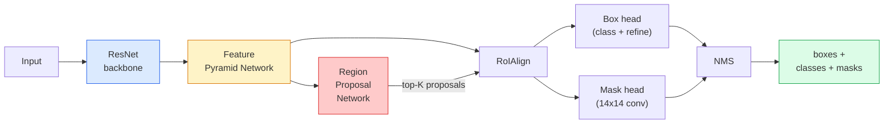

# 实例分割 — Mask R-CNN

> 向 Faster R-CNN 检测器添加一个微小的 mask 分支，你就拥有了实例分割。困难的部分是 RoIAlign，它看起来比实际更难。

**类型:** 构建 + 学习
**语言:** Python
**前提条件:** 第四阶段第 6 课（YOLO），第四阶段第 7 课（U-Net）
**时间:** ~75 分钟

## 学习目标

- 端到端追踪 Mask R-CNN 架构：骨干网络、FPN、RPN、RoIAlign、box head、mask head
- 从头开始实现 RoIAlign 并解释为什么不再使用 RoIPool
- 使用 torchvision 的 `maskrcnn_resnet50_fpn_v2` 预训练模型生成高质量的实例 mask 并正确读取其输出格式
- 通过替换 box head 和 mask head 并保持骨干网络冻结，在小规模自定义数据集上微调 Mask R-CNN

## 问题

语义分割为每个类别提供一个 mask。实例分割为每个对象提供一个 mask，即使两个对象属于同一类别。统计个体、跨帧跟踪以及测量事物（如墙中每个砖块的边界框、显微镜图像中每个细胞）都需要实例分割。

Mask R-CNN（He 等，2017）通过将实例分割重新定义为检测加 mask 解决了这个问题。该设计如此简洁，以至于在接下来的五年里，几乎所有实例分割论文都是 Mask R-CNN 的变体，而 torchvision 的实现仍然是小型到中型数据集的生产默认选择。

工程上的难题是采样：如何从一个角落未与像素边界对齐的提议框中裁剪出一个固定大小的特征区域？如果这一点处理错误，会导致 mAP 值在所有地方下降十分之一。RoIAlign 是解决这个问题的方法。

## 概念

### 架构



理解五个关键部分：

1. **Backbone** — 在ImageNet上训练的ResNet-50或ResNet-101。在步长为4、8、16、32时生成特征图的层次结构。
2. **FPN (Feature Pyramid Network)** — 通过自上而下和横向连接，为每一层提供具有丰富语义信息的C通道特征。检测时查询与目标尺寸匹配的FPN层级。
3. **RPN (Region Proposal Network)** — 一个小型卷积头，在每个锚点位置预测“此处是否有物体？”以及“如何优化边界框？”。每张图像生成约1000个候选框。
4. **RoIAlign** — 从任意FPN层级的任意框中采样固定大小（例如7x7）的特征块。使用双线性采样，不进行量化。
5. **Heads** — 一个两层的边界框头，用于优化边界框并选择类别，还有一个小型卷积头，为每个候选框输出一个`28x28`二值掩码。

### 为什么使用RoIAlign而不是RoIPool

原始的Fast R-CNN使用了RoIPool，它将候选框分割成网格，每个单元格中取最大特征值，并将所有坐标四舍五入为整数。这种四舍五入可能导致特征图与输入像素坐标之间最多错位一个特征图像素——在224x224图像中影响较小，但在步长为32的特征图中可能导致灾难性的错位。

```
RoIPool:
  box (34.7, 51.3, 98.2, 142.9)
  round -> (34, 51, 98, 142)
  split grid -> round each cell boundary
  misalignment accumulates at every step

RoIAlign:
  box (34.7, 51.3, 98.2, 142.9)
  sample at exact float coordinates using bilinear interpolation
  no rounding anywhere
```RoIAlign 在 COCO 上免费将 mask AP 提高了 3-4 分。现在所有关注定位的检测器都使用它 —— YOLOv7 seg、RT-DETR、Mask2Former 等等。

### 用一段话描述 RPN

在特征图的每个位置，放置 K 个不同大小和形状的锚框。为每个锚框预测一个对象性得分，以及一个回归偏移量，将锚框转换为更贴合的框。根据得分保留前 ~1,000 个框，以 IoU 0.7 的阈值应用 NMS，然后将幸存下来的框传递给头部。RPN 使用自己的小损失进行训练 —— 与第 6 课中的 YOLO 损失结构相同，只是这里只有两个类别（对象 / 非对象）。

### 掩码头部

对于每个提议（经过 RoIAlign 后），掩码头部是一个小型的 FCN：四个 3x3 卷积层，一个 2 倍上采样卷积层，一个最终的 1x1 卷积层，输出 `num_classes` 个输出通道，分辨率为 `28x28`。只保留与预测类别对应的通道，其余的通道被忽略。这将掩码预测与分类解耦。

将 28x28 的掩码上采样到提议的原始像素尺寸，生成最终的二值掩码。

### 损失函数

Mask R-CNN 总共有四个损失函数相加：

```
L = L_rpn_cls + L_rpn_box + L_box_cls + L_box_reg + L_mask
```- `L_rpn_cls`, `L_rpn_box` — 用于 RPN 候选框的对象性 + 边界框回归。
- `L_box_cls` — 在头部分类器上对 (C+1) 类（包括背景）的交叉熵。
- `L_box_reg` — 对头部边界框优化的平滑 L1 损失。
- `L_mask` — 对 28x28 掩码输出的逐像素二元交叉熵。

每个损失都有其默认权重；torchvision 的实现将它们作为构造函数参数公开。

### 输出格式

`torchvision.models.detection.maskrcnn_resnet50_fpn_v2` 返回一个字典列表，每个图像对应一个字典：

```
{
    "boxes":  (N, 4) in (x1, y1, x2, y2) pixel coordinates,
    "labels": (N,) class IDs, 0 = background so indices are 1-based,
    "scores": (N,) confidence scores,
    "masks":  (N, 1, H, W) float masks in [0, 1] — threshold at 0.5 for binary,
}
```

该掩码已经是完整图像分辨率。28x28 的头部输出已经在内部进行了上采样。

## 构建它

### 步骤 1：从零开始实现 RoIAlign

这是 Mask R-CNN 中唯一一个作为代码比作为文字更易于理解的组件。

```python
import torch
import torch.nn.functional as F

def roi_align_single(feature, box, output_size=7, spatial_scale=1 / 16.0):
    """
    feature: (C, H, W) single-image feature map
    box: (x1, y1, x2, y2) in original image pixel coordinates
    output_size: side of the output grid (7 for box head, 14 for mask head)
    spatial_scale: reciprocal of the feature map stride
    """
    C, H, W = feature.shape
    x1, y1, x2, y2 = [c * spatial_scale - 0.5 for c in box]
    bin_w = (x2 - x1) / output_size
    bin_h = (y2 - y1) / output_size

    grid_y = torch.linspace(y1 + bin_h / 2, y2 - bin_h / 2, output_size)
    grid_x = torch.linspace(x1 + bin_w / 2, x2 - bin_w / 2, output_size)
    yy, xx = torch.meshgrid(grid_y, grid_x, indexing="ij")

    gx = 2 * (xx + 0.5) / W - 1
    gy = 2 * (yy + 0.5) / H - 1
    grid = torch.stack([gx, gy], dim=-1).unsqueeze(0)
    sampled = F.grid_sample(feature.unsqueeze(0), grid, mode="bilinear",
                            align_corners=False)
    return sampled.squeeze(0)
```

每个数字都位于双线性采样的位置。没有四舍五入，没有量化，没有梯度丢失。

### 步骤 2：与 torchvision 的 RoIAlign 进行比较

```python
from torchvision.ops import roi_align

feature = torch.randn(1, 16, 50, 50)
boxes = torch.tensor([[0, 10, 20, 100, 90]], dtype=torch.float32)  # (batch_idx, x1, y1, x2, y2)

ours = roi_align_single(feature[0], boxes[0, 1:].tolist(), output_size=7, spatial_scale=1/4)
theirs = roi_align(feature, boxes, output_size=(7, 7), spatial_scale=1/4, sampling_ratio=1, aligned=True)[0]

print(f"shape ours:   {tuple(ours.shape)}")
print(f"shape theirs: {tuple(theirs.shape)}")
print(f"max|diff|:    {(ours - theirs).abs().max().item():.3e}")
```

使用 `sampling_ratio=1` 和 `aligned=True`，两者匹配精度在 `1e-5` 之内。

### 步骤 3：加载预训练的 Mask R-CNN

```python
import torch
from torchvision.models.detection import maskrcnn_resnet50_fpn_v2, MaskRCNN_ResNet50_FPN_V2_Weights

model = maskrcnn_resnet50_fpn_v2(weights=MaskRCNN_ResNet50_FPN_V2_Weights.DEFAULT)
model.eval()
print(f"params: {sum(p.numel() for p in model.parameters()):,}")
print(f"classes (including background): {len(model.roi_heads.box_predictor.cls_score.out_features * [0])}")
```46M 参数，91 个类别（COCO）。第一个类别（id 0）是背景；模型实际检测到的对象从 id 1 开始。

### 步骤 4：运行推理

```python
with torch.no_grad():
    x = torch.randn(3, 400, 600)
    predictions = model([x])
p = predictions[0]
print(f"boxes:  {tuple(p['boxes'].shape)}")
print(f"labels: {tuple(p['labels'].shape)}")
print(f"scores: {tuple(p['scores'].shape)}")
print(f"masks:  {tuple(p['masks'].shape)}")
```

掩码张量的形状为 `(N, 1, H, W)`。阈值设为 0.5 以获得每个对象的二值掩码：

```python
binary_masks = (p['masks'] > 0.5).squeeze(1)  # (N, H, W) boolean
```

### 步骤 5：为自定义类别数量交换头部

常见的微调方法：复用骨干网络、FPN 和 RPN；替换两个分类器头部。

```python
from torchvision.models.detection.faster_rcnn import FastRCNNPredictor
from torchvision.models.detection.mask_rcnn import MaskRCNNPredictor

def build_custom_maskrcnn(num_classes):
    model = maskrcnn_resnet50_fpn_v2(weights=MaskRCNN_ResNet50_FPN_V2_Weights.DEFAULT)
    in_features = model.roi_heads.box_predictor.cls_score.in_features
    model.roi_heads.box_predictor = FastRCNNPredictor(in_features, num_classes)
    in_features_mask = model.roi_heads.mask_predictor.conv5_mask.in_channels
    hidden_layer = 256
    model.roi_heads.mask_predictor = MaskRCNNPredictor(in_features_mask, hidden_layer, num_classes)
    return model

custom = build_custom_maskrcnn(num_classes=5)
print(f"custom cls_score.out_features: {custom.roi_heads.box_predictor.cls_score.out_features}")
```

`num_classes` 必须包含背景类别，因此具有 4 个对象类别的数据集使用 `num_classes=5`。

### 步骤 6：冻结不需要训练的部分

在小数据集上，冻结骨干网络和 FPN。只有 RPN 的对象性 + 回归和两个头部进行学习。

```python
def freeze_backbone_and_fpn(model):
    # torchvision Mask R-CNN packs the FPN inside `model.backbone` (as
    # `model.backbone.fpn`), so iterating `model.backbone.parameters()` covers
    # both the ResNet feature layers and the FPN lateral/output convs.
    for p in model.backbone.parameters():
        p.requires_grad = False
    return model

custom = freeze_backbone_and_fpn(custom)
trainable = sum(p.numel() for p in custom.parameters() if p.requires_grad)
print(f"trainable after freeze: {trainable:,}")
```

在包含 500 张图像的数据集上，这之间的区别就是收敛与过拟合。

## 使用方法

在 torchvision 中，Mask R-CNN 的完整训练循环只有 40 行代码，并且在不同任务之间不会发生显著变化 —— 只需更换数据集即可继续使用。

```python
def train_step(model, images, targets, optimizer):
    model.train()
    loss_dict = model(images, targets)
    losses = sum(loss for loss in loss_dict.values())
    optimizer.zero_grad()
    losses.backward()
    optimizer.step()
    return {k: v.item() for k, v in loss_dict.items()}
```

`targets` 列表必须为每张图像提供包含 `boxes`、`labels` 和 `masks` 的字典（以 `(num_instances, H, W)` 二进制张量形式）。模型在训练过程中返回包含四个损失的字典，在评估过程中返回以 `model.training` 为键的预测列表。

`pycocotools` 评估器对框和掩码都产生 mAP@IoU=0.5:0.95；你需要这两个数值来判断是框头还是掩码头成为瓶颈。

## 发布它

本课程将产出以下内容：

- `outputs/prompt-instance-vs-semantic-router.md` — 一个提示，询问三个问题并选择实例、语义或全景分割，同时指定要使用的具体模型。
- `outputs/skill-mask-rcnn-head-swapper.md` — 一种技能，根据新的 `num_classes`，为任何 torchvision 检测模型生成用于切换头的 10 行代码。

## 练习

1. **(简单)** 在 100 个随机框上验证你的 RoIAlign 是否与 `torchvision.ops.roi_align` 一致。报告最大绝对差异。同时运行 RoIPool（2017 年之前的版本），并显示它在靠近边界的框上因约 1-2 个特征图像素而出现差异。
2. **(中等)** 在一个 50 张图像的自定义数据集上微调 `maskrcnn_resnet50_fpn_v2`（任意两个类别：气球、鱼、坑洞、标志）。冻结主干网络，训练 20 个周期，报告掩码 AP@0.5。
3. **(困难)** 将 Mask R-CNN 的掩码头替换为在 56x56 处预测的掩码头，而不是在 28x28 处。测量替换前后的 mAP@IoU=0.75。解释为什么增益（或缺乏增益）与预期的边界精度/内存权衡一致。

## 关键术语

| 术语 | 人们常说 | 实际含义 |
|------|----------------|----------------|
| Mask R-CNN | “检测加掩码” | Faster R-CNN + 一个小型 FCN 头，为每个类别的每个提议预测 28x28 的掩码 |
| FPN | “特征金字塔” | 自上而下 + 侧边连接，为每个步长级别提供 C 通道的语义丰富特征 |
| RPN | “区域提议器” | 一个小型卷积头，每张图像生成约 1000 个物体/非物体提议 |
| RoIAlign | “无四舍五入裁剪” | 从任何浮点坐标框中双线性采样固定大小的特征网格 |
| RoIPool | “2017 年前的裁剪” | 与 RoIAlign 目的相同，但四舍五入框坐标；已过时 |
| Mask AP | “实例 mAP” | 使用掩码 IoU 而不是框 IoU 计算的平均精度；COCO 实例分割指标 |
| 二进制掩码头 | “每个类别的掩码” | 为每个提议预测每个类别的一个二进制掩码；仅保留预测类别的通道 |
| 背景类 | “类别 0” | 一个“无物体”的通用类别；真实类别的索引从 1 开始 |

## 进一步阅读

- [Mask R-CNN（He 等，2017）](https://arxiv.org/abs/1703.06870) — 论文；RoIAlign 部分是关键阅读内容
- [FPN：特征金字塔网络（Lin 等，2017）](https://arxiv.org/abs/1612.03144) — FPN 论文；现代检测器都使用它
- [torchvision Mask R-CNN 教程](https://pytorch.org/tutorials/intermediate/torchvision_tutorial.html) — 微调循环的参考
- [Detectron2 模型动物园](https://github.com/facebookresearch/detectron2/blob/main/MODEL_ZOO.md) — 几乎所有检测和分割变体的生产实现，带有训练好的权重
