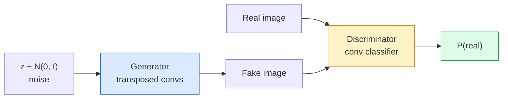

# 图像生成 —— GANs

> 一个 GAN 是两个神经网络在一个固定的游戏中的对抗。一个负责生成，一个负责评判。它们一起变得更好，直到生成的图像能够欺骗评判者。

**类型:** 构建
**语言:** Python
**先决条件:** 第四阶段第 03 课 (卷积神经网络), 第三阶段第 06 课 (优化器), 第三阶段第 07 课 (正则化)
**时间:** ~75 分钟

## 学习目标

- 解释生成器和判别器之间的 minimax 游戏，以及为什么平衡点对应于 p_model = p_data
- 在 PyTorch 中实现 DCGAN，并在不到 60 行代码内生成连贯的 32x32 合成图像
- 使用三个标准技巧稳定 GAN 的训练：非饱和损失、谱范数、TTUR（双时间尺度更新规则）
- 阅读训练曲线，区分健康的收敛与模式崩溃、振荡以及判别器完全获胜的情况

## 问题

分类教会网络将图像映射到标签。生成则反转了这个问题：生成看起来来自相同分布的新图像。你没有可以进行差异对比的“正确”输出；你只有一个想要模仿的分布。

标准的损失函数（MSE、交叉熵）无法衡量“这个样本是否来自真实分布”。最小化每个像素的误差会生成模糊的平均图像，而不是真实的样本。突破点是学习损失函数：训练一个第二个网络，它的任务是区分真实和伪造的图像，并利用它的判断推动生成器。

GANs（Goodfellow 等人，2014）定义了这个框架。到 2018 年，StyleGAN 已经能够生成与照片无法区分的 1024x1024 人脸。扩散模型随后在质量和可控性方面占据了主导地位，但每一种使扩散模型实用的技巧——归一化选择、潜在空间、特征损失——最初都是在 GANs 中被理解的。

## 概念

### 两个网络



生成器 **G** 接收一个噪声向量 `z`，并输出一张图像。判别器 **D** 接收一张图像，并输出一个标量：图像为真实图像的概率。

### 游戏

G 希望 D 判断错误。D 希望判断正确。形式化地：

```
min_G max_D  E_x[log D(x)] + E_z[log(1 - D(G(z)))]
```

从右到左看：D 正在最大化对真实（`log D(real)`）和伪造（`log (1 - D(fake))`）图像的准确率。G 正在最小化 D 对伪造图像的准确率——它希望 `D(G(z))` 要高。

Goodfellow 证明了这个极小极大问题存在一个全局均衡点，此时 `p_G = p_data`，D 在所有地方都输出 0.5，生成分布与真实分布之间的 Jensen-Shannon 散度为零。困难的部分是如何到达这个均衡点。

### 非饱和损失

上述形式在数值上是不稳定的。在训练初期，每个伪造样本的 `D(G(z))` 都接近于零，因此 `log(1 - D(G(z)))` 对 G 的梯度会消失。解决方法：反转 G 的损失。

```
L_D = -E_x[log D(x)] - E_z[log(1 - D(G(z)))]
L_G = -E_z[log D(G(z))]                          # non-saturating
```

现在当 `D(G(z))` 接近零时，G 的损失很大，其梯度也具有信息量。每种现代 GAN 都使用这种变体进行训练。

### DCGAN 架构规则

Radford, Metz, Chintala（2015）将多年失败的实验提炼成五条规则，使 GAN 的训练更加稳定：

1. 用步长卷积（strided convs）代替池化（两个网络都适用）。
2. 在生成器和判别器中都使用批量归一化（batch norm），但生成器的输出和判别器的输入除外。
3. 在更深的架构中移除全连接层。
4. 生成器在所有层中使用 ReLU，除了输出层（输出层使用 tanh，范围在 [-1, 1]）。
5. 判别器在所有层中使用 LeakyReLU（negative_slope=0.2）。

每种现代基于卷积的 GAN（如 StyleGAN、BigGAN、GigaGAN）仍然从这些规则出发，逐个替换其中的部分。

### 失败模式及其特征

```mermaid
flowchart LR
    M1["Mode collapse<br/>G produces a narrow<br/>set of outputs"] --> S1["D loss low,<br/>G loss oscillating,<br/>sample variety drops"]
    M2["Vanishing gradients<br/>D wins completely"] --> S2["D accuracy ~100%,<br/>G loss huge and static"]
    M3["Oscillation<br/>G and D keep trading<br/>wins forever"] --> S3["Both losses swing<br/>wildly with no downward trend"]

    style M1 fill:#fecaca,stroke:#dc2626
    style M2 fill:#fecaca,stroke:#dc2626
    style M3 fill:#fecaca,stroke:#dc2626
```- **模式崩溃（Mode collapse）**：G 找到一张能够欺骗 D 的图像，并且只生成这张图像。解决方法：添加小批量判别（minibatch discrimination）、谱归一化（spectral norm）或标签条件（label-conditioning）。
- **判别器胜出（Discriminator wins）**：D 变得太强，太快，导致 G 的梯度消失。解决方法：使用更小的 D、降低 D 的学习率，或对真实标签应用标签平滑（label smoothing）。
- **震荡（Oscillation）**：两个网络相互竞争，无法达到平衡。解决方法：使用 TTUR（D 的学习速度比 G 快 2-4 倍），或切换到 Wasserstein 损失。

### 评估

GAN 没有真实值，那如何判断它们是否有效？

- **样本检查（Sample inspection）**：在每个 epoch 结束时查看 64 个样本。这是必须的。
- **FID（Fréchet Inception Distance）**：真实数据集和生成数据集的 Inception-v3 特征分布之间的距离。数值越低越好。是社区的标准。
- **Inception Score**：较旧，且更脆弱；优先使用 FID。
- **生成模型的精确率/召回率（Precision/Recall for generative models）**：分别衡量质量（精确率）和覆盖范围（召回率）。比单独使用 FID 更具信息量。

对于一个小型的合成数据运行，样本检查就足够了。

## 构建它

### 步骤 1：生成器

一个小型的 DCGAN 生成器，接受 64 维的噪声，并生成 32x32 的图像。

```python
import torch
import torch.nn as nn

class Generator(nn.Module):
    def __init__(self, z_dim=64, img_channels=3, feat=64):
        super().__init__()
        self.net = nn.Sequential(
            nn.ConvTranspose2d(z_dim, feat * 4, kernel_size=4, stride=1, padding=0, bias=False),
            nn.BatchNorm2d(feat * 4),
            nn.ReLU(inplace=True),
            nn.ConvTranspose2d(feat * 4, feat * 2, kernel_size=4, stride=2, padding=1, bias=False),
            nn.BatchNorm2d(feat * 2),
            nn.ReLU(inplace=True),
            nn.ConvTranspose2d(feat * 2, feat, kernel_size=4, stride=2, padding=1, bias=False),
            nn.BatchNorm2d(feat),
            nn.ReLU(inplace=True),
            nn.ConvTranspose2d(feat, img_channels, kernel_size=4, stride=2, padding=1, bias=False),
            nn.Tanh(),
        )

    def forward(self, z):
        return self.net(z.view(z.size(0), -1, 1, 1))
```

四个转置卷积层，每个都使用 `kernel_size=4, stride=2, padding=1`，从而使空间尺寸干净地翻倍。通过 tanh 激活函数输出范围在 [-1, 1] 之间的值。

### 步骤 2：判别器

生成器的镜像。使用 LeakyReLU 和步长卷积，最终输出一个标量的 logit。

```python
class Discriminator(nn.Module):
    def __init__(self, img_channels=3, feat=64):
        super().__init__()
        self.net = nn.Sequential(
            nn.Conv2d(img_channels, feat, kernel_size=4, stride=2, padding=1),
            nn.LeakyReLU(0.2, inplace=True),
            nn.Conv2d(feat, feat * 2, kernel_size=4, stride=2, padding=1, bias=False),
            nn.BatchNorm2d(feat * 2),
            nn.LeakyReLU(0.2, inplace=True),
            nn.Conv2d(feat * 2, feat * 4, kernel_size=4, stride=2, padding=1, bias=False),
            nn.BatchNorm2d(feat * 4),
            nn.LeakyReLU(0.2, inplace=True),
            nn.Conv2d(feat * 4, 1, kernel_size=4, stride=1, padding=0),
        )

    def forward(self, x):
        return self.net(x).view(-1)
```

最后一个卷积层将 `4x4` 特征图缩减为 `1x1`。每张图像的输出是一个标量；仅在计算损失时应用 sigmoid 函数。

### 步骤 3：训练步骤

交替进行：每一批数据中，先更新 D 一次，然后更新 G 一次。

```python
import torch.nn.functional as F

def train_step(G, D, real, z, opt_g, opt_d, device):
    real = real.to(device)
    bs = real.size(0)

    # D step
    opt_d.zero_grad()
    d_real = D(real)
    d_fake = D(G(z).detach())
    loss_d = (F.binary_cross_entropy_with_logits(d_real, torch.ones_like(d_real))
              + F.binary_cross_entropy_with_logits(d_fake, torch.zeros_like(d_fake)))
    loss_d.backward()
    opt_d.step()

    # G step
    opt_g.zero_grad()
    d_fake = D(G(z))
    loss_g = F.binary_cross_entropy_with_logits(d_fake, torch.ones_like(d_fake))
    loss_g.backward()
    opt_g.step()

    return loss_d.item(), loss_g.item()
```D 步骤中的 `G(z).detach()` 至关重要：我们不希望在更新 G 的过程中梯度流入 G。忘记这一点是经典的初学者错误。

### 步骤 4：在合成形状上进行完整的训练循环

```python
from torch.utils.data import DataLoader, TensorDataset
import numpy as np

def synthetic_images(num=2000, size=32, seed=0):
    rng = np.random.default_rng(seed)
    imgs = np.zeros((num, 3, size, size), dtype=np.float32) - 1.0
    for i in range(num):
        r = rng.uniform(6, 12)
        cx, cy = rng.uniform(r, size - r, size=2)
        yy, xx = np.meshgrid(np.arange(size), np.arange(size), indexing="ij")
        mask = (xx - cx) ** 2 + (yy - cy) ** 2 < r ** 2
        color = rng.uniform(-0.5, 1.0, size=3)
        for c in range(3):
            imgs[i, c][mask] = color[c]
    return torch.from_numpy(imgs)

device = "cuda" if torch.cuda.is_available() else "cpu"
data = synthetic_images()
loader = DataLoader(TensorDataset(data), batch_size=64, shuffle=True)

G = Generator(z_dim=64, img_channels=3, feat=32).to(device)
D = Discriminator(img_channels=3, feat=32).to(device)
opt_g = torch.optim.Adam(G.parameters(), lr=2e-4, betas=(0.5, 0.999))
opt_d = torch.optim.Adam(D.parameters(), lr=2e-4, betas=(0.5, 0.999))

for epoch in range(10):
    for (batch,) in loader:
        z = torch.randn(batch.size(0), 64, device=device)
        ld, lg = train_step(G, D, batch, z, opt_g, opt_d, device)
    print(f"epoch {epoch}  D {ld:.3f}  G {lg:.3f}")
```

`Adam(lr=2e-4, betas=(0.5, 0.999))` 是 DCGAN 的默认设置 —— 较低的 beta1 值会防止动量项过多地稳定对抗游戏。

### 第 5 步：采样

```python
@torch.no_grad()
def sample(G, n=16, z_dim=64, device="cpu"):
    G.eval()
    z = torch.randn(n, z_dim, device=device)
    imgs = G(z)
    imgs = (imgs + 1) / 2
    return imgs.clamp(0, 1)
```

在采样之前，始终切换到 eval 模式。对于 DCGAN 来说，这一点很重要，因为会使用 batch norm 的运行时统计信息，而不是当前 batch 的统计信息。

### 步骤 6：谱归一化

这是判别器中批量归一化（BN）的一个直接替换方案，可以保证网络是 1-Lipschitz 的。这可以修复大多数“D 太容易获胜”的失败情况。

```python
from torch.nn.utils import spectral_norm

def build_sn_discriminator(img_channels=3, feat=64):
    return nn.Sequential(
        spectral_norm(nn.Conv2d(img_channels, feat, 4, 2, 1)),
        nn.LeakyReLU(0.2, inplace=True),
        spectral_norm(nn.Conv2d(feat, feat * 2, 4, 2, 1)),
        nn.LeakyReLU(0.2, inplace=True),
        spectral_norm(nn.Conv2d(feat * 2, feat * 4, 4, 2, 1)),
        nn.LeakyReLU(0.2, inplace=True),
        spectral_norm(nn.Conv2d(feat * 4, 1, 4, 1, 0)),
    )
```

用 `Discriminator` 交换 `build_sn_discriminator()`，通常不需要 TTUR 技巧。谱范数是你能应用的最简单的鲁棒性升级方式。

## 使用它

对于严肃的生成任务，使用预训练权重或切换到扩散模型。两个标准库：

- `torch_fidelity` 在不编写自定义评估代码的情况下，对你的生成器计算 FID / IS。
- `pytorch-gan-zoo`（旧版）和 `StudioGAN` 提供经过测试的 DCGAN、WGAN-GP、SN-GAN、StyleGAN 和 BigGAN 的实现。

到 2026 年，GAN 仍然是以下任务的最佳选择：实时图像生成（延迟 <10 ms）、风格迁移、具有精确控制的图像到图像翻译（Pix2Pix、CycleGAN）。扩散模型在照片级真实感和文本条件控制方面胜出。

## 部署它

本课生成以下内容：

- `outputs/prompt-gan-training-triage.md` — 一个提示，它读取训练曲线描述并选择失败模式（模式崩溃、D-胜利、振荡）以及单个推荐修复方法。
- `outputs/skill-dcgan-scaffold.md` — 一个技能，它从 `z_dim`、目标 `image_size` 和 `num_channels` 编写 DCGAN 框架，包括训练循环和样本保存器。

## 练习

1. **(简单)** 在合成圆数据集上训练上面的 DCGAN，并在每个 epoch 结束时保存 16 个样本的网格。到哪个 epoch 时生成的圆变得明显为圆形？
2. **(中等)** 将判别器中的批量归一化替换为谱范数。并排训练两个版本。哪个收敛得更快？在三个种子下，哪个方差更低？
3. **(困难)** 实现一个条件 DCGAN：将类别标签输入到 G 和 D 中（在 G 中将 one-hot 编码连接到噪声，在 D 中将类别嵌入通道连接）。在第 7 课的合成“圆 vs 方形”数据集上训练，并通过使用特定标签进行采样，展示类别条件是否有效。

## 关键术语

| 术语 | 人们说 | 实际含义 |
|------|----------------|----------------|
| 生成器（G） | “生成东西的网络” | 将噪声映射到图像；训练用于欺骗判别器 |
| 判别器（D） | “评论家” | 二分类器；训练用于区分真实和生成的图像 |
| 极小极大 | “游戏” | 关于 G 和 D 的对抗损失的极小极大；平衡点是 p_G = p_data |
| 非饱和损失 | “数值上合理的版本” | G 的损失是 -log(D(G(z))) 而不是 log(1 - D(G(z)))，以避免训练早期梯度消失 |
| 模式崩溃 | “生成器只生成一样东西” | G 仅生成数据分布的一个小子集；使用 SN、小批量判别或更大的批量来修复 |
| TTUR | “两个学习率” | D 比 G 学得更快，通常快 2-4 倍；稳定训练 |
| 谱范数 | “1-Lipschitz 层” | 一种权重归一化方法，限制每一层的 Lipschitz 常数；阻止 D 变得任意陡峭 |
| FID | “Fréchet Inception 距离” | 真实和生成集的 Inception-v3 特征分布之间的距离；标准评估指标 |

## 进一步阅读

- [生成对抗网络 (Goodfellow 等, 2014)](https://arxiv.org/abs/1406.2661) — 启动这一切的论文
- [DCGAN (Radford, Metz, Chintala, 2015)](https://arxiv.org/abs/1511.06434) — 使 GAN 可训练的架构规则
- [用于 GAN 的谱归一化 (Miyato 等, 2018)](https://arxiv.org/abs/1802.05957) — 最有用的稳定技巧
- [StyleGAN3 (Karras 等, 2021)](https://arxiv.org/abs/2106.12423) — 最先进的 GAN；读起来像是过去十年所有技巧的精选专辑
