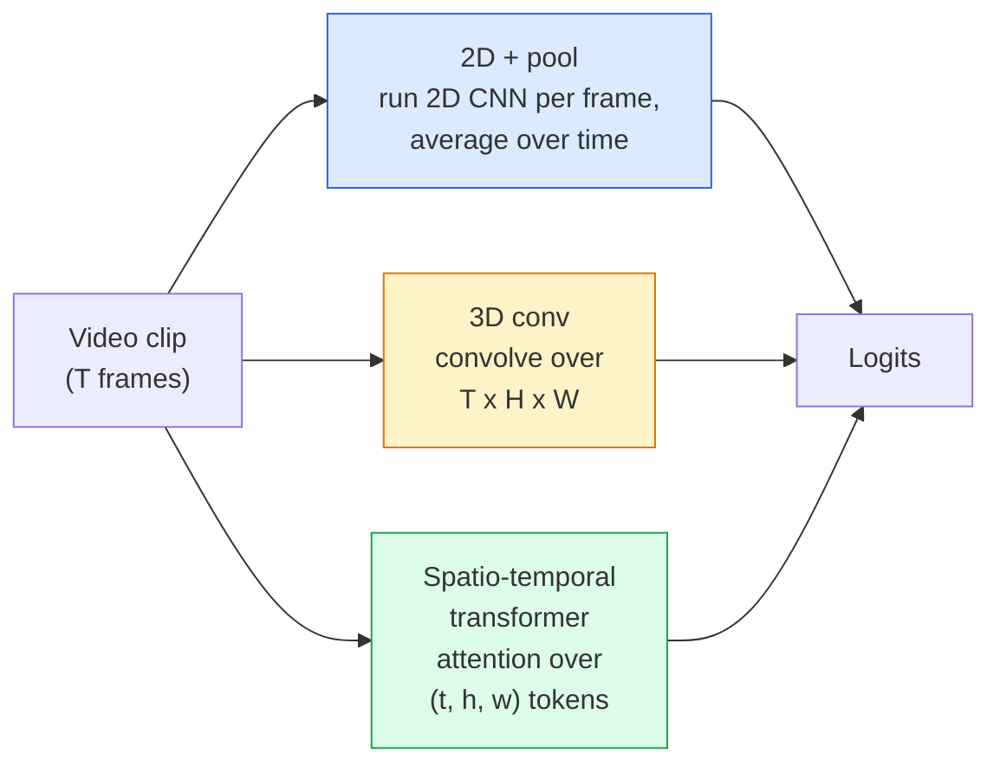

# 视频理解 —— 时间建模

> 视频是一系列图像加上连接它们的物理规律。每一个视频模型要么将时间视为一个额外的轴（3D卷积），一个需要关注的序列（transformer），或者一个一次性提取并池化的特征（2D+池化）。

**类型:** 学习 + 构建
**语言:** Python
**先决条件:** 第四阶段 第03课（CNNs），第四阶段 第04课（图像分类）
**时间:** ~45分钟

## 学习目标

- 区分三种主要的视频建模方法（2D+池化，3D卷积，时空transformer）并预测它们的成本和准确性权衡
- 在PyTorch中实现帧采样、时间池化和一个2D+池化的基线分类器
- 解释为什么I3D的“膨胀”3D卷积能很好地从ImageNet权重中迁移学习，以及分解的（2+1）D卷积有什么不同
- 阅读标准的动作识别数据集和指标：Kinetics-400/600，UCF101，Something-Something V2；在片段和视频级别的top-1准确率

## 问题

一个30秒的视频在30帧每秒的情况下是900张图像。天真地讲，视频分类就是将图像分类运行900次，然后进行某种形式的聚合。当动作几乎在每一帧中都可见时（体育、烹饪、锻炼视频），这种方法有效；而当动作本身由运动定义时（“从左向右推动某物”），这种方法却失败，因为每一帧看起来像是两个静态物体。

对于每一个视频架构来说，核心问题是：时间结构何时被建模，如何建模？答案决定了其他一切 —— 计算成本，预训练策略，是否可以复用ImageNet权重，模型训练使用的数据集。

本节课特意比静态图像课程更短。核心的图像处理机制已经就绪，视频理解主要围绕时间故事：采样、建模和聚合。

## 概念

### 三种架构家族



### 2D + pool

使用一个2D卷积网络（ResNet，EfficientNet，ViT）。独立地对每个采样帧运行该网络。对每个帧的嵌入向量进行平均（或最大池化，或注意力池化）。将池化后的向量输入到分类器中。

优点：
- ImageNet预训练可以直接迁移。
- 最容易实现。
- 成本低：T帧 * 单图像推理成本。

缺点：
- 无法建模运动。动作是外观的集合。
- 时间池化是顺序不变的；“开门”和“关门”看起来一样。

使用场景：以外观为主的任务，在小视频数据集上进行迁移学习，初始基线。

### 3D卷积

将2D（H，W）核替换为3D（T，H，W）核。网络在空间和时间上进行卷积。早期的家族：C3D，I3D，SlowFast。

I3D技巧：使用一个预训练的2D ImageNet模型，通过沿新的时间轴复制每个2D核来“膨胀”每个2D核。一个3x3的2D卷积变成一个3x3x3的3D卷积。这使得3D模型具有强大的预训练权重，而不是从头开始训练。

优点：
- 直接建模运动。
- I3D膨胀提供免费的迁移学习。

缺点：
- 与2D对应模型相比，FLOPs增加了T/8（对于堆叠三次的3D时间核）。
- 时间核较小；长距离运动需要金字塔或双流方法。

使用场景：动作识别，其中运动是信号（Something-Something V2，Kinetics中以运动为主的类别）。

### 时空变换器

将视频分块为时空补丁，并在所有补丁之间进行注意力操作。TimeSformer，ViViT，Video Swin，VideoMAE。

重要的注意力模式：
- **联合** — 在（t，h，w）上进行一次大的注意力操作。与`T*H*W`成二次关系；代价高。
- **分割** — 每个块有两个注意力操作：一个在时间上，一个在空间上。近似线性扩展。
- **分解** — 时间注意力与空间注意力在块之间交替进行。

优点：
- 在每个主要基准测试中都达到SOTA精度。
- 通过补丁膨胀从图像变换器（ViT）迁移。
- 支持通过稀疏注意力进行长上下文视频处理。

缺点：
- 计算资源消耗大。
- 需要仔细选择注意力模式，否则运行时会膨胀。

使用场景：大型数据集，高保真视频理解，多模态视频+文本任务。

### 帧采样

一个10秒的30fps片段有300帧；将所有300帧输入任何模型都是浪费的。标准策略：

- **均匀采样** — 在片段中均匀选取T帧。2D+pool的默认方法。
- **密集采样** — 随机选取连续的T帧窗口。常用于3D卷积，因为运动需要相邻帧。
- **多片段** — 从同一视频中采样多个T帧窗口，对每个片段进行分类，测试时对预测结果进行平均。

T通常为8、16、32或64。更高的T意味着更多的时序信息，但需要更多的计算资源。

### 评估

两个级别：
- **片段级准确率** — 模型看到一个T帧片段，报告top-k。
- **视频级准确率** — 在每个视频的多个片段上平均片段级预测；更高且更稳定。

始终报告两者。一个模型得分78%片段 / 82%视频，说明它严重依赖测试时的平均；一个模型得分80% / 81%则每个片段更稳健。

### 你将遇到的数据集

- **Kinetics-400 / 600 / 700** — 通用动作数据集。40万个片段；YouTube网址（许多现已失效）。
- **Something-Something V2** — 由运动定义的动作（“将X从左移到右”）。无法通过2D+pool解决。
- **UCF-101**，**HMDB-51** — 更旧、较小，但仍被报告。
- **AVA** — 在空间和时间上的动作定位；比分类更难。

## 构建它

### 第一步：帧采样器

适用于帧列表（或视频张量）的均匀和密集采样器。

```python
import numpy as np

def sample_uniform(num_frames_total, T):
    if num_frames_total <= T:
        return list(range(num_frames_total)) + [num_frames_total - 1] * (T - num_frames_total)
    step = num_frames_total / T
    return [int(i * step) for i in range(T)]


def sample_dense(num_frames_total, T, rng=None):
    rng = rng or np.random.default_rng()
    if num_frames_total <= T:
        return list(range(num_frames_total)) + [num_frames_total - 1] * (T - num_frames_total)
    start = int(rng.integers(0, num_frames_total - T + 1))
    return list(range(start, start + T))
```

两者都返回用于对视频张量进行切片的 `T` 索引。

### 步骤 2：2D+池化基线

对每帧运行 2D ResNet-18，对特征进行平均池化，然后进行分类。

```python
import torch
import torch.nn as nn
from torchvision.models import resnet18, ResNet18_Weights

class FramePool(nn.Module):
    def __init__(self, num_classes=400, pretrained=True):
        super().__init__()
        weights = ResNet18_Weights.IMAGENET1K_V1 if pretrained else None
        backbone = resnet18(weights=weights)
        self.features = nn.Sequential(*(list(backbone.children())[:-1]))  # global avg pool kept
        self.head = nn.Linear(512, num_classes)

    def forward(self, x):
        # x: (N, T, 3, H, W)
        N, T = x.shape[:2]
        x = x.view(N * T, *x.shape[2:])
        feats = self.features(x).view(N, T, -1)
        pooled = feats.mean(dim=1)
        return self.head(pooled)

model = FramePool(num_classes=10)
x = torch.randn(2, 8, 3, 224, 224)
print(f"output: {model(x).shape}")
print(f"params: {sum(p.numel() for p in model.parameters()):,}")
```1100万个参数，ImageNet预训练，逐帧运行，平均，分类。这个基线在以外观为主的任务上通常与正确的3D模型相差5-10分——有时更好，因为它复用了一个更强的ImageNet主干。

### 第3步：一种I3D风格的膨胀3D卷积

通过沿着新的时间轴重复权重，将一个单独的2D卷积转换为3D卷积。

```python
def inflate_2d_to_3d(conv2d, time_kernel=3):
    out_c, in_c, kh, kw = conv2d.weight.shape
    weight_3d = conv2d.weight.data.unsqueeze(2)  # (out, in, 1, kh, kw)
    weight_3d = weight_3d.repeat(1, 1, time_kernel, 1, 1) / time_kernel
    conv3d = nn.Conv3d(in_c, out_c, kernel_size=(time_kernel, kh, kw),
                        padding=(time_kernel // 2, conv2d.padding[0], conv2d.padding[1]),
                        stride=(1, conv2d.stride[0], conv2d.stride[1]),
                        bias=False)
    conv3d.weight.data = weight_3d
    return conv3d

conv2d = nn.Conv2d(3, 64, kernel_size=3, padding=1, bias=False)
conv3d = inflate_2d_to_3d(conv2d, time_kernel=3)
print(f"2D weight shape:  {tuple(conv2d.weight.shape)}")
print(f"3D weight shape:  {tuple(conv3d.weight.shape)}")
x = torch.randn(1, 3, 8, 56, 56)
print(f"3D output shape:  {tuple(conv3d(x).shape)}")
```

通过 `time_kernel` 进行除法操作，可以保持激活值的幅度大致恒定 —— 这对于在第一次遍历时不破坏批归一化（batch-norm）的统计信息非常重要。

### 步骤 4：分解的（2+1）D 卷积

将一个 3D 卷积拆分为一个 2D（空间）卷积和一个 1D（时间）卷积。具有相同的感受野，参数更少，在某些基准测试中准确率更高。

```python
class Conv2Plus1D(nn.Module):
    def __init__(self, in_c, out_c, kernel_size=3):
        super().__init__()
        mid_c = (in_c * out_c * kernel_size * kernel_size * kernel_size) \
                // (in_c * kernel_size * kernel_size + out_c * kernel_size)
        self.spatial = nn.Conv3d(in_c, mid_c, kernel_size=(1, kernel_size, kernel_size),
                                 padding=(0, kernel_size // 2, kernel_size // 2), bias=False)
        self.bn = nn.BatchNorm3d(mid_c)
        self.act = nn.ReLU(inplace=True)
        self.temporal = nn.Conv3d(mid_c, out_c, kernel_size=(kernel_size, 1, 1),
                                  padding=(kernel_size // 2, 0, 0), bias=False)

    def forward(self, x):
        return self.temporal(self.act(self.bn(self.spatial(x))))

c = Conv2Plus1D(3, 64)
x = torch.randn(1, 3, 8, 56, 56)
print(f"(2+1)D output: {tuple(c(x).shape)}")
```

一个完整的 R(2+1)D 网络与 ResNet-18 相同，只是每个 3x3 卷积都被替换为 `Conv2Plus1D`。

## 使用方式

两个库覆盖了生产视频工作：

- `torchvision.models.video` — R(2+1)D、MViT、Swin3D，带有预训练的 Kinetics 权重。与图像模型使用相同的 API。
- `pytorchvideo`（Meta） — 模型动物园、Kinetics / SSv2 / AVA 的数据加载器、标准变换。

对于视觉-语言视频模型（视频字幕生成、视频问答），使用 `transformers`（`VideoMAE`、`VideoLLaMA`、`InternVideo`）。

## 部署它

本课内容产生：

- `outputs/prompt-video-architecture-picker.md` — 一个提示，根据外观与运动、数据集大小和计算预算，选择 2D+pool / I3D / (2+1)D / transformer。
- `outputs/skill-frame-sampler-auditor.md` — 一项技能，检查视频流水线的采样器并标记常见错误：索引偏移、当 `num_frames < T` 时采样不均、缺少保持宽高比的裁剪等。

## 练习

1. **(简单)** 计算 FramePool 在 T=8 时的 FLOPs（近似）与 I3D 风格的 3D ResNet 在 T=8 时的 FLOPs。解释为什么 2D+pool 的成本要低 3-5 倍。
2. **(中等)** 生成一个合成视频数据集：随机方向移动的球，根据运动方向（“从左到右”、“从右到左”、“向右上方对角”）进行标注。在该数据集上训练 FramePool。展示其达到接近随机精度，证明仅凭外观不足以完成运动任务。
3. **(困难)** 通过将 ResNet-18 中的每个 Conv2d 替换为 `Conv2Plus1D` 来构建一个 R(2+1)D-18。将第一个卷积的权重从 ImageNet 预训练的 ResNet-18 中扩展。在练习 2 的运动数据集上训练，并击败 FramePool。

## 关键术语

| 术语 | 人们怎么说 | 实际含义 |
|------|----------------|----------------------|
| 2D + pool | “每帧分类器” | 在每个采样帧上运行 2D CNN，跨时间平均池化特征，进行分类 |
| 3D 卷积 | “时空核” | 在 (T, H, W) 上进行卷积的核；可以原生建模运动 |
| 扩展 | “将 2D 权重扩展为 3D” | 沿新时间轴重复 2D 卷积的权重来初始化 3D 卷积权重，然后除以 kernel_T 以保持激活规模 |
| (2+1)D | “分解卷积” | 将 3D 分解为 2D 空间 + 1D 时间；参数更少，中间增加了额外的非线性 |
| 分散注意力 | “先时间后空间” | 每层有两个注意力：一个在同一帧的 token 上，一个在同一位置的 token 上 |
| Clip | “T 帧窗口” | 采样得到的 T 帧子序列；视频模型消耗的单位 |
| Clip 与视频准确率 | “两种评估设置” | Clip = 每个视频一个样本，视频 = 多个采样 clip 的平均 |
| Kinetics | “视频的 ImageNet” | 400-700 个动作类别，300k+ YouTube 剪辑，标准的视频预训练语料库 |

## 进一步阅读

- [I3D: Quo Vadis, Action Recognition (Carreira & Zisserman, 2017)](https://arxiv.org/abs/1705.07750) — 引入扩展和 Kinetics 数据集
- [R(2+1)D: A Closer Look at Spatiotemporal Convolutions (Tran et al., 2018)](https://arxiv.org/abs/1711.11248) — 分解卷积，仍然是一个强大的基线
- [TimeSformer: Is Space-Time Attention All You Need? (Bertasius et al., 2021)](https://arxiv.org/abs/2102.05095) — 第一个强大的视频 Transformer
- [VideoMAE (Tong et al., 2022)](https://arxiv.org/abs/2203.12602) — 视频的掩码自编码器预训练；当前的主导预训练方法
