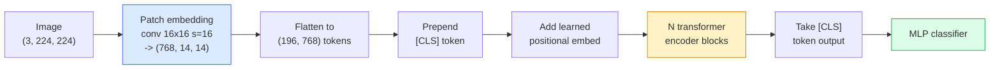

# 视觉变换器（ViT）

> 将图像分割成块，将每个块视为一个词，运行标准的变换器。不要回头。

**类型:** 构建
**语言:** Python
**先决条件:** 第7阶段第2课（自注意力），第4阶段第4课（图像分类）
**时间:** ~45分钟

## 学习目标

- 从头开始实现块嵌入、学习位置嵌入、类别标记和变换器编码器块，构建一个最小的ViT
- 解释为什么在DeiT和MAE证明之前，人们认为ViT需要大量预训练数据
- 比较ViT、Swin和ConvNeXt在它们的结构先验（无、局部窗口注意力、卷积主干）上的差异
- 使用 `timm` 和标准的线性探测 / 微调方案，在小数据集上对预训练的ViT进行微调

## 问题

十年来，卷积与计算机视觉同义。CNN具有很强的归纳偏置——局部性和平移等变性，没有人认为可以替换。然后Dosovitskiy等人（2020）展示了将普通的变换器应用到扁平化的图像块上，完全不使用任何卷积机制，就能在大规模数据上匹配甚至超越最好的CNN。

关键点在于“在大规模数据上”。在ImageNet-1k上，ViT输给ResNet。在ImageNet-21k或JFT-300M上预训练，然后在ImageNet-1k上微调的ViT则胜出。结论是变换器缺乏有用的先验，但可以从足够多的数据中学习它们。后续的工作（如DeiT、MAE、DINO）表明，使用正确的训练方法——强增强、自监督预训练、蒸馏——ViT在小数据上也能训练得很好。

到2026年，纯CNN在边缘设备上仍然具有竞争力（ConvNeXt是最强的），但变换器在其他所有领域占据主导地位：分割（Mask2Former、SegFormer）、检测（DETR、RT-DETR）、多模态（CLIP、SigLIP）、视频（VideoMAE、VJEPA）。ViT的块结构是必须掌握的。

## 概念

### 流程图



七个步骤。补丁 -> 令牌 -> 注意力 -> 分类器。每一个变体（DeiT、Swin、ConvNeXt、MAE预训练）都会改变其中一到两个步骤，而其余步骤保持不变。

### 补丁嵌入

第一个卷积是关键。卷积核大小为16，步长为16，因此一个224x224的图像会被转换成一个14x14的网格，每个网格由16x16的补丁组成，每个补丁被投影到一个768维的嵌入向量中。这一个卷积层同时完成了补丁化和线性投影。

```
Input:  (3, 224, 224)
Conv (3 -> 768, k=16, s=16, no padding):
Output: (768, 14, 14)
Flatten spatial: (196, 768)
```196 个补丁 = 196 个标记。每个标记的特征维度是 768（ViT-B）、1024（ViT-L）或 1280（ViT-H）。

### 类别标记

一个可学习的向量，添加到序列的最前面：

```
tokens = [CLS; patch_1; patch_2; ...; patch_196]   shape (197, 768)
```

经过 N 个 Transformer 模块后，`[CLS]` 的输出即为全局图像表示。分类头仅读取这个向量。

### 位置嵌入

Transformer 本身没有内置的空间位置概念。为每个 token 添加一个学习得到的向量：

```
tokens = tokens + learned_pos_embedding   (also shape (197, 768))
```

嵌入是模型的一个参数；基于梯度的训练使其适应二维图像结构。存在正弦二维替代方案，但在实践中很少使用。

### Transformer 编码器块

标准。多头自注意力，MLP，残差连接，预层归一化。

```
x = x + MSA(LN(x))
x = x + MLP(LN(x))

MLP is two-layer with GELU: Linear(d -> 4d) -> GELU -> Linear(4d -> d)
```ViT-B/16堆叠了12个这样的块，每个块有12个注意力头，总共86M参数。

### 为什么使用pre-LN

早期的Transformer使用post-LN（`x = LN(x + sublayer(x))`），在没有预热的情况下训练超过6-8层时遇到了困难。pre-LN（`x = x + sublayer(LN(x))`）可以在没有预热的情况下稳定地训练更深的网络。每个ViT和每个现代的LLM都使用pre-LN。

### 补丁大小的权衡

- 16x16补丁 -> 196个token，标准。
- 32x32补丁 -> 49个token，更快但分辨率较低。
- 8x8补丁 -> 784个token，更精细但注意力成本O(n²)扩展性差。

更大的补丁意味着更少的token，更快但空间细节更少。SwinV2在分层窗口中使用4x4补丁。

### DeiT在ImageNet-1k上训练ViT的配方

原始ViT需要JFT-300M才能击败CNN。DeiT（Touvron等，2020）通过四个改变，仅在ImageNet-1k上训练ViT-B达到81.8%的top-1准确率：

1. 强大的数据增强：RandAugment、Mixup、CutMix、Random Erasing。
2. 随机深度（训练过程中随机丢弃整个块）。
3. 重复增强（每个批次中同一张图像采样3次）。
4. 从CNN教师模型进行知识蒸馏（可选，进一步提升准确率）。

每个现代的ViT训练配方都源自DeiT。

### Swin与ConvNeXt的对比

- **Swin**（Liu等，2021）——基于窗口的注意力。每个块在局部窗口内进行注意力计算；交替块通过移动窗口来混合窗口间的信息。在保留注意力操作的同时，重新引入了类似CNN的局部先验。
- **ConvNeXt**（Liu等，2022）——重新设计的CNN，匹配Swin的架构选择（深度卷积、LayerNorm、GELU、倒置瓶颈）。表明差距并非“注意力与卷积”，而是“现代训练配方 + 架构”。

2026年，ConvNeXt-V2和Swin-V2都是生产级的；正确的选择取决于你的推理栈（ConvNeXt在边缘设备上编译更好）和预训练语料库。

### MAE预训练

掩码自编码器（He等，2022）：随机掩码75%的补丁，训练编码器仅处理可见的25%，训练一个小解码器从编码器的输出重建被掩码的补丁。预训练后丢弃解码器并微调编码器。

MAE使ViT仅在ImageNet-1k上即可训练，达到SOTA，并且是当前默认的自监督配方。

## 构建它

### 第一步：补丁嵌入

```python
import torch
import torch.nn as nn

class PatchEmbedding(nn.Module):
    def __init__(self, in_channels=3, patch_size=16, dim=192, image_size=64):
        super().__init__()
        assert image_size % patch_size == 0
        self.proj = nn.Conv2d(in_channels, dim, kernel_size=patch_size, stride=patch_size)
        num_patches = (image_size // patch_size) ** 2
        self.num_patches = num_patches

    def forward(self, x):
        x = self.proj(x)
        return x.flatten(2).transpose(1, 2)
```

一个卷积层，一个展平层，一个转置层。这就是整个图像到标记的步骤。

### 步骤 2：Transformer 块

预归一化（Pre-LN），多头自注意力，带有 GELU 的 MLP，残差连接。

```python
class Block(nn.Module):
    def __init__(self, dim, num_heads, mlp_ratio=4, dropout=0.0):
        super().__init__()
        self.ln1 = nn.LayerNorm(dim)
        self.attn = nn.MultiheadAttention(dim, num_heads, dropout=dropout, batch_first=True)
        self.ln2 = nn.LayerNorm(dim)
        self.mlp = nn.Sequential(
            nn.Linear(dim, dim * mlp_ratio),
            nn.GELU(),
            nn.Dropout(dropout),
            nn.Linear(dim * mlp_ratio, dim),
            nn.Dropout(dropout),
        )

    def forward(self, x):
        a, _ = self.attn(self.ln1(x), self.ln1(x), self.ln1(x), need_weights=False)
        x = x + a
        x = x + self.mlp(self.ln2(x))
        return x
```

`nn.MultiheadAttention` 负责处理头的拆分、缩放点积以及输出投影。`batch_first=True` 所以形状是 `(N, seq, dim)`。

### 第三步：ViT

```python
class ViT(nn.Module):
    def __init__(self, image_size=64, patch_size=16, in_channels=3,
                 num_classes=10, dim=192, depth=6, num_heads=3, mlp_ratio=4):
        super().__init__()
        self.patch = PatchEmbedding(in_channels, patch_size, dim, image_size)
        num_patches = self.patch.num_patches
        self.cls_token = nn.Parameter(torch.zeros(1, 1, dim))
        self.pos_embed = nn.Parameter(torch.zeros(1, num_patches + 1, dim))
        self.blocks = nn.ModuleList([
            Block(dim, num_heads, mlp_ratio) for _ in range(depth)
        ])
        self.ln = nn.LayerNorm(dim)
        self.head = nn.Linear(dim, num_classes)
        nn.init.trunc_normal_(self.pos_embed, std=0.02)
        nn.init.trunc_normal_(self.cls_token, std=0.02)

    def forward(self, x):
        x = self.patch(x)
        cls = self.cls_token.expand(x.size(0), -1, -1)
        x = torch.cat([cls, x], dim=1)
        x = x + self.pos_embed
        for blk in self.blocks:
            x = blk(x)
        x = self.ln(x[:, 0])
        return self.head(x)

vit = ViT(image_size=64, patch_size=16, num_classes=10, dim=192, depth=6, num_heads=3)
x = torch.randn(2, 3, 64, 64)
print(f"output: {vit(x).shape}")
print(f"params: {sum(p.numel() for p in vit.parameters()):,}")
```

约 2.8M 参数 —— 一个可以在 CPU 上运行的小型 ViT。真正的 ViT-B 是 86M；与 `dim=768, depth=12, num_heads=12` 使用相同的类别定义。

### 步骤 4：合理性检查 —— 单张图像推理

```python
logits = vit(torch.randn(1, 3, 64, 64))
print(f"logits: {logits}")
print(f"probs:  {logits.softmax(-1)}")
```

应无错误。概率总和为 1。

## 使用方法

`timm` 为每种 ViT 变体都提供了 ImageNet 预训练权重。一行代码即可：

 /no_think

<>

应无错误。概率总和为 1。

## 使用方法

`timm` 为每种 ViT 变体都提供了 ImageNet 预训练权重。一行代码即可：

 /no_think

```python
import timm

model = timm.create_model("vit_base_patch16_224", pretrained=True, num_classes=10)
```

`timm` 是 2026 年视觉变换器的生产默认设置。支持 ViT、DeiT、Swin、Swin-V2、ConvNeXt、ConvNeXt-V2、MaxViT、MViT、EfficientFormer，以及在同一 API 下的数十种其他模型。

对于多模态工作（图像 + 文本），`transformers` 提供 CLIP、SigLIP、BLIP-2、LLaVA。所有这些模型中的图像编码器都是 ViT 的变体。

## 发布它

本课将产生以下内容：

- `outputs/prompt-vit-vs-cnn-picker.md` — 一个提示，根据数据集大小、计算资源和推理堆栈在 ViT、ConvNeXt 或 Swin 之间进行选择。
- `outputs/skill-vit-patch-and-pos-embed-inspector.md` — 一项技能，验证 ViT 的块嵌入和位置嵌入形状是否与模型预期的序列长度匹配，从而捕捉最常见的移植错误。

## 练习

1. **(简单)** 打印上述微型 ViT 正向传递过程中每个中间张量的形状。确认：输入 `(N, 3, 64, 64)` -> 块 `(N, 16, 192)` -> 加入 CLS `(N, 17, 192)` -> 分类器输入 `(N, 192)` -> 输出 `(N, num_classes)`。
2. **(中等)** 在第 4 课的合成 CIFAR 数据集上微调预训练的 `timm` ViT-S/16。与在同一数据上微调 ResNet-18 进行比较。报告训练时间和最终准确率。
3. **(困难)** 为微型 ViT 实现 MAE 预训练：遮盖 75% 的块，训练编码器和一个小型解码器以重建被遮盖的块。在预训练前后评估合成数据上的线性探测准确率。

## 关键术语

| 术语 | 人们所说的 | 实际含义 |
|------|----------------|----------------------|
| 块嵌入 | "第一个卷积" | 一个卷积核大小等于步长等于块大小的卷积；将图像转换为一个 token 嵌入的网格 |
| 类 token | "[CLS]" | 一个学习到的向量，添加到 token 序列的前面；其最终输出是全局图像表示 |
| 位置嵌入 | "学习到的位置" | 每个 token 上添加的一个学习到的向量，以便变换器知道每个块的来源 |
| Pre-LN | "子层之前的 LayerNorm" | 稳定的变换器变体：使用 `x + sublayer(LN(x))` 而不是 `LN(x + sublayer(x))` |
| 多头注意力 | "并行注意力" | 标准变换器注意力拆分为 num_heads 个独立子空间，之后再进行拼接 |
| ViT-B/16 | "基础，块 16" | 典型大小：dim=768，depth=12，heads=12，patch_size=16，image=224；约 86M 参数 |
| DeiT | "数据高效型 ViT" | 仅在 ImageNet-1k 上训练的 ViT，使用强增强；证明了大规模预训练数据集并非严格必需 |
| MAE | "掩码自编码器" | 自监督预训练：遮盖 75% 的块，进行重建；ViT 预训练的主要方法 |

## 进一步阅读

- [一张图片值 16x16 个词 (Dosovitskiy 等, 2020)](https://arxiv.org/abs/2010.11929) — ViT 论文
- [DeiT: 数据高效型图像变换器 (Touvron 等, 2020)](https://arxiv.org/abs/2012.12877) — 如何仅在 ImageNet-1k 上训练 ViT
- [掩码自编码器是可扩展的视觉学习器 (He 等, 2022)](https://arxiv.org/abs/2111.06377) — MAE 预训练
- [timm 文档](https://huggingface.co/docs/timm) — 你将在生产中使用的所有视觉变换器的参考文档
