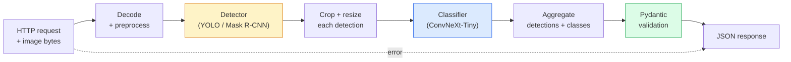

# 构建一个完整的视觉流水线 —— 顶石项目

> 一个生产级的视觉系统是一系列模型和规则通过数据契约连接而成的链条。这些组件已经在这个阶段准备好了；顶石项目将它们端到端地连接在一起。

**类型:** 构建  
**语言:** Python  
**先决条件:** 第四阶段课程 01-15  
**时间:** ~120 分钟

## 学习目标

- 设计一个生产级的视觉流水线，该流水线能够检测物体、对它们进行分类，并生成结构化的 JSON —— 并且处理每一条失败路径
- 将一个检测器（Mask R-CNN 或 YOLO）、一个分类器（ConvNeXt-Tiny）和一个数据契约（Pydantic）整合进一个服务中
- 对端到端的流水线进行基准测试，并识别第一个瓶颈（通常是预处理，然后是检测器）
- 部署一个最小化的 FastAPI 服务，该服务接受图像上传、运行流水线，并返回带有分类结果的检测结果

## 问题描述

单个视觉模型是有用的；但视觉产品是由这些模型组成的链条。零售货架审计是一个检测器加上一个产品分类器加上一个价格 OCR 流水线。自动驾驶是一个 2D 检测器加上一个 3D 检测器加上一个分割器加上一个跟踪器加上一个规划器。医疗预筛选是一个分割器加上一个区域分类器加上一个医生用户界面。

将这些链条连接起来是将一个机器学习原型与产品区分开来的部分。模型之间的每一个接口都可能引入新的错误点。每一个坐标变换、每一次归一化、每一次掩码缩放，都可能是导致静默失败的候选点。流水线的强度取决于其最弱的接口。

这个顶石项目建立了最小可行的流水线：检测 + 分类 + 结构化输出 + 服务层。第四阶段中的所有其他内容都可以插入到这个骨架中：将 Mask R-CNN 替换为 YOLOv8，添加一个 OCR 头，添加一个分割分支，添加一个跟踪器。架构是稳定的；组件是可插拔的。

## 概念

### 流水线



七个阶段。两个模型阶段是昂贵的；其余五个阶段是错误滋生的地方。

### 使用 Pydantic 的数据契约

每个模型边界都成为一个类型化的对象。这将静默失败转化为明显的错误。

```
Detection(
    box: tuple[float, float, float, float],   # (x1, y1, x2, y2), absolute pixels
    score: float,                              # [0, 1]
    class_id: int,                             # from detector's label map
    mask: Optional[list[list[int]]],           # RLE-encoded if present
)

PipelineResult(
    image_id: str,
    detections: list[Detection],
    classifications: list[Classification],
    inference_ms: float,
)
```

当检测器返回的框使用 `(cx, cy, w, h)` 而非 `(x1, y1, x2, y2)` 时，Pydantic 的验证会在边界处失败，你将立即发现问题，而不是调试一个下游裁剪操作，它静默地返回空区域。

### 延迟去向

几乎每条视觉流水线都遵循以下三个规律：

1. **预处理通常是最大的单一瓶颈。** 解码 JPEG、转换颜色空间、调整大小 —— 这些都是 CPU 密集型操作，很容易被忽视。
2. **检测器主导 GPU 时间。** 70-90% 的 GPU 时间用于检测的前向传播。
3. **后处理（NMS、RLE 编码/解码）在 GPU 上便宜，在 CPU 上昂贵。** 始终使用实际目标进行性能分析。

了解分布情况是将优化转化为优先级列表的关键。

### 故障模式

- **空检测** — 返回空列表，不崩溃。记录日志。
- **越界框** — 在裁剪前将框限制在图像尺寸内。
- **微小裁剪** — 跳过分类，对于小于分类器最小输入的框。
- **损坏上传** — 返回 400 响应和特定错误代码，而不是 500。
- **模型加载失败** — 服务启动时失败，而不是在第一个请求时失败。

生产流水线处理每种情况，而无需编写隐藏故障的通用 `try/except`。每个故障都有一个命名代码和一个响应。

### 批处理

一个生产服务要为多个客户端提供服务。跨请求批处理检测和分类可以提高吞吐量。权衡：等待批处理填充带来的额外延迟。典型设置：收集最多 20 毫秒的请求，批量处理，然后分配响应。`torchserve` 和 `triton` 原生支持此功能；负载可预测的小型服务则自行实现微批处理。

## 构建它

### 第一步：数据契约

```python
from pydantic import BaseModel, Field
from typing import List, Optional, Tuple

class Detection(BaseModel):
    box: Tuple[float, float, float, float]
    score: float = Field(ge=0, le=1)
    class_id: int = Field(ge=0)
    mask_rle: Optional[str] = None


class Classification(BaseModel):
    detection_index: int
    class_id: int
    class_name: str
    score: float = Field(ge=0, le=1)


class PipelineResult(BaseModel):
    image_id: str
    detections: List[Detection]
    classifications: List[Classification]
    inference_ms: float
```

五秒钟的代码可以节省一小时的调试时间，无论是在任何严肃的流水线中。

### 步骤 2：一个最小的 Pipeline 类

```python
import time
import numpy as np
import torch
from PIL import Image

class VisionPipeline:
    def __init__(self, detector, classifier, class_names,
                 device="cpu", min_crop=32):
        self.detector = detector.to(device).eval()
        self.classifier = classifier.to(device).eval()
        self.class_names = class_names
        self.device = device
        self.min_crop = min_crop

    def preprocess(self, image):
        """
        image: PIL.Image or np.ndarray (H, W, 3) uint8
        returns: CHW float tensor on device
        """
        if isinstance(image, Image.Image):
            image = np.asarray(image.convert("RGB"))
        tensor = torch.from_numpy(image).permute(2, 0, 1).float() / 255.0
        return tensor.to(self.device)

    @torch.no_grad()
    def detect(self, image_tensor):
        return self.detector([image_tensor])[0]

    @torch.no_grad()
    def classify(self, crops):
        if len(crops) == 0:
            return []
        batch = torch.stack(crops).to(self.device)
        logits = self.classifier(batch)
        probs = logits.softmax(-1)
        scores, cls = probs.max(-1)
        return list(zip(cls.tolist(), scores.tolist()))

    def run(self, image, image_id="anonymous"):
        t0 = time.perf_counter()
        tensor = self.preprocess(image)
        det = self.detect(tensor)

        crops = []
        detections = []
        valid_indices = []
        for i, (box, score, cls) in enumerate(zip(det["boxes"], det["scores"], det["labels"])):
            x1, y1, x2, y2 = [max(0, int(b)) for b in box.tolist()]
            x2 = min(x2, tensor.shape[-1])
            y2 = min(y2, tensor.shape[-2])
            detections.append(Detection(
                box=(x1, y1, x2, y2),
                score=float(score),
                class_id=int(cls),
            ))
            if (x2 - x1) < self.min_crop or (y2 - y1) < self.min_crop:
                continue
            crop = tensor[:, y1:y2, x1:x2]
            crop = torch.nn.functional.interpolate(
                crop.unsqueeze(0),
                size=(224, 224),
                mode="bilinear",
                align_corners=False,
            )[0]
            crops.append(crop)
            valid_indices.append(i)

        class_preds = self.classify(crops)

        classifications = []
        for valid_idx, (cls_id, cls_score) in zip(valid_indices, class_preds):
            classifications.append(Classification(
                detection_index=valid_idx,
                class_id=int(cls_id),
                class_name=self.class_names[cls_id],
                score=float(cls_score),
            ))

        return PipelineResult(
            image_id=image_id,
            detections=detections,
            classifications=classifications,
            inference_ms=(time.perf_counter() - t0) * 1000,
        )
```

每个接口都有类型。每个失败路径都有特定的处理决策。

### 第三步：连接一个探测器和一个分类器

```python
from torchvision.models.detection import maskrcnn_resnet50_fpn_v2
from torchvision.models import convnext_tiny

# Use ImageNet-pretrained weights for a realistic pipeline without training
detector = maskrcnn_resnet50_fpn_v2(weights="DEFAULT")
classifier = convnext_tiny(weights="DEFAULT")
class_names = [f"imagenet_class_{i}" for i in range(1000)]

pipe = VisionPipeline(detector, classifier, class_names)

# Smoke test with a synthetic image
test_image = (np.random.rand(400, 600, 3) * 255).astype(np.uint8)
result = pipe.run(test_image, image_id="demo")
print(result.model_dump_json(indent=2)[:500])
```

### 步骤 4：FastAPI 服务

```python
from fastapi import FastAPI, UploadFile, HTTPException
from io import BytesIO

app = FastAPI()
pipe = None  # initialised on startup

@app.on_event("startup")
def load():
    global pipe
    detector = maskrcnn_resnet50_fpn_v2(weights="DEFAULT").eval()
    classifier = convnext_tiny(weights="DEFAULT").eval()
    pipe = VisionPipeline(detector, classifier, class_names=[f"c{i}" for i in range(1000)])

@app.post("/detect")
async def detect_endpoint(file: UploadFile):
    if file.content_type not in {"image/jpeg", "image/png", "image/webp"}:
        raise HTTPException(status_code=400, detail="unsupported image type")
    data = await file.read()
    try:
        img = Image.open(BytesIO(data)).convert("RGB")
    except Exception:
        raise HTTPException(status_code=400, detail="cannot decode image")
    result = pipe.run(img, image_id=file.filename or "upload")
    return result.model_dump()
```

使用 `uvicorn main:app --host 0.0.0.0 --port 8000` 运行。使用 `curl -F 'file=@dog.jpg' http://localhost:8000/detect` 进行测试。

### 步骤 5：对管道进行基准测试

```python
import time

def benchmark(pipe, num_runs=20, image_size=(400, 600)):
    img = (np.random.rand(*image_size, 3) * 255).astype(np.uint8)
    pipe.run(img)  # warm up

    stages = {"preprocess": [], "detect": [], "classify": [], "total": []}
    for _ in range(num_runs):
        t0 = time.perf_counter()
        tensor = pipe.preprocess(img)
        t1 = time.perf_counter()
        det = pipe.detect(tensor)
        t2 = time.perf_counter()
        crops = []
        for box in det["boxes"]:
            x1, y1, x2, y2 = [max(0, int(b)) for b in box.tolist()]
            x2 = min(x2, tensor.shape[-1])
            y2 = min(y2, tensor.shape[-2])
            if (x2 - x1) >= pipe.min_crop and (y2 - y1) >= pipe.min_crop:
                crop = tensor[:, y1:y2, x1:x2]
                crop = torch.nn.functional.interpolate(
                    crop.unsqueeze(0), size=(224, 224), mode="bilinear", align_corners=False
                )[0]
                crops.append(crop)
        pipe.classify(crops)
        t3 = time.perf_counter()
        stages["preprocess"].append((t1 - t0) * 1000)
        stages["detect"].append((t2 - t1) * 1000)
        stages["classify"].append((t3 - t2) * 1000)
        stages["total"].append((t3 - t0) * 1000)

    for stage, times in stages.items():
        times.sort()
        print(f"{stage:12s}  p50={times[len(times)//2]:7.1f} ms  p95={times[int(len(times)*0.95)]:7.1f} ms")
```

在 CPU 上的典型输出：预处理 ~3 毫秒，检测 300-500 毫秒，分类 20-40 毫秒，总计 350-550 毫秒。在 GPU 上，检测时间是 20-40 毫秒，预处理 + 分类在相对意义上开始变得重要。

## 使用它

生产模板会收敛到相同的结构，此外还包括：

- **模型版本控制** —— 始终在响应中记录模型名称和权重哈希。
- **每个请求的追踪 ID** —— 为每个请求记录每个阶段的耗时，这样你可以将缓慢的响应与阶段对应起来。
- **回退路径** —— 如果分类器超时，返回没有分类的检测结果，而不是整个请求失败。
- **安全过滤器** —— NSFW / PII 过滤器在分类之后、响应离开服务之前运行。
- **批量端点** —— 一个 `/detect_batch` 接受图像 URL 列表以进行批量处理。

对于生产环境的服务，`torchserve`、`Triton Inference Server` 和 `BentoML` 可以直接处理批量处理、版本控制、指标和健康检查。直接运行 `FastAPI` 对于原型和小规模产品是可行的。

## 发布它

这节课将产生以下内容：

- `outputs/prompt-vision-service-shape-reviewer.md` —— 一个提示，用于审查视觉服务代码是否违反了合同/响应形状，并命名第一个破坏性错误。
- `outputs/skill-pipeline-budget-planner.md` —— 一种技能，给定目标延迟和吞吐量，为每个流水线阶段分配时间预算，并标记哪个阶段首先会错过预算。

## 练习

1. **(简单)** 在任何开放数据集的 10 张图像上运行流水线。报告每个阶段的平均时间以及每张图像的检测计数分布。
2. **(中等)** 向 `Detection` 添加一个掩码输出字段，并将其编码为 RLE。验证即使在 10 个对象的图像上，JSON 的大小仍保持在 1MB 以下。
3. **(困难)** 在分类器前面添加一个微批量处理器：收集最多 10 毫秒的裁剪图像，一次性在 GPU 上进行分类，然后按请求返回结果。测量在每秒 5 个并发请求时的吞吐量增益以及增加的延迟。

## 关键术语

| 术语 | 人们常说 | 实际含义 |
|------|----------------|----------------|
| 流水线 | “系统” | 一个有序的预处理、推理和后处理步骤链，每个步骤对之间有类型接口 |
| 数据契约 | “模式” | 每个阶段的输入和输出所符合的 Pydantic / dataclass 定义；在边界处捕获集成错误 |
| 预处理 | “模型之前” | 解码、颜色转换、调整大小、归一化；通常最大的 CPU 时间消耗 |
| 后处理 | “模型之后” | NMS、掩码调整大小、阈值、RLE 编码；在 GPU 上便宜，在 CPU 上昂贵 |
| 微批量处理器 | “收集然后转发” | 等待固定窗口收集多个请求的聚合器，运行一次批量前向传递 |
| 追踪 ID | “请求 ID” | 每个请求的标识符，每个阶段都记录，以便追踪缓慢的请求端到端 |
| 故障代码 | “命名错误” | 每个故障类别都有特定的错误代码，而不是通用的 500；使客户端重试逻辑成为可能 |
| 健康检查 | “就绪探测” | 一个廉价的端点，报告服务是否可以响应；负载均衡器依赖于此 |

## 进一步阅读

- [全栈深度学习 —— 部署模型](https://fullstackdeeplearning.com/course/2022/lecture-5-deployment/) —— 生产 ML 部署的标准概述
- [BentoML 文档](https://docs.bentoml.com) —— 提供批量处理、版本控制和指标的服务框架
- [torchserve 文档](https://pytorch.org/serve/) —— PyTorch 的官方服务库
- [NVIDIA Triton 推理服务器](https://developer.nvidia.com/triton-inference-server) —— 支持批量处理和多模型的高吞吐量服务
