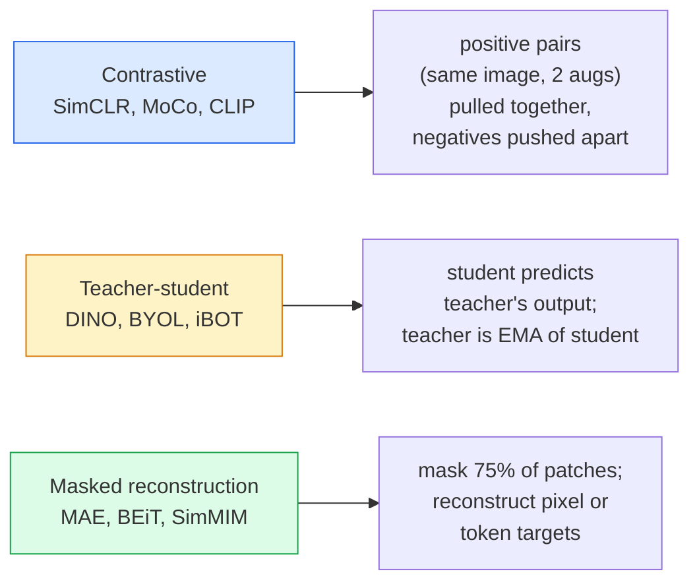

# 自监督视觉 — SimCLR、DINO、MAE

> 标签是监督视觉的瓶颈。自监督预训练去除了它们：从1亿张未标记的图像中学习视觉特征，然后在1万张标记的图像上进行微调。

**类型:** 学习 + 构建
**语言:** Python
**先决条件:** 第四阶段第04课（图像分类），第四阶段第14课（ViT）
**时间:** ~75 分钟

## 学习目标

- 追踪三个主要的自监督家族 — 对比（SimCLR）、教师-学生（DINO）、掩码重建（MAE） — 并说明每个优化的目标
- 从头实现一个 InfoNCE 损失，并解释为什么一个包含512个样本的批次可以工作，而一个包含32个样本的批次会失败
- 解释为什么 MAE 的 75% 掩码比例并不是随意的，以及它与文本中 BERT 的 15% 掩码比例有何不同
- 使用 DINOv2 或 MAE ImageNet 检查点进行线性探测和零样本检索

## 问题

监督 ImageNet 有 130 万张标记图像，标注成本估计为 1000 万美元。医学和工业数据集更小，标注成本更高。每个视觉团队都会问：我们能否在便宜的未标记数据上进行预训练 —— YouTube 帧、网络爬取、网络摄像头视频、卫星扫描 —— 然后在小规模的标记数据集上进行微调？

自监督学习是答案。现代自监督 ViT 在 LAION 或 JFT 上训练，微调后可以达到或超过监督 ImageNet 的准确率。它也比监督预训练更好地转移到下游任务（检测、分割、深度）。DINOv2（Meta，2023）和 MAE（Meta，2022）是当前用于可转移视觉特征的生产默认方法。

概念上的转变是，预训练任务 —— 模型被训练去执行的任务 —— 不必是下游任务。重要的是它迫使模型学习有用的特征。预测灰度图像的颜色、旋转图像并要求模型分类旋转、掩码块并重建它们 —— 都已经成功。能够扩展的三种方法是对比学习、教师-学生蒸馏和掩码重建。

## 概念

### 三个家族



### 对比学习（SimCLR）

取一张图像，应用两种随机增强，得到两个视图。将两者输入相同的编码器加上一个投影头。最小化一个损失函数，该损失函数表示“这两个嵌入应该接近”以及“这个嵌入应该与批次中其他所有图像的嵌入相距甚远”。

```
Loss for positive pair (z_i, z_j) among 2N views per batch:

   L_ij = -log( exp(sim(z_i, z_j) / tau) / sum_k in batch \ {i} exp(sim(z_i, z_k) / tau) )

sim = cosine similarity
tau = temperature (0.1 standard)
```

这是 InfoNCE 损失。它要求每个正样本对应许多负样本，因此批次大小很重要 —— SimCLR 需要 512-8192。MoCo 引入了一个动量队列来保存过去批次的信息，以将负样本数量与批次大小解耦。

### 教师-学生（DINO）

两个具有相同架构的网络：学生和教师。教师是学生权重的指数移动平均（EMA）。两者都看到图像的增强视图。学生的输出被训练以匹配教师的输出 —— 没有显式的负样本。

```
loss = CE( student_output(view_1),  teacher_output(view_2) )
     + CE( student_output(view_2),  teacher_output(view_1) )

teacher_weights = m * teacher_weights + (1 - m) * student_weights   (m ≈ 0.996)
```

为什么它不会退化为“预测一个常数”：教师的输出是居中的（按维度减去均值）并且被锐化（除以一个小的温度参数）。居中可以防止某一维度占据主导地位；锐化可以防止输出退化为均匀分布。

DINOv2 是 DINO 的扩展，使用了 1.42 亿张精心挑选的图像。由此得到的特征目前在零样本视觉检索和密集预测任务中是 SOTA（最先进）的。

### 掩码重建（MAE）

对 ViT 输入的图像块（patches）中 75% 的部分进行掩码处理。只将可见的 25% 的图像块输入编码器。一个小的解码器接收编码器的输出，并在被掩码的位置添加掩码标记（mask tokens），然后训练该解码器以重建被掩码图像块的像素。

```
Encoder:  visible 25% of patches -> features
Decoder:  features + mask tokens at masked positions -> reconstructed pixels
Loss:     MSE between reconstructed and original pixels on masked patches only
```

使 MAE 起作用的关键设计选择：

- **75% 的掩码比例** —— 高。迫使编码器学习语义特征；重建 25% 的内容几乎微不足道（相邻像素高度相关，CNN 轻松完成）。
- **不对称的编码器/解码器** —— 大型 ViT 编码器仅看到可见的图像块；小解码器（8 层，512 维）负责重建。预训练速度是 BEiT 的 3 倍。
- **像素空间重建目标** —— 比 BEiT 的分词目标更简单，并且在 ViT 上效果更好。

预训练完成后，丢弃解码器。编码器即为特征提取器。

### 为什么是 75% 而不是 15%

BERT 掩码 15% 的词。MAE 掩码 75%。差异在于信息密度。

- 自然语言每个词的熵较高。预测 15% 的词仍然困难，因为每个被掩码的位置有大量可能的完成方式。
- 图像块的熵较低 —— 未被掩码的邻域通常几乎可以完全确定被掩码块的像素。为了使预测需要语义理解，必须进行激进的掩码。

75% 的掩码比例足够高，以至于简单的空间外推无法完成任务；编码器必须表示图像内容。

### 线性探针评估

在自监督预训练之后，标准的评估方法是 **线性探针**：冻结编码器，在 ImageNet 标签上训练一个单一的线性分类器。报告 top-1 准确率。

- SimCLR ResNet-50: ~71% (2020)
- DINO ViT-S/16: ~77% (2021)
- MAE ViT-L/16: ~76% (2022)
- DINOv2 ViT-g/14: ~86% (2023)

线性探针是纯粹衡量特征质量的方法；微调通常会增加 2-5 个百分点，但也会混合头部重新训练的效果。

## 构建它

### 第一步：双视图增强管道

 /no_think

<>

### 第一步：双视图增强管道

```python
import torch
import torchvision.transforms as T

two_view_train = lambda: T.Compose([
    T.RandomResizedCrop(96, scale=(0.2, 1.0)),
    T.RandomHorizontalFlip(),
    T.ColorJitter(0.4, 0.4, 0.4, 0.1),
    T.RandomGrayscale(p=0.2),
    T.ToTensor(),
])


class TwoViewDataset(torch.utils.data.Dataset):
    def __init__(self, base):
        self.base = base
        self.aug = two_view_train()

    def __len__(self):
        return len(self.base)

    def __getitem__(self, i):
        img, _ = self.base[i]
        v1 = self.aug(img)
        v2 = self.aug(img)
        return v1, v2
```

每个 __getitem__ 返回同一张图像的两个增强视图；不需要标签。

### 步骤 2：InfoNCE 损失

```python
import torch.nn.functional as F

def info_nce(z1, z2, tau=0.1):
    """
    z1, z2: (N, D) L2-normalised embeddings of paired views
    """
    N, D = z1.shape
    z = torch.cat([z1, z2], dim=0)  # (2N, D)
    sim = z @ z.T / tau              # (2N, 2N)

    mask = torch.eye(2 * N, dtype=torch.bool, device=z.device)
    sim = sim.masked_fill(mask, float("-inf"))

    targets = torch.cat([torch.arange(N, 2 * N), torch.arange(0, N)]).to(z.device)
    return F.cross_entropy(sim, targets)
```

在调用之前对嵌入进行 L2 归一化。`tau=0.1` 是 SimCLR 的默认值；较低的值会使损失更尖锐，并需要更多的负样本。

### 步骤 3：对 InfoNCE 进行合理性检查

```python
z1 = F.normalize(torch.randn(16, 32), dim=-1)
z2 = z1.clone()
loss_same = info_nce(z1, z2, tau=0.1).item()
z2_random = F.normalize(torch.randn(16, 32), dim=-1)
loss_random = info_nce(z1, z2_random, tau=0.1).item()
print(f"InfoNCE with identical pairs:  {loss_same:.3f}")
print(f"InfoNCE with random pairs:     {loss_random:.3f}")
```

相同的配对应该产生较低的损失（对于大批量和低温，接近于 0）。随机配对应该产生 log(2N-1) = ~log(31) = ~3.4 的损失，当批次为 16 对时。

### 步骤 4：MAE 风格的掩码

```python
def random_mask_indices(num_patches, mask_ratio=0.75, seed=0):
    g = torch.Generator().manual_seed(seed)
    n_keep = int(num_patches * (1 - mask_ratio))
    perm = torch.randperm(num_patches, generator=g)
    visible = perm[:n_keep]
    masked = perm[n_keep:]
    return visible.sort().values, masked.sort().values


num_patches = 196
visible, masked = random_mask_indices(num_patches, mask_ratio=0.75)
print(f"visible: {len(visible)} / {num_patches}")
print(f"masked:  {len(masked)} / {num_patches}")
```

简单、快速，并且对于给定的种子是确定性的。真实的 MAE 实现会批量处理此操作并保留每个样本的掩码。

## 使用它

DINOv2 是 2026 年的生产标准：

```python
import torch
from transformers import AutoImageProcessor, AutoModel

processor = AutoImageProcessor.from_pretrained("facebook/dinov2-base")
model = AutoModel.from_pretrained("facebook/dinov2-base")
model.eval()

# Per-image embeddings for zero-shot retrieval
with torch.no_grad():
    inputs = processor(images=[pil_image], return_tensors="pt")
    outputs = model(**inputs)
    embedding = outputs.last_hidden_state[:, 0]  # CLS token
```

生成的 768 维嵌入是现代图像检索、密集对应和零样本迁移流水线的核心。在下游任务上进行微调时，通常只需要一个线性头。

对于图像-文本嵌入，SigLIP 或 OpenCLIP 是等效的；对于 MAE 风格的微调，`timm` 仓库包含了每一个 MAE 的检查点。

## 发布它

本课将产出以下内容：

- `outputs/prompt-ssl-pretraining-picker.md` — 一个提示，根据数据集大小、计算能力和下游任务选择 SimCLR / MAE / DINOv2。
- `outputs/skill-linear-probe-runner.md` — 一个技能，可以为任何冻结的编码器 + 标注数据集编写线性探测评估。

## 练习

1. **(简单)** 验证当温度降低时，对于对齐良好的嵌入，InfoNCE 损失会下降；而对于随机嵌入，损失会上升。生成一个 `tau in [0.05, 0.1, 0.2, 0.5]` 与损失的图像。
2. **(中等)** 实现一个 DINO 风格的中心缓冲区。展示如果没有中心化处理，学生模型在几个周期内会坍塌到一个常量向量。
3. **(困难)** 使用第 10 课中的 TinyUNet 作为骨干网络，在 CIFAR-100 上训练 MAE。报告在 10、50 和 200 个周期时的线性探测准确率。展示 MAE 预训练的线性探测在相同 1000 张图像的子集上优于从头开始的监督线性探测。

## 关键术语

| 术语 | 人们常说 | 它实际意味着 |
|------|----------------|--------------------|
| 自监督 | “无标签” | 一个预文本任务，从无标签数据中产生有用的表示 |
| 预文本任务 | “虚假任务” | 在 SSL 期间使用的任务（重建补丁、匹配视图）；预训练后被丢弃 |
| 线性探测 | “冻结编码器 + 线性头” | 标准的 SSL 评估：仅在冻结的特征上训练一个线性分类器 |
| InfoNCE | “对比损失” | 对余弦相似性进行 softmax；正样本对是目标类别，其余的是负样本 |
| EMA 教师 | “移动平均教师” | 教师的权重是学生权重的指数移动平均；BYOL、MoCo、DINO 使用 |
| 掩码比例 | “隐藏的补丁百分比” | MAE 中被掩码的补丁比例；视觉为 75%，文本为 15% |
| 表示坍塌 | “常量输出” | SSL 失败，编码器对所有输入输出常量向量；通过中心化、锐化或负样本防止 |
| DINOv2 | “生产级 SSL 骨干” | Meta 2023 年的自监督 ViT；2026 年最强的通用图像特征 |

## 进一步阅读

- [SimCLR (Chen 等, 2020)](https://arxiv.org/abs/2002.05709) — 对比学习参考
- [DINO (Caron 等, 2021)](https://arxiv.org/abs/2104.14294) — 带动量、中心化和锐化的教师-学生方法
- [MAE (He 等, 2022)](https://arxiv.org/abs/2111.06377) — ViT 的掩码自编码器预训练
- [DINOv2 (Oquab 等, 2023)](https://arxiv.org/abs/2304.07193) — 将自监督 ViT 扩展到生产特征
