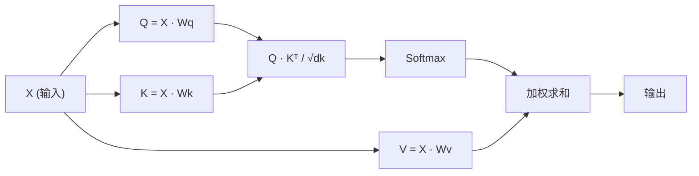

# 从零实现自注意力机制（Self-Attention）

> 注意力机制就像一个软查找表，其中每个词都在询问“谁对我重要？”——并学习答案。

**Type:** Build
**Languages:** Python
**Prerequisites:** Phase 3（深度学习核心）、Phase 5 第 10 课（序列到序列）
**Time:** ~90 分钟

## 学习目标

- 仅使用 NumPy 从零实现缩放点积自注意力，包括 Query/Key/Value 投影以及 Softmax 加权求和
- 构建多头注意力（Multi-Head Attention）层，实现多头切分、并行注意力计算与结果拼接
- 追踪注意力矩阵如何捕获 Token 间的关联，并解释为什么除以 sqrt(d_k) 缩放能防止 Softmax 饱和
- 应用因果掩码（Causal Masking），将双向注意力转换为自回归（解码器风格）注意力

## 核心问题

RNN 每次只处理序列中的一个 Token。当你处理到第 50 个 Token 时，来自第 1 个 Token 的信息已经穿过了 50 次压缩步骤。长距离依赖关系被挤压进固定大小的隐藏状态中——这是任何 LSTM 门控都无法彻底解决的瓶颈。

2014 年 Bahdanau 注意力机制论文提出了解决方案：允许解码器在当前步骤回头查看编码器的每一个位置，并决定哪些位置重要。但它当时仍附加在 RNN 上。2017 年的《Attention Is All You Need》论文提出了一个更尖锐的问题：如果注意力是*唯一*的机制呢？没有循环，没有卷核，只有注意力。

自注意力机制允许序列中的每个位置在单个并行步骤中关注所有其他位置。这就是 Transformer 运行迅速、易于扩展并占据主导地位的原因。

## 概念详解

### 数据库查找类比

将注意力机制想象为一种软数据库查找：

```
传统数据库：
  Query: "capital of France"  -->  精确匹配  -->  "Paris"

注意力机制：
  Query: "capital of France"  -->  与所有 Key 计算相似度  -->  所有 Value 的加权混合
```

每个 Token 会生成三个向量：
- **Query (Q)**：“我在寻找什么信息？”
- **Key (K)**：“我包含什么信息？”
- **Value (V)**：“如果被选中，我提供什么内容？”

Query 与所有 Key 之间的点积产生注意力得分。得分高意味着“这个 Key 匹配我的 Query”。这些得分对 Value 进行加权，最终输出为 Value 的加权求和。

### Q, K, V 计算过程

每个 Token 的嵌入通过三个可学习的权重矩阵进行投影：

```
输入嵌入（n 个 Token 的序列，每个为 d 维）：

  X = [x1, x2, x3, ..., xn]       形状: (n, d)

三个权重矩阵：

  Wq  形状: (d, dk)
  Wk  形状: (d, dk)
  Wv  形状: (d, dv)

投影计算：

  Q = X @ Wq    形状: (n, dk)      每个 Token 的 Query
  K = X @ Wk    形状: (n, dk)      每个 Token 的 Key
  V = X @ Wv    形状: (n, dv)      each token's Value
```

对单个 Token 而言：

```
             Wq
  x_i ------[*]------> q_i    "我在寻找什么？"
       |
       |     Wk
       +----[*]------> k_i    "我包含什么？"
       |
       |     Wv
       +----[*]------> v_i    "我提供什么？"
```

### 注意力矩阵

得到所有 Token 的 Q, K, V 后，注意力得分构成一个矩阵：

```
Scores = Q @ K^T    形状: (n, n)

              k1    k2    k3    k4    k5
        +-----+-----+-----+-----+-----+
   q1   | 2.1 | 0.3 | 0.1 | 0.8 | 0.2 |   <- q1 对每个 Key 的关注程度
        +-----+-----+-----+-----+-----+
   q2   | 0.4 | 1.9 | 0.7 | 0.1 | 0.3 |
        +-----+-----+-----+-----+-----+
   q3   | 0.2 | 0.6 | 2.3 | 0.5 | 0.1 |
        +-----+-----+-----+-----+-----+
   q4   | 0.9 | 0.1 | 0.4 | 1.7 | 0.6 |
        +-----+-----+-----+-----+-----+
   q5   | 0.1 | 0.3 | 0.2 | 0.5 | 2.0 |
        +-----+-----+-----+-----+-----+

每一行：单个 Token 在整个序列上的注意力分布
```

每个 Query 扫描所有 Key：每一行为每个 Token 评分，Softmax 将评分转换为权重，上下文向量则是 Value 的加权混合。

```figure
attention-matrix
```

### 为什么需要缩放？

点积大小随维度 dk 增加而增长。如果 dk = 64，点积数值可能达到数十，将 Softmax 挤压到梯度几乎消失的区域。解决方案：除以 sqrt(dk)。

```
Scaled scores = (Q @ K^T) / sqrt(dk)
```

这保持了 Softmax 能产生有效梯度的数值范围。

### Softmax 将得分转化为权重

Softmax 将原始得分转化为每一行上的概率分布：

```
q1 的原始得分:   [2.1, 0.3, 0.1, 0.8, 0.2]
                            |
                         softmax
                            |
注意力权重:       [0.52, 0.09, 0.07, 0.14, 0.08]   （和为 ~1.0）
```

现在每个 Token 都有了一组权重，指定对所有其他 Token 的关注程度。

### Value 的加权求和

每个 Token 的最终输出是所有 Value 向量的加权求和：

```
output_i = sum( attention_weight[i][j] * v_j  对于所有 j )

对于 Token 1：
  output_1 = 0.52 * v1 + 0.09 * v2 + 0.07 * v3 + 0.14 * v4 + 0.08 * v5
```

### 完整流程



一句话公式：

```
Attention(Q, K, V) = softmax( Q @ K^T / sqrt(dk) ) @ V
```

```figure
softmax-attention-scaling
```

## 动手构建

### 第一步：从零实现 Softmax

Softmax 将原始 Logit 转换为概率。减去最大值以保证数值稳定性。

```python
import numpy as np

def softmax(x):
    shifted = x - np.max(x, axis=-1, keepdims=True)
    exp_x = np.exp(shifted)
    return exp_x / np.sum(exp_x, axis=-1, keepdims=True)

logits = np.array([2.0, 1.0, 0.1])
print(f"logits:  {logits}")
print(f"softmax: {softmax(logits)}")
print(f"sum:     {softmax(logits).sum():.4f}")
```

### 第二步：缩放点积注意力

核心函数。接收 Q, K, V 矩阵，返回注意力输出和权重矩阵。

```python
def scaled_dot_product_attention(Q, K, V):
    dk = Q.shape[-1]
    scores = Q @ K.T / np.sqrt(dk)
    weights = softmax(scores)
    output = weights @ V
    return output, weights
```

### 第三步：带有可学习投影的自注意力类

一个完整的自注意力模块，包含带有 Xavier 式缩放初始化的 Wq, Wk, Wv 权重矩阵。

```python
class SelfAttention:
    def __init__(self, d_model, dk, dv, seed=42):
        rng = np.random.default_rng(seed)
        scale = np.sqrt(2.0 / (d_model + dk))
        self.Wq = rng.normal(0, scale, (d_model, dk))
        self.Wk = rng.normal(0, scale, (d_model, dk))
        scale_v = np.sqrt(2.0 / (d_model + dv))
        self.Wv = rng.normal(0, scale_v, (d_model, dv))
        self.dk = dk

    def forward(self, X):
        Q = X @ self.Wq
        K = X @ self.Wk
        V = X @ self.Wv
        output, weights = scaled_dot_product_attention(Q, K, V)
        return output, weights
```

### 第四步：在句子上运行

为句子创建虚拟嵌入并观察注意力权重。

```python
sentence = ["The", "cat", "sat", "on", "the", "mat"]
n_tokens = len(sentence)
d_model = 8
dk = 4
dv = 4

rng = np.random.default_rng(42)
X = rng.normal(0, 1, (n_tokens, d_model))

attn = SelfAttention(d_model, dk, dv, seed=42)
output, weights = attn.forward(X)

print("注意力权重（每一行表示该 Token 关注的位置）:
")
print(f"{'':>6}", end="")
for token in sentence:
    print(f"{token:>6}", end="")
print()

for i, token in enumerate(sentence):
    print(f"{token:>6}", end="")
    for j in range(n_tokens):
        w = weights[i][j]
        print(f"{w:6.3f}", end="")
    print()
```

### 第五步：使用 ASCII 热力图可视化注意力

将注意力权重映射到字符，以便进行快速直观的查看。

```python
def ascii_heatmap(weights, tokens, chars=" ░▒▓█"):
    n = len(tokens)
    print(f"
{'':>6}", end="")
    for t in tokens:
        print(f"{t:>6}", end="")
    print()

    for i in range(n):
        print(f"{tokens[i]:>6}", end="")
        for j in range(n):
            level = int(weights[i][j] * (len(chars) - 1) / weights.max())
            level = min(level, len(chars) - 1)
            print(f"{'  ' + chars[level] + '   '}", end="")
        print()

ascii_heatmap(weights, sentence)
```

## 实战应用

PyTorch 的 `nn.MultiheadAttention` 实现了我们构建的所有功能，外加多头切分与输出投影：

```python
import torch
import torch.nn as nn

d_model = 8
n_heads = 2
seq_len = 6

mha = nn.MultiheadAttention(embed_dim=d_model, num_heads=n_heads, batch_first=True)

X_torch = torch.randn(1, seq_len, d_model)

output, attn_weights = mha(X_torch, X_torch, X_torch)

print(f"输入形状:            {X_torch.shape}")
print(f"输出形状:           {output.shape}")
print(f"注意力权重形状: {attn_weights.shape}")
print(f"
注意力权重（多头取平均）:")
print(attn_weights[0].detach().numpy().round(3))
```

关键区别：多头注意力并行运行多个注意力函数，每个都有自己的 Q, K, V 投影（尺寸为 dk = d_model / n_heads），然后拼接结果。这使模型能够同时关注不同类型的关系。

## 成果产出

本课程产出：
- `outputs/prompt-attention-explainer.md` - 通过数据库查找类比解释注意力的提示词模板

## 练习题

1. 修改 `scaled_dot_product_attention` 以接收可选的掩码矩阵（Mask），在 Softmax 之前将特定位置设置为负无穷大（这就是因果/解码器掩码的工作原理）。
2. 从零实现多头注意力：将 Q, K, V 切分为 `n_heads` 个块，在每个块上运行注意力，拼接结果并通过最终权重矩阵 Wo 进行投影。
3. 传入两个相同长度的不同句子到同一个 SelfAttention 实例中，比较它们的注意力模式。哪些改变了？哪些保持不变？

## 核心术语

| 术语 | 通俗说法 | 真实含义 |
|------|----------------|----------------------|
| Query (Q) | "问题向量" | 输入的可学习投影，代表该 Token 正在寻找什么信息 |
| Key (K) | "标签向量" | 可学习的投影，代表该 Token 包含什么信息，用于与 Query 进行匹配 |
| Value (V) | "内容向量" | 携带实际信息的可学习投影，根据注意力得分进行聚合 |
| Scaled dot-product attention（缩放点积注意力） | "注意力公式" | softmax(QK^T / sqrt(dk)) @ V —— 缩放可防止高维空间下的 Softmax 饱和 |
| Self-attention（自注意力） | "Token 观察自身和其他位置" | Q, K, V 全部来自同一个序列的注意力机制，允许每个位置关注所有位置 |
| Attention weights（注意力权重） | "关注程度" | 通过在缩放点积上应用 Softmax 生成的位置概率分布 |
| Multi-head attention（多头注意力） | "并行注意力" | 使用不同投影并行运行多个注意力函数，然后拼接结果以获得更丰富的表示 |

## 延伸阅读

- [Attention Is All You Need (Vaswani et al., 2017)](https://arxiv.org/abs/1706.03762) - 原始 Transformer 论文
- [The Illustrated Transformer (Jay Alammar)](https://jalammar.github.io/illustrated-transformer/) - 完整架构的图解指南
- [The Annotated Transformer (Harvard NLP)](https://nlp.seas.harvard.edu/annotated-transformer/) - 带有详细解释的逐行 PyTorch 实现
