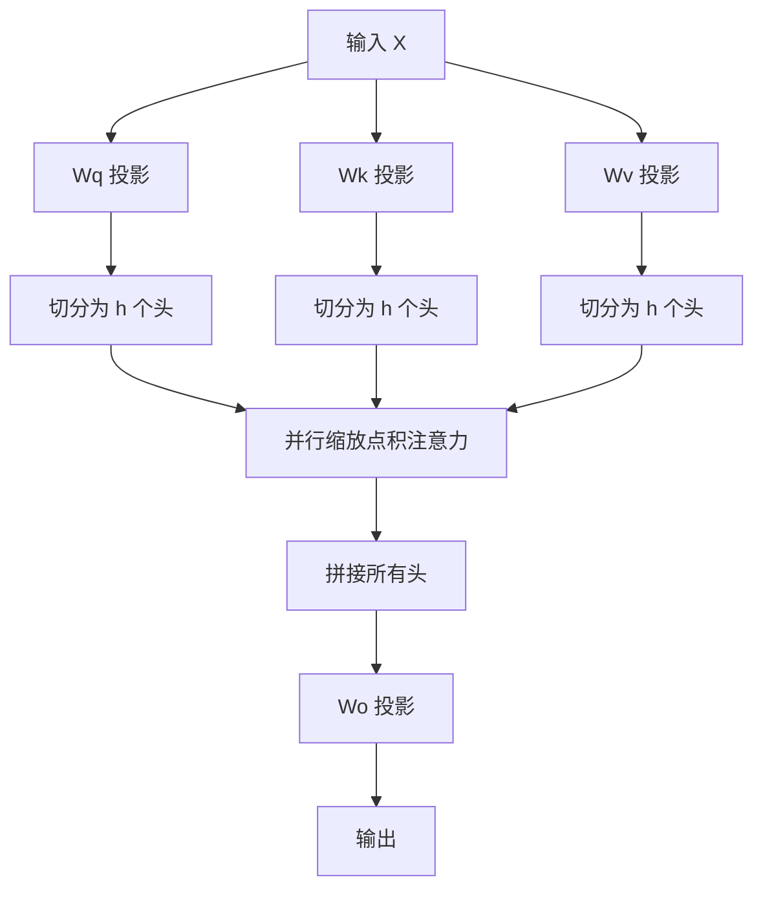

# 多头注意力机制（Multi-Head Attention）

> 单头注意力强迫模型选择一个全局焦点。多头注意力则允许模型同时关注词替换、语法结构和长距离相关性。

**Type:** Build
**Languages:** Python
**Prerequisites:** Phase 7 Lesson 2（自注意力机制）
**Time:** ~60 分钟

## 学习目标

- 仅使用 NumPy 实现多头注意力机制，包括头切分（Head Splitting）、并行点积注意力计算与合并投影
- 解释为什么将表示维度切分为多头能捕捉互补的表达子空间
- 验证多头注意力的总 FLOPs 和内存消耗与同等整体宽度的单头注意力相同
- 将自定义 NumPy 多头注意力与 PyTorch 的 `nn.MultiheadAttention` 模块输出进行比对验证

## 核心问题

单头注意力计算一组注意力权重。如果 Token "it" 需要同时关注主语 "bank"（语义相关性）和谓词 "raised"（语法相关性），单头机制必须在两者之间做出折中平均。它只有一个注意力概率分布。

多头注意力通过将查询、键和值向量投影到多个较小维度的子空间中来解决这个问题。每个“头”独立运行缩放点积注意力。一个头关注语法关联，另一个头关注共指指代，第三个头关注修饰限定。

最后将所有头的输出拼接在一起并通过线性层投影回原始模型维度。

## 概念详解

### 机制原理

设模型嵌入维度为 `d_model`，头数为 `h`。每个头的特征维度为：

```
d_k = d_v = d_model / h
```

如果 `d_model = 512` 且 `h = 8`，则每个头处理 `d_k = 64` 维的向量。

对于每个头 `i`（从 1 到 `h`）：

```
Q_i = X @ Wq_i    形状: (n, d_k)
K_i = X @ Wk_i    形状: (n, d_k)
V_i = X @ Wv_i    形状: (n, d_k)

head_i = Attention(Q_i, K_i, V_i) = softmax(Q_i @ K_i^T / sqrt(d_k)) @ V_i
```

合并所有头：

```
MultiHead(Q, K, V) = Concat(head_1, ..., head_h) @ W_o
```

其中 `W_o` 的形状为 `(h * d_k, d_model) = (d_model, d_model)`。

### 为什么 FLOPs 保持不变

计算 8 个维度为 64 的注意力头与计算 1 个维度为 512 的注意力头具有完全相同的计算量：

```
1 个头 @ 512 维:  Q @ K^T 矩阵乘法开销: O(n^2 * 512)
8 个头 @  64 维: 8 * (Q_i @ K_i^T) 矩阵乘法开销: 8 * O(n^2 * 64) = O(n^2 * 512)
```

多头注意力在没有增加计算开销的前提下提供了更丰富的表达能力。



## 动手构建

参见 `code/main.py` 了解完整的纯 NumPy 实现。核心张量重排逻辑：

```python
import numpy as np

def split_heads(x, n_heads):
    # x 形状: (batch_size, seq_len, d_model)
    batch_size, seq_len, d_model = x.shape
    d_k = d_model // n_heads
    # 重构形状并转置为: (batch_size, n_heads, seq_len, d_k)
    return x.reshape(batch_size, seq_len, n_heads, d_k).transpose(0, 2, 1, 3)

def combine_heads(x):
    # x 形状: (batch_size, n_heads, seq_len, d_k)
    batch_size, n_heads, seq_len, d_k = x.shape
    d_model = n_heads * d_k
    # 转置并重构形状为: (batch_size, seq_len, d_model)
    return x.transpose(0, 2, 1, 3).reshape(batch_size, seq_len, d_model)
```

## 实战应用

在 PyTorch 中，`nn.MultiheadAttention` 被广泛用于编码器与解码器块中。

## 成果产出

本课程代码包含完整的多头注意力 NumPy 实现以及针对 PyTorch 原生模块的测试套件。

## 练习题

1. 修改多头注意力类，使其支持交叉注意力（Q 来自一个序列，K/V 来自另一个序列）。
2. 在不同注意力头上添加 Dropout（训练模式下将 Softmax 权重按概率归零）。
3. 比较单个 512 维头与 16 个 32 维头在随机输入上的实际运行耗时。

## 核心术语

| 术语 | 真实含义 |
|------|-----------------------|
| Head Splitting（头切分） | 将模型特征维度均分为 h 个子向量的操作 |
| Subspace Projection（子空间投影） | 将向量投影到特定注意力头专属维度的线性变化 |
| Concatenation & Output Projection（拼接与输出投影） | 将多头输出复原为 `d_model` 维度的线性映射 |
