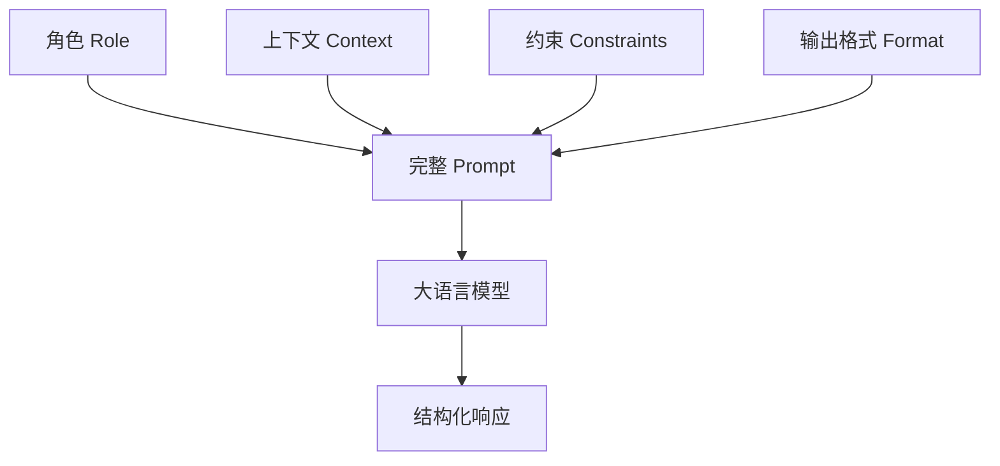

# Prompt 工程原理与实践（Prompt Engineering）

> Prompt 不是凭空猜测的咒语，而是向概率分布模型提供清晰约束与结构的系统化设计。

**Type:** Learn / Build
**Languages:** Python, TypeScript
**Prerequisites:** Phase 10 Lesson 1（Tokenizers）、Phase 10 Lesson 6（SFT）
**Time:** ~60 分钟

## 学习目标

- 掌握结构化 Prompt 的四大要素：角色（Role）、上下文（Context）、约束（Constraints）与输出格式（Output Format）
- 实现跨模型的 Prompt 模板化与变量替换系统
- 理解温度（Temperature）、Top-P 以及惩罚项对 Prompt 输出稳定性的影响
- 建立端到端 Prompt 迭代与基准评估流程

## 核心问题

在生产环境中，最常见的错误是编写过于模糊的 Prompt（例如“帮我总结这段文字”）。LLM 需要明确的边界限制、少样本示范以及清晰的结构引导，才能产生符合预期、可解析且高度稳定的结果。

## 概念详解

### Prompt 的四大要素

1. **角色（Role）**：定义模型的身份与专业背景（“你是一位资深的 Rust 安全审计专家……”）
2. **上下文（Context）**：提供任务所需的背景知识与前置信息
3. **约束（Constraints）**：明确指出哪些行为是被禁止的（“不要引入第三方依赖，禁止使用 unsafe 块……”）
4. **输出格式（Output Format）**：要求返回 JSON、Markdown 或指定的 XML 标签结构

## 动手构建

参见 `code/main.py` 与 `code/main.ts`。

## 练习题

1. 为一个正则表达式生成器编写符合四大要素的生产级 Prompt。
2. 比较同一 Prompt 在 Temperature=0.0 与 Temperature=0.9 下的重复输出一致性。
