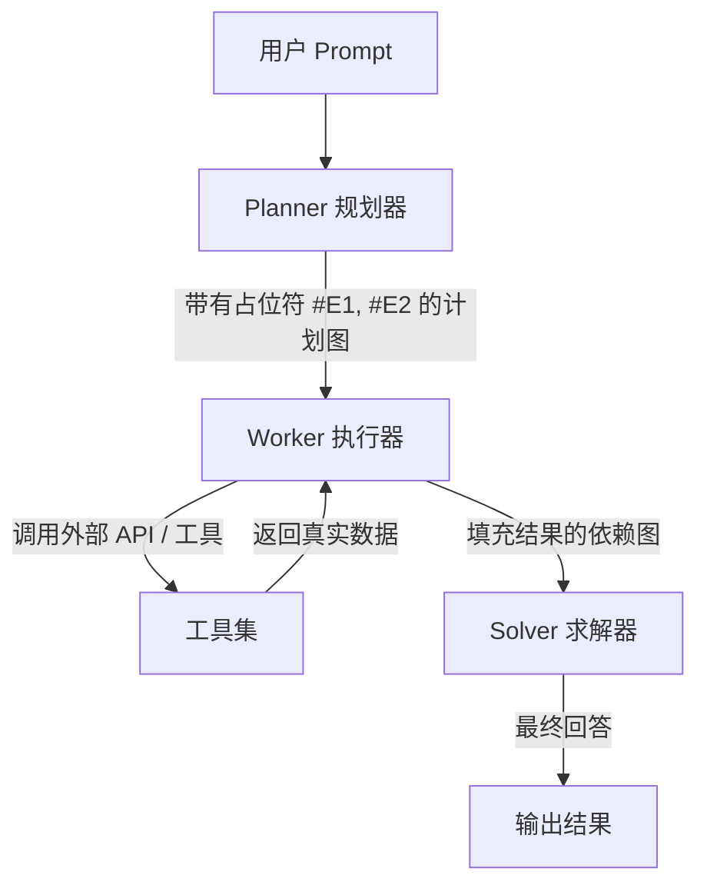

# ReWOO 与计划-执行模式：在无工具阻塞情况下生成依赖 DAG

> ReWOO（Reasoning WithOut Observation）通过在触发外部外部工具之前生成完整的带有变量依赖的计划图（DAG），将 Agent 的规划与工具执行解耦，大幅降低 Token 消耗并提升并行效率。

**Type:** Build
**Languages:** Python (stdlib)
**Prerequisites:** Phase 14 Lesson 01 (Agent 循环)
**Time:** ~60 分钟

## 学习目标

- 解释 ReWOO（Reasoning WithOut Observation）架构如何通过解耦规划与工具执行来降低 Token 成本。
- 实现包括 Planner、Worker 和 Solver 在内的完整三阶段 ReWOO 管道。
- 掌握符号变量占位符（如 `#E1`, `#E2`）的依赖图解析与填充机制。
- 评估一次性生成计划（Plan-then-Execute）与交替式 ReAct 在不同动态环境下的适用权衡。

## 问题切入

在标准的 ReAct 循环中，Agent 每执行一次工具调用，就需要将完整的历史上下文（Prompt、先前思考、行动及最新观察）重新发送给 LLM。对于包含 5–10 次工具调用的复杂任务，这会导致 Token 消耗指数级暴涨。

此外，当后续工具调用并不依赖前一步的观察结果时，ReAct 依然强制串行等待，无法利用并行执行的优势。ReWOO 模式解决了这个问题：先一次性生成所有计划及依赖占位符，再一次性并行/批量执行工具，最后总结结果。

## 核心概念

### ReWOO 架构：三阶段管道

Xu 等人（2023）提出的 ReWOO 架构包含三个关键角色：

1. **Planner（规划器）**：生成由多个步骤组成的计划方案。每个步骤定义了工具调用，并使用占位符变量（如 `#E1`）代表前序步骤的预期输出。
2. **Worker（执行器）**：解析计划图，将已解出的变量替换到实参中，并调用外部工具获取真实观察数据（Worker 本身不进行 LLM 思考）。
3. **Solver（求解器）**：结合原始 Prompt、初始计划以及 Worker 收集到的所有观察数据，合成出最终回答。



### 占位符变量与依赖 DAG

Planner 生成的输出形如：

```text
Plan: 查找 AI 领域的最新新闻。
#E1 = Search[AI news 2026]
Plan: 查找关于 Agent 架构的技术论文。
#E2 = Search[Agent architecture papers]
Plan: 总结 #E1 和 #E2 的检索结果。
#E3 = Summarize[#E1, #E2]
```

在这里，`#E1` 与 `#E2` 没有相互依赖关系，Worker 可以并行发起检索；而 `#E3` 依赖于 `#E1` 和 `#E2` 的执行结果，Worker 会在两项检索均完成后将真实字符串替换进占位符。

## 动手实现

`code/main.py` 仅使用 Python 标准库实现了 ReWOO 框架：

- `Planner`: 解析用户请求，输出包含 `#E` 变量的计划。
- `Worker`: 维护变量映射字典 `env = {}`，依次替换参数并调用 `ToolRegistry`。
- `Solver`: 整合所有结果生成最终产出。

你可以运行测试：

```bash
python3 code/main.py
```

## 练习题

1. 如果 Planner 生成了循环依赖（例如 `#E1` 依赖 `#E2`，而 `#E2` 依赖 `#E1`），Worker 应该如何防御？
2. 比较 ReWOO 与 ReAct 在工具调用失败时的容错机制。
