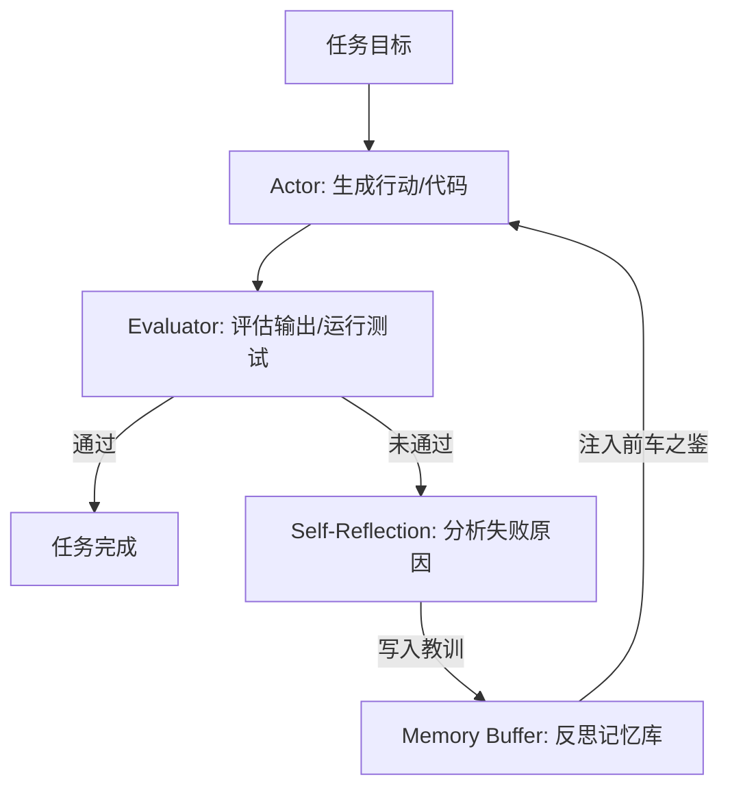

# Reflexion：语言强化学习与自我反思内存

> Reflexion（Shinn et al., 2023）引入了语言强化学习（Verbal RL）：使用自然语言自我反思替代传统的标量奖励，将试错教训记录到上下文记忆中，从而大幅提升 Agent 在代码编写和复杂决策上的成功率。

**Type:** Build
**Languages:** Python (stdlib)
**Prerequisites:** Phase 14 Lesson 01 (Agent 循环)
**Time:** ~60 分钟

## 学习目标

- 理解 Verbal RL（语言强化学习）与基于梯度的传统 RL 之间的差异。
- 实现 Actor-Evaluator-Self Reflection 三元组循环。
- 构建带反思教训持久化的 Memory Buffer（记忆缓冲区）。
- 分析如何使用外部校验信号（如单元测试）触发有效反思。

## 概念详解

在许多复杂任务中，Agent 很难在第一次尝试时就达到 100% 正确。Reflexion 提出了一种模仿人类试错反思的机制：



### 核心组件

1. **Actor**：基于环境观察与历史反思生成行动轨迹（如编写代码或输出推导步骤）。
2. **Evaluator**：评估 Actor 输出的质量（如执行 Python unittest，或核对预期输出格式）。
3. **Self-Reflection**：当 Evaluator 判定失败时，分析轨迹与报错信息，总结出“我错在了哪里，下一步应该如何纠正”。
4. **Memory Buffer**：保存反思生成的自然语言教训，供下一次尝试时载入上下文。

## 动手实现

`code/main.py` 展示了一个纯 Python 标准库实现的 Reflexion 循环，包含自动代码修复与基于单元测试反馈的反思流程。

```bash
python3 code/main.py
```

## 练习题

1. 当 Evaluator 给出错误的反馈（误报）时，Reflexion 会发生什么？
2. 如何在有限上下文长度下管理 Memory Buffer 的容量？
