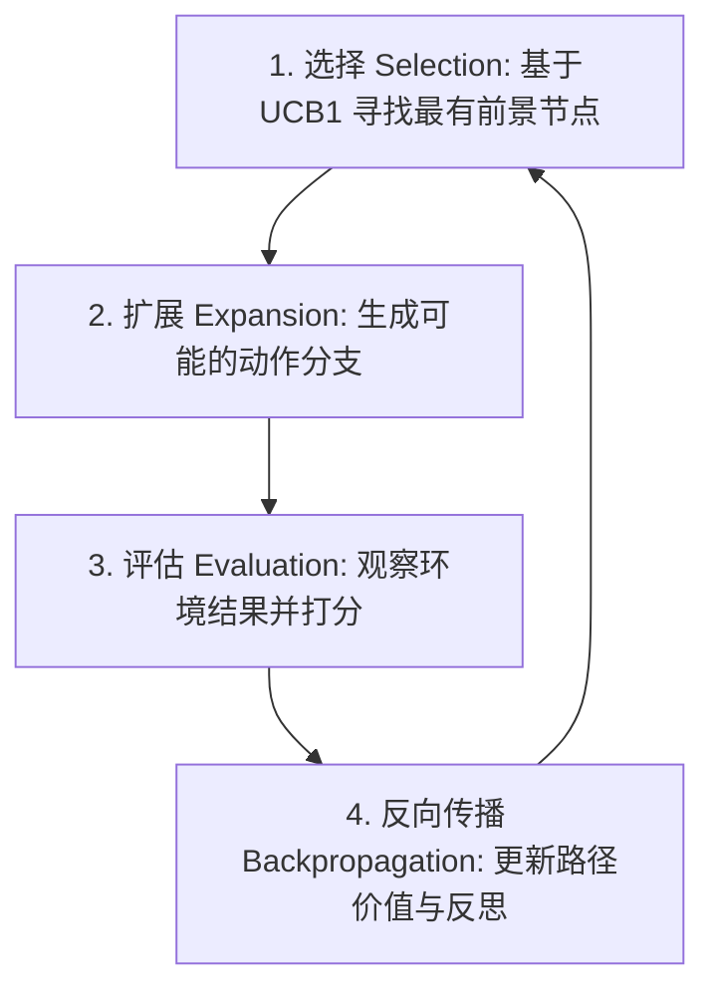

# 思维树与 LATS：基于蒙特卡洛树搜索的 Agent 搜索

> LATS（Language Agent Tree Search）将 LLM 的推理、行动、环境反馈和自我反思整合到蒙特卡洛树搜索（MCTS）框架中，使 Agent 能够在复杂的决策空间中进行树状探索与回溯。

**Type:** Build
**Languages:** Python (stdlib)
**Prerequisites:** Phase 14 Lesson 01, Lesson 03
**Time:** ~60 分钟

## 学习目标

- 区分线性 CoT/ReAct 与思维树（ToT）、语言 Agent 树搜索（LATS）之间的区别。
- 掌握 MCTS 的四个关键阶段：选择（Selection）、扩展（Expansion）、评估（Evaluation）与反向传播（Backpropagation）。
- 使用 UCB1 算法在 Agent 路径探索与利用之间实现平衡。
- 用 Python 实现带环境反馈和回溯机制的 LATS 决策搜索树。

## 架构概览



LATS 将每个思考/行动状态视为树上的节点，避免了 ReAct 在单条路径走通失败后无法回溯的弊端。

## 动手实现

运行 `code/main.py` 查看树搜索与回溯过程：

```bash
python3 code/main.py
```

## 练习题

1. 在搜索深度过深时，如何进行剪枝以控制 Token 消耗？
2. 解释 UCB1 中的常数 C 如何影响搜索是更偏向广度还是深度。
