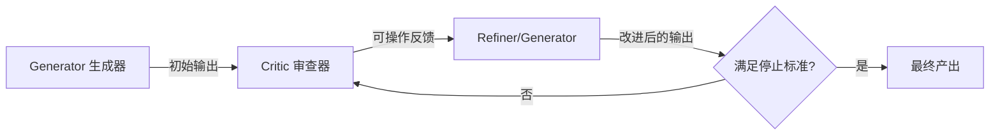

# Self-Refine 与 Critic 机制：通过自我批评与反馈迭代改进

> Self-Refine（Madaan et al., 2023）通过引入“生成-反馈-改进”的迭代循环，无需训练数据或强化学习即可提升 LLM 的输出质量。

**Type:** Build
**Languages:** Python (stdlib)
**Prerequisites:** Phase 14 Lesson 01
**Time:** ~60 分钟

## 学习目标

- 掌握 Self-Refine 的三大阶段：Initial Generation（初始生成）、Feedback（反馈批评）与 Refinement（改进修正）。
- 实现独立的 Generator 与 Critic 角色交互机制。
- 区分内部自我评价（Self-Critic）与外部接地评价（External Grounding）。
- 设置有效的停止标准，规避过度修改与盲目迭代风险。

## 架构说明



## 动手实现

运行 `code/main.py` 观察带有 Critic 评估反馈的自我纠错循环：

```bash
python3 code/main.py
```

## 练习题

1. 设计一个提示词，使 Critic 输出 JSON 格式的多维度评分。
2. 如何在有限 Token 预算下保存历史批评记录？
