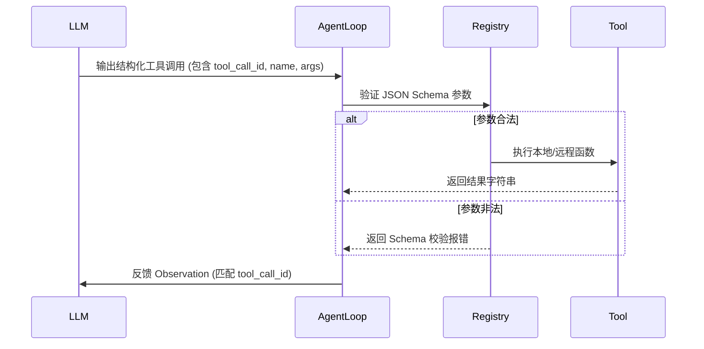

# 工具使用与函数调用：Schema 验证、解析与强类型约束

> 工具调用使 Agent 从纯文本聊天机器人跃升为能够与现实系统互动的自动化智能体。本课涵盖从 JSON Schema 定义、参数验证到沙箱安全的工具集成。

**Type:** Build
**Languages:** Python (stdlib)
**Prerequisites:** Phase 14 Lesson 01
**Time:** ~60 分钟

## 学习目标

- 掌握 JSON Schema 在工具定义与验证中的规范写法。
- 实现具备 Schema 校验与错误处理功能的本地工具注册表。
- 理解并行工具调用及关联 ID（`tool_call_id`）的处理逻辑。
- 遵循最小权限原则构建安全的工具执行沙箱。

## 关键概念



## 动手实现

运行 `code/main.py` 查看工具注册、校验与执行过程：

```bash
python3 code/main.py
```
