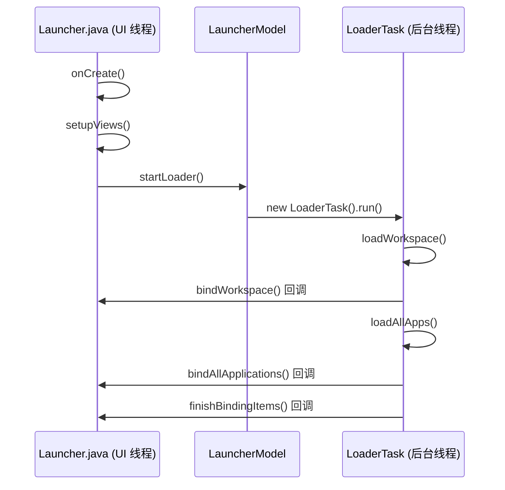

# 启动链路追踪：从 onCreate 到 finishBindingItems

> 用日志把 Launcher3 的启动过程变成可读的时序图——这是修改任何桌面功能的起点。

**Type:** Build
**Languages:** Python
**Prerequisites:** 03-source-structure
**Time:** ~45 分钟

## 学习目标

- 说出 Launcher3 启动时的完整调用链（8 个关键步骤）
- 在 `Launcher.java`、`LauncherModel.java`、`LoaderTask.java` 的正确位置添加日志埋点
- 通过 logcat 日志验证方法调用顺序
- 区分 UI 线程与后台加载线程的任务边界
- 解释为什么修改数据库加载行为必须在 `LoaderTask` 而非 `Launcher.onCreate` 中进行

## 概念

### 完整启动调用链



### 关键埋点位置

**Launcher.java**

```java
private static final String STUDY_TAG = "LauncherStudy";

@Override
protected void onCreate(Bundle savedInstanceState) {
    Log.d(STUDY_TAG, "Launcher.onCreate begin");
    super.onCreate(savedInstanceState);
    Log.d(STUDY_TAG, "Launcher.onCreate end");
}

protected void setupViews() {
    Log.d(STUDY_TAG, "Launcher.setupViews begin");
    // ... 原有代码
    Log.d(STUDY_TAG, "Launcher.setupViews end");
}
```

**LoaderTask.java**

```java
@Override
public void run() {
    Log.d("LauncherStudy", "LoaderTask.run begin");
    loadWorkspace();
    bindWorkspace();
    loadAllApps();
    bindAllApplications();
    finishBindingItems();
    Log.d("LauncherStudy", "LoaderTask.run end");
}
```

### UI 线程 vs 后台线程边界

| 阶段 | 线程 | 原因 |
|---|---|---|
| onCreate / setupViews | UI 线程 | Android 规定 UI 操作必须在主线程 |
| LoaderTask.run | 后台线程 | 数据库读取避免阻塞 UI |
| bindWorkspace 回调 | UI 线程 | 绑定时需要更新视图 |

## 构建它

实现一个 Python 脚本，解析带时间戳的日志文本，提取 LauncherStudy 的调用顺序，并计算各阶段耗时。

参见：`code/main.py`

## 使用它

```bash
python3 main.py
```

输出示例：

```text
=== Launcher3 启动链路分析 ===

  阶段 1: Launcher.onCreate begin       @ 10:00:00.100
  阶段 2: Launcher.setupViews begin     @ 10:00:00.150 (耗时 +50ms)
  阶段 3: LauncherModel.startLoader     @ 10:00:00.180 (耗时 +30ms)
  阶段 4: LoaderTask.run begin          @ 10:00:00.200 (耗时 +20ms)
  阶段 5: LoaderTask.loadWorkspace      @ 10:00:00.210 (耗时 +10ms)
  阶段 6: Launcher.finishBindingItems   @ 10:00:00.500 (耗时 +290ms)

总耗时: 400ms
```

## 发布它

输出技能见 `outputs/skill-startup-trace.md`。
