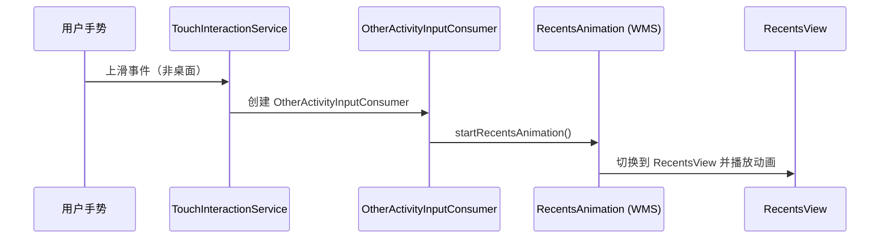

# 最近任务与 QuickStep：上滑手势的系统调用链

> 以运行实现为中心的 Android Framework 课程

**Type:** Build
**Languages:** Python
**Prerequisites:** 08-paged-workspace
**Time:** ~50 分钟

## 学习目标

见 quiz.json 的 pre/check/post 阶段问题。

## 概念

QuickStep 手势识别在 Launcher 进程中，通过 Binder 与 SystemUI 协作。

### 上滑进入最近任务调用链



### 三键导航最近任务

SystemUI 点击最近任务按钮 → 发送 SHOW_OVERVIEW 命令 → OverviewCommandHelper 处理 → 显示 RecentsView

### 验证命令

```bash
# 查询当前任务栈
adb shell dumpsys activity activities

# 查询 TouchInteractionService 状态
adb shell dumpsys activity service com.android.launcher3/.uioverrides.TouchInteractionService
```

## 构建它

参见：`code/main.py`

## 使用它

```bash
python3 main.py
```
