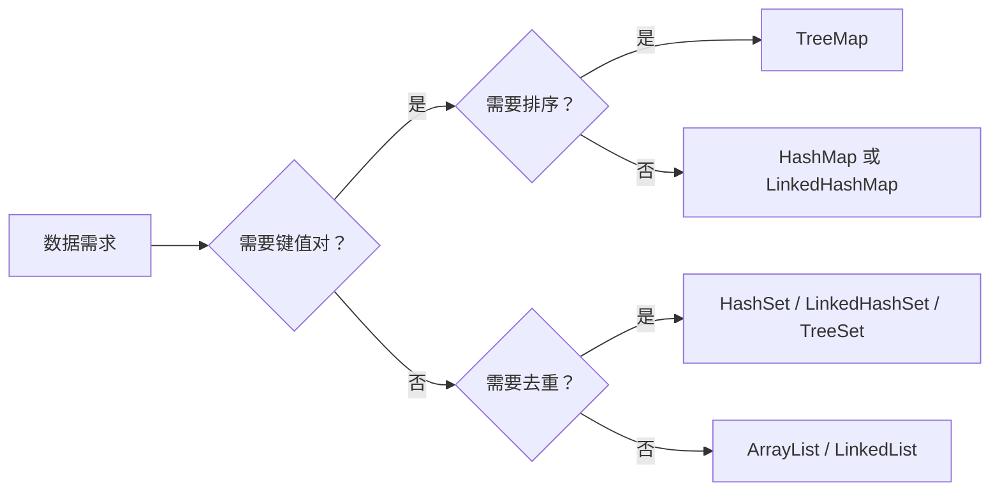

# Java 集合与相等性：从数据形状到 Hash 契约

> 选错集合不是“慢一点”这么简单：它会让重复数据、迭代顺序和查找成本同时失控。

**Type:** Build
**Languages:** Python
**Prerequisites:** None
**Time:** ~90 分钟


## 学习目标

- 区分单向、双向与循环链表的遍历和插入边界
- 根据顺序、唯一性和访问模式选择 Java 集合
- 解释 `List`、`Set` 与 `Map` 的数据模型差异
- 验证 `equals()` 与 `hashCode()` 的单向契约
- 避免把哈希碰撞误认为对象相等

## 概念

源资料 `docs/AndroidFramework/Java android .md` 指出：数组擅长按下标访问；集合适合大小不确定或需要键、去重、迭代顺序等语义的场景。`ArrayList` 是读多写少的默认选择；已定位元素附近频繁插入、删除时，`LinkedList` 更合适。



`HashSet` 和 `HashMap` 会先用 `hashCode()` 找候选位置，再用 `equals()` 判断逻辑相等。因此“`equals()` 为 `true` 的两个对象必须拥有相同哈希值”；反过来，哈希值相同可以只是碰撞。

## 构建它

`code/main.py` 实现 `CollectionAdvisor`。它用数据形状和主要工作负载选择集合实现，并提供 `hash_contract_holds()` 检查相等性契约。

```bash
cd phases/21-java-android-foundations/01-java-collections-and-equality/code
python3 main.py
python3 -m unittest discover tests -v
```

## 诊断练习

若自定义对象放入 `HashSet` 后出现“看起来一样却无法去重”，先检查是否同时重写了 `equals()` 与 `hashCode()`，不要只观察两个对象打印出的字段。

## 发布它

可复用的集合选型清单见 `outputs/skill-java-collections.md`。
