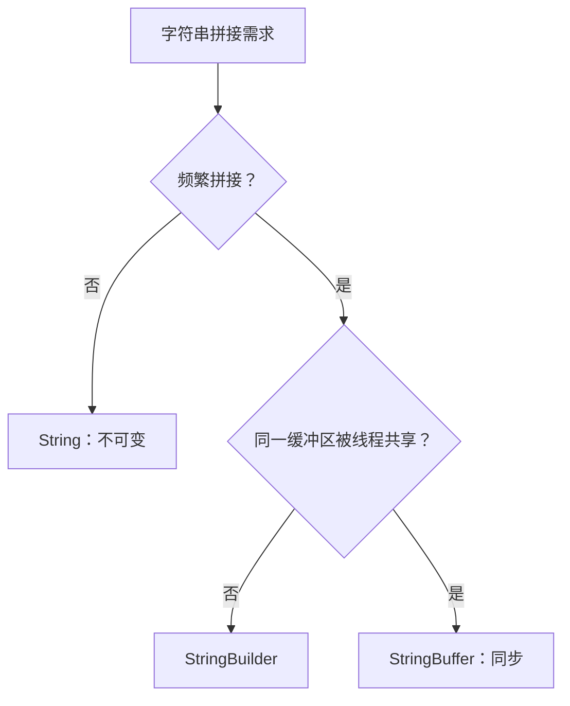

# Java 对象模型、泛型与字符串容器

> 写出可维护的 Android 代码，先要把“能力契约”“共享状态”和“可变性”分开思考。

**Type:** Build
**Languages:** Python
**Prerequisites:** 01-java-collections-and-equality
**Time:** ~90 分钟

## 学习目标

- 说明封装、继承与多态在 Android 组件中的作用
- 在抽象类和接口之间作出有依据的选择
- 区分 `String`、`StringBuilder` 与 `StringBuffer`
- 应用 PECS 原则解释 `extends` 与 `super`
- 识别静态、成员、局部和匿名内部类的生命周期边界

## 概念

封装隐藏状态，继承复用可继承行为，多态允许接口引用在运行时指向不同实现。若类型层次确实需要共享实例状态或部分实现，选择抽象类；若重点是定义可被多个类型实现的能力契约，选择接口。



泛型通配符遵循 PECS：`? extends T` 是生产者，安全读取 `T`；`? super T` 是消费者，安全写入 `T`。这不是语法记忆题，而是避免把不确定的子类型容器当作可写容器。

## 构建它

`code/main.py` 根据拼接次数和线程共享情况选择字符串容器，并通过 `generic_access()` 与 `can_write()` 把 PECS 转成可执行规则。

```bash
cd phases/21-java-android-foundations/02-java-oop-generics-and-strings/code
python3 main.py
python3 -m unittest discover tests -v
```

## 诊断练习

当 API 参数写成 `List<? extends Number>` 时，尝试 `add(Integer.valueOf(1))` 不安全；应只读取，或将 API 改为消费者边界 `? super Integer`。

## 发布它

可复用的类型设计提问清单见 `outputs/skill-java-type-boundaries.md`。
