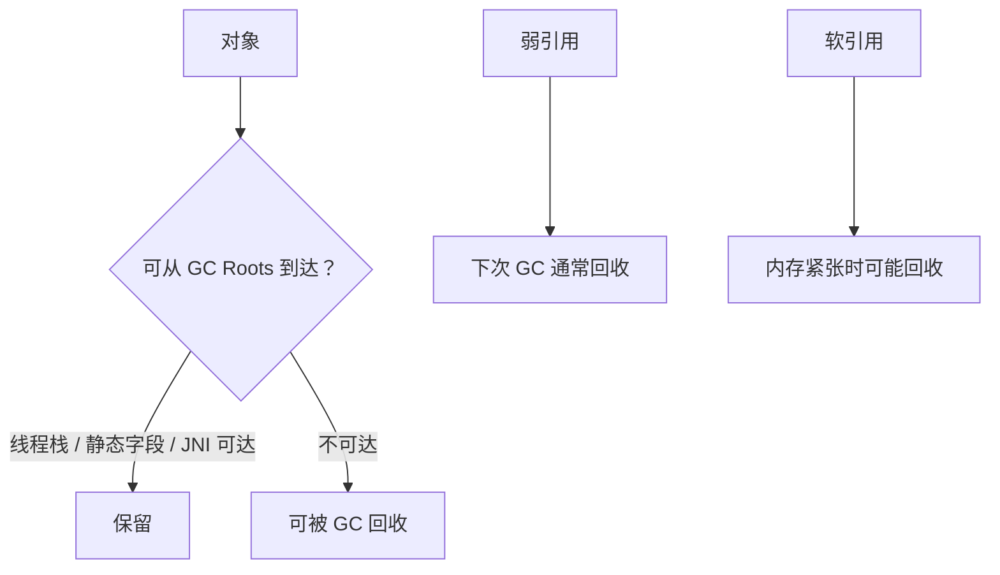

# Java 反射、序列化与 GC 可达性

> 运行时灵活性会把类型错误和资源风险从编译期推迟到最难排查的时刻。

**Type:** Build
**Languages:** Python
**Prerequisites:** 02-java-oop-generics-and-strings
**Time:** ~90 分钟

## 学习目标

- 判断何时应该使用反射而不是常规接口调用
- 解释不可信反序列化的安全风险
- 区分 `parseInt()` 与 `valueOf()` 的返回类型
- 用 GC Roots 而非引用计数解释对象回收
- 比较强、软、弱与虚引用的回收语义

## 概念

反射可在运行时发现构造器、字段和方法，因此适合框架、注解处理和受控插件加载；它也会降低编译期保障并可能突破封装。序列化要把对象状态转为字节，反序列化则恢复对象；不可信来源不能直接进入 Java 原生反序列化链路。



Java GC 的核心是可达性分析。循环引用本身不会阻止回收；资源释放也不能交给已废弃且不可靠的 `finalize()`，文件、数据库和网络资源应显式关闭。

## 构建它

本课实现一个不执行真实反射的安全模型：`inspect_type()` 要求显式允许私有成员；`is_collectable()` 按线程栈、静态字段和 JNI 根判定可达性。

```bash
cd phases/21-java-android-foundations/03-reflection-serialization-and-gc/code
python3 main.py
python3 -m unittest discover tests -v
```

## 诊断练习

发现页面泄漏时，不要仅仅观察“有循环引用”。沿静态单例、线程回调、JNI 持有关系反向追踪，找出从 GC Root 到页面对象的真实路径。

## 发布它

运行时风险检查清单见 `outputs/skill-java-runtime-safety.md`。
