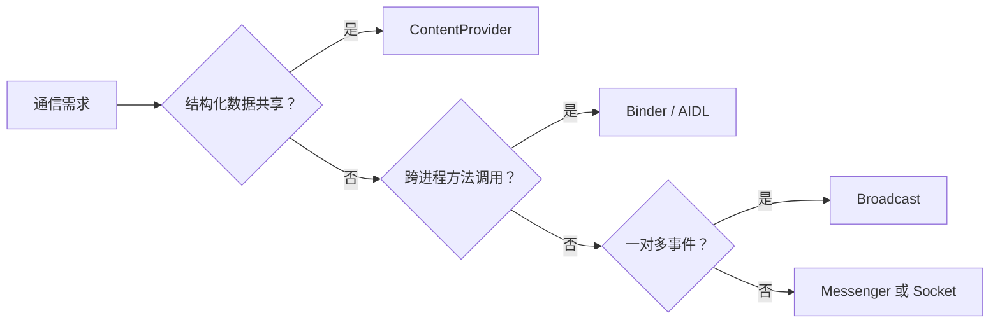

# 进程、线程、IPC 与等待语义

> 主线程不是“不能做事”，而是必须及时响应生命周期和输入事件。

**Type:** Build
**Languages:** Python
**Prerequisites:** 03-reflection-serialization-and-gc
**Time:** ~90 分钟

## 学习目标

- 区分 Android 进程隔离与线程调度责任
- 为 RPC、事件、数据共享和网络协议选择 IPC 机制
- 说明 Binder 与 AIDL 的关系
- 比较 `Thread.start()`、`run()`、`join()`、`wait()` 与 `sleep()`
- 把耗时 I/O 从主线程迁移到后台执行

## 概念

进程提供资源隔离；线程是 CPU 调度单位。默认应用进程中的主线程负责 UI 和组件回调，因此网络、磁盘、数据库、解码和复杂计算必须移到后台。



`wait()` 必须在持有对象监视器时调用，它会释放监视器并进入等待集；`sleep()` 不要求同步块，也不会释放已持有的锁。二者都不能用来掩盖错误的线程模型。

## 构建它

本课用 `choose_ipc()` 为目标通信模型选择方式，用 `ThreadOperation.describe()` 展示线程操作的真实语义。

```bash
cd phases/21-java-android-foundations/04-process-thread-and-ipc/code
python3 main.py
python3 -m unittest discover tests -v
```

## 诊断练习

遇到跨进程大位图或大集合传输时，不要继续扩大 AIDL 参数；应改为 Provider、文件描述符、共享存储或分块协议。

## 发布它

IPC 选型卡片见 `outputs/skill-android-ipc-triage.md`。
